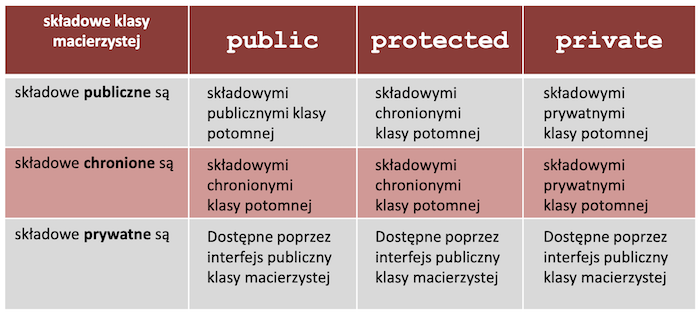

## 11. System operacyjny. Postrzeganie systemu operacyjnego przez warstwę oprogramowania użytkowego.

<a href="https://wazniak.mimuw.edu.pl/images/5/57/Sop_01_wyk_bw_1.1.pdf"> Źródło: wykład "Wprowadzenie do systemów operacyjnych"</a>

### **Definicja**

**System operacyjny** jest warstwą oprogramowania operującą bezpośrednio na sprzęcie, której celem jest zarządzanie zasobami systemu komputerowego i
stworzenie użytkownikowi środowiska łatwiejszego do zrozumienia i wykorzystania.

<center>


</center>

System operacyjny *pośredniczy* pomiędzy użytkownikiem a sprzętem,
dostarczając wygodnego środowiska do wykonywania programów. Użytkownik
końcowy korzysta z programów (aplikacji), na potrzeby których przydzielane są
zasoby systemu komputerowego. Przydziałem tym zarządza system operacyjny,
dzięki czemu można uzyskać stosunkowo duży stopień niezależności programów
od konkretnego sprzętu oraz odpowiedni poziom bezpieczeństwa i sprawności
działania.

### **Ogólna struktura systemu operacyjnego**

Nie ma precyzyjnego określenia, które składniki wchodzą w skład systemu
operacyjnego jako jego części.
<center>


</center>

W ogólnym przypadku w strukturze systemu operacyjnego wyróżnia się jądro
oraz programy systemowe, które dostarczane są razem z systemem operacyjnym,
ale nie stanowią integralnej części jądra. **Jądro** jest zbiorem modułów, które
ukrywają szczegóły sprzętowej realizacji systemu komputerowego, udostępniając
pewien zestaw usług, wykorzystywanych między innymi do implementacji
programów systemowych.

Z punktu widzenia kontaktu z użytkownikiem istotny jest **interpreter poleceń**,
który może być częścią jądra lub programem systemowym (np. w systemie
UNIX). Interpreter wykonuje pewne polecenia wewnętrznie, tzn. moduł lub
program interpretera dostarcza implementacji tych poleceń. Jeśli interpreter nie
może wykonać wewnętrznie jakiegoś polecenia, uruchamia odpowiedni program
(tzw. polecenie zewnętrzne), jako odrębny proces.

**Programy systemowe (programy użytkowe systemu)**:
<ul>
<li>programy do obsługi plików, w tym pakujące i archiwizujące</li>
<li>programy do komunikacji w sieci</li>
<li>proste edytory tekstów i grafiki</li>
<li>programy diagnozujące pracę procesora, pamięci, sieci, dysków twardych itp</li>
<li> kompilatory </li>
</ul>

**Zadania systemu operacyjnego:**
<ul>
<li> Definicja interfejsu użytkownika </li>
<li> Udostępnianie systemu plików </li>
<li> Udostępnianie środowiska do wykonywania
programów użytkownika </li>
  <ul>
    <li> mechanizm ładowania i uruchamiania programów</li>
    <li> mechanizmy synchronizacji i komunikacji procesów </li>
  </ul>
<li>Sterowanie urządzeniami wejścia-wyjścia</li>
<li>Obsługa podstawowej klasy błędów</li>
</ul>

### **Podział systemów operacyjnych**
<ul>
<li> Ze względu na <b>sposób przetwarzania</b> </li>
<ul>
<li>systemy przetwarzania bezpośredniego (online processing systems) - bezpośrednia interakcja użytkownik<->system</li>
<li>systemy przetwarzania pośredniego (offline processing systems) - zwłoka czasowa; brak możliwości ingerencji w wykonywanie zadania</li>
</ul>

<li> Ze względu na <b>liczbę wykonywanych programów</b> </li>
<ul>
<li>jednozadaniowe - tylko jedno zadanie na raz</li>
<li>wielozadaniowe - wiele zadań jednocześnie</li>
</ul>

<li> Ze względu na <b>liczbę użytkowników</b> </li>
<ul>
<li>dla 1 użytkownika - tylko jedno zadanie na raz</li>
<li>wielozadaniowe - wielu użytkowników może
korzystać ze zasobów systemu komputerowego, a
system operacyjny gwarantuje ich ochronę przed
nieupoważnioną ingerencją</li>
</ul>
</ul>

### **Procesy**

**Proces** - uruchomiony program. Jeden program to może być wiele procesów, bo np. uruchomimy wiele razy ten jeden program. Każdy proces jest identyfikowany przez numer PID.

W systemie operacyjnym każdy proces posiada proces nadrzędny (rodzica), z kolei każdy proces może, poprzez wywołanie funkcji systemu operacyjnego, utworzyć swoje procesy potomne. W ten sposób tworzy się swego rodzaju drzewo procesów.

W *skład procesu* wchodzi:
<ul>
<li>kod programu</li>
<li>licznik rozkazów</li>
<li>stos</li>
<li>sekcja danych</li>
</ul>

W trakcie ładowania procesu do pamięci system operacyjny tworzy *stos* (stack) i *stertę* (heap). 

**Stos** – do przechowywania zmiennych, parametrów funkcji, adresów powrotu.
**Sterta** – do przechowywania dynamicznie alokowanych danych, np. listy

**Stany procesu**:
<ul>
<li><b>Początkowy</b> (initial) – w trakcie uruchamiania</li>
<li><b>Aktywny</b> (running, executing)– proces działa na procesorze</li>
<li><b>Gotowy</b> (ready) – proces jest gotowy do uruchomienia, ale w tej chwili jest wstrzymany</li>
<li><b>Oczekujący</b> (blocked) ; proces wykonał operację w wyniku której nie może zostać ponownie uruchomiony dopóki nie nastąpi jakieś zdarzenie (np. operacja we/wy).</li>
<li><b>Końcowy</b> (final) – podczas zamykania</li>
<li><b>Zombie</b> – ukończony proces, który czeka na jakąś akcję, np. odczytanie kodu wyjścia przez proces rodzica</li>
<li><b>Demon</b> (ang. daemon czyli duszek) - nazywamy proces działający w tle, nie podlegający sterowaniu z żadnego terminala, uruchamiany zwykle podczas startu systemu i działający do jego zamknięcia.</li>
</ul>

### **Wątek**
Czasami może być konieczne współbieżne wykonywanie pewnych fragmentów programu. Aby to zrealizować, program może zażądać utworzenia określonej liczby wątków, wykonujących wskazane części programu. Ta cecha systemu operacyjnego to wielowątkowość. W jednym procesie może być kilka wątków. Każdy wątek ma swój własny stos (posiada swoje zmienne lokalne)

### **Wielozadaniowość**
Cecha systemu operacyjnego umożliwiająca równoczesne wykonywanie więcej niż jednego procesu (programu).

### **Planista (dyspozytor)**
Jest jak policjant na skrzyżowaniu, który wskazuje, które auta mogą teraz przejechać przez skrzyżowanie. Jest to część systemu operacyjnego przełączająca procesy według polityki szeregowania zadań. Do jego zadań należy m.in. przełączanie kontekstu.

**Planista krótkoterminowy** ustala wartość priorytetu. Wybiera proces o najwyższym priorytecie do wykonania.

### **Algorytmy szeregowania**
<ul>
<li><b>FIFO</b> – (FCFS) - najprostszy, niewywłaszczający, implementowany za pomocą kolejki FIFO;</li>
<li><b>SJF</b> (Shortest-Job-First) - wiąże z każdym procesem długość jego najbliższej z faz procesora, zapewnia minimalny średni czas oczekiwania; może być wywłaszczający lub nie;</li>
<li>algorytm <b>Round-Robin</b> - czas procesora podzielony na kwanty, kolejka procesów gotowych traktowana jako kolejka cykliczna, algorytm z wywłaszczeniem;</li>
</ul>

<center>


</center>

 Możliwe jest **zagłodzenie** procesu, gdy dany proces nie jest w stanie zakończyć działania,
  ponieważ nie ma dostępu do procesora lub innego współdzielonego zasobu.
Występuje
 najczęściej na skutek niewłaściwej pracy algorytmu szeregowania lub nadmiernego obciążenia
 systemu.

 Zdarza się również tzw. **zakleszczenie**, czyli blokada wzajemna. Powstaje wtedy, gdy wiele
 zadań w tym samym czasie konkuruje o wyłączny dostęp do zasobów. Zakleszczenie:

 <center>


</center>
 
## 12. Cechy tradycyjnego systemu Unixowego.

<a href="https://ai.ia.agh.edu.pl/_media/pl:dydaktyka:unix:gjn-unix-2015wiosna-lec1_4.pdf"> Polecanko - slajd 46+</a>

### TL;DR: Unix to system:
<ul>
<li><b>wielozadaniowy</b> - jest to cecha systemu operacyjnego, mówiąca, czy może on wykonywać jednocześnie kilka procesów. Wielozadaniowość otrzymuje się poprzez tzw. scheduler, czyli algorytm kolejkujący i porządkujący procesy, które mają być wykonane. W tym systemie każdy proces jest wykonywany jakiś kwant czasu, a później czeka "w uśpieniu" (oczywiście z uwzględnieniem różnych priorytetów).</li><br>

<li><b>wielodostępowy</b> (o ile jego administrator nie zażyczy sobie inaczej) - oznacza możliwość jednoczesnej pracy wielu użytkowników (np. możliwość czytania tego samego pliku przez kilku użytkowników)</li><br>

<li><b>wielowątkowy</b> – jest to cecha systemu operacyjnego, dzięki której w ramach jednego procesu można wykonywać kilka wątków lub jednostek wykonawczych. Nowe wątki to kolejne ciągi instrukcji wykonywane oddzielnie. Wszystkie wątki współdzielą między sobą ten sam obszar pamięci. W momencie, gdy system nie wspiera wielowątkowości, pojęcie procesu i wątku utożsamiają się.</li>
</ul>

### **Cechy**

<ol>

<li> <b>Jądro</b> systemu jest, oprócz pewnej części ściśle związanej z obsługiwanym sprzętem,
<b>napisane w języku wysokiego poziomu (C)</b>.</li>
<br>
<li>W Unixie obowiązuje model administracyjny, bazujący na <b>ograniczonym zaufaniu do użytkowników</b>. Ujawnia się on między innymi tym, że zwykle użytkownik lokalny ma
prawo zapisu jedynie w swoim katalogu domowym, katalogu na pliki tymczasowe oraz w kilku innych, dobrze znanych miejscach. Jednocześnie administratora systemu
(użytkownika o numerze identyfikacyjnym 0) nie dotyczą jakiekolwiek ograniczenia.</li><br>
<li><b>System praw dostępu do plików</b> (czyli również do urządzeń czy kanałów komunikacyjnych) jest zbudowany w oparciu o tablicę bitową stałej długości, zapisaną w i-węźle. Zawiera ona zezwolenia na trzy podstawowe operacje – czytanie, zapis i wykonanie dla trzech rozłącznych klas użytkowników: właściciela pliku, członków tzw. grupy pliku oraz innych. Unixowy system praw dostępu jest bardzo efektywny w działaniu, brak dynamicznych list dostępu jest jednakże dość uciążliwy.</li><br>
<li>Unix bezpośrednio po starcie widzi tylko jedno urządzenie pamięci masowej, zawierające tzw. korzeń systemu plików (oznaczany znakiem /). Inne urządzenia są przyłączane do głównego drzewa w procesie tzw. montowania i są widoczne jako fragmenty drzewa plikowego od pewnego katalogu określanego jako punkt montowania.</li><br>
<li>Naturalnym sposobem <b>organizacji pamięci masowej</b> jest model indeksowy oparty na tzw. i-węzłach (ang. i-nodes). i-węzeł zawiera w postaci tablicy o stałym rozmiarze wszystkie informacje o pliku poza jego nazwą. Odwzorowaniem i-węzłów na nazwy plików zajmują się pliki specjalne – katalogi.</li><br>
<li>Budowie interfejsu programisty systemu (API) prześwięca minimalizm, ujawniający się choćby tym, że odczyt i zapis informacji w rozmaitych urządzeniach obsługiwanych przez system odbywa się za pomocą tego samego interfejsu jak odczyt i zapis informacji do plików „zwykłych”. Zasadę tę często definiuje się jako: „Dla Unixa wszystko jest plikiem”. </li><br>
<li>Jednostką aktywną w systemie jest <b>proces</b>, pracujący w trybie nieuprzywilejowanym procesora, we własnej chronionej przestrzeni adresowej; jedynym elementem aktywnym w trybie uprzywilejowanym jest jądro systemu. </li><br>
<li>Unix wykorzystuje do pracy w środowisku rozproszonym rodzinę protokołów TCP/IP. </li><br>
<li>Plik danych jest ciągiem bajtów. </li><br>
<li>Unix używa pamięci wirtualnej, rozszerzając pamięć operacyjną o tzw. obszary wymiany w pamięci masowej. Niewykorzystaną pamięć operacyjną wypełniają bufory używanych plików.</li><br>
<li>Podstawową metodą tworzenia nowych procesów jest rozwidlanie procesu aktywnego funkcją systemową fork. Po jej wywołaniu system tworzy nowy proces, którego przestrzeń adresowa jest kopią przestrzeni procesu macierzystego. Oba procesy rozpoczynają współbieżną pracę od następnej instrukcji za wywołaniem fork. Często proces potomny wykonuje niedługo po utworzeniu funkcję systemową execve, która zastępuje kod aktywnego procesu kodem z pliku wykonywalnego. </li><br>
<li>Otwarty plik jest dostępny w procesie poprzez liczbę całkowitą zwaną <b>deskryptorem pliku</b>. Predefiniowanymi deskryptorami są tu wartości 0 (standardowe wejście, zwykle związane z klawiaturą terminala), 1 (standardowe wyjście, zwykle z związane z wyjściem terminala) oraz 2 (standardowe wyjście dla błędów). </li><br>
<li>W środowisku tekstowym naturalnym środowiskiem pracy jest tzw. Interpreter poleceń czyli powłoka (ang. shell).</li><br>
<li>Unixowy system plików jest widoczny jako wielopoziomowe drzewo.</li><br>
<li>Procesy korzystają podczas pracy z mechanizmów łączenia dynamicznego, ładując kod wspólnych bibliotek w miarę potrzeb. Podstawową biblioteką uwspólnioną jest standardowa biblioteka języka C (tzw. libc).</li><br>
<li>Komunikacja międzyprocesowa odbywa się przez jądro systemu.</li><br>
</ol>

### **Typy plików Unixowych**
<ul>
<li><b>pliki zwykłe</b> – (symbol: -) ciągi bajtów, może istnieć w kilku miejscach w systemie plików jednocześnie.</li><br>

<li><b>katalogi</b> – (symbol: d) plik binarny zawierający listę plików oraz katalogów, które się w nim znajdują. Typowe operacje dostępu do pliku, np. otwarcie, nie działają dla katalogu. Dowiązania sztywne do katalogu są tworzone jedynie pośrednio przez system. Każdy katalog zawiera dwie specjalne pozycje:
<ul>
<li>. – wskazującą na ten katalog
<li>.. – wskazującą na katalog zawierający.
</ul>
<br>

<li><b>dowiązanie symboliczne</b>, (ang. symbolic link, często skracane jako symlink) wskazuje, odwołując się za pomocą nazwy, na dowolny inny plik lub katalog (który może nawet w danej chwili nie istnieć). Odwołanie jest niewidoczne na poziomie aplikacji tzn. jest traktowane jak zwykły plik lub katalog.</li><br>

</ul>


## 13. Iteracja, rekurencja i ich realizacja.
<a href="https://fulmanski.pl/zajecia/wdi/zajecia_20212022/wyklad_pres/pres_pl_algorithm.pdf"> Źródło</a>


**Iteracja** - czynność powtarzania (najczęściej wielokrotnego) tej samej instrukcji (albo wielu instrukcji) w pętli.

**Rekurencja** to w logice, programowaniu i w matematyce odwoływanie się np. funkcji lub definicji do samej siebie.

Najwięcej problemów związanych z rekurencją wiąże się z ograniczeniami
stosu wywołań, a właściwie jego pojemności. Na stosie są odkładane kolejne wywołania danej metody i dopiero gdy dojdziemy do ostatniego elementu dane te są zbierane – bardzo łatwo więc o sytuację, gdy po prostu stos przepełnimy.

### **Klasyczne przykłady**

**Silnia iteracyjnie:** n! = 1 \* 2 \* 3...* n <br>
**Silnia rekurencyjnie:** n! = n \* (n-1)!


**Ciąg Fibonacciego**

*Definicja*: dla $n>1$ mamy
$$fib_n = fib_{n-1} + fib_{n-2}, $$
natomiast wyrazy 1 i 0 przyjmują wartość 1.

**Fibonacci rekurencyjnie:**
```
function FibR(n)
begin
      if ( n=0 or n=1) then {
          return 1
      }  
      return FibR(n-1) + FibR(n-2)
end
```
**Fibonacci iteracyjnie:**
```
function FibI(n)
begin
    tmp :=0 // zmienna tymczasowa (pomocnicza)
    x := 1 // wyraz n-1
    y := 1 // wyraz n-2

    for i:=1 to n-1 step 1 {
      tmp := y   // zapamiętaj wyraz n-2
      y := y+x   // przesuń wyraz n-2 na kolejną wartość ci¡gu
      x := tmp   // przesuń wyraz n-1 na kolejną wartość ci¡gu
                 // czyli na warto±¢ wyrazu n-1 przed jego
                 // przesunięciem
    }
    return x
end
```

## 14. Mechanizmy strukturalizacji programów - instrukcje warunkowe i pętle.

I mean..come on ;-;

<a href="https://home.agh.edu.pl/~pkleczek/dokuwiki/doku.php?id=dydaktyka:cprog:2015:conditionals"> For disabled folks</a>

### **Switch syntax**
```
switch(expression) {
  case x:
    // code block
    break;
  case y:
    // code block
    break;
  default:
    // code block
}
```

>Note: The default keyword must be used as the **last statement** in the switch, and it **does not need a break**. *default* can be the first statement on the list, but it makes no sense since only this statement will be executed. 

> **break** and **default** keywords are *optional*.

>Without a break statement, **every statement** from the matched case label to the end of the switch, including the default, is executed.

</br>

### **switch statement behavior**

<table align="center" >
    <thead>
        <tr>
            <th>Condition</th>
            <th>Action</th>
        </tr>
    </thead>
    <tbody>
        <tr>
            <td>Converted value matches that of the promoted controlling expression.</td>
            <td>Control is transferred to the statement following that label.</td>
        </tr>
        <tr>
            <td>None of the constants match the constants in the case labels; a default label is present.</td>
            <td>Control is transferred to the default label.</td>
        </tr>
        <tr>
            <td>None of the constants match the constants in the case labels; no default label is present.</td>
            <td>Control is transferred to the statement after the switch statement.</td>
        </tr>
    </tbody>
</table>

<a href="https://docs.microsoft.com/en-us/cpp/cpp/switch-statement-cpp?view=msvc-170">Switch documentation</a>


## 15. Podprogramy. Przekazywanie parametrów podprogramu.

**Podprogramy** – wydzielona część programu wykonująca określony zbiór instrukcji, posiadająca swoją nazwę i stanowiąca pewną odrębną całość. Ich nazwy powinny informować o ich wyniku działania.

Ogólnie przyjęta konwencja (w przypadku C++) typ_rezultatu nazwa_funkcji( lista parametrów formalnych); na przykład:
```
bool isPrime(int);
```

**Podprogramy dzielą się na dwa rodzaje:**
<ul>
<li>funkcje, które operują na otrzymanych w parametrach danych, zwracają pewną obliczoną wartość, ale nie ingerują w działanie programu.</li>
<li>procedury mogą przyjmować parametry, a w wyniku ich działania następują zmiany globalne w programie bądź w otrzymanych parametrach; po swoim działaniu nie zwraca niczego.</li>
</ul>

Innym szczególnym przypadkiem są *metody* – funkcje, które są własnością klasy lub obiektu. Bez ich istnienia nie można się do nich odwołać.

>W niektórych językach programowania nie istnieje powyższy podział.

Jeżeli chodzi o C++, formalnie procedury nie istnieją, jednak łatwo się domyślić, że ustawiając jako typ rezultatu void możemy utworzyć coś na jej wzór.

**Przekazywanie parametrów do podprogramów odbywa się głównie na dwa sposoby:**
<ul>
<li><b>przez wartość</b> – wewnątrz bloku podprogramu tworzona jest zmienna lokalna, do której kopiowana jest wartość przekazanego parametru, a następnie wszystkie operacje wykonywane są na kopii. Po zakończeniu działania podprogramu wszystkie kopie przestają istnieć, zaś oryginalna zmienna pozostaje niezmieniona</li>

<li><b>przez referencję</b> – do podprogramu przekazywany jest bezpośredni dostęp do zmiennej, a nie jedynie jej wartość, co zmniejsza zużycie pamięci oraz umożliwia modyfikację zmiennej, której efekty pozostaną także po zakończeniu działania podprogramu.</li>
</ul>

```
int addOne(int number) {
    return number++; //przez wartość
}

int addOne(int &number) {
    return number++; //przez referencję
}
```
## 16. Porównanie programowania obiektowego i strukturalnego.

**Programowanie strukturalne** – paradygmat programowania opierający się na podziale kodu źródłowego programu na procedury i hierarchicznie ułożone bloki z wykorzystaniem *struktur kontrolnych* w postaci instrukcji wyboru i pętli. Język programowania zgodny z paradygmatem programowania strukturalnego nazywa się językiem strukturalnym.

**Struktury kontrolne:**
<ul>
<li><b>Sekwencja</b> – wykonanie ciągu kolejnych instrukcji.</li>
<li><b>Wybór</b> – w zależności od wartości wykonywana jest odpowiednia instrukcja. W większości języków programowania są to instrukcje takie jak: if, else, switch, case.</li>
<li><b>Iteracja</b> – wykonywanie instrukcji póki spełniony jest jakiś warunek. Repreezntowana w różnych wariantach jako pętle oznaczane między innymi przez: while, for, do (...) while.</li>
<li><b>Podprogramy</b> - pozwalają na wydzielenie pewnej grupy instrukcji i traktowania ich jako pojedynczej operacji, są dodatkowo mechanizmem abstrakcji.</li>
<li><b>Bloki</b> - w językach programowania bloki odpowiadają sekwencjom instrukcji, umożliwiając budowanie programu przez komponowanie struktur kontrolnych – w miejscu, w którym umieścimy blok z instrukcjami jest on traktowany jak pojedyncza instrukcja.</li>
</ul>

**Programowanie obiektowe** – paradygmat programowania, w którym programy definiuje się za pomocą obiektów – elementów łączących stan i zachowanie. Obiektowy program komputerowy wyrażony jest jako zbiór takich obiektów, komunikujących się pomiędzy sobą w celu wykonywania zadań.

<table align="center">
    <thead>
        <tr>
            <th></th>
            <th><center>Zalety</center></th>
            <th><center>Wady</center></th>
        </tr>
    </thead>
    <tbody>
        <tr>
            <td>Programowanie strukturalne</td>
            <td>
                <ul>
                    <li>szybkie wykonywanie skryptów</li>
                    <li>mała liczba zmiennych (oszczędność pamięci)</li>
                    <li>prostota formy kodu</li>
                </ul>
            </td>
            <td>
                <ul>
                    <li>trudna modyfikacja kodu</li>
                    <li>rozdzielenie danych i operacji na nich wykonywanych</li>
                    <li>częsty nieporządek w kodzie, utrudniający jego czytanie</li>
                </ul>
            </td>
        </tr>
        <tr>
            <td>Programowanie obiektowe</td>
            <td>
                <ul>
                    <li>wysoka przejrzystość kodu</li>
                    <li>łatwość modyfikacji, rozbudowy oraz konserwacji kodu</li>
                    <li>małe ryzyko błędów przy zmianach</li>
                    <li>ułatwia współpracę wielu programistów</li>
                </ul>
            </td>
            <td>
                <ul>
                    <li>wolniejszy czas wykonywania</li>
                    <li>częsta potrzeba wykorzystania nadmiaru kodu do zdefiniowania klas</li>
                </ul>
            </td>
        </tr>
    </tbody>
</table>


## 17. Hermetyzacja danych - cechy klas obiektowych (pola, metody, poziomy prywatności danych).

>aka enkapsulacja

Polega na **ukrywaniu informacji** - ukrywanie pewnych danych składowych lub metod w obiektach danej klasy tak, aby były one dostępne tylko dla metod wewnętrznych danej klasy lub dla metod z klas z nią zaprzyjaźnionych.

Z *pełną enkapsulacją* mamy do czynienia wtedy gdy dostęp do wszystkich pól w klasie jest możliwy tylko i wyłącznie poprzez metody, lub inaczej: gdy wszystkie pola w klasie znajdują się w sekcji prywatnej (lub chronionej)

### **Ukrywanie wewnętrznej struktury obiektu jest bardzo ważne z kilku powodów (Zalety):**
<ul>
<li>obiekt taki jest odizolowany, a więc nie jest narażony na celowe, bądź niezamierzone działanie ze strony użytkownika</li>
<li>obiekt ten jest chroniony od niepożądanych referencji ze strony innych obiektów.</li>
<li>dzięki ukryciu wewnętrznej struktury obiektu, można uzyskać jego przenośność. Innymi słowy, zastosować definiującą go klasę w innym fragmencie kodu, czy też programie.</li>
<li>Uodparnia tworzony model na błędy polegające na przykład na błędnym przypisywaniu wartości oraz umożliwia wykonanie czynności pomocniczych</li>
<li>Umożliwia rozbicie modelu na mniejsze elementy.</li>
</ul>

**Klasa** to definicja obiektu, zawierająca stan obiektu, określony wartościami pól, oraz możliwe zachowanie, określone dostępnymi metodami.

**Obiekt** to utworzony egzemplarz (instancja) określonej klasy, który posiada własny, indywidualny stan i zbiór zachowań.

**Metoda** to funkcja lub procedura, skojarzona z ogółem klasy lub poszczególnymi jej obiektami; określa możliwe zachowania

**Pole** (Właściwość) to zmienna dowolnego typu, skojarzona z ogółem klasy lub poszczególnymi jej obiektami; określa aktualny stan obiektu

**Dziedziczenie** to mechanizm definiowania nowej klasy na bazie już istniejącej, wzbogacając ją o nowe pola, metody lub zmieniając zakres ich widoczności.

### ###**Zmienna składowa lub metoda może mieć trzy różne poziomy dostępności:**
<ul>
<li><b>public</b> - dostęp publiczny dla innych struktur/klas i funkcji</li>
<li><b>private</b> - dostęp prywatny, tylko dla metod struktury/klasy</li>
<li><b>protected</b> - dostęp chroniony, dla metod struktury/klasy i jej struktur/klas
pochodnych (dziedziczenie)</li>
<li><b>friend</b> - deklaracja przyjaźni, dostęp dla wyspecyfikowanych struktur/klas
lub funkcji</li>
</ul>

>Struct - wszystkie składowe (pola i metody) są domyślnie **publiczne**

>Class - wszystkie składowe (pola i metody) są domyślnie **prywatne**
## 18. Typy metod: konstruktory, destruktory, selektory, zapytania, iteratory.

Metoda
<ul>
<li>Funkcja składowa</li>
<li>Funkcja powiązana z klasą</li>
<li>Funkcja mająca dostęp do składowych klasy</li>
<li>Tworzy interfejs klasy</li>

```
class MyClass {
    void privateMethod(); //deklaracja w klasie

public:
    void publicMethod() { //definicja w klasie
        //donothing;
    }; 
}
```
</ul>

>Definicja klasy musi zawierać przynajmniej deklarację metody

>Definicja metody, często dla czytelności kodu, jest umieszczana
poza klasą

```
void MyClass::privateMethod() { //definicja poza klasą
    //this method is depressed
}
```

### **Konstruktory**

<ul>
<li><b>Konstruktor</b> – specjalna metoda do inicjalizacji atrybutów obiektu</li>
<li>uruchamiany zawsze przy tworzeniu obiektu</li>
<li>nazwa metody taka jak nazwa klasy</li>
<li>możliwe wiele przeciążeń z różnymi parametrami, <b>brak typu wynikowego!</b></li>

```
struct Obj {
    int a, b;   //od C++11 możliwa inicjalizacja w klasie, np.
                //int a = 0;

    Obj(int _a = 0, int _b = 0){ //konstruktor
        a = _a;
        b = _b;
    }
};

{
    Obj x, y(1), z(1,2), v = 3, u = {3,4}; //wywołania konstruktora
    Obj t[5], *s = new Obj, *p = new Obj[3]; //wielokrotne
}
```
</ul>

**Konstruktor domyślny:**
<ul>
<li>bez parametrów (lub gdy wszystkie parametry mają wartości domyślne) </li>
<li>tworzony automatycznie przez kompilator (bez gwarancji inicjalizacji atrybutów
obiektu) tylko gdy nie zdefiniowano jawnie żadnego konstruktora</li>

```
struct Obj {
    int a, b;

    Obj(){ //konstruktor domyślny
        a = 0;
        b = 0;
    }
    
    Obj()=default;//konstruktor domyślny bez inicjalizacji(C++11)
};

{
    Obj x, t[5]; //wywołania konstruktora domyślnego
    Obj *s = new Obj, *p = new Obj[3]; //tu też
}
```
<li><b>(!!!) jeżeli jakikolwiek konstruktor został zdefiniowany, kompilator nie tworzy
domyślnego</b> </li>
<li>w celu ułatwienia wykorzystania klasy należy zawsze zdefiniować konstruktor
domyślny </li>

```
struct Obj {
    int a, b;
    
    Obj(int _a, int _b = 0){ //1- lub 2-parametrowy konstruktor
        a = _a;
        b = _b;
    }
};

{
    Obj y(1), z(1, 2); //wywołania konstruktora
    Obj x; //brak konstruktora domyślnego – błąd kompilacji!
}
```
</ul>

**Konstruktor kopiujący:**
<ul>
<li>przyjmuje jako jedyny parametr referencję do obiektu tej samej klasy </li>
<li>tworzony automatycznie przez kompilator gdy nie zdefiniowano jawnie takiego
konstruktora (kopia atrybutów obiektu)</li>
<li>wywoływany przy przekazywaniu i zwracaniu obiektów w funkcjach</li>

```
struct Obj {
    int a, b;
    ... //inne konstruktory łącznie z domyślnym

    Obj(const Obj &o){ //konstruktor kopiujący
        a = o.a;
        b = o.b;
    }
};

{
    Obj x;
    Obj y(x), z = x; //wywołania konstruktora kopiującego
}
```
</ul>

### **Destruktory**
<ul>
<li><b>destruktor</b> – specjalna metoda do zwolnienia pamięci zajmowanej przez obiekt</li>
<li>wywoływany automatycznie gdy zmienna przestaje istnieć (na końcu bloku)</li>
<li>metoda o nazwie takiej jak nazwa klasy lecz z poprzedzającą tyldą (~)</li>
<li><b>możliwy tylko jeden destruktor, brak typu wynikowego!</b></li>

```
struct Obj {
    int a, b;
    ... //konstruktory łącznie z domyślnym
    
    ~Obj(){...} //destruktor
    ~Obj()=default; //destruktor domyślny (C++11)
};

{
    Obj x, *p = new Obj; //wywołania konstruktora
    delete p; //jawne wywołanie destruktora (obiekt *p)
} //niejawne wywołanie destruktora (obiekt x)
```
</ul>

**Destruktory obiektów:**
<ul>
<li>tworzone automatycznie przez kompilator gdy nie zostaną jawnie zdefiniowane
(destruktor domyślny nie zwalnia pamięci dla atrybutów klasy alokowanych
dynamicznie za pomocą operatora new)</li>
<li>uruchamiane w kolejności odwrotnej do kolejności tworzenia obiektów
(wywołań odpowiednich konstruktorów)</li>

```
{
    Obj x, *p = new Obj, z;

    { Obj y; } //destruktor dla obiektu y

    delete p; //destruktor dla obiektu *p
} //destruktor dla obiektu z i dalej dla x
```
</ul>

**Kiedy wywoływany jest destruktor?**
<ul>
<li>Decyzję o wywołaniu destruktora podejmuje kompilator. Kod nie powinien jawnie wywoływać destruktora.</li>
<li>Jeżeli obiekt tworzony jest w pamięci statycznej, wówczas jego destruktor wywoływany jest przed zakończeniem programu.</li>
<li>Jeżeli obiekt tworzony jest w sposób automatyczny wówczas destruktor jest wywoływany kiedy program opuszcza blok kodu w którym został zdefiniowany ten obiekt.</li>
<li>Jeżeli obiekt utworzono w sposób dynamiczny (tzn. za pomocą operatora new), wówczas destruktor tego obiektu jest wywoływany automatycznie, gdy użyjemy delete do zwolnienia pamięci.</li>
</ul>

### **Metody domyślne**

Dla każdej klasy kompilator tworzy **automatycznie (o ile nie zdefiniowano ich
jawnie)** następujące metody:
<ul>
<li>konstruktor domyślny (bezparametrowy, brak incjalizacji)</li>
<li>konstruktor kopiujący (kopia atrybutów)</li>
<li>destruktor (brak zwolnienia dynamicznej pamięci)</li>
<li>operator przypisania (kopia atrybutów)</li>

```
struct Obj {
    int a, b;
};

{
    Obj x; //konstruktor domyślny, atrybuty są przypadkowe
    Obj y = x; //konstruktor kopiujący
    x = y; //operator przypisania
} //destruktor domyślny obiektów y i x
```
</ul>

<a href="http://math.uni.lodz.pl/~cybula/psd/lec1.pdf">^Źródło</a>

### **Iteratory**

W programowaniu obiektowym jest to obiekt pozwalający na sekwencyjny dostęp do wszystkich elementów lub części zawartych w innym obiekcie, zwykle kontenerze 
lub liście.

Podstawowym celem iteratora jest pozwolić użytkownikowi przetworzyć każdy element w kolekcji bez konieczności zagłębiania się w jej wewnętrzną strukturę. 
Np.: przejść do kolejnego elementu, na koniec na początek. Użytkownik nie musi np. zajmować się tym, że odwoła się do nieistniejącego elementu.

W C++ iteratory są szeroko wykorzystywane w bibliotece STL. Iteratory stosuje się zwykle w parach, gdzie jeden jest używany do właściwej iteracji, zaś drugi oznacza koniec 
kolekcji. 

Iteratory tworzone są przez odpowiadający im kontener standardowymi metodami, takimi jak **begin()** i **end()**. 
Iterator zwrócony przez *begin()* wskazuje na pierwszy element, podczas gdy iteratorzwrócony przez *end()* wskazuje na 
pozycję za ostatnim elementem kontenera.

```
int main() {
    vector<int> ar = { 1, 2, 3, 4, 5 };
      
    // Declaring iterator to a vector
    vector<int>::iterator ptr;
      
    // Displaying vector elements using begin() and end()
    cout << "The vector elements are : ";
    for (ptr = ar.begin(); ptr < ar.end(); ptr++)
        cout << *ptr << " ";
      
    return 0;    
}
```

**Output:**
>The vector elements are : 1 2 3 4 5

***Just in case: przeciążenie operatorów***
<a href="http://math.uni.lodz.pl/~cybula/psd/lec2.pdf">slajd 7+ (Cybula)</a> oraz <a href="http://math.uni.lodz.pl/~cybula/psd/lec2.pdf)](https://uniwersytetlodzki-my.sharepoint.com/:b:/g/personal/ul0238576_edu_uni_lodz_pl/EWASzeMxbjRKhf5iqSJw63EBS1bY2hcYST7KydrOng9eMA?e=6bYqWF">slajd 8+ (Wardowski)</a>.

**Selektory**

<ul>
<li>Za jego pomocą możemy wywoływać metody klasy dla obiektu</li>
<li>Jest on oznaczony za pomocą kropki</li>
<li>Przykład użycia selektora:

```
x.set(4, 4.5);
```
</li>
</ul>

### **Zapytania**
<ul>
<li>Kwerendy utworzone w języku zapytań</li>
<li>Umożliwiają wyszukanie, tworzenie, usunięcie lub modyfikację danych
w bazie danych</li>
<li>Przykładem języka operującego na zapytaniach w bazach danych jest SQL (ang. Structured Query Language)

```
INSERT INTO TABLE osoby VALUES (’Jan’, ’Kowalski’);
SELECT imie FROM osoby WHERE nazwisko = ’Kowalski’;
UPDATE osoby SET imie = ’Adam’;
DELETE FROM osoby WHERE nazwisko = ’Kowalski’;
CREATE TABLE osoby (imie VARCHAR(50), nazwisko VARCHAR(50));
```
</li>
<li>Inne mniej popularne to np. QBE (ang. Query By Example) czy XQuery</li>
</ul>

## 19. Dziedziczenie i dynamiczny polimorfizm.

Jest to mechanizm umożliwiający tworzenie nowych klas na podstawie klasy już istniejących w ten sposób, że nowa klasa przejmuje (dziedziczy) wszystkie metody drugiej klasy.

**Zalety:**
<ul>
<li>Możliwość tworzenia kodu, który da się wielokrotnie wykorzystać.</li>
<li>Lepiej jest stosować kod już sprawdzony, niż wymyślać rozwiązanie od podstaw</li>
<li>Korzystanie z istniejącego kodu nie tylko skraca czas programowania, lecz również pozwala
uniknąć błędów.</li>
<li>Im mniej koncentrujemy się na szczegółach tym bardziej zrozumiały i przejrzysty jest cały projekt.</li>
<li>Wzbogacanie istniejących klas o dodatkową funkcjonalność oraz deklarowanie w nowych klasach
dodatkowych danych.</li>
<li>Modyfikowanie działań metod już istniejących bez modyfikacji starego kodu.</li>
</ul>

>Klasa oryginalna, na podstawie której tworzymy nową, nazywamy klasą **macierzystą**.

>Klasa, która dziedziczy funkcjonalność innej klasy nazywamy klasą **potomną**.

```
class Pracownik {
    private:
        enum {ILE = 20};
        char imie[ILE];
        char nazwisko[ILE];
        char stanowisko[ILE];
        double pensja;
    public:
        Pracownik(const char*, const char*, const char*, double p);
        void wypiszDane() const;
        void ustawPensja(double);
        double getPensja() const;
};

class Dyrektor : public Pracownik {
    private:
        double dodatekFunkcyjny;
    public:
        Dyrektor(double, const char* i, const char*, const char*, double p);
        Dyrektor(double dF, const Pracownik &);
        double getDodatekFunkcyjny() {return dodatekFunkcyjny;}
        void setDodatekFunkcyjny(double dF) {dodatekFunkcyjny = dF;}
};
```

Dwukropek oznacza, że klasa *Dyrektor* powstała z klasy *Pracownik*, która tutaj stanowi
publiczną klasę macierzystą ***(dziedziczenie publiczne)***.
Obiekt klasy potomnej zawiera wszystkie pola składowe i metody klasy macierzystej.
Gdy **dziedziczenie** jest **publiczne**, to wszystkie składowe publiczne klasy macierzystej stają się składowymi publicznymi klasy potomnej. Dostęp do odziedziczonych prywatnych składowych
jest możliwy poprzez odziedziczone publiczne lub chronione metody klasy macierzystej.

<br>

**Obiekt klasy potomnej**

Obiekt klasy *Dyrektor* ma następujące cechy:
<ul>
<li>Zawiera w sobie poza swoimi polami, pola klasy macierzystej, czyli: imie, nazwisko,
stanowisko, pensja, dodatekFunkcyjny.</li>
<li>Może korzystać z metod klasy macierzystej: wypiszDane(), ustawPensja(),
getPensja().</li>
<li>Składowe prywatne imie, nazwisko, stanowisko, pensja są dziedziczone, lecz nie są
bezpośrednio dostępne.</li>
<li>Wartość składowej pensja jest dostępna jedynie poprzez odziedziczoną metodę publiczną
getPensja().</li>
</ul>

W klasie potomnej *powinny być zdefiniowane własne konstruktory*, które dostarczają danych
zarówno dla nowych pól jak i odziedziczonych.
Klasa potomna może być uzupełniona o dodatkowe pola składowe i metody.
<br><br>

**Konstruktory klasy potomnej**

Klasa potomna **nie może korzystać** z prywatnych składowych klasy macierzystej, musi więc
odwoływać się do nich za pomocą publicznego interfejsu klasy macierzystej. W konsekwencji
konstruktory klasy potomnej mogą wykorzystywać konstruktory klasy macierzystej.

Podczas tworzenia obiektu klasy potomnej tworzony jest najpierw obiekt klasy macierzystej. Aby
wywołać odpowiedni konstruktor klasy macierzystej, wykorzystuje się tzw. listę inicjatorów
konstruktora (listę inicjalizacyjną).

```
Dyrektor::Dyrektor(double dF, const char* i, const char* n, const char* s, double p) : Pracownik (i,n, s, p) {
    dodatekFunkcyjny = dF;
}

//konstruktor bez listy inicjalizacyjne 
Dyrektor::Dyrektor(double dF, const char* i, const char* n, const char* s, double p = 0) {
    dodatekFunkcyjny = dF;
}

//powyższy konstruktor jest równoważny poniższemu:
Dyrektor::Dyrektor(double dF, const char* i, const char* n, const char* s, double p) : Pracownik() {
    dodatekFunkcyjny = dF;
}

//konstruktor powodujący wywołanie konstruktora kopiującego:
Dyrektor::Dyrektor(double dF, const Pracownik & p) : Pracownik(p) {
    dodatekFunkcyjny = dF;
}
```

>Podczas **likwidacji obiektu klasy potomnej** w pierwszej kolejności wywoływany jest destruktor tej
klasy, a następnie wywoływany jest destruktor klasy macierzystej. 

<br>

### **Relacje między klasą macierzystą a potomną**

<ul>
<li> Obiekt klasy potomnej może korzystać z metod klasy macierzystej

```
Dyrektor anna(500,”Anna”, ”Lis”, ”Dyrektor”, 3000);
anna.wypiszDane();
```
</li>
<li> Wskaźnik do klasy macierzystej może wskazywać na obiekt klasy potomnej.

```
Pracownik* p1;
p1 = &anna;
p1->wypiszDane();
```
</li>
<li> Referencja do klasy macierzystej może odnosić się do obiektu klasy potomnej.

```
Pracownik& p2 = anna;
p2.wypiszDane();
```
</li>
<li> Metody zdefiniowane w klasie potomnej mogę być wywołane jedynie przez referencję lub
wskaźnika do obiektu klasy potomnej.

```
p1->setDodatekFunkcyjny(500); //błąd!!!, p1 wskazuje na obiekt klasy macierzystej
```
</li>
<li>Nie można przypisywać adresów i obiektów klasy macierzystej do wskaźników i referencji klasy
potomnej.

```
Pracownik p3();
Dyrektor& d1 = p3; //błąd!!!
Dyrektor* d2 = &p3; //błąd!!!
```
</li>
</ul>

<br>

**Inicjalizacja obiektu klasy macierzystej za pomocą obiektu klasy potomnej**

```
Dyrektor dyr(300, ”Jan”, ”Kowalski”, ”Dyrektor”, 3000);
Pracownik p(dyr);
```

W powyższej sytuacji działa **konstruktor kopiujący** klasy macierzystej:

```
Pracownik(const Pracownik&);
```

**Przypisanie obiektu klasy potomnej do obiektu klasy macierzystej**

```
Dyrektor dyr(300, ”Jan”, ”Kowalski”, ”Dyrektor”, 3000);
Pracownik p;
p = dyr;
```

W powyższej sytuacji działa w sposób niejawny **operator przypisania**:

```
Pracownik& operator=(const Pracownik&);
```
<br>

### **Rodzaje dziedziczenia**

W C++ wyróżniamy trzy rodzaje dziedziczenia:
<ul>
<li><b>publiczne</b> - relacja typu "jest". Zgodnie z tą relacją obiekt klasy potomnej jest również obiektem klasy macierzystej. Wszystko co
jest możliwe do wykonania z obiektem klasy macierzystej powinno się dać zrobić z obiektem
klasy potomnej.</li>
<li><b>prywatne</b></li>
<li><b>chronione</b></li>
</ul>

<br>

**Dziedziczenie - kontrola dostępu:**



### **Klasy abstrakcyjne**
<ul>
<li><b>Nie można tworzyć obiektów klasy abstrakcyjnej</b>, ale można tworzyć wskaźniki

```
MyAbstractClass abclass; //błąd!
MyAbstractClass * p; //OK
```
</li>
<li>Klasy abstrakcyjne służą jako klasy macierzyste, a więc tworzymy je po to by z nich dziedziczyć.</li>
<li>Mechanizm abstrakcyjnych klas macierzystych pozwala projektować hierarchię klas w sposób
bardziej usystematyzowany i zdyscyplinowany.</li>
</ul>

<br>

### **Dziedziczenie wielokrotne**

Dziedziczenie wielokrotne zazwyczaj prowadzi do niejednoznaczności wywołań funkcji.
Najlepszym rozwiązaniem jest przedefiniowanie wszystkich metod w klasie, która dziedziczy z
wielu klas macierzystych. W przedefiniowanych metodach przeważnie wskazujemy w sposób
jawny, które wersje metod chcemy wywołać.
<br><br>

### **Polimorfizm**

Mechanizm polegający na tym, że jedna metoda może występować w wielu różnych postaciach
w zależności od kontekstu jej wywołania nazywamy polimorfizmem.

W celu *wdrożenia polimorficznego* działania dziedziczenia publicznego stosujemy:
<ul>
<li>redefinicje metod klasy macierzystej w klasie potomnej</li>
<li>metody wirtualne</li>
</ul>

>Aby odpowiednia wersja metody została wywołana należy przed deklaracją metody
umieścić słowo virtual. W definicji słowo virtual pomijamy.

```
virtual double getPensja(); //deklaracja metody dla klasy Dyrektor

...

double getPensja() { //definicja metody
    return Pracownik::getPensja() + dodatekFunkcyjny;
}
```

>W przypadku poprzedzenia deklaracji słowem **virtual**, odpowiednia wersja metody zostanie
wywołana w oparciu o typ obiektu, do którego odwołuje się **referencja** lub **wskaźnik**.

```
Dyrektor anna;
Pracownik janek;
Pracownik& p1 = anna;
Pracownik& p2 = janek;
p1.getPensja(); //wywołana metoda Dyrektor::getPensja();
p2.getPensja(); //wywołana metoda Pracownik::getPensja();
```

>W przypadku, gdy metoda przedefiniowana nie jest poprzedzona w części deklaracyjnej słowem
virtual, wówczas sposób działania metody opiera się na typie referencji, a nie na typie
obiektu.

```
Dyrektor anna;
Pracownik janek;
Pracownik& p1 = anna;
Pracownik& p2 = janek;
p1.getPensja(); //wywołana metoda Pracownik::getPensja();
p2.getPensja(); //wywołana metoda Pracownik::getPensja();
```

Zazwyczaj dobrą praktyką jest poprzedzanie w klasie macierzystej słowem **virtual** deklaracje tych
metod, które są przedefiniowane w klasie potomnej. Zabieg ten pozwala wybrać odpowiednie
wersje metod, na podstawie obiektu, na rzecz którego są one wywoływane, a nie na postawie
referencji lub wskaźnika.

>Poprzedzenie destruktorów słowem virtual powoduje, że podczas destrukcji obiektu zostanie
wywołany odpowiedni kod destruktora.

<br>

### **Metody wirtualne** - podsumowanie
<ul>
<li>Jeżeli w deklaracji klasy daną metodę poprzedzimy słowem kluczowym <b>virtual</b>, wówczas
metoda będzie metodą wirtualną w klasie macierzystej, potomnej i innych klasach
dziedziczących po klasie potomnej.</li>
<li>Jeżeli metoda wirtualna wywoływana jest na rzecz <b>referencji lub wskaźnika</b>, to program użyje
tej wersji metody, która odpowiada typowi obiektu na który dana referencja czy wskaźnik
wskazuje.</li>
<li>Na metody wirtualne wybieramy te, które w klasach potomnych będą przedefiniowane.</li>
<li>Jeżeli w którejś klasie potomnej nie zostanie przedefiniowana metoda wirtualna, wówczas
obiekt tej klasy będzie korzystał z funkcji wirtualnej najbliższego „przodka”.</li>
<li>Konstruktory <b>nie mogą</b> być metodami wirtualnymi, gdyż klasa potomna nie dziedziczy
konstruktorów klasy macierzystej.</li>
<li>Jeżeli dana klasa będzie stanowić klasę macierzystą, wówczas jej destruktory <b>powinny</b> być
wirtualne.</li>
<li>Funkcje zaprzyjaźnione <b>(friend) nie mogą być wirtualne</b>, gdyż nie są metodami klasowymi.</li>
</ul>
<br>

### **Wiązanie statyczne i dynamiczne**

Wiązanie nazwy funkcji polega na określeniu odpowiedniego bloku wykonywalnego (w kodzie
skompilowanym), który ma zostać użyty.

**Wiązanie statyczne** to wiązanie, które jest realizowane podczas kompilacji kodu źródłowego.

**Wiązanie dynamiczne**, to odpowiedni mechanizm, który pozwala wybrać odpowiednią metodę
wirtualną podczas działania programu.

> **Uwaga** Wiązanie dynamiczne zachodzi wówczas, gdy odpowiednie metody wywoływane są
przez **wskaźniki lub referencje**.

<br>

## 20. Polimorfizm statyczny – szablony.

Polimorfizm statyczny jest często implementowany za pomocą **szablonów**. Jest on nieograniczony, 
bo interfejsy typów uczestniczących w polimorfizmie nie są z góry określone.

**Szablony** służą do tworzenia ogólnych deklaracji klas (lub funkcji). W ten sposób realizowana jest
koncepcja tzw. typów sparametryzowanych. Typ jest argumentem przekazywanym do ogólnego
wzorca klasy lub funkcji.

Szablony pozwalają na *wielokrotne wykorzystanie istniejącego kodu*
źródłowego struktury danych dla wielu wersji tej struktury z tym samym
interfejsem, ale różnymi typami dla wewnętrznych komponentów
(**programowanie generyczne/uogólnione, struktury parametryzowane**)

```
template <typename T>
class Punkt {

    private:
        T x, y;
    public:
        Punkt();
        Punkt(T,T);
        T getX();
        T getY();

        void setXY(T,T);
        void wypisz();
};

template <typename T>
Punkt<T>::Punkt() {
    x = y = 0;
}

template <typename T>
T Punkt<T>::getX() {
    return x;
}

...
```

Chcąc wygenerować klasę na podstawie zdefiniowanego szablonu należy jawnie określić typ
parametru (tzn. dokonać jawnej konkretyzacji typu).

```
#include <iostream>
#include "Punkttp.h"
using namespace std;

int main() {
    Punkt<int> p(3,2);
    cout << p.getX();

    Punkt<double> z(3.2,2.1);
    z.setXY(5.01,3);
    
    return 0;
}
```
>Konkretyzując klasę możemy użyć zarówno typu wbudowanego jak i obiektu jakiejś klasy.

>W języku C++ możemy używać szablony, które posiadają więcej niż jeden argument typu.
Korzystając z tej możliwości możemy utworzyć klasę do przechowywania dwóch elementów
różnych typów.

```
template <typename T1, typename T2>
class Pair {
    private: T1 x, T2 y;
    public:
        T1 & first(const T1 & f) {x = f; return x;};
        T2 & second(const T2 & s) {y = s; return y;};
        T1 first() const {return x;}
        T2 second() const {return y;}

        Pair(const T1 & f, const T2 & s) : x(f), y(s) {}
        Pair(){}
};
```