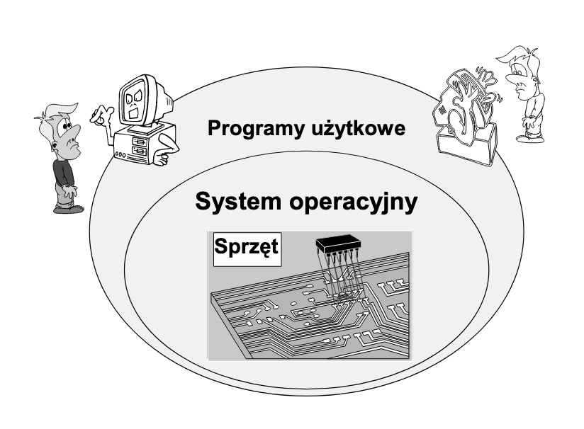
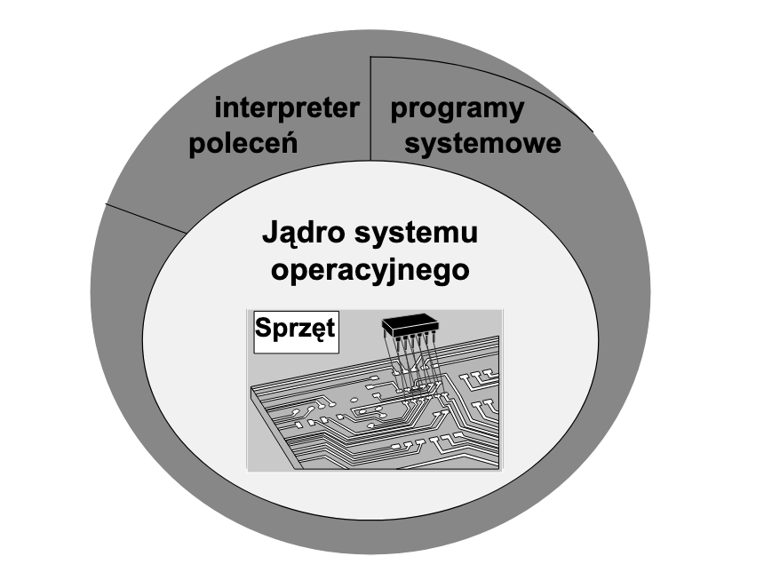
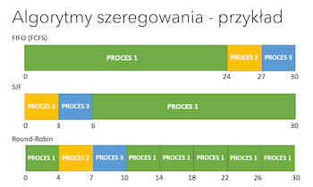
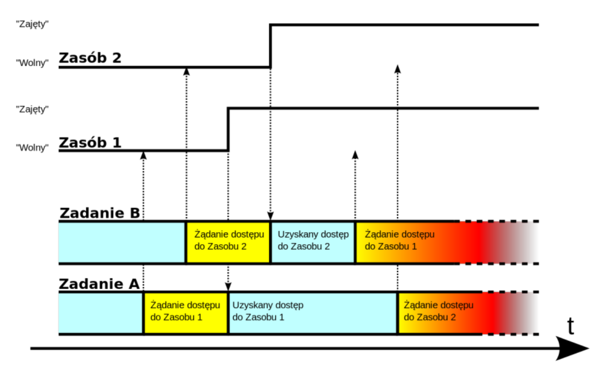

### 11. System operacyjny. Postrzeganie systemu operacyjnego przez warstwę oprogramowania użytkowego.

<a href="<https://wazniak.mimuw.edu.pl/images/5/57/Sop_01_wyk_bw_1.1.pdf>"> Źródło: wykład "Wprowadzenie do systemów operacyjnych"</a>

<h4>Definicja</h4>

**System operacyjny** jest warstwą oprogramowania operującą bezpośrednio na sprzęcie, której celem jest zarządzanie zasobami systemu komputerowego i
stworzenie użytkownikowi środowiska łatwiejszego do zrozumienia i wykorzystania.

<center>



</center>

System operacyjny *pośredniczy* pomiędzy użytkownikiem a sprzętem,
dostarczając wygodnego środowiska do wykonywania programów. Użytkownik
końcowy korzysta z programów (aplikacji), na potrzeby których przydzielane są
zasoby systemu komputerowego. Przydziałem tym zarządza system operacyjny,
dzięki czemu można uzyskać stosunkowo duży stopień niezależności programów
od konkretnego sprzętu oraz odpowiedni poziom bezpieczeństwa i sprawności
działania.

<h4> Ogólna struktura systemu operacyjnego </h4>

Nie ma precyzyjnego określenia, które składniki wchodzą w skład systemu
operacyjnego jako jego części.
<center>



</center>

W ogólnym przypadku w strukturze systemu operacyjnego wyróżnia się jądro
oraz programy systemowe, które dostarczane są razem z systemem operacyjnym,
ale nie stanowią integralnej części jądra. **Jądro** jest zbiorem modułów, które
ukrywają szczegóły sprzętowej realizacji systemu komputerowego, udostępniając
pewien zestaw usług, wykorzystywanych między innymi do implementacji
programów systemowych.

Z punktu widzenia kontaktu z użytkownikiem istotny jest **interpreter poleceń**,
który może być częścią jądra lub programem systemowym (np. w systemie
UNIX). Interpreter wykonuje pewne polecenia wewnętrznie, tzn. moduł lub
program interpretera dostarcza implementacji tych poleceń. Jeśli interpreter nie
może wykonać wewnętrznie jakiegoś polecenia, uruchamia odpowiedni program
(tzw. polecenie zewnętrzne), jako odrębny proces.

**Programy systemowe (programy użytkowe systemu)**:
<ul>
<li>programy do obsługi plików, w tym pakujące i archiwizujące</li>
<li>programy do komunikacji w sieci</li>
<li>proste edytory tekstów i grafiki</li>
<li>programy diagnozujące pracę procesora, pamięci, sieci, dysków twardych itp</li>
<li> kompilatory </li>
</ul>

**Zadania systemu operacyjnego:**
<ul>
<li> Definicja interfejsu użytkownika </li>
<li> Udostępnianie systemu plików </li>
<li> Udostępnianie środowiska do wykonywania
programów użytkownika </li>
  <ul>
    <li> mechanizm ładowania i uruchamiania programów</li>
    <li> mechanizmy synchronizacji i komunikacji procesów </li>
  </ul>
<li>Sterowanie urządzeniami wejścia-wyjścia</li>
<li>Obsługa podstawowej klasy błędów</li>
</ul>

<h4>Podział systemów operacyjnych</h4>
<ul>
<li> Ze względu na sposób przetwarzania </li>
<ul>
<li>systemy przetwarzania bezpośredniego (online processing systems) - bezpośrednia interakcja użytkownik<->system</li>
<li>systemy przetwarzania pośredniego (offline processing systems) - zwłoka czasowa; brak możliwości ingerencji w wykonywanie zadania</li>
</ul>

<li> Ze względu na liczbę wykonywanych programów </li>
<ul>
<li>jednozadaniowe - tylko jedno zadanie na raz</li>
<li>wielozadaniowe - wiele zadań jednocześnie</li>
</ul>

<li> Ze względu na liczbę użytkowników </li>
<ul>
<li>dla 1 użytkownika - tylko jedno zadanie na raz</li>
<li>wielozadaniowe - wielu użytkowników może
korzystać ze zasobów systemu komputerowego, a
system operacyjny gwarantuje ich ochronę przed
nieupoważnioną ingerencją</li>
</ul>
</ul>

#### **Procesy**

**Proces** - uruchomiony program. Jeden program to może być wiele procesów, bo np. uruchomimy wiele razy ten jeden program. Każdy proces jest identyfikowany przez numer PID.

W systemie operacyjnym każdy proces posiada proces nadrzędny (rodzica), z kolei każdy proces może, poprzez wywołanie funkcji systemu operacyjnego, utworzyć swoje procesy potomne. W ten sposób tworzy się swego rodzaju drzewo procesów.

W *skład procesu* wchodzi:
<ul>
<li>kod programu</li>
<li>licznik rozkazów</li>
<li>stos</li>
<li>sekcja danych</li>
</ul>

W trakcie ładowania procesu do pamięci system operacyjny tworzy *stos* (stack) i *stertę* (heap). 

**Stos** – do przechowywania zmiennych, parametrów funkcji, adresów powrotu.
**Sterta** – do przechowywania dynamicznie alokowanych danych, np. listy

**Stany procesu**:
<ul>
<li><b>Początkowy</b> (initial) – w trakcie uruchamiania</li>
<li><b>Aktywny</b> (running, executing)– proces działa na procesorze</li>
<li><b>Gotowy</b> (ready) – proces jest gotowy do uruchomienia, ale w tej chwili jest wstrzymany</li>
<li><b>Oczekujący</b> (blocked) ; proces wykonał operację w wyniku której nie może zostać ponownie uruchomiony dopóki nie nastąpi jakieś zdarzenie (np. operacja we/wy).</li>
<li><b>Końcowy</b> (final) – podczas zamykania</li>
<li><b>Zombie</b> – ukończony proces, który czeka na jakąś akcję, np. odczytanie kodu wyjścia przez proces rodzica</li>
<li><b>Demon</b> (ang. daemon czyli duszek) - nazywamy proces działający w tle, nie podlegający sterowaniu z żadnego terminala, uruchamiany zwykle podczas startu systemu i działający do jego zamknięcia.</li>
</ul>

#### **Wątek**
Czasami może być konieczne współbieżne wykonywanie pewnych fragmentów programu. Aby to zrealizować, program może zażądać utworzenia określonej liczby wątków, wykonujących wskazane części programu. Ta cecha systemu operacyjnego to wielowątkowość. W jednym procesie może być kilka wątków. Każdy wątek ma swój własny stos (posiada swoje zmienne lokalne)

#### **Wielozadaniowość**
Cecha systemu operacyjnego umożliwiająca równoczesne wykonywanie więcej niż jednego procesu (programu).

#### **Planista (dyspozytor)**
Jest jak policjant na skrzyżowaniu, który wskazuje, które auta mogą teraz przejechać przez skrzyżowanie. Jest to część systemu operacyjnego przełączająca procesy według polityki szeregowania zadań. Do jego zadań należy m.in. przełączanie kontekstu.

**Planista krótkoterminowy** ustala wartość priorytetu. Wybiera proces o najwyższym priorytecie do wykonania.

#### **Algorytmy szeregowania**
<ul>
<li><b>FIFO</b> – (FCFS) - najprostszy, niewywłaszczający, implementowany za pomocą kolejki FIFO;</li>
<li><b>SJF</b> (Shortest-Job-First) - wiąże z każdym procesem długość jego najbliższej z faz procesora, zapewnia minimalny średni czas oczekiwania; może być wywłaszczający lub nie;</li>
<li>algorytm <b>Round-Robin</b> - czas procesora podzielony na kwanty, kolejka procesów gotowych traktowana jako kolejka cykliczna, algorytm z wywłaszczeniem;</li>
</ul>

<center>



</center>

 Możliwe jest **zagłodzenie** procesu, gdy dany proces nie jest w stanie zakończyć działania,
  ponieważ nie ma dostępu do procesora lub innego współdzielonego zasobu.
Występuje
 najczęściej na skutek niewłaściwej pracy algorytmu szeregowania lub nadmiernego obciążenia
 systemu.

 Zdarza się również tzw. **zakleszczenie**, czyli blokada wzajemna. Powstaje wtedy, gdy wiele
 zadań w tym samym czasie konkuruje o wyłączny dostęp do zasobów. Zakleszczenie:

 <center>



</center>
 
### 12. Cechy tradycyjnego systemu :sparkling_heart: Unixowego :sparkling_heart:.

<a href="<https://ai.ia.agh.edu.pl/_media/pl:dydaktyka:unix:gjn-unix-2015wiosna-lec1_4.pdf>"> Polecanko - slajd 46+</a>
<h4>TL;DR: Unix to system </h4>
<ul>
<li><b>wielozadaniowy</b> - jest to cecha systemu operacyjnego, mówiąca, czy może on wykonywać jednocześnie kilka procesów. Wielozadaniowość otrzymuje się poprzez tzw. scheduler, czyli algorytm kolejkujący i porządkujący procesy, które mają być wykonane. W tym systemie każdy proces jest wykonywany jakiś kwant czasu, a później czeka "w uśpieniu" (oczywiście z uwzględnieniem różnych priorytetów).</li><br>

<li><b>wielodostępowy</b> (o ile jego administrator nie zażyczy sobie inaczej) - oznacza możliwość jednoczesnej pracy wielu użytkowników (np. możliwość czytania tego samego pliku przez kilku użytkowników)</li><br>

<li><b>wielowątkowy</b> – jest to cecha systemu operacyjnego, dzięki której w ramach jednego procesu można wykonywać kilka wątków lub jednostek wykonawczych. Nowe wątki to kolejne ciągi instrukcji wykonywane oddzielnie. Wszystkie wątki współdzielą między sobą ten sam obszar pamięci. W momencie, gdy system nie wspiera wielowątkowości, pojęcie procesu i wątku utożsamiają się.</li>
</ul>

<h4>Cechy</h4>

<ol>

<li> <b>Jądro</b> systemu jest, oprócz pewnej części ściśle związanej z obsługiwanym sprzętem,
<b>napisane w języku wysokiego poziomu (C)</b>.</li>
<br>
<li>W Unixie obowiązuje model administracyjny, bazujący na <b>ograniczonym zaufaniu do użytkowników</b>. Ujawnia się on między innymi tym, że zwykle użytkownik lokalny ma
prawo zapisu jedynie w swoim katalogu domowym, katalogu na pliki tymczasowe oraz w kilku innych, dobrze znanych miejscach. Jednocześnie administratora systemu
(użytkownika o numerze identyfikacyjnym 0) nie dotyczą jakiekolwiek ograniczenia.</li><br>
<li><b>System praw dostępu do plików</b> (czyli również do urządzeń czy kanałów komunikacyjnych) jest zbudowany w oparciu o tablicę bitową stałej długości, zapisaną w i-węźle. Zawiera ona zezwolenia na trzy podstawowe operacje – czytanie, zapis i wykonanie dla trzech rozłącznych klas użytkowników: właściciela pliku, członków tzw. grupy pliku oraz innych. Unixowy system praw dostępu jest bardzo efektywny w działaniu, brak dynamicznych list dostępu jest jednakże dość uciążliwy.</li><br>
<li>Unix bezpośrednio po starcie widzi tylko jedno urządzenie pamięci masowej, zawierające tzw. korzeń systemu plików (oznaczany znakiem /). Inne urządzenia są przyłączane do głównego drzewa w procesie tzw. montowania i są widoczne jako fragmenty drzewa plikowego od pewnego katalogu określanego jako punkt montowania.</li><br>
<li>Naturalnym sposobem <b>organizacji pamięci masowej</b> jest model indeksowy oparty na tzw. i-węzłach (ang. i-nodes). i-węzeł zawiera w postaci tablicy o stałym rozmiarze wszystkie informacje o pliku poza jego nazwą. Odwzorowaniem i-węzłów na nazwy plików zajmują się pliki specjalne – katalogi.</li><br>
<li>Budowie interfejsu programisty systemu (API) prześwięca minimalizm, ujawniający się choćby tym, że odczyt i zapis informacji w rozmaitych urządzeniach obsługiwanych przez system odbywa się za pomocą tego samego interfejsu jak odczyt i zapis informacji do plików „zwykłych”. Zasadę tę często definiuje się jako: „Dla Unixa wszystko jest plikiem”. </li><br>
<li>Jednostką aktywną w systemie jest <b>proces</b>, pracujący w trybie nieuprzywilejowanym procesora, we własnej chronionej przestrzeni adresowej; jedynym elementem aktywnym w trybie uprzywilejowanym jest jądro systemu. </li><br>
<li>Unix wykorzystuje do pracy w środowisku rozproszonym rodzinę protokołów TCP/IP. </li><br>
<li>Plik danych jest ciągiem bajtów. </li><br>
<li>Unix używa pamięci wirtualnej, rozszerzając pamięć operacyjną o tzw. obszary wymiany w pamięci masowej. Niewykorzystaną pamięć operacyjną wypełniają bufory używanych plików.</li><br>
<li>Podstawową metodą tworzenia nowych procesów jest rozwidlanie procesu aktywnego funkcją systemową fork. Po jej wywołaniu system tworzy nowy proces, którego przestrzeń adresowa jest kopią przestrzeni procesu macierzystego. Oba procesy rozpoczynają współbieżną pracę od następnej instrukcji za wywołaniem fork. Często proces potomny wykonuje niedługo po utworzeniu funkcję systemową execve, która zastępuje kod aktywnego procesu kodem z pliku wykonywalnego. </li><br>
<li>Otwarty plik jest dostępny w procesie poprzez liczbę całkowitą zwaną <b>deskryptorem pliku</b>. Predefiniowanymi deskryptorami są tu wartości 0 (standardowe wejście, zwykle związane z klawiaturą terminala), 1 (standardowe wyjście, zwykle z związane z wyjściem terminala) oraz 2 (standardowe wyjście dla błędów). </li><br>
<li>W środowisku tekstowym naturalnym środowiskiem pracy jest tzw. Interpreter poleceń czyli powłoka (ang. shell).</li><br>
<li>Unixowy system plików jest widoczny jako wielopoziomowe drzewo.</li><br>
<li>Procesy korzystają podczas pracy z mechanizmów łączenia dynamicznego, ładując kod wspólnych bibliotek w miarę potrzeb. Podstawową biblioteką uwspólnioną jest standardowa biblioteka języka C (tzw. libc).</li><br>
<li>Komunikacja międzyprocesowa odbywa się przez jądro systemu.</li><br>
</ol>

<h4>Typy plików Unixowych</h4>
<ul>
<li><b>pliki zwykłe</b> – (symbol: -) ciągi bajtów, może istnieć w kilku miejscach w systemie plików jednocześnie.</li><br>

<li><b>katalogi</b> – (symbol: d) plik binarny zawierający listę plików oraz katalogów, które się w nim znajdują. Typowe operacje dostępu do pliku, np. otwarcie, nie działają dla katalogu. Dowiązania sztywne do katalogu są tworzone jedynie pośrednio przez system. Każdy katalog zawiera dwie specjalne pozycje:
<ul>
<li>. – wskazującą na ten katalog
<li>.. – wskazującą na katalog zawierający.
</ul>
<br>

<li><b>dowiązanie symboliczne</b>, (ang. symbolic link, często skracane jako symlink) wskazuje, odwołując się za pomocą nazwy, na dowolny inny plik lub katalog (który może nawet w danej chwili nie istnieć). Odwołanie jest niewidoczne na poziomie aplikacji tzn. jest traktowane jak zwykły plik lub katalog.</li><br>

</ul>


### 13. Iteracja, rekurencja i ich realizacja.
<a href="<https://fulmanski.pl/zajecia/wdi/zajecia_20212022/wyklad_pres/pres_pl_algorithm.pdf>"> Źródło :duck: :fire:</a>


**Iteracja** - czynność powtarzania (najczęściej wielokrotnego) tej samej instrukcji (albo wielu instrukcji) w pętli.

**Rekurencja** to w logice, programowaniu i w matematyce odwoływanie się np. funkcji lub definicji do samej siebie.

Najwięcej problemów związanych z rekurencją wiąże się z ograniczeniami
stosu wywołań, a właściwie jego pojemności. Na stosie są odkładane kolejne wywołania danej metody i dopiero gdy dojdziemy do ostatniego elementu dane te są zbierane – bardzo łatwo więc o sytuację, gdy po prostu stos przepełnimy.

<h4>Klasyczne przykłady</h4>

**Silnia iteracyjnie:** n! = 1 \* 2 \* 3...* n <br>
**Silnia rekurencyjnie:** n! = n \* (n-1)!


**Ciąg Fibonacciego**

*Definicja*: dla $n>1$ mamy
$$fib_n = fib_{n-1} + fib_{n-2}, $$
natomiast wyrazy 1 i 0 przyjmują wartość 1.

**Fibonacci rekurencyjnie:**
```
function FibR(n)
begin
      if ( n=0 or n=1) then {
          return 1
      }  
      return FibR(n-1) + FibR(n-2)
end
```
**Fibonacci iteracyjnie:**
```
function FibI(n)
begin
    tmp :=0 // zmienna tymczasowa (pomocnicza)
    x := 1 // wyraz n-1
    y := 1 // wyraz n-2

    for i:=1 to n-1 step 1 {
      tmp := y   // zapamiętaj wyraz n-2
      y := y+x   // przesuń wyraz n-2 na kolejną wartość ci¡gu
      x := tmp   // przesuń wyraz n-1 na kolejną wartość ci¡gu
                 // czyli na warto±¢ wyrazu n-1 przed jego
                 // przesunięciem
    }
    return x
end
```

### 14. Mechanizmy strukturalizacji programów - instrukcje warunkowe i pętle.

I mean..come on ;-;

<a href="<https://home.agh.edu.pl/~pkleczek/dokuwiki/doku.php?id=dydaktyka:cprog:2015:conditionals>"> For disabled folks</a>

**Switch syntax**
```
switch(expression) {
  case x:
    // code block
    break;
  case y:
    // code block
    break;
  default:
    // code block
}
```

>Note: The default keyword must be used as the **last statement** in the switch, and it **does not need a break**. *default* can be the first statement on the list, but it makes no sense since only this statement will be executed. 

> **break** and **default** keywords are *optional*.

>Without a break statement, **every statement** from the matched case label to the end of the switch, including the default, is executed.

</br>

#### **switch statement behavior**

<table align="center" >
    <thead>
        <tr>
            <th>Condition</th>
            <th>Action</th>
        </tr>
    </thead>
    <tbody>
        <tr>
            <td>Converted value matches that of the promoted controlling expression.</td>
            <td>Control is transferred to the statement following that label.</td>
        </tr>
        <tr>
            <td>None of the constants match the constants in the case labels; a default label is present.</td>
            <td>Control is transferred to the default label.</td>
        </tr>
        <tr>
            <td>None of the constants match the constants in the case labels; no default label is present.</td>
            <td>Control is transferred to the statement after the switch statement.</td>
        </tr>
    </tbody>
</table>

<a href="<https://docs.microsoft.com/en-us/cpp/cpp/switch-statement-cpp?view=msvc-170>">Switch documentation</a>


## 15. Podprogramy. Przekazywanie parametrów podprogramu.

**Podprogramy** – wydzielona część programu wykonująca określony zbiór instrukcji, posiadająca swoją nazwę i stanowiąca pewną odrębną całość. Ich nazwy powinny informować o ich wyniku działania.

Ogólnie przyjęta konwencja (w przypadku C++) typ_rezultatu nazwa_funkcji( lista parametrów formalnych); na przykład:
```
bool isPrime(int);
```

**Podprogramy dzielą się na dwa rodzaje:**
<ul>
<li>funkcje, które operują na otrzymanych w parametrach danych, zwracają pewną obliczoną wartość, ale nie ingerują w działanie programu.</li>
<li>procedury mogą przyjmować parametry, a w wyniku ich działania następują zmiany globalne w programie bądź w otrzymanych parametrach; po swoim działaniu nie zwraca niczego.</li>
</ul>

Innym szczególnym przypadkiem są *metody* – funkcje, które są własnością klasy lub obiektu. Bez ich istnienia nie można się do nich odwołać.

>W niektórych językach programowania nie istnieje powyższy podział.

Jeżeli chodzi o C++, formalnie procedury nie istnieją, jednak łatwo się domyślić, że ustawiając jako typ rezultatu void możemy utworzyć coś na jej wzór.

**Przekazywanie parametrów do podprogramów odbywa się głównie na dwa sposoby:**
<ul>
<li><b>przez wartość</b> – wewnątrz bloku podprogramu tworzona jest zmienna lokalna, do której kopiowana jest wartość przekazanego parametru, a następnie wszystkie operacje wykonywane są na kopii. Po zakończeniu działania podprogramu wszystkie kopie przestają istnieć, zaś oryginalna zmienna pozostaje niezmieniona</li>

<li><b>przez referencję</b> – do podprogramu przekazywany jest bezpośredni dostęp do zmiennej, a nie jedynie jej wartość, co zmniejsza zużycie pamięci oraz umożliwia modyfikację zmiennej, której efekty pozostaną także po zakończeniu działania podprogramu.</li>
</ul>

```
int addOne(int number) {
    return number++; //przez wartość
}

int addOne(int &number) {
    return number++; //przez referencję
}
```
## 16. Porównanie programowania obiektowego i strukturalnego.

<a href="<link_to_resource_local_or_online_here>"></a><b></b>
<table align="center">
    <thead>
        <tr>
            <th>Ex. 1</th>
            <th>Ex. 2</th>
            <th>Ex. 3</th>
        </tr>
    </thead>
    <tbody>
        <tr>
            <td>Ts</td>
            <td>Ts</td>
            <td>Ts</td>
        </tr>
    </tbody>
</table>

## 17. Hermetyzacja danych - cechy klas obiektowych (pola, metody, poziomy prywatności danych).

<a href="<link_to_resource_local_or_online_here>"></a><b></b>
<table align="center">
    <thead>
        <tr>
            <th>Ex. 1</th>
            <th>Ex. 2</th>
            <th>Ex. 3</th>
        </tr>
    </thead>
    <tbody>
        <tr>
            <td>Ts</td>
            <td>Ts</td>
            <td>Ts</td>
        </tr>
    </tbody>
</table>

## 18. Typy metod: konstruktory, destruktory, selektory, zapytania, iteratory.

<a href="<link_to_resource_local_or_online_here>"></a><b></b>
<table align="center">
    <thead>
        <tr>
            <th>Ex. 1</th>
            <th>Ex. 2</th>
            <th>Ex. 3</th>
        </tr>
    </thead>
    <tbody>
        <tr>
            <td>Ts</td>
            <td>Ts</td>
            <td>Ts</td>
        </tr>
    </tbody>
</table>

## 19. Dziedziczenie i dynamiczny polimorfizm.

<a href="<link_to_resource_local_or_online_here>"></a><b></b>
<table align="center">
    <thead>
        <tr>
            <th>Ex. 1</th>
            <th>Ex. 2</th>
            <th>Ex. 3</th>
        </tr>
    </thead>
    <tbody>
        <tr>
            <td>Ts</td>
            <td>Ts</td>
            <td>Ts</td>
        </tr>
    </tbody>
</table>

## 20. Polimorfizm statyczny – szablony.

<a href="<link_to_resource_local_or_online_here>"></a><b></b>
<table align="center">
    <thead>
        <tr>
            <th>Ex. 1</th>
            <th>Ex. 2</th>
            <th>Ex. 3</th>
        </tr>
    </thead>
    <tbody>
        <tr>
            <td>Ts</td>
            <td>Ts</td>
            <td>Ts</td>
        </tr>
    </tbody>
</table>
