## 21. Listy i drzewa oraz ich zastosowania. Stosy i kolejki.

<a href="<link_to_resource_local_or_online_here>"></a><b></b>

__Listy__

Lista to ciąg elementów, gdzie każdy zawiera atrybuty: ***key***, ***next*** oraz ***previous***. Wartość każdego z tych elementów odczytujemy przez ***key[x]***. Listy reprezentujemy poprzez obiekt, zawierający atrybuty ***head*** oraz ***tail***, wskazujące odpowiednio na początek i koniec listy.

Listy dzielimy na 3 typy:

1. listy jednokierunkowe
2. Listy dwukierunkowe
3. Listy cykliczne

 

W liście ***jednokierunkowej*** każdy z elementów wskazuje na element następny, czyli dla każdego x, next[x] wskazuje na kolejny. Ostatni element listy wskazuje na pusty element ***NIL***.

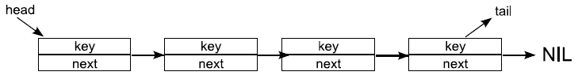

 

W liście ***dwukierunkowej*** każdy element zawiera trzy atrybuty. Oprócz atrybutu next zawiera także *previous* wskazujący na poprzedni element listy. Na pusty element ***NIL*** wskazuje zarówno pierwszy jak i ostatni element listy.

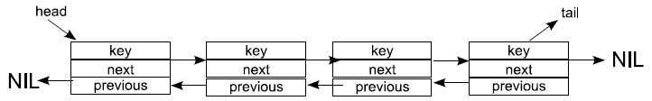

 

Listą ***cykliczną*** nazywamy listę, w której ostatni element **zamiast wskazywać** na pusty element **NIL**, wskazuje na pierwszy element listy. **Nie występują** tutaj atrybuty **head i tail**.

 

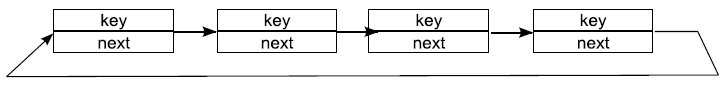

 

__Stos__

Stos to liniowa struktura danych, gdzie elementy przetwarzane są w kolejności od tego, który pojawił się najpóźniej (jest na górze stosu) do tego, który pojawił się na samym początku (na dole stosu).

Poszczególne elementy można przeglądać, lecz by pobrać element znajdujący się poniżej, trzeba pobrać ze stosu wszystkie elementy znajdujące się nad nim.

W algorytmach stos reprezentowany jest przez strukturę **LIFO (Last In First Out)**.

 

__Kolejka__

Kolejka jest strukturą działającą przeciwnie do stosu. Dane są przetwarzane w kolejności ich pojawienia się, tzn.: zaczynając od tego, który pojawił się na początku, kończąc na tym, który znalazł się na samym końcu.

W algorytmach kolejka reprezentowana jest poprzez strukturę ***FIFO (First In First Out)***.

 

__Drzewa__

Drzewo składa się z elementów , które posiadają **trzy** atrybuty: ***key***, ***left*** oraz ***right***.

Drzewo reprezentowane jest przez obiekt z atrybutem ***root (korzeń)***. Kolejne elementy są jego potomkami.

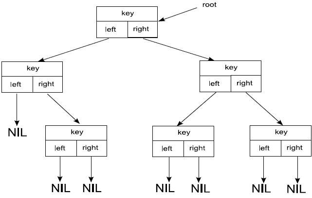

W informatyce drzewo wykorzystywane jest do budowy ***drzew decyzyjnych***, które są podstawą działania takich algorytmów jak ***min-max*** (wyznaczanie optymalnych ruchów).

## 22. Grafy i metody ich przeszukiwania. Zastosowania.

__Grafy__

**Graf** To struktura matematyczna służąca do przedstawiania i badania relacji między obiektami. W uproszczeniu **Graf to zbiór wierzchołków, które mogą być połączone krawędziami w taki sposób, że każda krawędź kończy się i zaczyna w którymś z wierzchołków**.

 

***Grafem nieskierowanym*** nazywamy parę **G=(V, E)**, gdzie **V** jest pewnym zbiorem skończonym zwanym **zbiorem wierzchołków grafu G**.

Natomiast **E** jest zbiorem nieuporządkowanych par **{u, v}** gdzie ***u, v  $\isin$ V*** oraz ***u != v***.

Zbiór **E** nazywamy zbiorem krawędzi grafu **G**.

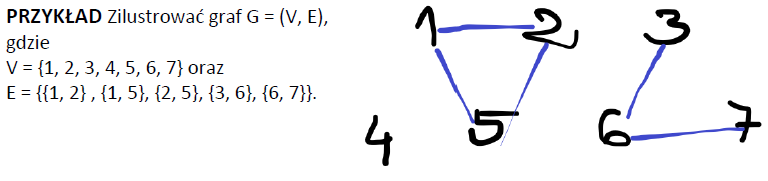

Jeśli ***{u, v}*** jest krawędzią grafu nieskierowanego **G**, to mówimy, że ***{u, v}*** jest ***incydentna*** z wierzchołkami **u** i **v**.

**Stopniem** wierzchołka w grafie nieskierowanym nazywamy ***liczbę incydentnych z nim krawędzi***. Pętlę liczymy za 2.

 

***Grafem skierowanym*** nazywamy parę ***G=(V, E)***, gdzie **V** jest pewnym zbiorem skończonym zwanym **zbiorem wierzchołków grafu G**.

Natomiast **E** - zbiór krawędzi grafu **G**.

**G** - zbiór uporządkowanych par ***{u, v}** oznaczanych **(u, v)**, gdzie ***u, v  $\isin$ V***

**Stopniem** wierzchołka w grafie skierowanym nazywamy **sumę liczby krawędzi wchodzących do wierzchołka i wychodzących z tego wierzchołka**

 

**Rząd grafu** - liczba wierzchołków w grafie.

**Rozmiar grafu** - liczba krawędzi w grafie.

**Droga (ścieżka)** - drogą w grafie będziemy nazywać ciąg krawędzi taki, że koniec jednej stanowi początek następnej. Drogę nazywamy **prostą**, gdy **wszystkie jej wierzchołki są różne**.

**Osiągalność** - mówimy, że **v** jest osiągalny z **u**, gdy istnieje droga z **u** do **v**.

**Cykl** - cyklem nazywamy zamkniętą drogę *x1x2x3...xnx1* w grafie skierowanym, gdzie to wierzchołki *x1x2...xn* to wierzchołki drogi, która jest długości co najmniej 1. **Gdy wszystkie wierzchołki są różne to cykl nazywamy prostym**. **Cykl o długości 1 nazywamy pętlą**.

Mówimy, że ścieżka ***<v0, v1, ..., vk>*** tworzy **cykl** w grafie **nieskierowanym**, gdy **v0 = vk**, **v1 ... vk** są różne oraz **k >=2**

Graf niezawierający cykli nazywamy grafem **acyklicznym**.

Acykliczny graf nieskierowany nazywamy **lasem**.

**Graf prosty** to graf bez krawędzi wielokrotnych i bez pętli.

**Graf regularny** to fraf, w którym wszystkie wierzchołki są tego samego stopnia.

**Graf pusty** to graf, w którym w ogólne nie ma krawędzi (są same wierzchołki izolowane).

**Graf pełny** to graf prosty, w którym każdy wierzchołek jest połączony krawędzią z każdym.

 

**Graf jest spójny**, gdy każda para różnych wierzchołków jest połaczona drogą w tym grafie.

Spójny podgraf grafu **G**, który nie jest zawarty w żadnym większym spójnym podgrafie tego grafu, nazywamy **składową grafu G**.

Spójny, acykliczny graf nieskierowany nazywamy **drzewem (wolnym)**.

**Cykl Eulera** - droga zamknięta przechodząca przez każdą krawędź grafu dokładnie raz.

**Droga Eulera** - droga przechodząca przez każdą krawędź grafu dokładnie raz.

Graf, który posiada cykl Eulera **Musi mieć wszystkie wierzchołki stopnia parzystego**.

Graf, który posiada drogę Eulera ma **albo dokładnie dwa wierzchołki stopnia nieparzystego, albo nie ma w ogóle takich wierzchołków**.

Graf spójny, mający dokładnie 2 wierzchołki stopnia nieparzystego **posiada drogę Eulera**.

 

__Formy reprezentacji grafów__
- **Macierz sąsiedztwa**
  
  Macierzą sąsiedztwa grafu (skierowanego lub nie) nazywamy macierz **M** o wymiarze ***VxV***, w której wartości reprezentują wagę połączeń pomiędzy wierzchołkami, 1 gdy połączone, 0 gdy nie ma.

    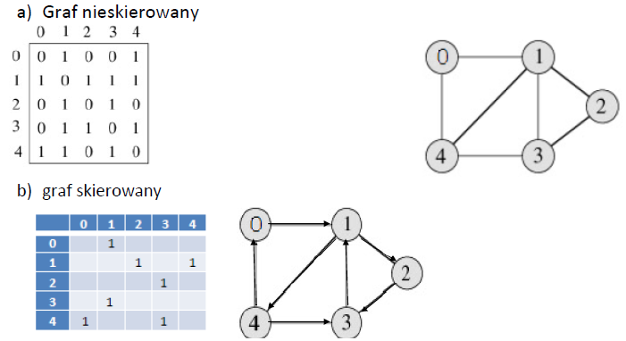

- **Lista sąsiedztwa**

  Dane zapisywane są w postaci listy obiektów zawierających wierzchołek grafu, wraz z listą wierzchołków sąsiednich. W przypadku grafu nieskierowanego listy są dłuższe, ponieważ muszą odzwierciedlać krawędzie w obu kierunkach.

  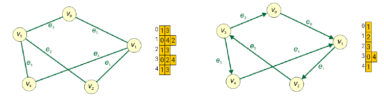

- **Macierz incydencji**
  
  Macierz incydencji jest macierzą **A** o wymiarze **n x m**, gdzie **n** oznacza liczbę wierzchołków grafu, natomiast **m** liczbę jego krawędzi. Każdy wiersz tej macierzy odwzorowuje jeden wierzchołek grafu. Każda kolumna odwzorowuje jedną krawędź. Zawartość komurki **A[i, j]** określa powiązanie (incydencję) wierzchołka **vi** z krawędzią **ej** w sposób następujący:

    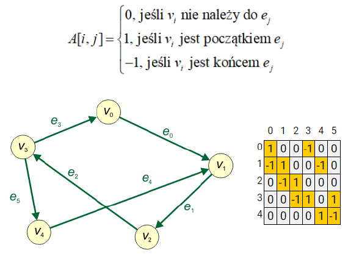

  Jeśli graf jest nieskierowany, to definicję macierzy należy uprościć:

    

 

__Zastosowania__

**Mapy** - Aby znaleźć najkrótszą drogę by dostać się z jednego miejsca do drugiego można wykorzystać graf, którego wierzchołki będą odpowiadały miejscowością a krawędzie drogom.

**Dokumenty hipertekstowe** - Przeszukując internet napotykamy dokumenty, które zawierają odnośniki do innych dokumentów - internet jest grafem, którego wierzchołkami sa dokumenty a krawędziami odsyłacze.

**Sieci** - Sieć komputerowa zbudowana jest z komputerów, które przesyłają między sobą informacje. Komputery w danej sieci reprezentowane są przez wierzchołki grafu, a połączenia między nimi krawędziami.

**Struktura programu** - Kompilator buduje graf reprezentujący strukturę wywołań podprogramów w kompilowanym programie. Wierzchołkami grafu są różne funkcje, natomiast krawędzie są kojarzone z wywołaniem funkcji./

## 23. Metody projektowania algorytmów (dziel i rządź, programowanie dynamiczne i algorytmy zachłanne).

- **Dziel i rządź**
  
  Polega na rekurencyjnym dzieleniu problemu na mniejsze podproblemy. Dzielenie trwa dopóni nie uzyskamy problemów, które da się w prosty sposób rozwiązać.

  Algorytmy wykorzystujące metodę "dziel i rządź":
  - Sortowanie przez wybieranie
  - Sortowanie przez wstawianie
  - Sortowanie przez scalanie
  - Quicksort

 

- **Programowanie dynamiczne**
  
  Jest stosowane głównie do rozwiązywania problemów optymalizacyjnych. Jest alternatywą dla niektórych zagadnień rozwiązywanych metodami zachłannymi. Wyniki poszczególnych obliczeń są zapamiętywane w pomocniczej tablicy, która jest wykorzystywana w kolejnych krokach. Eliminuje to konieczność wielokrotnego powtarzania tych samych obliczeń.

  Algorytmy wykorzystujące programowanie dynamiczne:
  - Algorytm Bellmana-Forda
  - Algorytm Helda-Karpa
  - Algorytm wykorzystujący problem wydawania reszty

 

- **Algorytm zachłanny**

  W każdym kroku dokonuje wyboru będącego na daną chwilę tym najlepszym. Podejmuje decyzje optymalne tylko lokalnie. Kontynuuje działania wynikające z poprzednich decyzji.

  Algorytmy wykorzystujące metodę zachłanną:
  - Algorytm Dijkstry (poszukiwanie najkrótszych ścierzek)
  - Algorytm Kruskala (poszukujący minimalnego drzewa rozpinającego)

## 24. Elementarne i nieelementarne metody sortowania.

Elementarne metody sortowania:
- **Sortowanie przez selekcję (selection sort)** - Jego czas działania jest określany z góry O(n2). Sortowanie to jest najlepsze, spośród innych elementarnych do sortowania elementów o małych kluczach i dużych polach, ponieważ wykonuje najmniej wstawień. W pierwszym przebiegu algorytm znajduje najmniejszy element w tablicy i zamienia go z pierwszym. W drugim algorytm znajduje najmniejszy element w podtablicy i zamienia go z drugim. Tak aż do zamiany r-tego elementu z r-1 elementem.
 
- **Sortowanie bąbelkowe** - Czas działania jest z góry określony przez O(n2) - algorytm wykonuje w najgorszym i średnim przypadku podobną ilość porównań i zamian. Zadada działania opiera się na cyklicznym porównywaniu par sąsiadujących elementów i zamianie ich kolejności w przypadku niespełniania kryterium porządkowego zbioru. Operację tę wykonujemy dotąd, aż cały zbiór zostanie posortowany.

 

Nieelementarne metody sortowania:
- **Quicksort (sortowanie szybkie)** - Średnia złożoność obliczeniowa O(*n log n*)Bazuje na strategii dziel i rządź. Problem dzielimy rekurencyjnie na podproblemy a następnie łączymy w jedno rozwiązanie. Z tablicy wybiera się element rozdzielający, po czym tablica jest dzielona na dwa fragmenty: do początkowego przenoszone są wszystkie elementy nie większe od rozdzielającego, do końcowego wszystkie większe. Potem sortuje się osobno początkową i końcową część tablicy. Rekurencję kończy się, gdy kolejny fragment uzyskany z podziału zawiera pojedynczy element, jako że jednoelementowa tablica nie wymaga sortowania.

- **Sortowanie pozycyjne** - Algorytm porządkujący stabilnie ciągi wartości (liczb, słów) względem konkretnych cyfr, znaków itp, kolejno od najmniej znaczących do najbardziej znaczących pozycji. Złożoność obliczeniowa jest równa O(d(n+k)), gdzie k to liczba różnych cyfr, a d liczba cyfr w kluczach. Wymaga O(n+k) dodatkowej pamięci.

## 25. Elementarne metody wyszukiwania. Haszowanie.

**Wyszukiwanie liniowe/sekwencyjne**
- Polega na przeglądaniu kolejnych elementów zbioru **Z**
- W przypadku odnalezienia elementu, który posiada odpowiednie własności, zwraca jego pozycje w zbiorze i kończy pracę.
- W przypadku pesymistycznym, gdy poszukiwanego elementu nie ma w zbiorze lub też znajduje się on na samym końcu zbioru, algorytm musi wykonać przynajmniej **n** obiegów pętli sprawdzającej poszczególne elementy
- klasa złożoności obliczeniowej jest równa **O(n)**
- W przypadku poszukiwania wszystkich wystąpień poszukiwanej własności elementu, algorytm po zwrocie pierwszej odnalezionej pozycji kontunuuje pracę od następnego indeksu.
 
  

**Wyszukiwanie binarne**
- Opiera się na metodzie **dziel i rządź** oraz działa na uporządkowanych tablicach
- Polega na sprawdzeniu środkowego elementu zbioru oraz przyjęciu nowego podzbioru, gdy środkowy element nie spełnia kryteriów wyszukiwania
- Wyszukiwanie kontynuowane jest w podzbiorze spełniającym warunek porównania **mniejsze-większe**
- W przypadku odnalezienia elementu, posiadającego odpowiednie własności, zwraca on jego pozycję w tablicy i kończy pracę
- Złożoność obliczeniowa równa **O(log2n)**
- W przypadku tablicy o milionie elementów, algorytm musi sprawdzić maksymalnie 20 pozycji

 

**Wyszukiwanie max lub min**
- Opiera się na metodzie wyszukiwania liniowego
- Przyjmuje pierwszy element zbioru za tymczasowy maksymalny/minimalny a następnie porównuje go z kolejnym elementem i na podstawie wyniku porównania może przyjąć nowy tymczasowy element maksymalny/minimalny
- Po przejściu przez wszystkie elementy zbioru, wartość elementu tymczasowego zostaje przyjęta jako maksimum lub minimum zbioru
- Złożonośc obliczeniowa równa **O(n)**

 

**Naiwne wyszukiwanie wzorca w tekście**
- Algorytm ustawia okno o długości wzorca **p** na pierwszej pozycji w łańcuchu **s** a następnie sprawdza czy zawartość wzorca **p** i porównywanego fragmentu łańcucha **s** są sobie równe
- W przypadku pozytywnym pozycja okna jest zwracana jako wynik
- Po porównaniu okno przesuwa się o jedną pozycje w prawo i cała procedura powtarza się, dopóki okno nie wyjdzie poza koniec łańcucha **s**
- Posiada złożoność obliczeniową równą **O(n x m)** pesymistycznie, oraz **o(n)** w najlepszym przypadku.
 
  **n** - długość łańcucha
   
  **m** - długość wzorca

   

**Haszowanie**
- Technika rozwiązywania ogólnego problemu słownika, czyli takiego zorganizowania struktur danych i algorytmów, aby można było w miarę efektywnie przechowywać i wyszukiwać elementy należące do pewnego dużego zbioru danych (uniwersum),
- Przykładem tablicy z haszowaniem jest książka telefoniczna, w której kluczem są imie i nazwisko a wyszukiwaną informacją jest numer telefonu.
- Czas uzyskania informacji jest **niezależny** od rozmiaru tablicy lub położenia elementu
- W najprostszym przypadku wartość **funkcji mieszającej** dla danego **klucza** wyznacza **indeks** szukanej informacji w tablicy (złożoność obliczeniowa wynosi **O(1)**) 
- Może wystąpić problem **kolizji**, czyli przypisania przez funkcję mieszającą tej samej wartości dwóm różnym kluczom

**Unikanie kolizji**
- Zastąpienie istniejącego elementu lub rezygnacja ze wstawienia nowego elementu
- **Metoda Łańcuchowa** - przechowywanie elementów o tej samej wartości wewnątrz listy lib drzewa związanych z danym indeksem (pesymistycznie **O(n)**)
- **Adresowanie Otwarte** - nowy element wstawia się w innym miejscu niż wynikałoby to z wartości funkcji mieszającej a nowy indeks określany jest przez dodanie do wartości tzw. funkcji przyrostu **p(i)**, gdzie **i** oznacza numer próby (liczba kolizji)
- **Współczynnik wypełnienia** - iloraz liczby elementów zapisanych w tablicy mieszającej **(m)** od fizycznego rozmiaru tablicy **(n)**, czyli **$a$ = m/n**. Dzięki temu można przewidzieć prawdopodobieństwo wystąpienia kolizji i odpowiednio skorygować fizyczny rozmiar tablicy
- **Haszowanie kukułcze** - stosuje dwie tablice i dwie odpowiadające im funkcje haszujące. Do momentu kolizji elementy wstawiane są do pierwszej tablicy za pomocą pierwszej funkcji haszującej. W wypadku kolizji element wstawiany jest do drugiej tablicy przez drugą funkcję. Jeśli ponownie nastąpi kolizja, to zastępujemy istniejący już obiekt a dla niego zostaje uruchomiona ponowna procedura wstawiania, jednak tym razem na siłę będzie wstawiony do pierwszej tablicy. W przypadku zapętlenia się algorytmu losowane są nowe funkcje haszujące i wszystkie elementy tablucy zostają ponownie przemieszane. Odczyt elementu z tablicy odbywa się zawsze w czasie stałym.
  
 

**Haszowanie - zastosowania**
- kompilatory, interpretery (w dynamicznych językach obiektowych)
- bazy danych - indeksowanie, łączenie, grupowanie
- analiza i agregacja danych
- trasowanie
- systemy pamięci podręcznej
- monitorowanie
- implementacja zbiorów
- mapowanie
- kompresja danych
- wyszukiwanie wzorca w tekście

 

**Haszowanie - wady**
- Współczesne procesory wykorzystują pamięć podręczną, która przyspiesza odwołania do komórek pamięci operacyjnej, gdy te są zgrupowane blisko siebie. Zastosowanie tablicy mieszającej (z haszowaniem) dla małej liczby elementów może być wolniejsze niż zastosowanie zwykłej tablicy przeszukującej sekwencyjnie
- Występuje ryzyko dużej złożoności obliczeniowej w pesymistycznym przypadku wyszukiwania wynoszącej **O(n)**
- Obliczenie wartości dobrej funkcji haszującej (eliminującej kolizje) może być kosztowne względem czasu lub zasobów pamięci

## 26. Złożoność obliczeniowa algorytmu. Przykłady.

Mierzymy liczbę operacji wykonanych na modelu. Następnie próbujemy znaleźć funkcję, która będzie opisywała liczbę operacji w zależności od wejścia algorytmu. Funkcje te możemy porównać ze sobą.

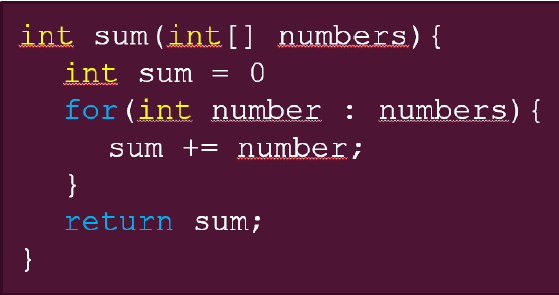

Ile mamy tu operacji? Przypisanie, pętla for. Jej ciało zawiera jedną operację. Sama pętla wykona się dokładnie tyle razy ule jest elementów tablicy numbers. Liczbę tych elementów określimy jako *n*. Na końcu mamy instrukcję return *sum*.

Dodając do siebie otrzymujemy wzór:
*
f(n) = 1+n+1 = n+2
*

Zatem złożoność naszego algotyrmu opisana jest przez funkcję *f(n) = n+2*. Tak więc wyznacza się ją poprostu licząc operacje.

Jak oszacować rząd złożoności funkcji?

Wyobraźmy sobie pewien algorytm. Funkcja, która go opisuje to np.: *f(n) = n3 - 6n2 + 4n + 12*

Argument n to rozmiar danych wejściowych do algorytmu. Wykres tej funkcji wygląda następująco:

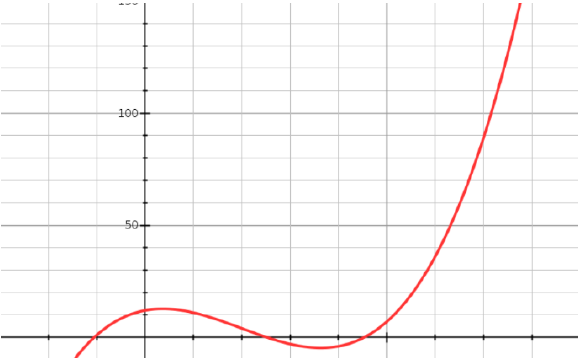

**Notacja Dużego O** zakłada, że istnieje funkcja *g(n)*, dla której spełniona jest poniższa wartość:

$\forall$ n $\geqslant$ n0 : f(n) $\leqslant$ c $\cdot$ g(n)

Oznacza to, że wynik funkcji *g(n)* pomnożony przez jakąś stałą c, będzie większy bądź równy wynikowi funkcji *f(n)*. Własność ta jest spełniona dla wszystkich *n*, które będą większe od n0. Jeszcze łatwiej wygląda to na wykresie:

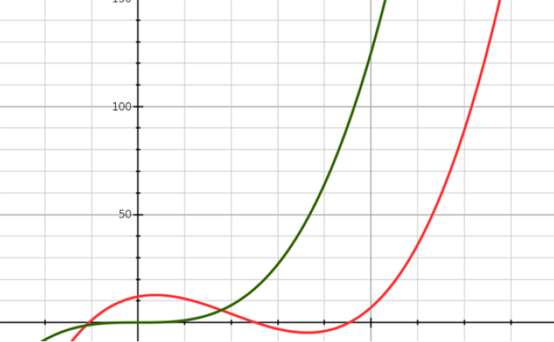

Pokazuje on dwie funkcje. Pierwszą z poprzedniego wykresu. Druga to wykres funkcji *g(n) = n3*. Od pewnego punktu zielona linia jest zawsze ponad czerwoną linią. To nic innego jak oszacowanie z góry. To właśnie robi notacja O. Zatem w naszym przypadku nasza funkcja *f(n)* ma złożoność *O(n3)*

## 27. Pojęcie bazy danych - funkcje i możliwości.

Baza danych jest zbiorem danych oraz narzędzi **Zystemu Zarządzania Bazą Danych (SZBD)** przeznaczonego do zarządzania nią oraz gromadzenia, przekształcania i wyszukiwania danych.

To zbiór usystematyzowanych informacji (danych), który dotyczy rzeczywistości a konkretnie określonego jej fragmentu (wycinka), który reprezentuje. Fragment ten określamy mianem obszaru analizy.

**Cechy bazy danych**
- **Trwałośc danych** - oznacza możliwość przechowywania danych w pamięci masowej (trwałej) komputera
- **Niezależność danych** - pozwala osiągnąć większą elastyczność, ponieważ programy wymieniające informacje z bazą danych są niezależne od przechowywania danych na dysku i szczegółów reprezentacji danych na dysku
- **Ochrona danych** - baza danych oferuje mechanizmy kontroli dostępu do danych w sposób umożliwiający użytkowanie danych wyłącznie przez uprawnionych do tego użytkowników
- **Integralność danych** - zgodność z rzeczywistością. Dane w bazie danych są odwzorowaniem rzeczywistości
- **Współdzielenie danych** - poszczególne fragmenty danych mogą być używane przez kilku użytkowników jednocześnie (dostęp współbieżny)
- **Abstrakcja danych** - dane opisują tylko istotne aspekty obiektów świata rzeczywistego
- **Integracja danych** = gwarantująca, że dane i związki między nimi nie powtarzają się jeśli nie jest to konieczne ale wszelkie zmiany w obrębie bazy nie powodują wieloznaczności

 

**System zarządzania bazą danych (SZBD)** obsługuje użytkowników bazy danych, umożliwiając im eklploatację oraz tworzenie baz danych. By stworzyć i zaprojektować bazę danych, nalezy ją zidentyfikować, a do tego konieczne jest określenie typów przechowywanych w niej danych. Istotną rolę odgrywa również wyznaczenie użytkowników oraz ich praw dostępu.

**Właściwości bazy danych (funkcje SZBD)**
- Tworzenie struktur baz danych
- Wykonywanie operacji CRUD (Create, Read, Update, Delete)
- Obsługa zapytań (selekcjonowanie danych)
- Generowanie raportów i zestawień
- Administracja bazą danych

 

**Podział baz danych**
- **Model relacyjno-obiektowy** jest mieszanym modelem bazodanowym, pozwala on w relacyjnych tabelach tworzyć kolumny, w których przechowywane są dane typu obiektowego, pozwala na definiowanie zmiennych oraz metod, które będą wykonywane na danych wprowadzancych do obiektu. Podstawa wielodostępu: identyfikatory użytkowników i ich hasła, procedura logowania system praw dostępu i uprawnień, grupy użytkowników
- **Obiektowy model danych** opiera się na koncepcji obiektów (podobnie jak w
projektowaniu obiektowym – obiekt jest odwzorowaniem rzeczywistości lub abstrakcji).
Odwołania do określonego obiektu w tym modelu bazy danych są wykonywane za
pomocą interfejsu, dzięki któremu są zachowane integralność i bezpieczeństwo danych.
- **Relacyjny model danych** w najprostszym ujęciu w modelu relacyjnym dane grupowane
są w relacje, które reprezentowane są przez tablice. Relacje są pewnym zbiorem
rekordów o identycznej strukturze wewnętrznie powiązanych za pomocą związków
zachodzących pomiędzy danymi. Relacje zgrupowane są w tzw. schematy bazy danych.
Relacją może być tabela zawierająca dane teleadresowe pracowników, zaś schemat
może zawierać wszystkie dane dotyczące firmy. Takie podejście w porównaniu do innych
modeli danych ułatwia wprowadzanie zmian, zmniejsza możliwość pomyłek, ale dzieje się
to kosztem wydajności. W 1985 r. Edgar Frank Codd (twórca) przedstawił 12 zasad
opisujących model relacyjny baz danych.

 

**Postulaty Codda**
- **Postulat informacyjny** – dane są reprezentowane jedynie poprzez wartości atrybutów wierszach tabel.
- **Postulat dostępu** – każda wartość w bazie danych jest dostępna poprzez podanie nazwy tabeli, atrybutu i wartości
klucza podstawowego.
- **Postulat dotyczący wartości NULL** - dostępna jest specjalna wartość NULL dla reprezentacji zarówno wartości
nieokreślonej, jak i nieadekwatnej.
- **Postulat dotyczący katalogu** – wymaga się, aby system obsługiwał wbudowany katalog relacyjny z bieżącym
dostępem dla uprawnionych użytkowników.
- **Postulat języka danych** – system musi dostarczać pełny język przetwarzania danych, który może być używany zarówno
w trybie interaktywnym, jak i w obrębie programów aplikacyjnych, obsługuje operacje definiowania danych, operacje
manipulowania danymi, ograniczenia związane z bezpieczeństwem i integralnością oraz operacje zarządzania
transakcjami.
- **Postulat modyfikowalności perspektyw** – system musi umożliwiać modyfikowanie perspektyw, o ile jest ono semantycznie
realizowalne.
- **Postulat modyfikowalności danych** – system musi umożliwiać operacje modyfikacji danych, musi obsługiwać operatory
INSERT, UPDATE oraz DELETE.
- **Postulat fizycznej niezależności danych** – zmiany fizycznej reprezentacji danych i organizacji dostępu nie wpływają na
aplikacje.
- **Postulat logicznej niezależności danych** – zmiany wartości w tabelach nie wpływają na aplikacje.
- **Postulat niezależności więzów spójności** – więzy spójności są definiowane w bazie i nie zależą od aplikacji.
- **Postulat niezależności dystrybucyjnej** – działanie aplikacji nie zależy od modyfikacji i dystrybucji bazy.
- **Postulat bezpieczeństwa względem operacji niskiego poziomu** — operacje niskiego poziomu nie mogą naruszać modelu relacyjnego i więzów

 

**Elementy relacyjnej bazy danych**
- **Encja** – rodzaj obiektu przechowywanego w bazie. Na przykład towar czy producent. Odpowiednikiem w
programowaniu obiektowym jest klasa.
- **Atrybut** – każda encja ma swoje właściwości. Na przykład pracownik ma numer telefonu, imię czy nazwisko. Każdy z
tych elementów to atrybut. Podobnie jak w programowaniu obiektowym instancję mają swoje atrybuty. Atrybuty
mogą mieć różne typy (np. varchar czyli string).
- **Krotka** – Pojedyncza krotka to wiersz w tabeli. Zbierając kilka wierszy tworzy się relacja. Np. relacja „ubrania” będzie
zawierała wiersze z typami ubrań oraz ich atrybutami.
- **Klucz główny** – zbiór atrybutów (kolumn w tabeli) tworzy klucz główny. Jest to unikalny identyfikator dla każdego wiersza
w tabeli. W większości przypadków tabele zawierają dodatkową kolumnę która zawiera identyfikator. Zazwyczaj jest to
liczba odpowiadająca numerowi wiersza.
- **Klucz obcy** – przez to że tabele mogą być ze sobą powiązane musimy mieć również klucz obcy. Jest to dodatkowa
kolumna (kolumny), która przekazuje zależność. Np. produkty mogą mieć swój klucz główny, a jako klucz obcy będzie
ich producent.

 

KONIEC SLAJD 186!!!

## 28. Relacja i jej atrybuty w bazach danych.

**Rodzaje powiązań w relacyjnej bazie danych**
- **Jeden do jednego** – mając dwie tabele A i B występuje wtedy, gdy każdemu rekordowi z tabeli A jest
przyporządkowany jeden rekord z tabeli B i na odwrót. Np. numer rejestracyjny i samochód.
- **Jeden do wielu** – jest najczęściej używanym typem połączeń. Pomiędzy tabelami A i B występuje wtedy, gdy
pojedynczemu rekordowi z tabeli A jest podporządkowany jeden lub wiele rekordów z tabeli B, natomiast
pojedynczemu rekordowi z tabeli B jest przyporządkowany dokładnie jeden rekord z tabeli A.
- **Wiele do wielu** - pomiędzy tabelami A i B
występuje wtedy, gdy pojedynczemu rekordowi
z tabeli A jest przyporządkowany jeden lub wiele
rekordów z tabeli B i na odwrót. Taka sytuacja
będzie np. w relacji nauczycieli do uczniów.
Każdy nauczyciel ma wielu uczniów i każdego
ucznia uczą różni nauczyciele

**Klucz główny**

Dość często spotykanym problemem na etapie projektowania bazy danych jest określenie, która
kolumna (kolumny) będzie pełnić funkcję klucza głównego. Ponieważ każdy wiersz w tabel musi
my jednoznacznie zidentyfikować , zachodzi potrzeba wybrania atrybutów (kolumn), które
spełniają to zadanie. Klucz główny odgrywa bardzo ważną rolę w tabeli (relacji), dlatego jego
wybór powinien zostać poprzedzony analizą typowanych przez nas kolumn pod kątem
wymienionych poniżej własności:

- **trwałość** – wartość kolumny powinna być stale obecna w wierszu, oznacza to , że kolumna
taka (należąca do klucza głównego) nie może zawierać wartości NULL.
- **unikatowość** – wartość klucza dla każdego wiersza powinna być unikatowa, ponieważ w
niepowtarzalny sposób powinien on identyfikować każdą krotkę (wiersz tabeli). Może się
zdarzyć, że taki niepowtarzalny identyfikator otrzymamy, umieszczając w kluczu głównym
więcej niż jedną kolumnę. Kombinacja wartości, trzech kolumn, które należeć będą do
klucza, będzie unikatowa i jednoznacznie zidentyfikuje każdą krotkę.
- **stabilność** – wartości klucza nie powinny podlegać zmianom. Nie powinno się jako kluczy
głównych używać kolumn przechowujących wartości nietrwałe, np. numer telefonu
komórkowego, ponieważ mimo jego unikatowości każdy człowiek może go zmienić.

Aby jednoznacznie zidentyfikować wiersz tabeli, stosuje się atrybut (kolumnę), której
poszczególne wartości dla kolejnych krotek (wierszy) będą niepowtarzalne

Atrybut będący kluczem głównym możemy stworzyć sztucznie dla przykładu wprowadzając
kolejne numerowanie wierszy 1, 2, 3, 4, 5 itd., pod warunkiem że każdy wiersz ma inny numer.
Możemy również posłużyć się określoną cechą (atrybutem) opisywanej rzeczywistości (encji), np.
dokonując spisu ludności, możemy posłużyć się numerem PESEL. Ponieważ każdy człowiek ma
inny niepowtarzalny numer PESEL, nie zachodzi obawa, że może on się powtórzyć. Taką kolumnę
(atrybut) nazywamy kluczem Głównym (primary key).

 

**Rodzake kluczy**

- **klucz prosty** – to taki, który jest jednoelementowy (składa się z jednej kolumny),
- **klucz złożony** – to taki, który jest kilkuelementowy (składa się z więcej niż jednej
kolumny). 

Kluczem może być zatem jedna lub kilka kolumn, które wspólnie będą w stanie jednoznacznie
zidentyfikować pozostałe dane w tabeli (relacji). Kolumny, które należą do kluczy (używa się ich
do jednoznacznej identyfikacji wierszy w tabeli), nazywamy atrybutami podstawowymi.
Kolumny nie należące do kluczy (zawierają dane, które w określonej relacji są przedmiotem opisu)
nazywamy atrybutami opisowymi.

Do łączenia dwóch tabel (np. A i B) za pomocą związków używa się klucza. Klucz pochodzący z
obcej tabeli B (w której jest on kluczem głównym), używany do łączenia tej tabeli z tabelą A,
będzie dla tabeli A kluczem obcym.

**Superklucz** (superkey) – to kolumna lub zestaw kolumn jednoznacznie identyfikujących każda
krotkę tabeli. Super klucz może zawierać kolumny, które samodzielnie mogą nie identyfikować
każdej z krotek. Unikatowa identyfikacja każdej z krotek może odbywać się jedynie przez zestaw
np. dwóch lub trzech atrybutów. Przedmiotem zainteresowań projektantów baz danych jest taki
superklucz, który zawiera minimalny zestaw atrybutów unikatowo identyfikujących krotkę.

**Klucz kandydujący** (nadklucz, klucz potencjalny) o super klucz zawierający minimalną liczbę
kolumn unikatowo identyfikujących krotki relacji. W praktyce to kolumna lub kolumny, których
użycie w charakterze klucza głównego jest rozważane przez projektanta baz danych. To właśnie
twórca bazy danych decyduje, której kolumnie (kolumnom) nada funkcję klucza głównego.

**Klucz główny** (primary key) to klucz, który został wybrany, aby unikatowo identyfikować krotki
tabeli. Klucz główny jest podyktowany wyborem projektanta bazy danych.
h
 

## 29. Spójność referencyjna baz danych.

**Spójność referencyjna** baz danych polega na wprowadzeniu i utrzymaniu powiązań pomiędzy tabelami.

To zespół reguł, które gwarantują logiczną spójność danych wprowadzanych i przechowywanych w bazie.
Zadaniem więzów spójności jest zagwarantowanie tego, aby dane w bazie danych wiernie odzwierciedlały świat
rzeczywisty, dla opisu którego baza danych została zaprojektowana. Więzy spójności definiowane są na etapie
projektowania bazy danych, tworzone wraz z innymi obiektami, przy tworzeniu bazy.

Wyróżniamy dwa typy więzów spójności:
- **Spójność encji** - ograniczają możliwe wartości, jakie mogą się pojawić w wierszu tabeli:
  - **Więzy klucza głównego PRIMARY KEY** – wartości w określonych kolumnach jednoznacznie identyfikują wiersz tabeli. W kolumnach klucza głównego nie jest dozwolona pseudo-wartość NULL . Automatycznie jest zakładany indeks na kolumnach tworzących klucz główny. Może być określony tylko jeden klucz główny dla jednej tabeli.
  - **Więzy klucza jednoznacznego UNIQUE** – wartości w określonych kolumnach jednoznacznie identyfikują wiersz tabeli. W kolumnach klucza jednoznacznego jest dozwolona pseudo-wartość NULL . Automatycznie jest zakładany indeks na kolumnach tworzących klucz jednoznaczny. Może być określony więcej niż jeden klucz jednoznaczny dla jednej tabeli.
  - **Więzy NOT NULL** – w kolumnie nie jest dozwolona pseudo-wartość NULL.
  - **Więzy CHECK** – warunek, który ma być prawdziwy dla wszystkich wierszy  w tabeli. Nie może zawierać podzapytania ani funkcji zmiennych w czasie, jak Sysdate lub User. Może zawierać nazwy jednej lub więcej kolumn.

- **Spójność referencyjna** - zapewniają, że zbiór wartości w kolumnach klucza obcego jest zawsze podzbiorem zbioru wartości odpowiadającego mu klucza głównego lub jednoznacznego. Ponieważ wartości klucza głównego lub jednoznacznego jednoznacznie określają obiekty, więc klucz obcy wskazuje zawsze na istniejący obiekt. Wartością klucza obcego może też być NULL – wówczas klucz obcy nie wskazuje na żaden obiekt. System zapewnia, aby obiekt wskazywany przez wartość klucza obcego zawsze istniał, niezależnie od wszystkich możliwych operacji na tabelach, w których biorą udział klucze główne, jednoznaczne i obce.

 

## 30. Normalizacja relacji - postaci normalne.

**Normalizacja baz danych** - proces w ramach którego doprowadzamy bazę danych do postaci
normalnych. W przypadku gdy baza danych nie jest znormalizowana występuje redundancja danych.

Redundancja danych w najprostszym wytłumaczeniem jest sytuacją gdy dane się powtarzają np. są zdublowane.

 

**Pierwsza postać normalna** - występuje gdy każda kolumna jest atomowa tzn. nie zawiera list
i dane są niepodzielne.

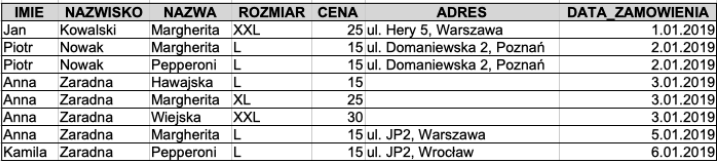

Przedstawiona tabela nie spełnia pierwszej postaci normalnej (1NF) ponieważ kolumna Adres nie jest atomowa. Możemy ją
podzielić na pojedyncze kolumny. Aby więc doprowadzić naszą tabelę do 1NF należy kolumnę adres podzielić na kilka
pojedynczych kolumn. Poniższa tabela została tak zmieniona, że spełnia 1NF:

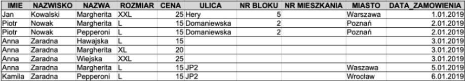

 

**Druga postać normalna** - baza danych jest w drugiej postaci normalnej gdy spełnia pierwszą postać normalną oraz wszystkie kolumny w tabeli zależą
tylko od klucza.

Czy powyższa baza jest w 2NF? Nie ponieważ jak się zastanowić to z tabeli możemy wyodrębnić przynajmniej trzy zbiory danych zależne od różnych kluczy: KLIENT, PIZZA, ZAMÓWIENIE.

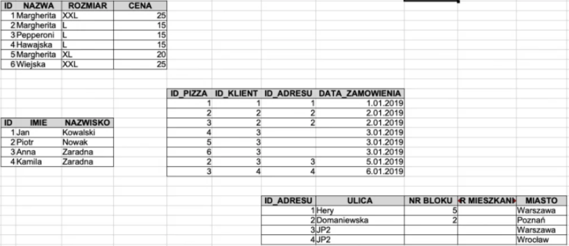

Powyższa baza została sprowadzona do drugiej postaci normalnej.

 

**Trzecia postać normalna** - Baza jest w trzeciej postaci normalnej wtedy gdy spełnia drugą postać normalną oraz żadna z kolumn nie jest zależna od innej kolumny która nie jest kluczem.

Tabela KLIENT spełnia 3NF natomiast tabela PIZZA jej nie spełnia ponieważ kolumna CENA nie jest zależna od klucza
a od wielkośc i pizzy. Aby to zmienić należy dane dotyczące cen wyciągnąć do inny tabeli jak na poniższym schemacie:

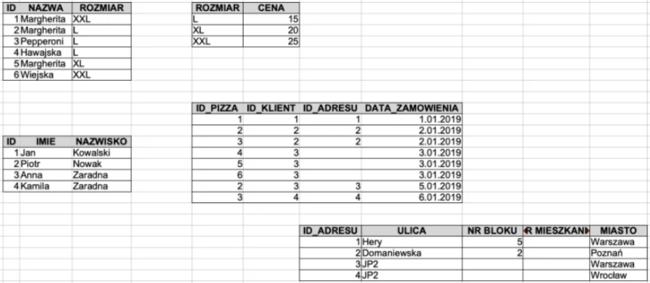

 

**Kolejne postacie normalne**
W bazach danych występują jeszcze inne postaci normalne jak: Byce-Codde, 4NF, 5NF. Kolejne postaci normalne mówią, że naszą bazę można jeszcze bardziej podzielić. Dla przykładu miasto nie jest bezpośrednio związane z adresem a z ulicą na którą zamawiamy dlatego też ulicę można by wyciągnąć do osobnej tabeli.