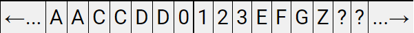
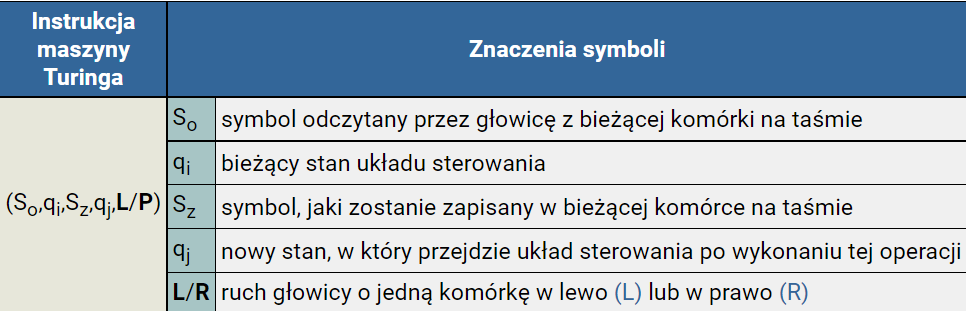
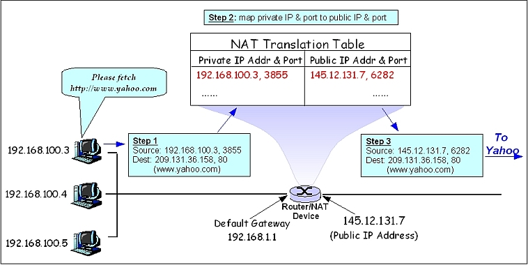
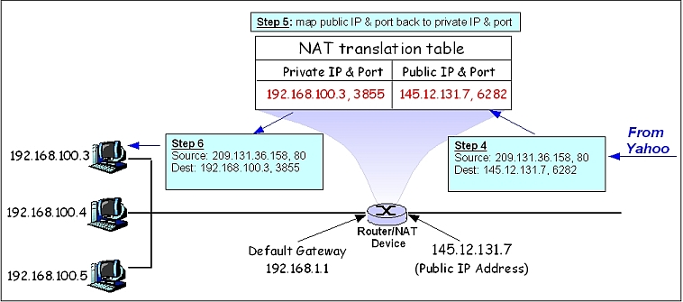
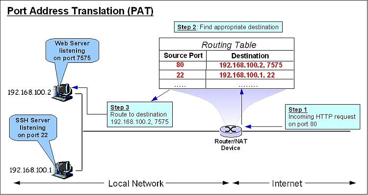
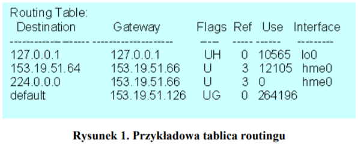
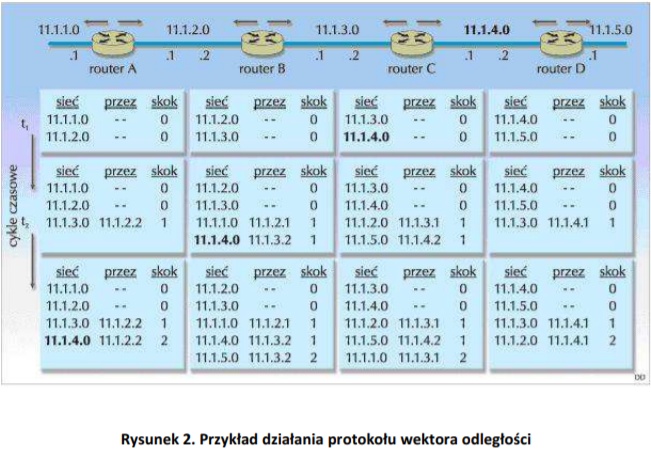

## 41. Pojęcie Maszyny Turinga - idea pracy automatu, hipoteza Churcha-Turinga

### **Definicja**

**Maszyna Turinga** - stworzona przez *Alana Turinga* prosta maszyna logiczna (licząca) służąca do wykonywania algorytmów. Wszystkie
współczesne komputery dają się do niej sprowadzić. *Problem jest rozwiązalny na komputerze, jeśli da
się zdefiniować rozwiązującą go maszynę Turinga.*

**Maszyna Turinga zbudowana jest z trzech głównych elementów:**
<ul>
    <li>Nieskończnoej taśmy zawierającej komórki z przetwarzanymi symbolami</li>
    <li>Ruchomej głowicy odczytującej i zapisującej </li>
    <li>Bloku sterowania głowicą.</li>
</ul>

**Taśma**

*Nieskończona taśma* jest odpowiednikiem współczesnej pamięci komputera. Taśma dzieli się na komórki, w których umieszczone zostały znaki przetwarzane przez maszynę Turinga. Symbole te stanowią odpowiednik danych wejściowych. Maszyna Turinga odczytuje te dane z kolejnych komórek i przetwarza na inne symbole, czyli dane wyjściowe. Wyniki obliczeń również są zapisywane w komórkach taśmy.

Można definiować różne symbole dla maszyny Turinga. Najczęściej rozważa się jedynie symbole 0, 1 oraz tzw. *znak pusty* - czyli zawartość komórki, która nie zawiera żadnej danej do przetworzenia.  Wbrew pozorom taki prymitywny zbiór trzech symboli jest równoważny logicznie dowolnemu innemu zbiorowi

**Głowica**

Aby przetwarzać dane, maszyna Turinga musi je odczytywać i zapisywać na taśmę. Do tego celu przeznaczona jest właśnie głowica zapisująco-odczytująca, która odpowiada funkcjonalnie urządzeniom wejścia/wyjścia współczesnych komputerów lub układom odczytu i zapisu pamięci.

Głowica zawsze znajduje się nad jedną z komórek taśmy. Może ona odczytywać zawartość tej komórki oraz zapisywać do niej inny symbol - na tej zasadzie odbywa się przetwarzanie danych - z jednych symboli otrzymujemy inne. Oprócz odczytywania i zapisywania symboli w komórkach głowica wykonuje ruchy w prawo i w lewo do sąsiednich komórek na taśmie. W ten sposób może się ona przemieścić do dowolnie wybranej komórki taśmy.

Przed rozpoczęciem pracy maszyny Turinga głowica jest zawsze ustawiana nad komórką taśmy zawierającą pierwszy symbol do przetworzenia. W klatce taśmy po lewo jest zapisany specjalny znak, tzw. *lewy ogranicznik*. Jeżeli głowica znajduje się nad lewym ogranicznikiem, to nie może go zamazać ani przesunąć się na lewo od niego. Po zakończeniu danych wejściowych taśma wypełniona jest w nieskończoność specjalnymi pustymi symbolami, tzw. *blank'ami*.

**Układ Starowania**

Przetwarzaniem informacji zarządza układ sterowania głowicą. Jego współczesnym odpowiednikiem jest procesor komputera. Układ ten odczytuje za pomocą głowicy symbole z komórek taśmy oraz przesyła do głowicy symbole do zapisu w komórkach. Dodatkowo nakazuje on głowicy przemieścić się do sąsiedniej komórki w lewo lub w prawo.

Podstawą działania maszyny Turinga są *stany układu sterowania. Stan układu sterowania określa jednoznacznie jaką operację wykona, jak zareaguje maszyna Turinga, gdy odczyta z taśmy określony symbol.*

Zatem operacje wykonywane przez układ sterowania zależą od dwóch czynników:
<ul>
    <li>Symbolu odczytanego z komórki na taśmie </li>
    <li>Bieżącego stanu układu sterującego </li>
</ul>

Stany będziemy określać kolejnymi nazwami: q0, q1, q2, ... ,qn, gdzie q0 jest stanem początkowym, w którym znajduje się maszyna Turinga przed rozpoczęciem przetwarzania symboli na taśmie.

Instrukcją dla maszyny Turinga jest następująca piątka symboli:

S0 i qi są tzw. **częścią identyfikacyjną instrukcji**. Maszyna Turinga wykonuje tyle różnych instrukcji, ile zdefiniujemy części identyfikacyjnych - w programie nie może być dwóch różnych instrukcji o identycznej części identyfikacyjnej.

Sz, qj i L/P są tzw. **częścią operacyjną**, która określa jakie działanie podejmuje dana instrukcja. Części operacyjne różnych instrukcji mogą być takie same - oznacza to jedynie, iż instrukcje te wykonują dokładnie to samo działanie.

**Przyklad instrukcji**
$$  (A,q_{0},B,q_{0},\bf R)
$$
Jeżeli odczytanym przez głowicę symbolem z taśmy będzie symbol *A*, a układ sterowania znajduje się w stanie *q0*, to głowica zamieni ten symbol na *B*, stan wewnętrzny nie zmieni się (pozostanie dalej *q0*), a głowica przesunie się do sąsiedniej komórki po prawej stronie.

### **Hipoteza Churcha-Turinga**
**Formalna Definicja**

*Każdy problem, który może być intuicyjnie uznany za obliczalny, jest rozwiązywalny przez maszynę Turinga.*

Sformułowanie *"intuicyjnie uznany za obliczalny"* uniemożliwia przeprowadzenie matematycznego dowodu tej hipotezy.

**Bardziej praktyczna definicja**

*Każdy problem, dla którego przy
nieograniczonej pamięci oraz zasobach istnieje efektywny algorytm
jego rozwiązywania, da się rozwiązać na maszynie Turinga*

**Trzecie równoważne sformułowanie**

*Każdy nieinteraktywny program może być zredukowany do rozwiązującej go maszyny Turinga, a ta może być wyrażona w każdym <a href="https://pl.wikipedia.org/wiki/Kompletno%C5%9B%C4%87_Turinga">zupełnym w sensie Turinga </a> języku programowania.*

 Dlatego równoważne sformułowanie tej hipotezy mówi, że każdy istniejący algorytm można wyrazić w każdym zupełnym języku programowania.

### **Zapis Formalny MT**

$$ 
  {\bf MT} = <Q,{\scriptstyle\sum},Г,s,b,F,\delta>
$$

> $$Q\; - \;skończony\; zbiór\; stanów\; (q_{0} -stan\; początkowy),$$
> $$ {\scriptstyle\sum} \; - \; skończony \; zbiór \; symboli \; wejściowych $$
> $$Г \supseteq {\scriptstyle\sum}\: - skończony \; zbiór \; dopuszczalnych \; symboli, $$
>$$s\; є\; Q\; - \;stan\; początkowy$$
>$$ b \; є \; Г \; \backslash \; {\scriptstyle\sum} \; - \; symbol\; pusty$$
>$$ F \subseteq Q - zbiór\; stanów\; końcowych$$
>$$\delta: Q\timesГ\longrightarrow Q\times (Г\times \{L,R,S\}) - funkcja \; częściowa, \:zwana \\
funkcją \; przejść, gdzie\; {\boldsymbol k} \; jest \; liczbą \; taśm, {\boldsymbol L}\; to \; przesunięcie \\
w \; lewo \;, {\boldsymbol R}\; przesunięcie\; w\; prawo,\; a \;{\boldsymbol S}\; to \; brak \; przesunięcia.  

## 42. Usługa translacji adresów w sieci TCP/IP.

### **Definicja Formalna**

**Translacja Adresów Sieciowych (Network Adress Translation, NAT)** - technika przesyłania ruchu sieciowego poprzez router, która wiąże się ze zmianą źródłowych lub docelowych adresów IP, zwykle również numerów portów TCP/UDP pakietów IP podczas ich przepływu. Zmieniane są także sumy kontrolne (zarówno w pakiecie IP, jak i w segmencie TCP/UDP), aby potwierdzić wprowadzone zmiany.

**Alternatywna Definicja**

*NAT* jest procesem modyfikującym informację o adresie IP w nagłówku pakietu IP, w momencie przesyłania ruchu przez urządzenie sieciowe. W większości konfiguracji, NAT podmienia prywatne adresy wewnątrz sieci na adresy IP publiczne, udostępniane przez dostawcę usługi dostępu do internetu. Taki zabieg pozwala komputerom w sieci domowej czy firmowej współdzielić połączenie internetowe. Dodatkowo, uzyskuje się zwiększony poziom bezpieczeństwa sieci, ponieważ dostęp do sieci wewnętrznej z zewnątrz jest mocno ograniczony.

**Dwa podstawowe typy NAT:**
<ul>
<li>
SNAT  (Source Network Address Translation)  to technika polegająca na zmianie adresu źródłowego pakietu IP na jakiś inny. Stosowana często w przypadku podłączenia sieci dysponującej adresami prywatnymi do sieci Internet. Wtedy router, przez który podłączono sieć, podmienia adres źródłowy prywatny na adres publiczny (najczęściej swój własny).
</li>
<li>
DNAT (Destination Network Address Translation) - to technika polegająca na zmianie adresu docelowego pakietu IP na jakiś inny. Stosowana często w przypadku, gdy serwer, który ma być dostępny z Internetu ma tylko adres prywatny. W tym przypadku router dokonuje translacji adresu docelowego pakietów IP z Internetu na adres tego serwera.
</li>
</ul>

**Wyróżniamy trzy rodzaje SNAT:**
<ul>
<li>
Statyczny NAT: Udostępnia odzorowanie 1-1 między adresami zewnętrznymi a adresami lokalnymi (czyli każdy komputer lokalny ma swoje IP, a serwer tylko pośredniczy w przekazywaniu pakietów).
Takie stałe mapowanie jest najbardziej odpowiednie dla hostów, które muszą być dostępne poza siecią. Jest to najbardziej odpowiednie do zapewnienia dostępu do serwerów takich jak serwery poczty elektronicznej i serwery internetowe.
</li>

<li>
Dynamiczny NAT: Serwer dysponuje pulą adresów IP, które przyporządkowuje lokalnym jednostkom dynamiczne w odpowiedzi na ich żądania skierowane do sieci zewnętrznej
</li>
<li>
PAT: Port address translation -  jest jednym z najczęściej używanych systemów NAT. Wiele połączeń z różnych wewnętrznych hostów jest multipleksowane w celu utworzenia jednego publicznego adresu IP, który wykorzystuje różne numery portów źródłowych. Maksymalnie 65 536 połączeń wewnętrznych można przetłumaczyć na jeden publiczny adres IP. Sprawia to, że jest on bardzo skuteczny w sytuacjach, gdy dostawca usług przydzielił tylko jeden publiczny adres IP.
</li>
</ul>
Kiedy komputer z sieci lokalnej wysyła zapytanie do sieci, urządzenie NAT zmienia adres nadawcy pakietu (i czasem numer portu) na publiczny adres IP.

W momencie, gdy wraca do nas odpowiedź na ten pakiet urządzenie NAT przypisuje pakietowi odpowiedni adres lokalnego węzła. Odwzorowania między pakietami a adresami zapamietywane są w tablicy translacji NAT.

**Przyklady działania SNAT`U**

*Wysyłanie request`u przez (Statyczny/Dynamiczny SNAT):*

*Otrzymanie odpowiedzi przy (Statycznym/Dynamicznym SNAT):*

*Otrzymanie odpowiedzi z wlączanym PAT:*

## 43. Mechanizm trasowania (ang. routing) pakietów w Internecie.

### **Ogółne pojęcie**

**Trasowanie (Routing)** - to mechanizm wyznaczania trasy i przesyłania pakietów
danych w intersieci, od stacji nadawczej do stacji odbiorczej. 

**Intersieć** - to minimum dwie
sieci fizyczne połączone ze sobą za pomocą routera. 

Trasowaniem zajmuje się urządzenie zwane routerem: może to być zwykły komputer
jak i urządzenie specjalnie dedykowane tylko do tego zadania, tzw. *router sprzętowy*.

Trasowanie umożliwia danym z jednej sieci lokalnej dotrzeć do innej sieci lokalnej,
która może znajdować się w dowolnym miejscu na świecie. Trasa może prowadzić przez
wiele sieci pośrednich, tak więc routing jest jakby *spoiwem łączącym Internet w całość*. Bez
routowania cały ruch danych byłby ograniczony do jednej fizycznej sieci.

**UWAGA**

*Trasowanie realizowane jest w **warstwie trzeciej (sieciowej)** modelu OSI*.
Wyznaczane trasy pakietów danych musza być jak **najbardziej optymalne** – czyli
możliwie najszybsze, ale umożliwiające dostarczenie wszystkich pakietów.

### **Troche bardziej szczegółowo o pakietach**
**Pakiet**  to jednostka informacji, której źródłem i przeznaczeniem jest warstwa *Sieciowa
(warstwa 3)* modelu OSI. Pakiet składa się z trzech elementów:
<ul>
<li>
   Nagłówka warstwy Sieciowej, 
</li>
<li>
Danych warstwy wyższej,
</li>
<li>
Końcówki warstwy Sieciowej.
</li>
</ul>

Nagłówek i końcówka zawierają informację sterującą przeznaczoną dla warstwy 3 w stacji
odbiorczej. Można powiedzieć, że dane z wyższej warstwy są otoczone (kapsułkowane) przez
nagłówek i końcówkę warstwy 3.

**Datagram** jest jednostką informacji, której źródłem i przeznaczeniem jest warstwa
Sieciowa (warstwa 3) modelu OSI, używająca bezpołączeniowej obsługi sieci. Pakiet
(połączeniowa obsługa sieci) = datagram (bezpołączeniowa)

**Etapy trasowania:**
<ol>
<li> 
    Host generuje pakiety i decyduje, czy dostarczyć je bezpośrednio do adresata, czy
przesłać do routera. 
</li>
<li>
    Obowiązkiem routera przy przekazywaniu pakietu dalej do celu jest obniżenie o jeden
wartości TTL (ang. Time To Live, czas życia). Datagram IP, który trafia do routera z wartością 1 (a zostanie ona zmniejszona na tym routerze do 0) w polu TTL zostanie
utracony, a do źródła router odsyła data gram ICMP z kodem TTL Exceeded. 
</li>
<li>
Router decyduje, czy przesłać pakiety bezpośrednio do adresata, czy do routera
pośredniczącego (i ew. do którego routera, gdy jest ich kilka). 
</li>
</ol>

**Tablica Routingu**

Router przechowuje tzw. **tablicę routingu**, dzięki której wie, jak kierować ruchem.
Najważniejsze informacje zawarte w tablicy to adresy sąsiednich routerów i adresy sieci
docelowych. 
<table align="center">
    <thead>
        <tr>
            <th>Aby dotrzeć do sieci</th>
            <th>Wyślij do urządzenia o adresie</th>
        </tr>
    </thead>
    <tbody>
        <tr>
            <td>10.1.1.0</td>
            <td>10.1.2.2</td>
        </tr>
        <tr><td>10.1.2.0</td>
        <td>10.1.2.2 </td>
        </tr>
        <tr>
        <td>10.1.3.0</td>
        <td>Bezpośrednio połączony</td>
        </tr>
    </tbody>
</table>

Oprócz tego w tablicy mogą się też znaleźć informacje o **całościowym koszcie (metryce)** wysłania daną trasą pakietu (jest to pewna liczba przypisana trasie przez protokoły
routingu), **nazwy czy adresy interfejsów sieciowych**, przez które dany pakiet jest kierowany
do sieci, **flagi** opisujące właściwości danej ścieżki (H - ścieżka do konkretnego komputera, a
nie np. do kolejnego routera, U – ścieżka jest drożna i działa bez problemów), **licznik**
określający czas, jaki upłynął od ostatniego uaktualnienia informacji o trasie. 

Pakiet danych przechodzi pomiędzy kolejnymi sieciami. Takie kolejne przejście
nazywane jest **przeskokiem** lub **hop-em**. Tablica routingu zawarta w routerze lub w
komputerze sieciowym zawiera właśnie przyporządkowania adresów **dotyczące jednego
hopu!** 

### **Routing Statyczny i Dynamiczny**

*Pod względem sposobu wypełniania danymi tych tablic, dzielimy routing na statyczny
i dynamiczny.*

**Statyczny** - administrator ręcznie wpisuje wszystkie adresy to tablicy routingu.
Najprostszą formą budowania informacji o topologii sieci są ręcznie podane przez
administratora trasy definiujące routing statyczny. Przy tworzeniu takiej trasy wymagane jest
jedynie podanie adresu sieci docelowej, interfejsu, przez który pakiet ma zostać wysłany oraz
adresu IP następnego routera na trasie. 

**Zalety**
<ul>
<li>Router przesyła pakiety przez z góry ustalone interfejsy bez konieczności
każdorazowego obliczania tras, co zmniejsza zajętość cykli procesora i pamięci. 
</li>
<li>
Informacja statyczna nie jest narażona na deformację spowodowaną zanikiem
działania dynamicznego routingu na routerach sąsiednich. 
</li>
<li>
Dodatkowo zmniejsza się zajętość pasma transmisji, gdyż nie są rozsyłane pakiety
rozgłoszeniowe protokołów routingu dynamicznego
</li>
<li>
Dla małych sieci jest to doskonałe rozwiązanie, ponieważ nie musimy posiadać
zaawansowanych technologicznie i rozbudowanych sprzętowo routerów.
</li>
<li>
Routing statyczny zapewnia również konfigurację tras domyślnych, nazywanych
<i>bramkami ostatniej szansy (gateway of the last resort).</i> Jeżeli router uzna, iż żadna
pozycja w tablicy routingu nie odpowiada poszukiwanemu adresowi sieci docelowej,
korzysta ze statycznego wpisu, który spowoduje odesłanie pakietu w inne miejsce
sieci.) 
</li>
</ul>

**Wady**
<ul>
<li>
Routing statyczny wymaga jednak od administratora sporego nakładu pracy w
początkowej fazie konfiguracji sieci. 
</li>
<li>
Nie jest również w stanie reagować na awarie poszczególnych tras. 
</li>
</ul>

**Dynamiczny** - routery samodzielnie zbierają informacje i aktualizują zapisy w tablicy.

Ponieważ statyczne systemy trasowania nie mogą reagować na zmiany w sieci, to
generalnie nie są one przydatne do stosowania w sieciach dużych, gdzie zmiany następują
praktycznie ciągle. Dlatego większość obecnie stosowanych algorytmów trasowania to
algorytmy dynamiczne, dostosowujące się do zmiennych warunków występujących w sieci,
na drodze analizy aktualizujących komunikatów trasowania. W wypadku, gdy aktualizujący
komunikat trasowania wskazuje, że w sieci wystąpiły zmiany, oprogramowanie trasujące
ponownie oblicza trasy i wysyła do routerów nowe komunikaty aktualizujące. W ślad za tym
komunikaty, przenikając przez sieć, stymulują routery do uruchomienia algorytmów
trasowania i zmieniają ich tablice trasowania.  

Protokoły trasowania dynamicznego są wykorzystywane przez routery do pełnienia
trzech podstawowych funkcji: 
<ul>
<li> Wyszukiwania nowych tras</li>
<li> Przekazywania do innych routerów informacji o znalezionych trasach </li>
<li> Przesyłania pakietów za pomocą owych routerów. 
</li>
</ul>

### **Kategorie protokołów trasowania**

**Podział protokołów:**
<ul>
<li>
    Podział ze względu na charakter wymienianych informacji:
    <ul>
    <li>
    Protokoły wektora odległości (lub dystans - wektor)
    </li>
    <li>Protokoły stanu łącza </li>
    <li>Hybrydowe</li>
    </ul>
    <li>
    Podział ze względu na obszary zastosowań:
    <ul>
    <li>Protokoły wewnętrzne </li>
    <li>Protokoły zewnętrzne </li>
    </ul>
    </li>
</li>
</ul>

**Protokoły wektora odległości:**

Trasowanie może być oparte na algorytmach wektora odległości (nazywanych również
<a href="https://pl.wikipedia.org/wiki/Algorytm_Bellmana-Forda">algorytmami Bellmana-Forda</a>). Nazwa pochodzi stąd, iż poszczególne routery prezentowane
są jako wektory zawierające dwie informacje: dystans oraz wektor wyznaczający kierunek.
**Dystans** opisuje całkowity koszt/metrykę danej trasy i wyrażany jest za pomocą pewnej
liczby, natomiast **Kierunek** definiowany jest poprzez adres następnego skoku. 

*<u>Etapy działania protokołu:</u>*
<ol>
<li>
Przy starcie router tworzy tablicę routingu zawierająca informacje tylko o jego
bezpośrednich sąsiadach i kosztach/metrykach dotarcia do nich. 
</li>
<li>
Wysyła tą tablicę tylko do swoich sąsiadów, którzy uzupełniają swoje tablice
routingu o informacje, które pozyskali z tej właśnie przysłanej.
</li>
</ol>

Router nie widzi poza swojego sąsiada i informacje o innych sieciach,
nieprzyłączonych do niego bezpośrednio, uzyskuje tylko dzięki nim. Nazywa się to
**routingiem przez plotkowanie**.

### Zalety:
<ul>
<li>
Protokoły wektora odległości są łatwe w konfiguracji i bardzo dobrze nadają się do
zastosowania w małych sieciach. 
</li>
</ul>

### Wady:
<ul>
<li>
Niestety, jednym z ich podstawowych problemów jest tzw. <b>zbieżność</b>, czyli powolne
reagowanie na zmiany zachodzące w topologii sieci, na przykład wyłączenie lub
włączenie pewnych segmentów - zerwanie łącza zostaje odzwierciedlone w tabelach
routingu poszczególnych routerów dopiero po pewnym czasie. Czas, po którym
wszystkie routery mają spójne i uaktualnione tabele routingu nazywany jest <b>czasem
zbieżności</b>.
</li>
<li>
Kolejną wadą protokołów wektora odległości jest generowanie dodatkowego ruchu w
sieci poprzez cykliczne rozgłaszanie pełnych tabel routingu, nawet wówczas, gdy w
topologii sieci nie zachodzą żadne zmiany. 
</li>
<li>
Protokoły tej grupy nie są też odporne na powstawanie pętli między routerami
(zarówno między bezpośrednimi sąsiadami, jak i pętli rozległych), co skutkuje
wzajemnym odsyłaniem sobie pakietów z informacją o tej samej sieci. 
</li>
</ul>

**Przykładowe protokoły: *RIP, EBGP*.**

### **Trasowanie na podstawie stanu łącza**

Algorytmy trasowania na podstawie stanu łącza, ogólnie określane jako protokoły
"<u>najpierw najkrótsza ścieżka</u>" (ang. <a href="https://pl.wikipedia.org/wiki/Open_Shortest_Path_First">SPF shortest path first</a>), utrzymują złożoną bazę danych
opisującą topologię sieci. W odróżnieniu od protokołów wektora odległości, *protokoły stanu
łącza zbierają i przechowują pełną informację na temat routerów sieci, a także o sposobie ich
połączenia.*

W protokołach stanu łącza każdy router przechowuje kompletną bazę danych o
topologii sieci z informacjami o koszcie pojedynczych ścieżek w obrębie sieci oraz o stanie
połączeń. Informacje te kompletowane są *poprzez rozsyłanie tzw. pakietów LSA (Link-State
Advertisement) o stanie łączy*.

### *<u>Etapy działania protokołu:</u>*
<ol>
<li>
Każdy router wysyła informację o bezpośrednio do niego podłączonych
sieciach oraz o ich stanie (włączone lub wyłączone). 
</li>
<li>
Dane te są następnie rozsyłane od routera do routera, każdy router pośredni
zapisuje u siebie kopię pakietów LSA, ale nigdy ich nie zmienia. 
</li>
<li>
Po pewnym czasie (czasie zbieżności) każdy router ma identyczną bazę danych
o topologii (czyli mapę sieci) i na jej podstawie tworzy drzewo najkrótszych
ścieżek SPF (shortest path first) do poszczególnych sieci.
</li>
<li>
Router zawsze umieszcza siebie w centrum (korzeniu) tego drzewa, a ścieżka
wybierana jest na podstawie kosztu dotarcia do docelowej sieci - najkrótsza
trasa nie musi pokrywać się z trasą o najmniejszej liczbie skoków. Do
wyznaczenia drzewa najkrótszych ścieżek stosowany jest <i><a href="https://pl.wikipedia.org/wiki/Algorytm_Dijkstry"> algorytm E.W.
Dijkstry. </a></i>
</li>
</ol>

### Zalety:
<ul>
<li>Reagowanie na zmiany w topologii sieci. Po zmianie stanu łącza router generuje nowy
pakiet LSA, który rozsyłany jest od routera do routera, a każdy router otrzymujący ten
pakiet musi przeliczyć od nowa drzewo najkrótszych ścieżek i na jego podstawie
zaktualizować tabelę routingu. </li>
<li>Protokoły stanu łącza nazywane są też protokołami "cichymi", ponieważ w
przeciwieństwie do protokołów wektora odległości nie rozsyłają cyklicznych
ogłoszeń, a dodatkowy ruch generują tylko przy zmianie stanu łącza. Ze względu na
sposób działania i swoje cechy protokoły stanu łącza przeznaczone są do obsługi
znacznie większych sieci niż protokoły wektora odległości. 
 </li>
</ul>

### Wady
<ul>
<li>Do wad protokołów stanu łącza zaliczyć można zwiększone zapotrzebowanie na
pasmo transmisji w początkowej fazie ich działania (zanim "ucichną"), gdy routery
rozsyłają między sobą pakiety LSA. Wspomniane obniżenie wydajności ma charakter
przejściowy, ale jest niestety mocno odczuwalne.  </li>
<li>Dodatkowo ze względu na złożoność obliczeń drzewa SPF, protokoły stanu łącza mają
zwiększone wymagania dotyczące procesora i pamięci RAM routera (zwłaszcza przy
większych sieciach). Z tego powodu routery skonfigurowane do obsługi trasowania na
postawie stanu łącza są stosunkowo drogie. Typowym przedstawicielem tej grupy
protokołów jest *OSPF (Open Shortest Path First)* </li>
</ul>

**Przykładowe protokoły: OSPF, IS-IS, IDRP**

### **Hybrydowe Trasowanie**
Ostatnią formą trasowania dynamicznego jest praca *hybrydowa*. Choć istnieją "otwarte"
zrównoważone protokoły hybrydowe, ta forma trasowania jest niemal całkowicie związana
z zastrzeżonym produktem jednej firmy Cisco Systems, Inc. Protokół o nazwie <b>EIGRP</b> (ang.
<a href="https://pl.wikipedia.org/wiki/Enhanced_Interior_Gateway_Routing_Protocol">Enhanced Interior Gateway Routing Protocol</a>) został zaprojektowany z zamiarem połączenia
najlepszych cech protokołów opartych na wektorze odległości i stanie łącza, przy
jednoczesnym ominięciu ich ograniczeń wydajności i innych wad. 

### **Protokoły wewnetrzne i zewnętrzne**

**Potrzebna informacja:**

<b>System autonomiczny</b> – grupa sieci i routerów pod wspólną administracją
(korporacje, uczelnie). Routery wewnątrz systemu autonomicznego dowolnie zarządzają
trasami. Każdy system autonomiczny wybiera router lub routery przeznaczone do
komunikacji z innymi systemami autonomicznymi. Odpowiadają one za przekazywanie
informacji o osiągalności sieci wewnątrz „swojego” systemu do innych systemów. 

Routery odpowiedzialne za komunikację z innymi systemami autonomicznymi
nazywane są routerami zewnętrznymi albo brzegowymi (exterior gateways), routery
działające wewnątrz systemu – wewnętrznymi (interior gateways). 

**Zewnętrzne:**

*EGP(Exterior Gateway Protocol)*
<ul>
<li>Router może uzgodnić z innym routerem, że będą „sąsiadami”, tzn. będą wymieniać
informacje o trasach. </li>
<li>Router sprawdza co jakiś czas czy jego sąsiedzi działają. </li>
<li>Sąsiedzi wymieniają komunikaty pozwalające zaktualizować tablice routingu.
Komunikat taki zawiera listę znanych danemu routerowi sieci i odległości do nich</li>
</ul>

*Inny protokoł tego typu: (E) BGP (Exterior Border Gateway Protocol)*

**Wewnętrzne:**

Grupę protokołów używanych przez routery wewnątrz systemu autonomicznego
określa się nazwą *IGP (Interior Gateway Protocols)*

### Pzykładowe protokoły z tej grupy:
<ul> 
<li> 
   <b> RIP</b>
</li>
<li>HELLO</li>
<li>OSPF</li>
</ul>

### RIP - Routing Information Protocol
<ul>
<li>
Implementacja algorytmu wektor-odległość dla sieci lokalnych
</li>
<li>
 Odległość mierzona jako <i>„hop count”</i>
</li>
<li>
Liczba routerów między rozważanymi sieciami
</li>
<li>Przeznaczony dla niewielkich sieci – <i>odległość 16 traktowana jest jako
nieskończoność </i>
</li>
</ul>

### HELLO
<ul>
<li>
Protokół bazujący na algorytmie „wektor odległość”
</li>
<li>
Do oceny odległości używa <u>opóźnień</u> (tj. czasu potrzebnego na dostarczenie
komunikatu za pośrednictwem sieci), a nie liczby routerów pośredniczących 
</li>
</ul>

### **Miary trasowania**
W jaki sposób algorytmy trasowania decydują o tym, że jedna trasa jest preferowana bardziej
niż inna?
Rozróżnia się obecnie następujące miary trasowania:
<ul>
<li>długość ścieżki</li>
<li>niezawodność </li>
<li>opóźnienie </li>
<li>szerokość pasma </li>
<li>obciążenie </li>
<li>koszt komunikacji</li>
</ul>

<b>Długość ściężki</b> jest najczęściej używaną miarą trasowania. Niektóre protokoły trasowania
zezwalają administratorowi sieci na arbitralne przypisywanie kosztów każdemu łączu
sieciowemu. W takim wypadku koszt ścieżki jest sumą kosztów związanych z każdym łączem
składającym się na ścieżkę. Inne protokoły trasowania natomiast używają miary hop count,
rozumianej jako liczba przejść pakietu przez urządzenia intersieciowe - np. routery - od stacji
nadawczej do stacji odbiorczej.

<b>Niezawodność</b>, w kontekście algorytmów trasowania, odnosi się do skuteczności każdego
łącza (określanego liczbą przekłamanych bitów). Niektóre łącza mogą ulegać uszkodzeniom
częściej od innych. Po uszkodzeniu sieci niektóre łącza można naprawić szybciej i prościej
niż inne. 

<b>Opóźnienie</b> trasowania oznacza czas potrzebny do przesłania pakietu od stacji nadawczej do
stacji odbiorczej w intersieci. 

<b>Szerokość pasma</b> odnosi się do dostępnej pojemności ruchu w określonym łączu

<b>Obciążenie </b>to stopień zajętości zasobu sieciowego, np. routera. Obciążenie zależy od wielu
czynników, np. stopnia wykorzystania procesora czy liczby pakietów przetwarzanych w
czasie jednej sekundy. 

<b> Koszt komunikacji </b> jest ważną miarą trasowania, przede wszystkim dlatego, że niektóre
firmy nie dbają o wydajność. Nawet wtedy, gdy opóźnienia są duże, przesyłają pakiety przez
własne linie zamiast korzystać z sieci publicznych, za które się płaci tylko w czasie ich
używania. 

## 44. Usługi nazewnicze sieci TCP/IP.

**Ogółny Zarys**

*Usługi nazewnicze* wykorzystywane są do dystrybuowania informacji. One tłumaczą nazwy hostów na adresy IP. Internetowym standardem jest DNS, ale w pewnych sytuacjach wykorzystywane są NIS i WINS.

**DNS**(ang. Domain Name System, system nazw domenowych) to system serwerów oraz protokół komunikacyjny zapewniający zamianę adresów znanych użytkownikom Internetu na adresy zrozumiałe dla urządzeń tworzących sieć komputerową. Dzięki wykorzystaniu DNS nazwa mnemoniczna, np. pl.wikipedia.org, może zostać zamieniona na odpowiadający jej adres IP, czyli 145.97.39.135.

Adresy DNS składają się z domen internetowych rozdzielonych kropkami. Dla przykładu w adresie Wikipedii *org* oznacza domenę funkcjonalną organizacji, wikipedia domenę należącądo fundacji Wikimedia, a *pl* polską domenę w sieci tej instytucji. W ten sposób możliwe jest budowanie hierarchii nazw, które porządkują Internet. 

**Strona Techniczna**

Podstawą technicznego systemu DNS jest ogólnoświatowa sieć serwerów przechowujących informacje na temat adresów domen. Każdy wpis zawiera nazwę oraz odpowiadającą jej wartość, najczęściej adres IP. System DNS jest podstawą dla rozwiązywania nazw hostów w Internecie.

DNS to również protokół komunikacyjny opisujący sposób łączenia się klientów z serwerami DNS. Częścią specyfikacji protokołu jest również zestaw zaleceń, jak aktualizować wpisy w bazach domen internetowych. Na świecie jest wiele serwerów DNS, które odpowiadają za obsługę poszczególnych domen internetowych. Domeny mają strukturę drzewiastą, na szczycie znajduje się 13 głównych serwerów (*root servers*) obsługujących domeny najwyższego poziomu (*TLD – top level domains*).

Serwery najwyższego poziomu z reguły posiadają tylko odwołania do odpowiednich serwerów DNS odpowiedzialnych za domeny niższego rzędu, np. serwery główne (obsługujące między innymi TLD.com) wiedzą, które serwery DNS odpowiedzialne są za domenę example.com. Serwery DNS zwracają nazwę serwerów odpowiedzialnych za domeny niższego rzędu. Możliwa jest sytuacja, że serwer główny odpowiada, że dane o domenie example.com posiada serwer dns.example.com. W celu uniknięcia zapętlenia w takiej sytuacji serwer główny do odpowiedzi dołącza specjalny rekord (tak zwany **<a href="https://en.wikipedia.org/wiki/Domain_Name_System#Circular_dependencies_and_glue_records">glue record</a>**) zawierający także adres IP serwera niższego rzędu (w tym przypadku dns.example.com).

Wewnątrz każdej domeny można tworzyć tzw. subdomeny - stąd mówimy, że system domen jest 'hierarchiczny'. Przykładowo wewnątrz domeny .pl utworzono wiele domen:

<ul>
<li>
regionalnych jak 'opole.pl', 'dzierzoniow.pl' czy 'warmia.pl' 
</li>
<li>funkcjonalnych jak 'com.pl', 'gov.pl' czy 'org.pl' </li>
<li>należących do firm, organizacji lub osób prywatnych jak 'onet.pl' czy 'zus.pl' </li>
</ul>

Nazwy domen i poszczególnych komputerów składają się z pewnej liczby nazw, oddzielonych kropkami. Ostatnia z tych nazw jest domeną najwyższego poziomu. Każda z tych nazw może zawierać litery, cyfry lub znak '-'. Od niedawna w nazwach niektórych domen można używać znaków narodowych (IDN) takich jak 'ą' czy 'ż', ale większośćwspółczesnych programów nie przewiduje możliwości wykorzystania takich funkcji. *Wewnątrz każdej z poddomen można tworzyć dalsze poddomeny, np. w domenie 'wikipedia.org' można utworzyć domenępl.wikipedia.org.*

DNS, jako system organizacyjny, składa się z dwóch instytucji - IANA i ICANN. Nadzorująone ogólne zasady przyznawania nazw domen i adresów IP. Jednak te dwie instytucje nie sąw stanie zajmować się całym światem i dlatego cedują swoje uprawnienia na szereg lokalnych instytucji i firm. 

**Najważniejsze cechy DNS:**
<ul>
<li> Nie ma jednej centralnej bazy danych adresów IP i nazw. Najważniejszych jest 13 głównych serwerów (klastrów) rozmieszczonych na wielu kontynentach</li>
<li>Serwery DNS przechowują dane tylko wybranych domen. </li>
<li>Każda domena powinna mieć co najmniej 2 serwery DNS obsługujące ją, jeśli więc nawet któryś z nich będzie nieczynny, to drugi może przejąć jego zadanie. </li>
<li>Każda domena posiada jeden główny dla niej serwer DNS (tzw. <u>master</u>), na którym to wprowadza się konfigurację tej domeny, wszystkie inne serwery obsługujące tę domenę są typu <u>slave</u> i dane dotyczące tej domeny pobierają automatycznie z jej serwera głównego po każdej zmianie zawartości domeny. </li>
<li>Serwery DNS mogą przechowywać przez pewien czas odpowiedzi z innych serwerów (<i>ang. caching</i>), a więc proces zamiany nazw na adresy IP jest często krótszy niż w podanym przykładzie. </li>
<li>Na dany adres IP może wskazywać wiele różnych nazw. Na przykład na adres IP 207.142.131.245 mogą wskazywać nazwy pl.wikipedia.org oraz de.wikipedia.org </li>
<li>Czasami pod jedną nazwą może kryć się więcej niż 1 adres IP po to, aby jeśli jeden z nich zawiedzie, inny mógł spełnić jego rolę. </li>
<li>Przy zmianie adresu IP komputera pełniącego funkcję serwera WWW, nie ma konieczności zmiany adresu internetowego strony, a jedynie poprawy wpisu w serwerze DNS obsługującym domenę. </li>
<li>Protokół DNS posługuje się do komunikacji serwer-klient głównie protokołem UDP, serwer pracuje na porcie numer 53, przesyłanie domeny pomiędzy serwerami master i slave odbywa się protokołem TCP na porcie 53. </li>
</ul>

**Rodzaje zapytań DNS**
<ul>
<li><b>Rekurencyjne</b>

  Zmusza serwer do znalezienia wymaganej informacji lub zwrócenia wiadomości o błędzie. Ogólną zasadą jest, że zapytania od resolwera (program, który potrafi wysyłać zapytania do serwerów DNS) do serwera są typu rekurencyjnego, czyli resolwer oczekuje podania przez serwer adresu IP poszukiwanego hosta. Wykonywanie zapytań rekurencyjnych pozwala wszystkim uczestniczącym serwerom zapamiętać odwzorowanie (ang. <i>DNS caching</i>), co podnosi efektywność systemu.
</li>
<li> <b>Iteracyjne </b>

Wymaga od serwera jedynie podania najlepszej dostępnej mu w danej chwili odpowiedzi, przy czym nie musi on łączyć się jeszcze z innymi serwerami. Zapytania wysyłane pomiędzy serwerami są iteracyjne, przykładowo wiarygodny serwer domeny org nie musi znać adresu IP komputera www.pl.wikipedia.org, podaje więc najlepszą znaną mu w tej chwili odpowiedź, czyli adresy serwerów autorytatywnych dla domeny wikipedia.org </li>
</ul>

**Odpowiedzi na zapytania**
<ul>
<li><b> Autorytatywne </b> 

Dotyczące domeny w strefie, nad którą dany serwer ma zarząd, pochodzą one bezpośrednio z bazy danych serwera; jest to pozytywna odpowiedź zwracana do klienta, która w komunikacie DNS zawiera ustawiony bit uwierzytelniania (AA – Authoritative Answer) wskazujący, że odpowiedź została uzyskana z serwera dokonującego bezpośredniego uwierzytelnienia poszukiwanej nazwy  </li>

<li><b> Nieautorytatywne </b>

Dane które zwraca serwer pochodzą spoza zarządzanej przez niego strefy; odpowiedzi nieautorytatywne są buforowane poprzez serwer przez czas TTL wyrażony w sekundach, wyspecyfikowany w odpowiedzi, a następnie po upływie czasu są usuwane
</li>
</ul>

**Komunikaty DNS**

Zapytania i odpowiedzi DNS są najczęściej transportowane w pakietach <a href="https://pl.wikipedia.org/wiki/User_Datagram_Protocol">UDP</a>. Każdy komunikat musi się zawrzeć w jednym pakiecie UDP (standardowo 512 oktetów, ale wielkość tę można zmieniać pamiętając również o ustawieniu takiej samej wielkości w <a href="https://pl.wikipedia.org/wiki/Maximum_Transmission_Unit">MTU</a> – Maximum Transmission Unit). W innym przypadku przesyłany jest protokołem <a href="https://pl.wikipedia.org/wiki/Protok%C3%B3%C5%82_sterowania_transmisj%C4%85">TCP</a> i poprzedzony dwubajtową wartością określającą długość zapytania i długość odpowiedzi (bez wliczania tych dwóch bajtów).

### Format Komunikatu DNS:

><b>NAGLÓWEK </b> - (Header)   
><b>ZAPYTANIE </b> - (Question) do serwera nazw  
><b>ODPOWIEDŻ</b> - (Answer) zawiera rekordy będące odpowiedzią  
><b>ZWIERZCHNOŚĆ</b> - (Authority) wskazuje serwery zwierzchnie dla domeny  
> <b>DODATKOWE</b> - (Additional) sekcja informacji dodatkowych  
>  

## 45. Zarządzanie konfiguracją urządzenia w sieci TCP/IP.
 

IDK

## 46. Wirtualne sieci lokalne.

 **Wirtualna sieć lokalna, VLAN** (ang. virtual local area network) - sieć komputerowa wydzielona logicznie w ramach innej, większej sieci fizycznej. 

 *Wirtualne sieci lokalne (Virtual Local Area Networks, VLANs)* umożliwiają podział
większej fizycznej sieci komputerowej na logiczne, odizolowane segmenty.
**Kształtowanie przepływu ruchu między sieciami VLAN odbywa się w warstwie 3.
modelu OSI.**

Virtual LAN dzieli fizyczne łącza na logiczne segmenty, ale sposób
zaprojektowania wirtualnej sieci lokalnej zależy od administratora, a raczej przyjętych w
organizacji założeń w zakresie kształtowania przepływu ruchu oraz wymaganego poziomu
bezpieczeństwa. W ten sposób na jednym fizycznym przełączniku można utworzyć dwie
(lub więcej) odizolowane od siebie sieci lokalne.

Tylko urządzenia przynależące do tej samej sieci VLAN mogą komunikować się ze sobą,
każda sieć VLAN tworzy bowiem niezależną domenę rozgłoszeniową. Przełączniki
przekazują ruch transmisji pojedynczej (unicast), grupowej (multicast) i rozgłoszeniowej
(broadcast) tylko w ramach jednego segmentu sieci LAN. Poza izolacją segmentów sieci
podejście to pozwala też ograniczyć zalewanie portów przełącznika rozgłoszeniami z
protokołów ARP i DHCP, które nigdy nie przekraczają granic sieci VLAN.

Mechanizm routingu między VLAN, choć wymaga zastosowania dodatkowych urządzeń,
pozwala kształtować przepływy ruchu między poszczególnymi segmentami sieci
komputerowej. Mowa tutaj o kontroli dostępu, filtrowaniu ruchu na zaporze sieciowej czy
zapewnianiu jakości usług (QoS).

**Praktyczne zastosowanie**

Sieć VLAN może służyć do segmentacji według struktury organizacyjnej. W instytucjach
publicznych komputery pracowników działów finansowych i HR nie powinny
komunikować się ze względów bezpieczeństwa z urządzeniami pozostałego personelu
biurowego. Z kolei w firmie produkcyjnej technologia VLAN może odizolować ruch sieci
komputerowej udostępnianej pracownikom biurowym od sieci komputerowej
wykorzystywanej w wydziałach produkcyjnych na potrzeby zbierania danych i sterowania
maszynami.

Inne praktyczne zastosowanie sieci VLAN to segmentacja ruchu sieciowego ze względu na
jego typ. Podejście to sprawdzi się w każdej instytucji, nawet gdy nie ma jawnej potrzeby
izolowania ruchu według struktury organizacyjnej. Oddzielne VLAN stosuje się dla
serwerów, punktów końcowych (stacje robocze, laptopy), drukarek, urządzeń mobilnych
(strategia BYOD), telefonów VoIP, sieci Wi-Fi dla gości, sieci zarządzania (management)
czy strefy DMZ.

**Protokół IEEE 802.1Q**

*VLAN to wydzielona logicznie sieć komputerowa **warstwy 2. (łącza danych)** modelu OSI.*
Grupuje logicznie porty jednego lub wielu przełączników sieciowych niezależnie od ich
położenia. Podstawowym, powszechnie stosowanym protokołem oznaczania ramek i
trunkingu jest IEEE 802.1Q. Protokół ten, nazywany także Dot1q, stał się branżowym
standardem definiującym sposób obsługi VLAN w sieciach Ethernet.

Działanie sieci VLAN bazuje na dodawaniu 4-bajtowych znaczników (tagów) wewnątrz
nagłówka ramek Ethernet, które pozwalają urządzeniom sieciowym sterować przepływem
ruchu. Znacznik ten, o nazwie 802.1Q Header, umieszczany jest między polem adresu
źródłowego (Source MAC) a polem wskazującym na typ ramki/długość (EtherType/Size).
Pierwsze dwa bajty tego znacznika (Tag Protocol ID, TPID) mają stałą wartość 0x8100 i
umożliwiają przełącznikowi odróżnienie znakowanej ramki 802.1Q od ramki
nieznakowanej, która w tym miejscu miałaby pole EtherType/Size. Pozostałe dwa bajty (Tag Control Information, TCI) zawierają informacje służące do oznaczenia priorytetu ramki
(definiowany w standardzie 802.1p), standardu sieci LAN (Ethernet lub Token Ring) oraz
numeru wirtualnej sieci (VLAN ID), do której przynależy dana ramka. Wspomniane pole
VLAN ID, stanowiące identyfikator sieci wirtualnej, ma długość 12 bitów i pozwala
skutecznie przypisać ramkę do właściwego segmentu VLAN. W rezultacie na przełączniku
można zdefiniować maksymalnie do 4096 sieci VLAN, z czego dwie są zarezerwowane do
innych celów, a VLAN 1 pełni funkcję sieci natywnej.

W tym miejscu warto też wspomnieć o innym protokole znakowania i trunkingu. InterSwitch Link (ISL) to własnościowy protokół Cisco używany w przełącznikach tej firmy.
Oryginalna ramka Ethernet pozostaje niezmieniona, jest bowiem kapsułkowana w ramce
ISL, której nagłówek zawiera znacznik VLAN ID. Protokół ISL został *uznany za
przestarzały, nie powinien być dalej używany*. Co więcej, nie jest wspierany przez najnowsze
przełączniki Cisco.

Punkty końcowe mogą komunikować się ze sobą w ramach jednej sieci VLAN.
<u>*Przekazywanie ruchu sieciowego między sieciami VLAN wymaga zastosowania routera lub
przełącznika działającego w warstwie 3. (sieci) modelu OSI.*</u>

## 47. Technologie redundantne w sieciach komputerowych.

<a href="<link_to_resource_local_or_online_here>"></a><b></b>
<table align="center">
    <thead>
        <tr>
            <th>Ex. 1</th>
            <th>Ex. 2</th>
            <th>Ex. 3</th>
        </tr>
    </thead>
    <tbody>
        <tr>
            <td>Ts</td>
            <td>Ts</td>
            <td>Ts</td>
        </tr>
    </tbody>
</table>

## 48. Metody optymalizacji zapytań SQL.

<a href="<link_to_resource_local_or_online_here>"></a><b></b>
<table align="center">
    <thead>
        <tr>
            <th>Ex. 1</th>
            <th>Ex. 2</th>
            <th>Ex. 3</th>
        </tr>
    </thead>
    <tbody>
        <tr>
            <td>Ts</td>
            <td>Ts</td>
            <td>Ts</td>
        </tr>
    </tbody>
</table>

## 49. Modele uwierzytelniania, autoryzacji i kontroli dostępu do systemów komputerowych.

<a href="<link_to_resource_local_or_online_here>"></a><b></b>
<table align="center">
    <thead>
        <tr>
            <th>Ex. 1</th>
            <th>Ex. 2</th>
            <th>Ex. 3</th>
        </tr>
    </thead>
    <tbody>
        <tr>
            <td>Ts</td>
            <td>Ts</td>
            <td>Ts</td>
        </tr>
    </tbody>
</table>

## 50. Teoretyczne modele komputerów: automaty skończone, automaty ze stosem, maszyny Turinga i odpowiadające im klasy języków formalnych.
<a href="<link_to_resource_local_or_online_here>"></a><b></b>
<table align="center">
    <thead>
        <tr>
            <th>Ex. 1</th>
            <th>Ex. 2</th>
            <th>Ex. 3</th>
        </tr>
    </thead>
    <tbody>
        <tr>
            <td>Ts</td>
            <td>Ts</td>
            <td>Ts</td>
        </tr>
    </tbody>
</table>