# Zagadnienia na licencjat

## 1. Ciągi liczb rzeczywistych. Zbieżność ciągu, warunek Cauchy'ego.

<h3>Definicja</h3>

**Ciągiem** nazywamy funkcję, której dziedziną jest zbiór liczb naturalnych $\mathbb{N}$ lub jego skończony odcinek początkowy $\{ 1, 2, 3, ... , m \}$.
Ciągiem liczbowym nazywamy ciąg, którego wyrazy są liczbami.

Liczbę $g$ nazywamy **granicą ciągu nieskończonego** $(a_n)$ , jeśli dla każdej liczby dodatniej  istnieje taka liczba $k$, że dla $n>k$ zachodzi nierówność:
$|a_n-g|< \epsilon$

Ciągiem **zbieżnym (rozbieżnym)** nazywamy ciąg, który **posiada granicę (nie posiada granicy)**.

<h3> Własności: </h3>

> 1. Jeśli ciąg posiada granicę to tylko jedną.
>
> 2. Każdy ciąg zbieżny jest ograniczony.
>
> 3. Przy założeniu, że ciągi $(a_n)$ i $(b_n)$ są zbieżne, zachodzą następujące wzory:
>    - $\lim_{n \to \infty} (a_n \pm b_n) = \lim_{n \to \infty} a_n \pm \lim_{n \to \infty} b_n$ (dla iloczynu i ilorazu też zachodzi)
>    - $\lim_{n \to \infty} - (a_n) = - \lim_{n \to \infty} a_n$
> 4. Jeżeli ciąg $(b_n)$ jest zbieżny i $\lim_{n \to \infty} \neq 0$, to $\lim_{n \to \infty} {1 \over b_n} = {1 \over {\lim_{n \to \infty} b_n}}$.
>
> 5. Jeżeli ciąg $(a_n)$ jest zbieżny, to $\lim_{n \to \infty} |a_n| = | \lim_{n \to \infty} a_n|$.
>
> 6. **(Tw. o trzech ciągach)**: Jeśli $a_n \leq c_n \leq b_n \;\; i \;\; \lim_{n \to\infty} a_n = g = \lim_{n\to\infty} b_n$ , to ciąg $(c_n)$ jest zbieżny, przy czym $\lim_{n \to\infty} c_n = \lim_{n \to\infty} b_n  = \lim_{n\to\infty} a_n$.
>
> 7. Zmiana skończonej ilości wyrazów ciągu nie wpływa na jego zbieżność/granicę.
>
> 8. Podciąg ciągu zbieżnego jest zbieżny do tej samej granicy, co ciąg dany.

<p>
<h3>Warunek Cauchy’ego:</h3>

$\forall_{\epsilon > 0} \;\;\exists_{n_0 \in \mathbb{N}}\;\;\forall_{n, m > n_0}\;\;(|a_n - a_m|<\epsilon)$  

*Po ludzku:*
Ciągi Cauchy'ego to takie ciągi, dla których odległości między wyrazami zmierzają do zera.
Oznacza to, że wybierając dowolnie małą dodatnią liczbę rzeczywistą $\epsilon$ , można ustalić odpowiednio duży wskaźnik $\mathbb{N}$ taki, że dowolne dwa wyrazy o wyższych wskaźnikach są odległe od siebie o mniej niż $\epsilon$.

<h3> Własności ciągu Cauchy'ego: </h3>

> 1. Ciąg $(a_n)^{\infty}_{n=1}$ jest zbieżny $\Longleftrightarrow$ gdy jest ciągiem Cauchy’ego. **(ale niekoniecznie odwrotnie)**.
>
> 2. Każdy ciąg Cauchy’ego jest ograniczony.
</p>

## 2. Macierze. Podstawowe operacje na macierzach. Rząd i wyznacznik macierzy.

Macierzą (rzeczywistą) wymiaru <i>m$\times$n</i>, gdzie m, n $\isin$ $\natnums$, nazywamy prostokątną tablicę złożoną z <i>m$\times$n</i> liczb rzeczywistych ustawionych w <i>m</i> wierszach i <i>n</i> kolumnach

$$
\left[\begin{array}{cc} 
a_{11} & a_{12} & \ldots & a_{1n}\\
a_{21} & a_{22} & \ldots & a_{2n}\\
\vdots & \vdots & \ddots & \vdots\\
a_{m1} & a_{m2} & \ldots & a_{mn}\\
\end{array}\right]
$$ 

### Dzialania na macierzach

__Suma/różnica__ <br>
Niech macierz $A=[a_{ij}]$, $B=[b_{ij}]$. Sumą/różnicą nazywamy macierz $C=[c_{ij}]_{m\times n}$, której elementy określone są wzorami 

$$
c_{ij}=a_{ij}\plusmn b_{ij} \ dla \ i \isin\{1, 2, \ldots, m\}, j \isin\{1, 2, \ldots, n\}.
$$  
<br>
Piszemy wtedy 

$$
C=A\plusmn B
$$

Zatem,

$$
\left[\begin{array}{cc} 
c_{11} & c_{12} & \ldots & c_{1n}\\
c_{21} & c_{22} & \ldots & c_{2n}\\
\vdots & \vdots & \ddots & \vdots\\
c_{m1} & c_{m2} & \ldots & c_{mn}\\
\end{array}\right]
\left[\begin{array}{cc}
a_{11}\plusmn b_{11} & a_{12}\plusmn b_{12} & \ldots & a_{1n}\plusmn b_{1n}\\
a_{21}\plusmn b_{21} & a_{22}\plusmn b_{22} & \ldots & a_{2n}\plusmn b_{2n}\\
\vdots & \vdots & \ddots & \vdots\\
a_{m1}\plusmn b_{m1} & a_{m2}\plusmn b_{m1} & \ldots & a_{mn}\plusmn b_{mn}\\
\end{array}\right]
$$ 

__Iloczyn macierzy przez liczbę__<br>
Niech $A=[a_{ij}]_{m\times n}, \alpha$ niech będzie dowolną liczbą rzeczywistą. Iloczynem macierzy $A$ przez liczbę $\alpha$ nazywamy macierz $B=[b_{ij}]_{m\times n}$ której elementy określone są następująco: <p align="center"> $b_{ij}=\alpha \cdot a_{ij}$ </p> dla $i \isin${$1, 2, \ldots, m$}, $j \isin${$1, 2, \ldots, n$}. Piszemy wtedy <p align="center">$B=\alpha \cdot A$</p> Zatem

$$
\left[\begin{array}{cc} 
b_{11} & b_{12} & \ldots & b_{1n}\\
b_{21} & b_{22} & \ldots & b_{2n}\\
\vdots & \vdots & \ddots & \vdots\\
b_{m1} & b_{m2} & \ldots & b_{mn}\\
\end{array}\right]
\left[\begin{array}{cc}
\alpha \cdot a_{11} & \alpha \cdot a_{12} & \ldots &\alpha \cdot  a_{1n}\\
\alpha \cdot a_{21} & \alpha \cdot a_{22} & \ldots & \alpha \cdot a_{2n}\\
\vdots & \vdots & \ddots & \vdots\\
\alpha \cdot a_{m1} & \alpha \cdot a_{m2} & \ldots & \alpha \cdot a_{mn}\\
\end{array}\right]
$$ 

__Iloczyn macierzy__

Iloczyn macierzy $AB$ jest możliwy jeśli macierz $A$ ma tyle samo kolumn co macierz $B$ ma wierszy. Iloczynem macierzy $A=[a_{ij}]_{n\times p}$ przez macierz $B=[b_{ij}]_{p\times m}$ nazywamy macierz $C=[c_{ij}]_{n\times m}$ taką, że: 
$$
c_{ij}=a_{i1}b_{1j}+a_{i2}b_{2j}+\ldots +a_{ip}b_{pj}=\sum_{k=1}^{p} a_{ik}b_{kj}
$$
Własności iloczynu macierzy:
- mnożenie macierzy jest łączne $A(BC)=(AB)C$ dlatego zapis $ABC$ jest jednoznaczny
- mnożenie macierzy jest rodzielne względem dodawania $A(B+C)=AB+BC$ i $(B+C)A=BA+CA$
- mnożenie macierzy nie jest przemienne $AB\not =BA$

__Macierz transponowana__

Niech

$$
A=\left[\begin{array}{cc} 
-5 & 2 & 1\\
-1 & 6 & 2\\
2 & 0 & 1\\
2 & 64 & 5\\
\end{array}\right]
$$

Wówczas

$$
A^T=\left[\begin{array}{cc} 
-5 & -1 & 2 & 2\\
2 & 6 & 0 & 64\\
1 & 2 & 1 & 5\\
\end{array}\right]
$$

__Rząd macierzy__

Chcąc obliczyć rząd macierzy musimy znależć największą macierz, której wyznacznik jest różny od zera, wielkość tej niezerowej macierzy będzie szukaną wartością, czyli jeśli największą macierzą, której wyznacznik jest różny od zera jest macierz $3\times 3$ to rząd macierzy jest równy $3$.

_Przyklad_

$$
A=\left[\begin{array}{cc} 
2 & 8 & 3 & -4\\
1 & 4 & 1 & -2\\
5 & 20 & 0 & -10\\
-3 & -12 & -2 & 6\\
\end{array}\right]
$$

Aby obliczyć rząd macierzy zaczynamy od obliczenia wyznacznika największej macierzy czyli w tym przypadku $4\times 4$

$$
det(A)=\left|\begin{array}{cc} 
2 & 8 & 3 & -4\\
1 & 4 & 1 & -2\\
5 & 20 & 0 & -10\\
-3 & -12 & -2 & 6\\
\end{array}\right| = 0
$$

Następnie obliczamy macierze $3\times 3$ do momentu aż wyjdzie nam liczba różna od zera. Z macierzy $4\times 4$ można utowrzyć 16 macierzy $3\times 3$ w następujący sposób:

1. $$det(A)=\left|\begin{array}{cc} - & - & - & -\\\mid & 4 & 1 & -2\\\mid & 20 & 0 & -10\\\mid & -12 & -2 & 6\\\end{array}\right|$$
2. $$det(A)=\left|\begin{array}{cc} - & - & - & -\\1 & \mid & 1 & -2\\5 & \mid & 0 & -10\\-3 & \mid & -2 & 6\\\end{array}\right|$$
3. $\ldots$
4. $\ldots$
5. $\ldots$
6. $\ldots$
7. $\ldots$
8. $\ldots$
9. $\ldots$
10. $\ldots$
11. $$det(A)=\left|\begin{array}{cc} 2 & 8 & \mid & -4\\1 & 4 & \mid & -2\\- & - & - & -\\-3 & -12 & \mid & 6\\\end{array}\right|$$
12. $\ldots$
13. $\ldots$
14. $\ldots$
15. $\ldots$
16. $$det(A)=\left|\begin{array}{cc} 2 & 8 & 3 & \mid\\1 & 4 & 1 & \mid\\5 & 20 & 0 & \mid\\- & - & - & -\\\end{array}\right|$$
    
Jeżeli któraś z nich wyjdzie różna od zera to koniec obliczeń. Wystarczy że obliczając wyznacznik macierzy pierwszej $3\times 3$ wyjdzie nam liczba różna od zera - wtedy z automatu możemy powiedzieć, że rząd macierzy wynosi $3$. Analogicznie jeżeli wszystkie wzory wyjdą na $0$, to wtedy szukamy macierzy $2\times 2$ poprzez wykreślenie wiersza i kolumny analogicznie jak do kroków powyżej tak aby otrzymać macierz $2\times 2$ (czyli wykreślając po dwa wiersze i dwie kolumny).<br>
Dla macierzy

$$
\left[\begin{array}{cc} 
2 & 8 & 3 & -4\\
1 & 4 & 1 & -2\\
5 & 20 & 0 & -10\\
-3 & -12 & -2 & 6\\
\end{array}\right]
$$

operacja ta wygalda nastepująco:

$$
\left[\begin{array}{cc} 
- & - & - & -\\
- & - & - & -\\
\mid & \mid & 0 & -10\\
\mid & \mid & -2 & 6\\
\end{array}\right]
\rArr
\left[\begin{array}{cc}
0 & -10\\
-2 & 6\\
\end{array}\right]
$$

__Wyznacznik macierzy__

$1\times 1:$ $det(A)=\left|\begin{array}{cc}5\\\end{array}\right|=5$<br>
$2\times 2:$ $det(A)=\left|\begin{array}{cc} a_{11} & a_{12}\\ a_{21} & a_{22}\\\end{array}\right|=a_{11}\cdot a_{22} - a_{21}\cdot a_{12}$<br>
$3\times 3:$ np. Metoda Sarrusa

1. Dopisujemy z prawej kolumny $1$ oraz $2$<br>$det(A)=\left|\begin{array}{cc} a_{11} & a_{12} & a_{13}\\ a_{21} & a_{22} & a_{23}\\ a_{31} & a_{32} & a_{33}\end{array}\right|\begin{array}{cc} a_{11} & a_{12}\\ a_{21} & a_{22}\\ a_{31} & a_{32}\\\end{array}$
2. Następnie wymnażamy wyrazy zaznaczone kolorem<br>$det(A)=\left|\begin{array}{cc} \color{blue}a_{11} & \color{green}a_{12} & \color{red}a_{13}\\ a_{21} & \color{blue}a_{22} & \color{green}a_{23}\\ a_{31} & a_{32} & \color{blue}a_{33}\end{array}\right|\begin{array}{cc} a_{11} & a_{12}\\ \color{red}a_{21} & a_{22}\\ \color{green}a_{31} & \color{red}a_{32}\\\end{array}$<br>czyli<br>$a_{11}\cdot a_{22}\cdot a_{33} + a_{12}\cdot a_{23}\cdot a_{31} + a_{13}\cdot a_{21}\cdot a_{32}$
3. Analogicznie w drugą stronę<br>$det(A)=\left|\begin{array}{cc} a_{11} & a_{12} & \color{blue}a_{13}\\ a_{21} & \color{blue}a_{22} & \color{green}a_{23}\\ \color{blue}a_{31} & \color{green}a_{32} & \color{red}a_{33}\end{array}\right|\begin{array}{cc} \color{green}a_{11} & \color{red}a_{12}\\ \color{red}a_{21} & a_{22}\\ a_{31} & a_{32}\\\end{array}$<br>czyli<br>$a_{13}\cdot a_{22}\cdot a_{31} + a_{11}\cdot a_{23}\cdot a_{32} + a_{12}\cdot a_{21}\cdot a_{33}$
4. Następnie od wielomianu z kroku $2$ odejmujemy wielomian z kroku $3$:<br>$(a_{11}\cdot a_{22}\cdot a_{33} + a_{12}\cdot a_{23}\cdot a_{31} + a_{13}\cdot a_{21}\cdot a_{32}) - (a_{13}\cdot a_{22}\cdot a_{31} + a_{11}\cdot a_{23}\cdot a_{32} + a_{12}\cdot a_{21}\cdot a_{33})$
   
$4\times 4:$ np. Rozwinięcie Laplace'a

Szukamy w macierzy wiersza lub kolumny która ma najwięcej zer (dla łatwiejszego obliczania). Na przykład:

Dla macierzy

$$
\left[\begin{array}{cc} 
1 & -1 & 2 & 4\\
0 & 1 & 0 & 3\\
5 & 7 & -2 & 0\\
2 & 0 & -1 & 4\\
\end{array}\right]
$$

Sytuacja wyglada tak:

$$
\left|\begin{array}{cc} 
\color{red}1 & \color{green}-1 & \color{blue}2 & \color{magenta}4\\
0 & 1 & 0 & 3\\
\color{red}5 & \color{green}7 & \color{blue}-2 & \color{magenta}0\\
\color{red}2 & \color{green}0 & \color{blue}-1 & \color{magenta}4\\
\end{array}\right|=\color{red}0\color{default}\cdot (-1)^{2+1}\cdot \left|\begin{array}{cc}-1 & 2 & 4\\7 & -2 & 0\\0 & -1 & 4\\\end{array}\right| + \color{green}1\color{default}\cdot (-1)^{2+2}\cdot \left|\begin{array}{cc}1 & 2 & 4\\5 & -2 & 0\\2 & -1 & 4\\\end{array}\right| + \color{blue}0\color{default}\cdot (-1)^{2+3}\cdot \left|\begin{array}{cc}1 & -1 & 4\\5 & 7 & 0\\2 & 0 & 4\\\end{array}\right| + \color{magenta}3\color{default}\cdot (-1)^{2+4}\cdot \left|\begin{array}{cc}1 & -1 & 2\\5 & 7 & -2\\2 & 0 & -1\\\end{array}\right| =
$$
$$
\color{green}((1\cdot (-2)\cdot 4 + 2\cdot 0\cdot 2 + 4\cdot 5\cdot (-1)) - (2\cdot (-2)\cdot 4 + 1\cdot 0\cdot (-1) + 4\cdot 5\cdot 2)) \color{default}+ \color{magenta}3\cdot((1\cdot 7\cdot (-1) + (-1)\cdot (-2)\cdot 2 + 2\cdot 5\cdot 0)-(2\cdot 7\cdot 2 + 1\cdot (-2)\cdot 0 + (-1)\cdot (-1)\cdot 5))\color{default} =
$$
$$
\color{green}((-8 + 0 + (-20))-((-16) + 0 + 40))\color{default} + \color{magenta}3\cdot(((-7) + 4 + 0)-(28 + 0 + 5))\color{default} = 
$$
$$
\color{green}((-28)-(24))\color{default} + \color{magenta}3\cdot((-3)-(33))\color{default} = 
$$
$$
\color{green}(-52)\color{default} + \color{magenta}3\cdot(-36)\color{default} = 
$$
$$
\color{green}-52\color{default} + \color{magenta}-108\color{default} = -160
$$

Gdzie po równaniu pierwsza liczba to liczba $z$ wiersza $m$ i kolumny $n$ pomnożone przez $(-1)$ do potegi $(m+n)$ razy macierz po wykreśleniu wiersza $m$ i kolumny $n$. Następne dodajemy analogicznie.

__Maceirz odwrotna $(A^{-1})$__

Wzór:

$$
A^{-1}=(A^D)^T\cdot \frac{1}{det(A)}
$$

gdzie:

* $A^{-1}$ - macierz odwrotna
* $A^D$ - macierz dopełnień algebraicznych
* $(A^D)^T$ - macierz dołączona - czyli transponowana z macierzy dopełnień algebraicznych
* $det(A)$ - wyznacznik macierzy

Nie można obliczyć macierzy odwrotnej z macierzy osobliwej, czyli takiej której wyznacznik jest równy $0$. Więc jeśli liczymy macierz odwrotną zawsze zaczynamy od obliczania wyznacznika macierzy, jeśli wyjdzie on $0$ to znaczy, że z danej macierzy nie można obliczyć macierzy odwrotnej.

___Macierz odwrotna jest określona tylko dla macierzy kwadratowych, których wyznacznik $W$ jest $W\not ={0}$.___ <br>
Macierz odwrotna $A^{-1}$ do macierzy kwadratowej $A$ to macierz spełniająca równanie $A^{-1}\cdot A=A\cdot A^{-1}=I$, gdzie $I$ to macierz jednostkowa.<br>
Jeśli macierz $A^{-1}$ istnieje to macierz $A$ nazwyamy ___odwracalną___, a jeśli macierz $A^{-1}$ nie istnieje to macierz $A$ nazywamy ___nieodwracalną___.<br>
Jeśli macierz $A$ jest odwracalna to istnieje tylko jedna macierz odwrotna $A^{-1}$

__Własności macierzy odwrotnej__

* macierzą odwrotną od macierzy jednostkowej jest ta sama macierz tzn. $I^{-1}=I$
* $(diag(a_{11},a_{22},\ldots ,a_{nn}))^{-1}=diag((a_{11})^{-1},(a_{22})^{-1},\ldots, (a_{nn})^{-1})$
* $(A^{-1})^{-1}=A$
* $(A^{-1})^{T}=(A^{T})^{-1}$
* $(cA)^{-1}=c^{-1}A^{-1}$, gdzie $c$ to stała
* $(AB)^{-1}=B^{-1}A^{-1}$
* $det(A^{-1})=(det(A))^{-1}$
* macierz odwrotna do nieosobliwej macierzy symetrycznej jest symmetryczna
* macierz odwrotna do nieosobliwej macierzy trójkątej jest trójkątna
> ___Macierz nieosobliwa___ - macierz kwadratowa o wyznaczniku róznym od zera<br>
> ___Macierz symetryczna___ - macierz kwadratowa której wyrazy położone symetrycznie względem przekątnej głównej są równe, przykład:
> $$\left[\begin{array}{cc}a_{11} & a_{2} & \ldots & a_{n}\\a_{2} & a_{22} & \ldots & a_{n-1}\\\vdots & \vdots & \ddots & \vdots\\ a_{n}& a_{n-1} & \ldots & a_{nn}\\\end{array}\right]$$

___Proces obliczania macierzy odwrotnej dla macierzy $3\times 3$___
$$
B=
\left[\begin{array}{cc}
a_{11}& a_{12} &a_{13}\\
a_{21}& a_{22} &a_{23}\\
a_{31}& a_{32} &a_{33}\\
\end{array}\right]
=
\left[\begin{array}{cc}
2 & 5 & 7\\
6 & 3 & 4\\
5 & -2 & -3\\
\end{array}\right]
$$

Podobnie jak wcześniej najpierw obliczamy wyznacznik macierzy $3\times 3$:

$$
det(B)=
\left|\begin{array}{cc}
2 & 5 & 7\\
6 & 3 & 4\\
5 & -2 & -3\\
\end{array}\right|
= -1
$$

Następnie obliczamy macierz dopełnień algebraicznych:

$$
B^D=
\left[\begin{array}{cc}
+
\left|\begin{array}{cc}
a_{22} & a_{23}\\
a_{32} & a_{33}\\
\end{array}\right|& 
-
\left|\begin{array}{cc}
a_{21} & a_{23}\\
a_{31} & a_{33}\\
\end{array}\right| &
+
\left|\begin{array}{cc}
a_{21} & a_{22}\\
a_{31} & a_{32}\\
\end{array}\right|\\
-
\left|\begin{array}{cc}
a_{12} & a_{13}\\
a_{32} & a_{33}\\
\end{array}\right|& 
+
\left|\begin{array}{cc}
a_{11} & a_{13}\\
a_{31} & a_{33}\\
\end{array}\right| &
-
\left|\begin{array}{cc}
a_{11} & a_{12}\\
a_{31} & a_{33}\\
\end{array}\right|\\
+
\left|\begin{array}{cc}
a_{12} & a_{13}\\
a_{22} & a_{23}\\
\end{array}\right|& 
-
\left|\begin{array}{cc}
a_{11} & a_{13}\\
a_{21} & a_{23}\\
\end{array}\right| &
+
\left|\begin{array}{cc}
a_{11} & a_{12}\\
a_{21} & a_{22}\\
\end{array}\right|\\
\end{array}\right]
$$

czyli

$$
B^D=
\left[\begin{array}{cc}
+
\left|\begin{array}{cc}
3 & 4\\
-2 & -3\\
\end{array}\right|& 
-
\left|\begin{array}{cc}
6 & 4\\
5 & -3\\
\end{array}\right| &
+
\left|\begin{array}{cc}
6 & 3\\
5 & -2\\
\end{array}\right|\\
-
\left|\begin{array}{cc}
5 & 7\\
-2 & -3\\
\end{array}\right|& 
+
\left|\begin{array}{cc}
2 & 7\\
5 & -3\\
\end{array}\right| &
-
\left|\begin{array}{cc}
2 & 5\\
5 & -2\\
\end{array}\right|\\
+
\left|\begin{array}{cc}
5 & 7\\
3 & 4\\
\end{array}\right|& 
-
\left|\begin{array}{cc}
2 & 7\\
6 & 4\\
\end{array}\right| &
+
\left|\begin{array}{cc}
2 & 5\\
6 & 3\\
\end{array}\right|\\
\end{array}\right]
$$

Więc:

$$
B^D=
\left[\begin{array}{cc}
-1 & 38 & -27 \\
1 & -41 & 29 \\
-1 & 34 & -24 \\
\end{array}\right]
$$

Następnie obliczamy macierz transponowaną:

$$
(B^D)^T=
\left[\begin{array}{cc}
-1 & 1 & -1 \\
38 & -41 & 34 \\
-27 & 29 & -24 \\
\end{array}\right]
$$

więc macierz odwrotna będzie miała postać:

$$
\frac{(B^D)^T}{det(B)}=
\left[\begin{array}{cc}
1 & -1 & 1 \\
-38 & 41 & -34 \\
27 & -29 & 24 \\
\end{array}\right]
$$

__Ślad macierzy__

Ślad macierzy jest to suma elementów leżących na przekątnej danej macierzy. Ślad macierzy definujemy tylko dla macierzy kwadratowej. Ślad macierzy kwadratowej $A=[a_{ij}]$ stopnia $n$ jest sumą elementów leżących na głównej przekątnej (diagonali). Ślad macierzy oznaczamy $Tr(A), TrA$ lub $trace(A)$.

$$
Tr(A) = \sum_{i=1}^{n}{a_{ii}} = a_{11} + a_{22} + \ldots + a_{nn}
$$

Mając macierz

$$
A=
\left[\begin{array}{cc}
1 & 2 & 4 & -4\\
-3 & 4 & -6 & 12\\
-9 & 2 & -1 & 3\\
5 & 0 & 2 & 1\\
\end{array}\right]
$$

obliczamy ślad macierzy w następujący sposób:

$$
tr(A)=tr
\left[\begin{array}{cc}
\color{red}1 & 2 & 4 & -4\\
-3 & \color{red}4 & -6 & 12\\
-9 & 2 & \color{red}-1 & 3\\
5 & 0 & 2 & \color{red}1\\
\end{array}\right] = 1 + 4 + (-1) + 1 = 5
$$

__Własności śladu macierzy__

* jeśli macierze $A=a_{ij}$ i $B=b_{ij}$ są macierzami kwadratowymi tego samego stopnia to: $Tr(A+B)=Tr(A)+Tr(B)$
* jeśli macierz $A=a_{ij}$ jest macierzą kwadratową, a $\alpha$ jest liczbą rzeczywistą to: $Tr(\alpha A)=\alpha Tr(A)$
* jeśli $A\isin M_n$ a $B\isin M_n$ to: $Tr(AB)=Tr(BA)$
* jeśli $A\isin M_n$, $B\isin M_n$ i $C\isin M_n$ (cykliczna przemieenność śladu) to: $Tr(ABC)=Tr(CAB)=Tr(BCA)$
* przekątna główna mecierzy nie ulegnie zmianie przy transpozycji: $Tr(A)=Tr(A^T)$

## 3. Rozwiązywanie układów równań liniowych.

Rozważmy układ $m$ równań liniowych o $n$ niewiadomych $x_1, x_2, \ldots, x_n$:

$$
(*)
\left\{
    \begin{array}{cc}
    a_{11}x_1 + a_{12}x_2 + \ldots + a_{1n}x_n = b_1\\
    a_{21}x_1 + a_{22}x_2 + \ldots + a_{2n}x_n = b_2\\
    \vdots\\
    a_{m1}x_1 + a_{m2}x_2 + \ldots + a_{mn}x_n = b_m\\
    \end{array}
\right\}
$$

oraz macierz $A\isin M_{n\times m}$:

$$
A=
\left[
    \begin{array}{cc}
    a_{11} & a_{12} & \ldots & a_{1n}\\
    a_{21} & a_{22} & \ldots & a_{2n}\\
    \vdots & \vdots & \ddots & \vdots\\
    a_{m1} & a_{m2} & \ldots & a_{mn}\\
    \end{array}
\right]
$$

nazywać będziemy __macierzą układu__ $(*)$.

Macierz

$$
B=
\left[
    \begin{array}{cc}
    b_{1}\\
    b_{2}\\
    \vdots\\
    b_{m}\\
    \end{array}
\right]
$$

nazywać będziemy __macierzą wynikową__.

Macierz

$$
A_r=
\left[
    \begin{array}{cc}
    a_{11} & a_{12} & \ldots & a_{1n}b_1\\
    a_{21} & a_{22} & \ldots & a_{2n}b_2\\
    \vdots & \vdots & \ddots & \vdots\\
    a_{m1} & a_{m2} & \ldots & a_{mn}b_m\\
    \end{array}
\right]
$$

nazywać będzimy __macierzą rozszerzoną układu__ $(*)$.

Rozwiązaniem układu $(*)$ nazywać będziemy każdy $n$-elementowy ciąg $y_{1}, y_{2}, \ldots, y_{n}$ taki, że po podstawieniu $x_i = y_i$ do układu $(*)$ otrzymujemy $n$ równości:

$$
\left\{
    \begin{array}{cc}
    a_{11}y_1 + a_{12}y_2 + \ldots + a_{1n}y_n = b_1\\
    a_{21}y_1 + a_{22}y_2 + \ldots + a_{2n}y_n = b_2\\
    \vdots\\
    a_{m1}y_1 + a_{m2}y_2 + \ldots + a_{mn}y_n = b_m\\
    \end{array}
\right\}
$$

___Operacje elementarne___

Za pomocą operacji elementarnych możemy przekształcać wiersze macierzy.

Możliwe operacje elementarne:
* Dodanie do dowolnego wiersza innego wiersza pomnożonego lub nie przez liczbę
* Odjęcie od dowolnego wiersza innego wiersza pomnożonego lub nie przez liczbę
* Pomnożenie dowolnego wiersza przez liczbę różną od zera
* Zamiana miejscami dwóch wierszy

___Metoda eliminacji Gaussa___

Metoda eliminacji Gaussa polega na stosowaniu operacji elementarnych do macierzy rozszerzonej uładu równań liniowych tak, aby doprowadzić macierz rozszerzoną do postaci schodkowej.

Postać schodkowa:

$$
\left[
    \begin{array}{cc}
    1 & 0 & 0 & \ldots & 0 & a\\
    0 & 1 & 0 & \ldots & 0 & b\\
    0 & 0 & 1 & \ldots & 0 & c\\
    \vdots & \vdots & \vdots & \ddots & \vdots & \vdots\\
    0 & 0 & 0 & \ldots & 1 & z\\
    \end{array}
\right]
gdzie \{a,b,c,\ldots,z\} \isin \reals
$$

Przykład:

$$
\left\{
    \begin{array}{cc}
    x_1 + 2x_2 + 3x_3 = 14\\
    x_1 + 3x_2 + x_3 = 10\\
    2x_1 + 5x_2 + 5x_3 = 27\\
    \end{array}
\right\}
\lrArr
\left[
    \begin{array}{cc}
    1 & 2 & 3 & 14\\
    1 & 3 & 1 & 10\\
    2 & 3 & 1 & 27\\
    \end{array}
\right]
\rarr_{w_2 - w_1}^{w_3-2w_1}
\left[
    \begin{array}{cc}
    1 & 2 & 3 & 14\\
    0 & 1 & -2 & -4\\
    0 & 1 & -1 & -1\\
    \end{array}
\right]
\rarr^{w_3-w_2}
\left[
    \begin{array}{cc}
    1 & 2 & 3 & 14\\
    0 & 1 & -2 & -4\\
    0 & 0 & 1 & 3\\
    \end{array}
\right]
\rarr^{w_2+2w_3}
$$
$$
\left[
    \begin{array}{cc}
    1 & 2 & 3 & 14\\
    0 & 1 & 0 & 2\\
    0 & 0 & 1 & 3\\
    \end{array}
\right]
\rarr^{w_1-3w_3}
\left[
    \begin{array}{cc}
    1 & 2 & 0 & 5\\
    0 & 1 & 0 & 2\\
    0 & 0 & 1 & 3\\
    \end{array}
\right]
\rarr^{w_1-2w_2}
\left[
    \begin{array}{cc}
    1 & 0 & 0 & 1\\
    0 & 1 & 0 & 2\\
    0 & 0 & 1 & 3\\
    \end{array}
\right]
\lrArr
\left\{
    \begin{array}{cc}
    x_1 = 1\\
    x_2 = 2\\
    x_3 = 3\\
    \end{array}
\right\}
$$

___Twierdzenie Cramera___

Rozważamy układ $n$ równań liniowych o $n$ niewiadomych $x_1, x_2, \ldots, x_n$:

$$
\left\{
    \begin{array}{cc}
    a_{11}x_1 + a_{12}x_2 + \ldots + a_{1n}x_n = b_1\\
    a_{21}x_1 + a_{22}x_2 + \ldots + a_{2n}x_n = b_2\\
    \vdots\\
    a_{n1}x_1 + a_{n2}x_2 + \ldots + a_{nn}x_n = b_n\\
    \end{array}
\right\}
$$

Jeżeli wyznacznik macierzy tego układu jest różny od zero $(det(A)\not ={0})$ to ten układ ma dokładnie jedno rozwiązanie postaci:

$$
x_i=\frac{det(A_i)}{det(A)}, i=1, 2, \ldots, n
$$

Natomiast macierz $A_i$ powstaje z macierzy $A$ poprzez zastąpienie $i$-tej kolumny macierzy $A$ przez kolumnę macierzy wynikowej.

_Przykład_

$$
\left\{
    \begin{array}{cc}
    8x_1 + x_2 + 2x_3 = 16\\
    5x_1 - 3x_2 - 7x_3 = -22\\
    -5x_2 + 7x_3 = 11\\
    \end{array}
\right\}
$$

Najpierw sprawdźmy czy wyznacznik macierzy układu jest rózny od zera

$$
A = 
\left[
    \begin{array}{cc}
    8 & 1 & 2 \\
    5 & -3 & -7 \\
    0 & -5 & 7 \\
    \end{array}
\right]
$$

$$
det(A) = 
\left|
    \begin{array}{cc}
    8 & 1 & 2 \\
    5 & -3 & -7 \\
    0 & -5 & 7 \\
    \end{array}
\right|
= -553
$$

Oznacza to e układ ten ma dokladnie jedno rozwiązanie.

Musimy znalezc wzynacznik odpowiadajace kolejnym niewiadomym, czyli $A_1, A_2, A_3$.

__$A_1$__

Wykreslamy pierwsza kolumne macierzy

$$
A = 
\left[
    \begin{array}{cc}
    \color{red}8 & 1 & 2 \\
    \color{red}5 & -3 & -7 \\
    \color{red}0 & -5 & 7 \\
    \end{array}
\right]
$$

W wolne miejsce wpisujemy kolumne macierzy wynikowej

$$
A_1 = 
\left[
    \begin{array}{cc}
    \color{green}16 & 1 & 2 \\
    \color{green}-22 & -3 & -7 \\
    \color{green}11 & -5 & 7 \\
    \end{array}
\right]
$$

Obliczamy wartosc $det(A_1)$

$$
det(A_1) = 
\left|
    \begin{array}{cc}
    16 & 1 & 2 \\
    -22 & -3 & -7 \\
    11 & -5 & 7 \\
    \end{array}
\right|
= -533
$$

Teraz mozemy wyznaczyc niewiadoma $x_1$

$$
x_1 = \frac{det(A_1)}{det(A)} = \frac{-533}{-533} = 1
$$

__$A_2$__

$$
A = 
\left[
    \begin{array}{cc}
    8 & \color{red}1 & 2 \\
    5 & \color{red}-3 & -7 \\
    0 & \color{red}-5 & 7 \\
    \end{array}
\right]
$$

$$
A_2 = 
\left[
    \begin{array}{cc}
    8 & \color{green}16 & 2 \\
    5 & \color{green}-22 & -7 \\
    0 & \color{green}11 & 7 \\
    \end{array}
\right]
$$

$$
det(A_2) = 
\left|
    \begin{array}{cc}
    8 & 16 & 2 \\
    5 & -22 & -7 \\
    0 & 11 & 7 \\
    \end{array}
\right|
= -1066
$$

$$
x_2 = \frac{det(A_2)}{det(A)} = \frac{-1066}{-533} = 2
$$

__$A_3$__

$$
A = 
\left[
    \begin{array}{cc}
    8 & 1 & \color{red}2 \\
    5 & -3 & \color{red}-7 \\
    0 & -5 & \color{red}7 \\
    \end{array}
\right]
$$

$$
A_3 = 
\left[
    \begin{array}{cc}
    8 & 1 & \color{green}16 \\
    5 & -3 & \color{green}-22 \\
    0 & -5 & \color{green}11 \\
    \end{array}
\right]
$$

$$
det(A_3) = 
\left|
    \begin{array}{cc}
    8 & 1 & 16 \\
    5 & -3 & -22 \\
    0 & -5 & 11 \\
    \end{array}
\right|
= -1599
$$

$$
x_3 = \frac{det(A_3)}{det(A)} = \frac{-1599}{-533} = 3
$$

Podsumowujac otrzymalismy nastepujace rzowiazanie ukldau rownan:

$$
    x_1 = 1\\
    x_2 = 2\\
    x_3 = 3\\
$$

___Wniosek z twierdzenia Cramera___

- $det(A) = 0$ i $det(A_i) = 0$ (dla kazdego $i$) - uklad rownan liniowych ma nisekonczenie wiele rozwiazan 
- $det(A) = 0$ i istnieje $det(A_i) = 0$ - uklad rownan liniowych jest sprzeczny

## 4. Rachunek zdań. Tautologie.

__Prawem rachunku zdan__ lub __tautologia__ nazywamy wyrażenie zbudowane ze zdań prostych i spójników, które zawsze jest zdaniem prawdziwym (niezależnie od wartości logicznych zdań prostych).

___TAUTOLOGIA___

W logice wartość logiczną zdania definiujemy jako __0__, gdy zdanie to jest
fałszywe, zaś jako __1__ , gdy zdanie to jest prawdziwe.
Symbolu __0__ używamy również do oznaczenia dowolnego zdania fałszywego,
zaś symbolu __1__ do oznaczenia dowolnego zdania prawdziwego.<br />
__Koniunkcja__ - to dwa zdania połączone spójnikiem logicznym $i$.<br />
__Koniunkcja__ dwóch zdań $p∧q$ jest prawdziwa jedynie wtedy, gdy oba zdania $p$ oraz $q$ są prawdziwe.

__Alternatywa__ - to dwa zdania połączone spójnikiem logicznym $lub$.<br />
__Alternatywa__ dwóch zdań $p∨q$ jest prawdziwa wtedy, gdy przynajmniej jedno ze zdań $p$ lub $q$ jest prawdziwe.

$$
Koniunkcja \land\\
\begin{array}{cc}
    \color{green}p & \color{green}q & \color{green}p\land q\\
    1 & 1 & \color{orange}1\\
    1 & 0 & \color{red}0\\
    0 & 1 & \color{red}0\\
    0 & 0 & \color{red}0\\
\end{array}
\\
Alternatywa \lor\\
\begin{array}{cc}
    \color{green}p & \color{green}q & \color{green}p\lor q\\
    1 & 1 & \color{orange}1\\
    1 & 0 & \color{orange}1\\
    0 & 1 & \color{orange}1\\
    0 & 0 & \color{red}0\\
\end{array}
$$

__Implikacja__ $\implies$ - możemy odczytywać na wiele równoważnych sposobów:
- "p pod warunkiem, że q"
- "p wtedy, gdy q"
- "p tylko wtedy, gdy q"
- "p jest warunkiem dostatecznym do tego, że q"
- "p jest warunkiem koniecznym do tego, że q"

__Rownowaznosc__ $\iff$ - możemy odczytywać na wiele równoważnych sposobów:
- "p wtedy i tylko wtedy, gdy q"
- "p dokładnie wtedy, gdy q"
- "p jest warunkiem koniecznym i dostatecznym do tego, że q"
- "p jest równoważne temu, że q"

$$
Implikacja \implies\\
\begin{array}{cc}
    \color{green}p & \color{green}q & \color{green}p\implies q\\
    1 & 1 & \color{orange}1\\
    1 & 0 & \color{red}0\\
    0 & 1 & \color{orange}1\\
    0 & 0 & \color{orange}1\\
\end{array}
\\
Rownowaznosc \iff\\
\begin{array}{cc}
    \color{green}p & \color{green}q & \color{green}p\iff q\\
    1 & 1 & \color{orange}1\\
    1 & 0 & \color{red}0\\
    0 & 1 & \color{red}0\\
    0 & 0 & \color{orange}1\\
\end{array}
$$

__Negacja__ $\lnot$ - oznacza jednoargumentowy spójnik negacji, $\lnot p$ oznacza zdanie:
- "nie p"
- "nieprawda, że p"

$$
Negacja \lnot\\
\begin{array}{cc}
    \color{green}p & \color{green}\lnot p\\
    1 & 0\\
    0 & 1\\
\end{array}
$$

___Najwazniejsze tautologie___

> __Tautologia__ (z greki) - to wyrażenie, zdanie logiczne, które zawsze jest logiczne

$$
\begin{array}{lc}
    \color{green}\text{Nazwa tautologii} & \color{green}Tautologia\\
    \text{prawo wyłączonego środka} & p∨(\lnot p)\\
    \text{prawo sprzeczności} & \lnot(p∧(\lnot p))\\
    \text{prawo podwójnej negacji} & p⇔\lnot (\lnot p)\\
    \text{I prawo de Morgana} & (\lnot(p∧q))⇔((\lnot p)∨(\lnot q))\\
    \text{II prawo de Morgana} & (\lnot(p∨q))⇔((\lnot p)∧(\lnot q))\\
    \text{prawo odrywania} & (p∧(p⇒q))⇒q\\
    \text{prawo negacji implikacji} & (\lnot(p⇒q))⇔(p∧(\lnot q))\\
    \text{rozdzielność koniunkcji względem alternatywy} & (p∧(q∨r))⇔((p∧q)∨(p∧r))\\
    \text{rozdzielność alternatywy względem koniunkcji} & (p∨(q∧r))⇔((p∨q)∧(p∨r))\\
\end{array}
$$

$$
\text{Prawo wyłączonego środka}\\
\begin{array}{cc}
    \color{green}p & \color{green}p\lor (\lnot p) \\
    1 & \color{orange}1\\
    0 & \color{orange}1\\
\end{array}
$$

$$
\text{Prawo przemiennosci koniunkcji}\\
\begin{array}{cc}
    \color{green}p & \color{green}q & \color{green}(p\land q)\iff (q\land p) \\
    1 & 1 & \color{orange}1 \\
    1 & 0 & \color{orange}1 \\
    0 & 1 & \color{orange}1 \\
    0 & 0 & \color{orange}1 \\
\end{array}
$$

$$
\text{Prawo przemiennosci alternatywy}\\
\begin{array}{cc}
    \color{green}p & \color{green}q & \color{green}(p\lor q)\iff (q\lor p) \\
    1 & 1 & \color{orange}1 \\
    1 & 0 & \color{orange}1 \\
    0 & 1 & \color{orange}1 \\
    0 & 0 & \color{orange}1 \\
\end{array}
$$

$$
\text{Prawo podwójnej negacji}\\
\begin{array}{cc}
    \color{green}p & \color{green}\lnot p & \color{green}\lnot(\lnot p) & \color{green}p\iff\lnot(\lnot p) \\
    1 & 0 & 1 & \color{orange}1 \\
    0 & 1 & 0 & \color{orange}1 \\
\end{array}
$$

$$
\text{Prawo sprzeczności}\\
\begin{array}{cc}
    \color{green}p & \color{green}\lnot p & \color{green}p\land(\lnot p) & \color{green}\lnot(p\land(\lnot p)) \\
    1 & 0 & 0 & \color{orange}1 \\
    0 & 1 & 0 & \color{orange}1 \\
\end{array}
$$

$$
\text{I Prawo de Morgana}\\
\begin{array}{cc}
    \color{green}p & \color{green}q & \color{green}\lnot(p\land q) & \color{green}\lnot p & \color{green}\lnot q & \color{green}(\lnot p)\lor(\lnot q) & \color{green}(\lnot(p\land q))\iff((\lnot p)\lor(\lnot q)) \\
    1 & 1 & \color{orange}0 & 0 & 0 & \color{orange}0 & \color{orange}1 \\
    1 & 0 & \color{orange}1 & 0 & 1 & \color{orange}1 & \color{orange}1 \\
    0 & 1 & \color{orange}1 & 1 & 0 & \color{orange}1 & \color{orange}1 \\
    0 & 0 & \color{orange}1 & 1 & 1 & \color{orange}1 & \color{orange}1 \\
\end{array}\\
\text{Zaprzeczenie koniunkcji dwóch zdań } \lnot(p\land q) \text{ jest równoważne alternatywie
zaprzeczeń tych zdań } (\lnot p)\lor(\lnot q)
$$

$$
\text{II Prawo de Morgana}\\
\begin{array}{cc}
    \color{green}p & \color{green}q & \color{green}\lnot(p\lor q) & \color{green}\lnot p & \color{green}\lnot q & \color{green}(\lnot p)\land(\lnot q) & \color{green}(\lnot(p\lor q))\iff((\lnot p)\land(\lnot q)) \\
    1 & 1 & \color{orange}0 & 0 & 0 & \color{orange}0 & \color{orange}1 \\
    1 & 0 & \color{orange}0 & 0 & 1 & \color{orange}0 & \color{orange}1 \\
    0 & 1 & \color{orange}0 & 1 & 0 & \color{orange}0 & \color{orange}1 \\
    0 & 0 & \color{orange}1 & 1 & 1 & \color{orange}1 & \color{orange}1 \\
\end{array}\\
\text{Zaprzeczenie alternatywy dwóch zdań } \lnot(p\lor q) \text{ jest
równoważne koniunkcji zaprzeczeń tych zdań } (\lnot p)\land(\lnot q)
$$

$$
\text{Prawo negacji implikacji}\\
\begin{array}{cc}
    \color{green}p & \color{green}q & \color{green}p\implies q & \color{green}\lnot(p\implies q) & \color{green}\lnot q & \color{green}p\land (\lnot q) & \color{green}\lnot(p\implies q)\iff(p\land (\lnot q)) \\
    1 & 1 & 1 & \color{orange}0 & 0 & \color{orange}0 & \color{orange}1 \\
    1 & 0 & 0 & \color{orange}1 & 1 & \color{orange}1 & \color{orange}1 \\
    0 & 1 & 1 & \color{orange}0 & 0 & \color{orange}0 & \color{orange}1 \\
    0 & 0 & 1 & \color{orange}0 & 1 & \color{orange}0 & \color{orange}1 \\
\end{array}\\
\text{Zaprzeczenie implikacji dwoch zdan } \lnot(p\implies q) \text{ jest
równoważne koniunkcji } p\land(\lnot q)
$$

$$
\text{Prawo odrywania}\\
\begin{array}{cc}
    \color{green}p & \color{green}q & \color{green}p\implies q & \color{green}p\land(p\implies q) & \color{green}(p\land(p\implies q))\implies q \\
    1 & 1 & 1 & 1 & \color{orange}1 \\
    1 & 0 & 0 & 0 & \color{orange}1 \\
    0 & 1 & 1 & 0 & \color{orange}1 \\
    0 & 0 & 1 & 0 & \color{orange}1 \\
\end{array}\\
\text{Jezeli prawdziwe sa implikacja } p\implies q \text{ oraz jej poprzednik } p \text{, to rowniez jej nastepnik } q \text{ jest zdaniem prawdziwym}
$$

$$
\text{Prawo rozdzielnosci koniunkcji wzgledem alternatywy}\\
\begin{array}{cc}
    \color{green}p & \color{green}q & \color{green}r & \color{green}q\lor r & \color{green}p\land(q\lor r) & \color{green}p\land q & \color{green}p\land r & \color{green}(p\land q)\lor(p\land r) & \color{green}(p\land(q\lor r))\iff((p\land q)\lor(p\land r)) \\
    1 & 1 & 1 & 1 & 1 & 1 & 1 & 1 & \color{orange}1 \\
    1 & 1 & 0 & 1 & 1 & 1 & 0 & 1 & \color{orange}1 \\
    1 & 0 & 1 & 1 & 1 & 0 & 1 & 1 & \color{orange}1 \\
    1 & 0 & 0 & 0 & 0 & 0 & 0 & 0 & \color{orange}1 \\
    0 & 1 & 1 & 1 & 0 & 0 & 0 & 0 & \color{orange}1 \\
    0 & 1 & 0 & 1 & 0 & 0 & 0 & 0 & \color{orange}1 \\
    0 & 0 & 1 & 1 & 0 & 0 & 0 & 0 & \color{orange}1 \\
    0 & 0 & 0 & 0 & 0 & 0 & 0 & 0 & \color{orange}1 \\
\end{array}
$$

$$
\text{Prawo rozdzielnosci alternatywy wzgledem koniunkcji}\\
\begin{array}{cc}
    \color{green}p & \color{green}q & \color{green}r & \color{green}q\land r & \color{green}p\lor(q\land r) & \color{green}p\lor q & \color{green}p\lor r & \color{green}(p\lor q)\land(p\lor r) & \color{green}(p\lor(q\land r))\iff((p\lor q)\land(p\lor r)) \\
    1 & 1 & 1 & 1 & 1 & 1 & 1 & 1 & \color{orange}1 \\
    1 & 1 & 0 & 0 & 1 & 1 & 1 & 1 & \color{orange}1 \\
    1 & 0 & 1 & 0 & 1 & 1 & 1 & 1 & \color{orange}1 \\
    1 & 0 & 0 & 0 & 1 & 1 & 1 & 1 & \color{orange}1 \\
    0 & 1 & 1 & 1 & 1 & 1 & 1 & 1 & \color{orange}1 \\
    0 & 1 & 0 & 0 & 0 & 1 & 0 & 0 & \color{orange}1 \\
    0 & 0 & 1 & 0 & 0 & 0 & 1 & 0 & \color{orange}1 \\
    0 & 0 & 0 & 0 & 0 & 0 & 0 & 0 & \color{orange}1 \\
\end{array}
$$

## 5. Indukcja matematyczna.

__Indukcja matematyczna__ – metoda dowodzenia twierdzeń o prawdziwości nieskończonej liczby stwierdzeń oraz definiowania rekurencyjnego. W najbardziej typowych przypadkach dotyczą one liczb naturalnych.

___Aksjomat indukcji matematycznej___

Jeśli $S$ jest podzbiorem $\N$, ktory spelnia:
- $1\isin S$
- dla wszystkich $k \isin \N$, jesli $k \isin S$, to $k + 1 \isin S$
  
to $S$ stanowi calosc $\N$, tzn $S = \N$.

Innymi slowy oznacza to ze jezeli dowiedziemy ze dany zbior $S$ posiada takie same wlasciwosci jak zbior $\N$ (tj. jest dyskretny, posiada poczatkowy element oraz odlegosc miedzy nasepnymi dyskretnymi elementami jest zawsze taka sama) to element ten jest podzbiorem $\N$ ale np przesunietym i powiekszonym o jakis skalar.

___Przyklady___

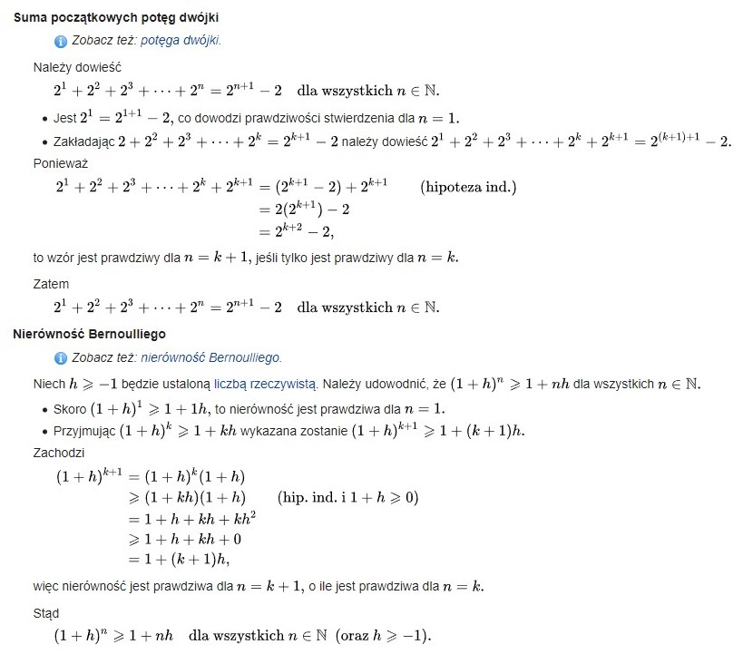

## 6. Permutacje, wariacje i kombinacje.

### ___Permutacja___

Permutacja zbioru $n$-elementowego - to dowolny $n$-wyrazowy ciąg utworzony ze wszystkich elementów tego zbioru.<br />
Liczbę permutacji zbioru $n$-elementowego możemy obliczyć ze wzoru:
$$
    P_n=n!
$$

__Przyklady__

1. Na ile sposobów można ustawić $5$ osób w kolejce?

$$
    P_5 = 5! = 1\cdot 2\cdot 3\cdot 4\cdot 5 = 120 
$$

2. Ile liczb można utworzyć z cyfr: $1,2,3,4,5,6,7$?

$$
    P_7=7!=1\cdot 2\cdot 3\cdot 4\cdot 5\cdot 6\cdot 7=5040
$$

### ___Kombinacja___

Kombinacja pozwala policzyć na ile sposobów można wybrać $k$ elementów z $n$-elementowego zbioru.<br />
Wzór na kombinację jest następujący:
$$
    C_n^k=\frac{n!}{k!(n−k)!}
$$
Kombinację zapisujemy krótko za pomocą Symbolu Newtona:
$$
    \binom{n}{k}=\frac{n!}{k!(n−k)!}
$$

__Przyklady__

1. Na ile sposobow mozna wybrac $2$ osoby w klasie $30$ osobowej?

$$
    \binom{30}{2} = \frac{30!}{2!(30 - 2)!} = \frac{30!}{2\cdot 28!} = \frac{29\cdot 30}{2} = 15\cdot 29 = 435
$$

2. Na ile sposobow mozne wybrac $3$ zawodnikow w duzynie $12$ osobowej?

$$
    \binom{12}{3} = \frac{12!}{3!(12 - 3)!} = \frac{12!}{6\cdot 9!} = \frac{10\cdot 11\cdot 12}{6} = 220
$$

###  ___Wariacja z powtorzeniami___

Przyjmijmy, że mamy dany zbiór elementów (np. zbiór liter). Wariacja z powtórzeniami pozwala na utworzenie ciągu z elementów tego zbioru, z tym, że dopuszcza powtarzanie elementów.<br />
Wzór na wariację z powtórzeniami jest następujący:

$$
    W^k_n=n^k
$$

__Przyklady__

1. Ile słów pięcioliterowych (nawet tych bezsensownych) można utworzyć z liter $\{A,B,C\}$?

> Przykładami taki słów są: $AAAAA, AABCA, CBCBB$.<br/>
> Na każde z $5$ miejsc możemy wybrać jedną z $3$ liter, zatem wszystkich możliwości mamy:

$$
    3^5=243
$$

2. Ile słów dwuliterowych (nawet tych bezsensownych) można utworzyć z liter {A,B,C,D}?

> Przykładami taki słów są: $AA, DC, CD$.<br/>
> Na każde z $2$ miejsc możemy wybrać jedną z $4$ liter, zatem wszystkich możliwości mamy:

$$
 4^2=16
$$

### ___Wariacja bez powtorzen___

Przyjmijmy, że mamy dany zbiór elementów (np. zbiór liter). Wariacja bez powtórzeń pozwala na utworzenie ciągu z elementów tego zbioru, z tym, że nie dopuszcza powtarzania elementów. Wzór na wariację bez powtórzeń jest następujący:

$$
    V^k_n=\frac{n!}{(n−k)!}
$$

__Przyklady__

1. Ile istnieje czterocyfrowych PIN-kodów składających się z różnych cyfr?

> Mamy do dyspozycji $10$ cyfr: $\{0,1,2,3,4,5,6,7,8,9\}$.<br/>
> Przykładowymi kodami o różnych cyfrach są: $1234, 0189, 9734$. Wszystkich takich wariacji bez powtórzeń jest:

$$
    \frac{10!}{6!}=7\cdot 8\cdot 9\cdot 10 = 5040
$$

## 7. Klasyczna definicja prawdopodobieństwa. Prawdopodobieństwo geometryczne.

___Definicja___

Zakładamy, że przestrzeń zdarzeń elementarnych \OmegaΩ ma skończoną liczbę zdarzeń elementarnych i każde z nich jest jednakowo prawdopodobne. Wtedy prawdopodobieństwo definiujemy następująco:

Dla dowolnego $A\subset\Omega: P(A) = \frac{|A|}{|\Omega|}$

Kilka wyjaśnień:

- $P(A)$ to prawdopodobieństwo zajścia zdarzenia $A$
- $|A|$ to liczebność zdarzenia $A$,
- $|\Omega|$ to liczebność przestrzeni zdarzeń elementarnych $\Omega$ (czyli liczba wszystkich zdarzeń elementarnych w doświadczeniu losowym).

Krótko: prawdopodobieństwo uzyskania jakiegoś wyniku to liczba sprzyjających wyników przez liczbę wszystkich możliwych wyników. Zatem chcąc obliczyć prawdopodobieństwo zajścia pewnego zdarzenia:

1. Opisujemy przestrzeń zdarzeń elementarnych $\Omega$.
2. Upewniamy się, że każde zdarzenie elementarne jest jednakowo prawdopodobne.
3. Zliczamy liczbę elementów $\Omega$, czyli obliczamy $|\Omega|$.
4. Opisujemy zdarzenie $A$, którego prawdopodobieństwo zajścia chcemy obliczyć.
5. Zliczamy liczbę elementów zdarzenia $A$, czyli obliczamy $|A|$.
6. Obliczamy prawdopodobieństwo zajścia zdarzenia $A$ ze wzoru: $P(A) = \frac{|A|}{|\Omega|}$.

___Własności prawdopodobieństwa___

_Prawdopodobieństwo dowolnego zdarzenia losowego A jest zawsze liczbą z przedziału ⟨0;1⟩._

$$
    0≤P(A)≤1
$$

_Prawdopodobieństwo zdarzenia pewnego jest równe 1._

$$
    P(Ω)=1
$$

_Prawdopodobieństwo zdarzenia niemożliwego jest równe 0._

$$
    P(∅)=0
$$

___Przydatne wzory___

_Prawdopodobieństwo zdarzenia przeciwnego:_

$$
    P(A′)=1−P(A)
$$

_Prawdopodobieństwo sumy zdarzeń_

$$
    P(A∪B)=P(A)+P(B)−P(A∩B)
$$

___Prawdopodobieństwo warunkowe___

_Prawdopodobieństwo warunkowe zajścia zdarzenia A pod warunkiem zajścia zdarzenia B liczymy ze wzoru:_

$$
    P(A|B)=P(A∩B)P(B)\\
    \text{gdzie } P(B)>0
$$

___Prawdopodobieństwo całkowite___

_Jeżeli zdarzenia $B_1,B_2,...,B_n$ są parami rozłączne oraz mają prawdopodobieństwa dodatnie, które sumują się do jedynki, to dla dowolnego zdarzenia A zachodzi wzór:_

$$
    P(A)=P(A|B_1)⋅P(B_1)+P(A|B_2)⋅P(B_2)+...+P(A|B_n)⋅P(B_n)
$$

___Wzór Bayesa___

_Jeżeli zdarzenia $B_1,B_2,...,B_n$ są parami rozłączne oraz mają prawdopodobieństwa dodatnie, które sumują się do jedynki, to dla dowolnego zdarzenia A zachodzi wzór:_

$$
    P(B_k|A)=P(A|B_k)⋅P(B_k)P(A)
$$

___Schemat Bernoulliego___

_W schemacie Bernoulliego prawdopodobieństwo uzyskania k sukcesów w n próbach można obliczyć ze wzoru:_
$$
    P_n(k)=\binom{n}{k}p^k(1−p)^{n−k}\\
    \text{gdzie }p \text{ - to prawdopodobieństwo sukcesu w jednej próbie}
$$

## 8. Struktura logiczna i funkcjonalna klasycznego komputera.

**Klasyczny komputer** o architekturze podanej przez von Neumana składa się z trzech podstawowych bloków:
- procesora
- pamięci operacyjnej
- urządzeń wejścia/wyjścia.

**Struktura logiczna komputera**

- W pamięci przechowywane są przetwarzane dane oraz program dla procesora.
- Urządzenia wejścia/wyjścia umożliwią wymianę informacji pomiędzy komputerem a otoczeniem.
- Procesor umożliwia przetwarzanie danych.

> Po załadowaniu programu do pamięci komputera może
> on zostać w dowolnej chwili wywołany przez operatora.
> W tym celu musi on wydać polecenie rozpoczęcia
> wykonywania tego programu przez wymuszenie
> odczytania pierwszego polecenia tego programu. W tym
> celu należy spowodować, aby procesor wysłał do pamięci
> odpowiedni adres. Dalsze polecenia są umieszczone
> w pamięci kolejno, więc będą odczytywane przez procesor
> automatycznie. Wykonywanie programu polega, więc na
> pobieraniu z pamięci kolejnych poleceń i odpowiednich
> dla tych poleceń argumentów.
> Argumenty rozkazu mogą być:
> - w pamięci i wówczas rozkaz musi zawierać adres miejsca w
> pamięci, gdzie one się znajduje,
> - w rejestrach procesora i wówczas rozkaz musi wskazywać adres
> odpowiedniego rejestru,
> - w samym rozkazie i wówczas programista umieszcza je w
> odpowiednio w kodzie programu.
> 
> W czasie wykonywania programu procesor
> odczytuje kolejne rozkazy, które następnie musi
> rozpoznać (dekodować). Po zdekodowaniu rozkazu,
> w zależności od treści tego rozkazu, procesor
> podejmuje odpowiednią akcję. Akcja ta polega na
> wykonaniu odpowiedniej operacji. Między
> innymi, z treści rozkazu, może wynikać
> konieczność odczytania argumentów dla niego.
> 
> Jeżeli argument znajduje się, w pamięci, to dalsza akcja
> polega na odczytaniu adresu tego argumentu.
> Jeżeli adres ten programista umieścił w kodzie
> programu, to odczytane będzie następne słowo(a)
> z kodu programu stanowiące ten adres. Jeżeli argument
> znajduje sic, w rejestrze procesora, to rozkaz
> musi wskazać, w którym z rejestrów procesora znajduje
> się adres. Po skompletowaniu całej instrukcji procesor
> wykonuje ją, a dalej pobiera następny rozkaz i cała akcja
> się powtarza.

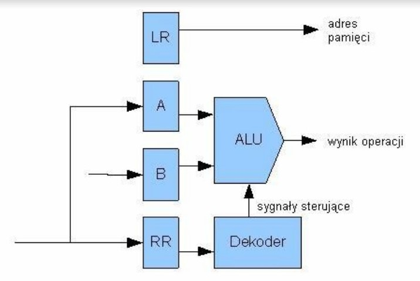

(schemat czytamy od gory - strzalka znika z prawej strony i pojawia sei po lewej dolnej stronie)

Na schemacie:
- **ALU** - jednostka arytmetyczno-logiczna - wykonuje obliczenia
- **RR** - rejestr rozkazow - posiada tablice dostepnych rozkazow
- **dekoder** - dekoduje rozkazy na sygnaly sterujace **ALU**
- **LR** - licznik rozkazow - zlicza rozkazy i uklada je w pamieci aby nastepnie ozstaly odczytane przez **RR**
- **A** oraz **B** - rejjestry argumentow pobranych z pamieci

> Typowa organizacja procesora to blok rejestrów, blok ALU i dekoder kodu rozkazowego. Najważniejszym układem procesora jest blok arytmetyczno logiczny ALU 
> wykonujący operacje na argumentach z dwóch rejestrów A i B. Cykl pracy procesora rozpoczyna się od wysłania do pamięci adresu rozkazu. 
> Adres ten znajduje się, w rejestrze LR zwanym licznikiem rozkazów. 
> 
> Odczytywany z pamięci rozkaz zostaje przesłany do rejestru rozkazów RR. 
> Zawartość tego rejestru jest dekodowana i blok ALU zostaje odpowiednio wysterowany do wykonania danej operacji. 
> Zarówno rozkazy procesora jak i argumenty tych rozkazów są przedstawiane w komputerze w postaci słów binarnych, tj. kodowane w zapisie dwójkowym. (dlugosc slowa zawsze jest taka sama i odpowiada bitowosci komputera tj. 8-bitow, 16-bitow, 32-bity itd)

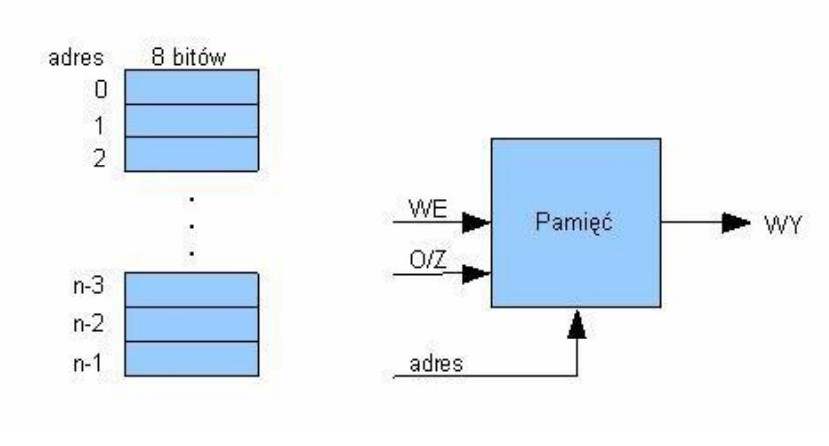

> Pamięć jest podzielona na komórki, w których są
> przechowywane pojedyncze słowa (bajty). Każda komórka
> ma swój adres i podanie tego adresu na wejście adresowe
> pamięci umożliwia dostęp do danej komórki, czyli odczyt
> lub zapis. W zależności od sygnału **O** (odczyt) / **Z** (zapis) pamięć jest
> odczytywana lub zapisywana. 
>
> Wielkość takiej pamięci
> nazywana jest pojemnością pamięci i jest oznaczana przez
> $n\times 8$ (liczba pamiętanych słów przez długość słowa).
> W jednym cyklu pracy takiej pamięci można odczytać lub
> zapisać tylko słowo 8-bitowe. W przypadku, gdy długość
> rozkazu lub argumentu jest większa, to jest on zapisywany
> w dwóch (lub więcej) komórkach pamięci.
> Cykl instrukcyjny składa się z 4 faz:
> - fazy pobrania rozkazu
> - dwóch faz pobrania argumentów rozkazu
> - fazy zapisu wyniku do pamięci.


## 9. Reprezentacja liczb w pozycyjnym systemie liczbowym. Systemy dwójkowy i szesnastkowy oraz ich zastosowania.

**Pozycyjny system liczbowy** - to system liczbowy ktory opiera sie o pewien skonczony zestaw cyfr tego systemu. Kazda liczba w systemie pozycyjnym zostaje przedstawiona jako ciag cyfr tego systemu gdzie kazda nastepna cyfra $k$ na indeksie $n$ ($n \isin \{0, 1, 2, ...\}$) gdzie $m$ to ilosc cyfr tego systemu, przedstawia wartosc $k\times m^{n}$.

__Wzor__:

$$
    k_{n}\cdot m^{n} + k_{n-1}\cdot m^{n-1} + \ldots + k_{1}\cdot m^{1} + k_{0}\cdot m^{0}
$$

**Przyklady**

___Zamiana z $(2), (16)$ na $(10)$___

- $$
    2137_{(10)} = 2\cdot 10^{3} + 1\cdot 10^{2} + \ldots + 3\cdot 10^{1} + 7\cdot 10^{0} = 2137_{(10)}
$$
- $$
    11001000_{(2)} = 1\cdot 2^{7} + 1\cdot 2^{6} + 0\cdot 2^{5} + 0\cdot 2^{4} + 1\cdot 2^{3} + 0\cdot 2^{2} + 0\cdot 2^{1} + 0\cdot 2^{0} = 200_{(10)}
$$
- $$
    1A4_{(16)} = 1\cdot 16^{2} + A\cdot 16^{2} + 4\cdot 16^{0} = 420_{(16)}
$$

___Zamiana z $(10)$ na $(2), (16)$___

- __Zamiana z $(10)$ na $(16)$__<br/>


- __Zamiana z $(10)$ na $(2)$__<br/>
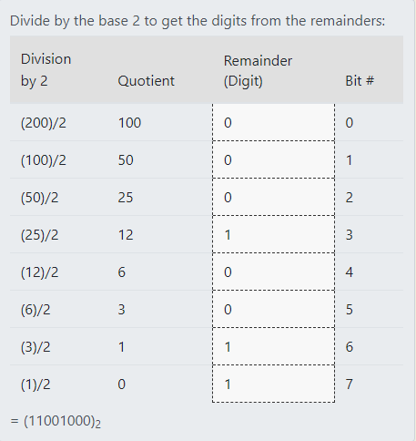

**Zastowosawnie systemu dwojkowego**

**System dwojkowy** oznaczany $XXX_{(2)}$ wykorzystywany jest jako glowny podloze wszystkich obliczen komputerow elektronicznych. Zostal wybrany na system pozycyjny komputerow poniewaz $0$ moze przedstawiac brak napieca a $1$ napiecie na danej sciezce, w danej komorce pamieci lub nosniku danych co sprawia ze jest to system bardzo prosty poniewaz nie wymaga pomiaru poziomu napiecia pradu przeplywajacego przez komponent w celu uzyskania danyhc z tego komponentu.

 - używany w matematyce, informatyce i elektronice cyfrowej, gdzie
minimalizacja liczby stanów (do dwóch) pozwala na prostą implementację
sprzętową odpowiadającą zazwyczaj stanom wyłączony i włączony oraz
zminimalizowanie przekłamań danych

**Zastosowanie systemu szesnastkowego**

**System szesnastkowy** oznaczany $XXX_{(16)}$ wykorzystywany jest jako roziwniecie systeu dowjkowego. Dzieki wiekszej podstawie tego systemu, liczby zapisywane w nim sa bardziej kompaktowe i dzieki temu bardziej czytelne.

- adresy sprzetowe
- kody kolorow RBG
- adresy IPv6

## 10. Arytmetyka stałopozycyjna i zmiennopozycyjna. Reprezentacja liczb w komputerze.

### **_Liczba stalopozycyjna (staloprzecinkowa)_**

Komputerowa reprezentacja liczb calkowitych z przedzialu od $-2^n$ do $2^{n-1}$ (przedzial zalezy od standardu), gdzie n jest liczba bitów w slowie maszynowym, zapisywanych w kodzie uzupelnien do dwóch. Zakres liczb 16-bitowych w a.s. (komputery PC) miesci sie w przedziale $[-32768, +32767]$. Przekroczenie zakresu liczb powoduje nadmiar. W arytmetyce stalopozycyjnej sa wykonywane cztery podstawowe dzialania (+, -, * i /), przy czym stosuje sie dzielenie calkowite.

### **_Liczba zmiannopozycyjna (zmiennoprzecinkowa)_**

Reprezentacja liczby rzeczywistej zapisanej za pomocą notacji naukowej. Ze względu na wygodę operowania na takich liczbach, przyjmuje się ograniczony zakres na mantysę i cechę – nazwy te mają w matematyce znaczenie podane w artykule podłoga i sufit, a w niniejszym artykule inne, powszechne w informatyce. Powoduje to, że reprezentacja liczby rzeczywistej jest tylko przybliżona, a jedna liczba zmiennoprzecinkowa może reprezentować różne liczby rzeczywiste z pewnego zakresu.

**Stalopozycjne (calkowite)**<br/>
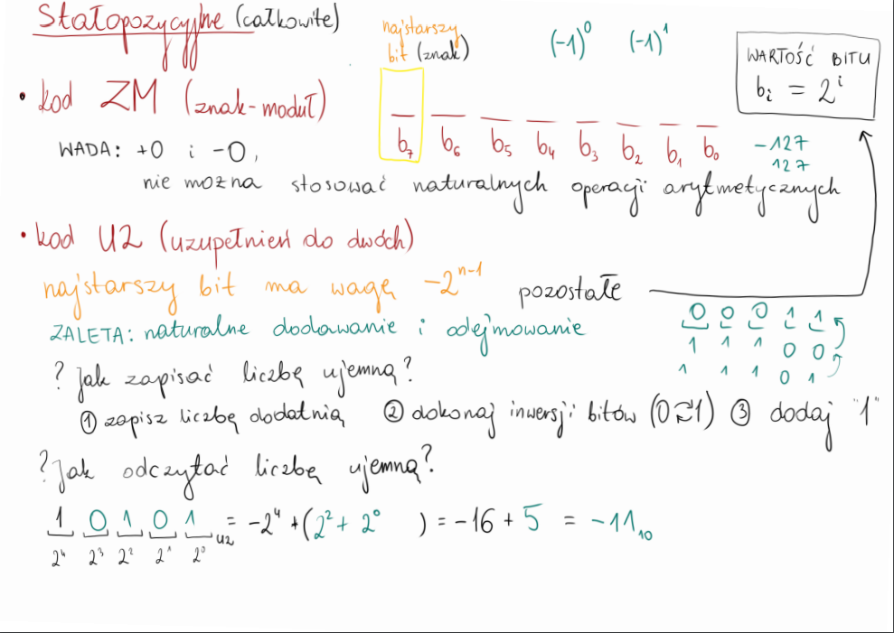

**Stalopozycjne (rzeczywiste)**<br/>
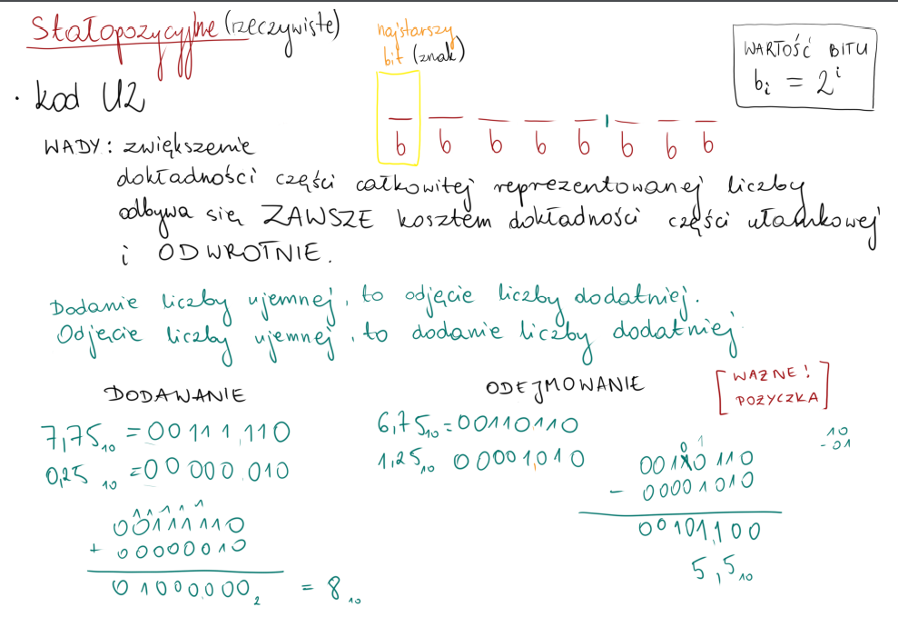

**Stalopozycjne (rzeczywiste cd.)**<br/>


**Zmiennopozycyjne**<br/>
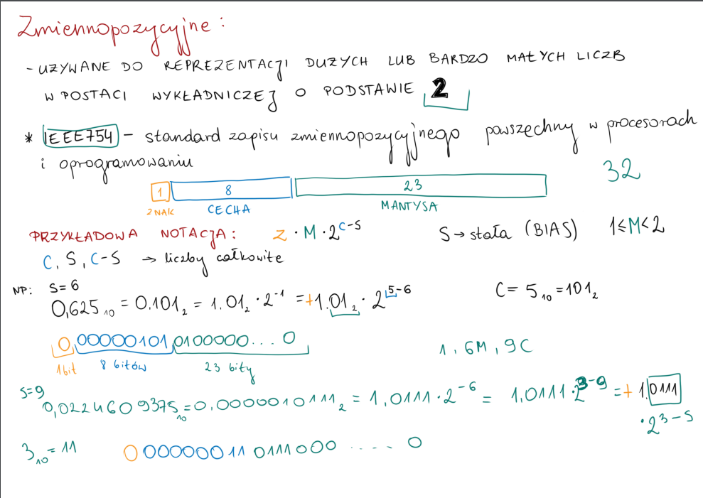## 11. System operacyjny. Postrzeganie systemu operacyjnego przez warstwę oprogramowania użytkowego.

### **Definicja**

**System operacyjny** jest warstwą oprogramowania operującą bezpośrednio na sprzęcie, której celem jest zarządzanie zasobami systemu komputerowego i
stworzenie użytkownikowi środowiska łatwiejszego do zrozumienia i wykorzystania.

<center>


</center>

System operacyjny *pośredniczy* pomiędzy użytkownikiem a sprzętem,
dostarczając wygodnego środowiska do wykonywania programów. Użytkownik
końcowy korzysta z programów (aplikacji), na potrzeby których przydzielane są
zasoby systemu komputerowego. Przydziałem tym zarządza system operacyjny,
dzięki czemu można uzyskać stosunkowo duży stopień niezależności programów
od konkretnego sprzętu oraz odpowiedni poziom bezpieczeństwa i sprawności
działania.

### **Ogólna struktura systemu operacyjnego**

Nie ma precyzyjnego określenia, które składniki wchodzą w skład systemu
operacyjnego jako jego części.
<center>


</center>

W ogólnym przypadku w strukturze systemu operacyjnego wyróżnia się jądro
oraz programy systemowe, które dostarczane są razem z systemem operacyjnym,
ale nie stanowią integralnej części jądra. **Jądro** jest zbiorem modułów, które
ukrywają szczegóły sprzętowej realizacji systemu komputerowego, udostępniając
pewien zestaw usług, wykorzystywanych między innymi do implementacji
programów systemowych.

Z punktu widzenia kontaktu z użytkownikiem istotny jest **interpreter poleceń**,
który może być częścią jądra lub programem systemowym (np. w systemie
UNIX). Interpreter wykonuje pewne polecenia wewnętrznie, tzn. moduł lub
program interpretera dostarcza implementacji tych poleceń. Jeśli interpreter nie
może wykonać wewnętrznie jakiegoś polecenia, uruchamia odpowiedni program
(tzw. polecenie zewnętrzne), jako odrębny proces.

**Programy systemowe (programy użytkowe systemu)**:
<ul>
<li>programy do obsługi plików, w tym pakujące i archiwizujące</li>
<li>programy do komunikacji w sieci</li>
<li>proste edytory tekstów i grafiki</li>
<li>programy diagnozujące pracę procesora, pamięci, sieci, dysków twardych itp</li>
<li> kompilatory </li>
</ul>

**Zadania systemu operacyjnego:**
<ul>
<li> Definicja interfejsu użytkownika </li>
<li> Udostępnianie systemu plików </li>
<li> Udostępnianie środowiska do wykonywania
programów użytkownika </li>
  <ul>
    <li> mechanizm ładowania i uruchamiania programów</li>
    <li> mechanizmy synchronizacji i komunikacji procesów </li>
  </ul>
<li>Sterowanie urządzeniami wejścia-wyjścia</li>
<li>Obsługa podstawowej klasy błędów</li>
</ul>

### **Podział systemów operacyjnych**
<ul>
<li> Ze względu na <b>sposób przetwarzania</b> </li>
<ul>
<li>systemy przetwarzania bezpośredniego (online processing systems) - bezpośrednia interakcja użytkownik<->system</li>
<li>systemy przetwarzania pośredniego (offline processing systems) - zwłoka czasowa; brak możliwości ingerencji w wykonywanie zadania</li>
</ul>

<li> Ze względu na <b>liczbę wykonywanych programów</b> </li>
<ul>
<li>jednozadaniowe - tylko jedno zadanie na raz</li>
<li>wielozadaniowe - wiele zadań jednocześnie</li>
</ul>

<li> Ze względu na <b>liczbę użytkowników</b> </li>
<ul>
<li>dla 1 użytkownika - tylko jedno zadanie na raz</li>
<li>wielozadaniowe - wielu użytkowników może
korzystać ze zasobów systemu komputerowego, a
system operacyjny gwarantuje ich ochronę przed
nieupoważnioną ingerencją</li>
</ul>
</ul>

### **Procesy**

**Proces** - uruchomiony program. Jeden program to może być wiele procesów, bo np. uruchomimy wiele razy ten jeden program. Każdy proces jest identyfikowany przez numer PID.

W systemie operacyjnym każdy proces posiada proces nadrzędny (rodzica), z kolei każdy proces może, poprzez wywołanie funkcji systemu operacyjnego, utworzyć swoje procesy potomne. W ten sposób tworzy się swego rodzaju drzewo procesów.

W *skład procesu* wchodzi:
<ul>
<li>kod programu</li>
<li>licznik rozkazów</li>
<li>stos</li>
<li>sekcja danych</li>
</ul>

W trakcie ładowania procesu do pamięci system operacyjny tworzy *stos* (stack) i *stertę* (heap). 

**Stos** – do przechowywania zmiennych, parametrów funkcji, adresów powrotu.
**Sterta** – do przechowywania dynamicznie alokowanych danych, np. listy

**Stany procesu**:
<ul>
<li><b>Początkowy</b> (initial) – w trakcie uruchamiania</li>
<li><b>Aktywny</b> (running, executing)– proces działa na procesorze</li>
<li><b>Gotowy</b> (ready) – proces jest gotowy do uruchomienia, ale w tej chwili jest wstrzymany</li>
<li><b>Oczekujący</b> (blocked) ; proces wykonał operację w wyniku której nie może zostać ponownie uruchomiony dopóki nie nastąpi jakieś zdarzenie (np. operacja we/wy).</li>
<li><b>Końcowy</b> (final) – podczas zamykania</li>
<li><b>Zombie</b> – ukończony proces, który czeka na jakąś akcję, np. odczytanie kodu wyjścia przez proces rodzica</li>
<li><b>Demon</b> (ang. daemon czyli duszek) - nazywamy proces działający w tle, nie podlegający sterowaniu z żadnego terminala, uruchamiany zwykle podczas startu systemu i działający do jego zamknięcia.</li>
</ul>

### **Wątek**
Czasami może być konieczne współbieżne wykonywanie pewnych fragmentów programu. Aby to zrealizować, program może zażądać utworzenia określonej liczby wątków, wykonujących wskazane części programu. Ta cecha systemu operacyjnego to wielowątkowość. W jednym procesie może być kilka wątków. Każdy wątek ma swój własny stos (posiada swoje zmienne lokalne)

### **Wielozadaniowość**
Cecha systemu operacyjnego umożliwiająca równoczesne wykonywanie więcej niż jednego procesu (programu).

### **Planista (dyspozytor)**
Jest jak policjant na skrzyżowaniu, który wskazuje, które auta mogą teraz przejechać przez skrzyżowanie. Jest to część systemu operacyjnego przełączająca procesy według polityki szeregowania zadań. Do jego zadań należy m.in. przełączanie kontekstu.

**Planista krótkoterminowy** ustala wartość priorytetu. Wybiera proces o najwyższym priorytecie do wykonania.

### **Algorytmy szeregowania**
<ul>
<li><b>FIFO</b> – (FCFS) - najprostszy, niewywłaszczający, implementowany za pomocą kolejki FIFO;</li>
<li><b>SJF</b> (Shortest-Job-First) - wiąże z każdym procesem długość jego najbliższej z faz procesora, zapewnia minimalny średni czas oczekiwania; może być wywłaszczający lub nie;</li>
<li>algorytm <b>Round-Robin</b> - czas procesora podzielony na kwanty, kolejka procesów gotowych traktowana jako kolejka cykliczna, algorytm z wywłaszczeniem;</li>
</ul>

<center>


</center>

 Możliwe jest **zagłodzenie** procesu, gdy dany proces nie jest w stanie zakończyć działania,
  ponieważ nie ma dostępu do procesora lub innego współdzielonego zasobu.
Występuje
 najczęściej na skutek niewłaściwej pracy algorytmu szeregowania lub nadmiernego obciążenia
 systemu.

 Zdarza się również tzw. **zakleszczenie**, czyli blokada wzajemna. Powstaje wtedy, gdy wiele
 zadań w tym samym czasie konkuruje o wyłączny dostęp do zasobów. Zakleszczenie:

 <center>


</center>
 
## 12. Cechy tradycyjnego systemu Unixowego.

<a href="https://ai.ia.agh.edu.pl/_media/pl:dydaktyka:unix:gjn-unix-2015wiosna-lec1_4.pdf"> Polecanko - slajd 46+</a>

### TL;DR: Unix to system:
<ul>
<li><b>wielozadaniowy</b> - jest to cecha systemu operacyjnego, mówiąca, czy może on wykonywać jednocześnie kilka procesów. Wielozadaniowość otrzymuje się poprzez tzw. scheduler, czyli algorytm kolejkujący i porządkujący procesy, które mają być wykonane. W tym systemie każdy proces jest wykonywany jakiś kwant czasu, a później czeka "w uśpieniu" (oczywiście z uwzględnieniem różnych priorytetów).</li><br>

<li><b>wielodostępowy</b> (o ile jego administrator nie zażyczy sobie inaczej) - oznacza możliwość jednoczesnej pracy wielu użytkowników (np. możliwość czytania tego samego pliku przez kilku użytkowników)</li><br>

<li><b>wielowątkowy</b> – jest to cecha systemu operacyjnego, dzięki której w ramach jednego procesu można wykonywać kilka wątków lub jednostek wykonawczych. Nowe wątki to kolejne ciągi instrukcji wykonywane oddzielnie. Wszystkie wątki współdzielą między sobą ten sam obszar pamięci. W momencie, gdy system nie wspiera wielowątkowości, pojęcie procesu i wątku utożsamiają się.</li>
</ul>

### **Cechy**

<ol>

<li> <b>Jądro</b> systemu jest, oprócz pewnej części ściśle związanej z obsługiwanym sprzętem,
<b>napisane w języku wysokiego poziomu (C)</b>.</li>
<br>
<li>W Unixie obowiązuje model administracyjny, bazujący na <b>ograniczonym zaufaniu do użytkowników</b>. Ujawnia się on między innymi tym, że zwykle użytkownik lokalny ma
prawo zapisu jedynie w swoim katalogu domowym, katalogu na pliki tymczasowe oraz w kilku innych, dobrze znanych miejscach. Jednocześnie administratora systemu
(użytkownika o numerze identyfikacyjnym 0) nie dotyczą jakiekolwiek ograniczenia.</li><br>
<li><b>System praw dostępu do plików</b> (czyli również do urządzeń czy kanałów komunikacyjnych) jest zbudowany w oparciu o tablicę bitową stałej długości, zapisaną w i-węźle. Zawiera ona zezwolenia na trzy podstawowe operacje – czytanie, zapis i wykonanie dla trzech rozłącznych klas użytkowników: właściciela pliku, członków tzw. grupy pliku oraz innych. Unixowy system praw dostępu jest bardzo efektywny w działaniu, brak dynamicznych list dostępu jest jednakże dość uciążliwy.</li><br>
<li>Unix bezpośrednio po starcie widzi tylko jedno urządzenie pamięci masowej, zawierające tzw. korzeń systemu plików (oznaczany znakiem /). Inne urządzenia są przyłączane do głównego drzewa w procesie tzw. montowania i są widoczne jako fragmenty drzewa plikowego od pewnego katalogu określanego jako punkt montowania.</li><br>
<li>Naturalnym sposobem <b>organizacji pamięci masowej</b> jest model indeksowy oparty na tzw. i-węzłach (ang. i-nodes). i-węzeł zawiera w postaci tablicy o stałym rozmiarze wszystkie informacje o pliku poza jego nazwą. Odwzorowaniem i-węzłów na nazwy plików zajmują się pliki specjalne – katalogi.</li><br>
<li>Budowie interfejsu programisty systemu (API) prześwięca minimalizm, ujawniający się choćby tym, że odczyt i zapis informacji w rozmaitych urządzeniach obsługiwanych przez system odbywa się za pomocą tego samego interfejsu jak odczyt i zapis informacji do plików „zwykłych”. Zasadę tę często definiuje się jako: „Dla Unixa wszystko jest plikiem”. </li><br>
<li>Jednostką aktywną w systemie jest <b>proces</b>, pracujący w trybie nieuprzywilejowanym procesora, we własnej chronionej przestrzeni adresowej; jedynym elementem aktywnym w trybie uprzywilejowanym jest jądro systemu. </li><br>
<li>Unix wykorzystuje do pracy w środowisku rozproszonym rodzinę protokołów TCP/IP. </li><br>
<li>Plik danych jest ciągiem bajtów. </li><br>
<li>Unix używa pamięci wirtualnej, rozszerzając pamięć operacyjną o tzw. obszary wymiany w pamięci masowej. Niewykorzystaną pamięć operacyjną wypełniają bufory używanych plików.</li><br>
<li>Podstawową metodą tworzenia nowych procesów jest rozwidlanie procesu aktywnego funkcją systemową fork. Po jej wywołaniu system tworzy nowy proces, którego przestrzeń adresowa jest kopią przestrzeni procesu macierzystego. Oba procesy rozpoczynają współbieżną pracę od następnej instrukcji za wywołaniem fork. Często proces potomny wykonuje niedługo po utworzeniu funkcję systemową execve, która zastępuje kod aktywnego procesu kodem z pliku wykonywalnego. </li><br>
<li>Otwarty plik jest dostępny w procesie poprzez liczbę całkowitą zwaną <b>deskryptorem pliku</b>. Predefiniowanymi deskryptorami są tu wartości 0 (standardowe wejście, zwykle związane z klawiaturą terminala), 1 (standardowe wyjście, zwykle z związane z wyjściem terminala) oraz 2 (standardowe wyjście dla błędów). </li><br>
<li>W środowisku tekstowym naturalnym środowiskiem pracy jest tzw. Interpreter poleceń czyli powłoka (ang. shell).</li><br>
<li>Unixowy system plików jest widoczny jako wielopoziomowe drzewo.</li><br>
<li>Procesy korzystają podczas pracy z mechanizmów łączenia dynamicznego, ładując kod wspólnych bibliotek w miarę potrzeb. Podstawową biblioteką uwspólnioną jest standardowa biblioteka języka C (tzw. libc).</li><br>
<li>Komunikacja międzyprocesowa odbywa się przez jądro systemu.</li><br>
</ol>

### **Typy plików Unixowych**
<ul>
<li><b>pliki zwykłe</b> – (symbol: -) ciągi bajtów, może istnieć w kilku miejscach w systemie plików jednocześnie.</li><br>

<li><b>katalogi</b> – (symbol: d) plik binarny zawierający listę plików oraz katalogów, które się w nim znajdują. Typowe operacje dostępu do pliku, np. otwarcie, nie działają dla katalogu. Dowiązania sztywne do katalogu są tworzone jedynie pośrednio przez system. Każdy katalog zawiera dwie specjalne pozycje:
<ul>
<li>. – wskazującą na ten katalog
<li>.. – wskazującą na katalog zawierający.
</ul>
<br>

<li><b>dowiązanie symboliczne</b>, (ang. symbolic link, często skracane jako symlink) wskazuje, odwołując się za pomocą nazwy, na dowolny inny plik lub katalog (który może nawet w danej chwili nie istnieć). Odwołanie jest niewidoczne na poziomie aplikacji tzn. jest traktowane jak zwykły plik lub katalog.</li><br>

</ul>


## 13. Iteracja, rekurencja i ich realizacja.
<a href="https://fulmanski.pl/zajecia/wdi/zajecia_20212022/wyklad_pres/pres_pl_algorithm.pdf"> Źródło</a>


**Iteracja** - czynność powtarzania (najczęściej wielokrotnego) tej samej instrukcji (albo wielu instrukcji) w pętli.

**Rekurencja** to w logice, programowaniu i w matematyce odwoływanie się np. funkcji lub definicji do samej siebie.

Najwięcej problemów związanych z rekurencją wiąże się z ograniczeniami
stosu wywołań, a właściwie jego pojemności. Na stosie są odkładane kolejne wywołania danej metody i dopiero gdy dojdziemy do ostatniego elementu dane te są zbierane – bardzo łatwo więc o sytuację, gdy po prostu stos przepełnimy.

### **Klasyczne przykłady**

**Silnia iteracyjnie:** n! = 1 \* 2 \* 3...* n <br>
**Silnia rekurencyjnie:** n! = n \* (n-1)!


**Ciąg Fibonacciego**

*Definicja*: dla $n>1$ mamy
$$fib_n = fib_{n-1} + fib_{n-2}, $$
natomiast wyrazy 1 i 0 przyjmują wartość 1.

**Fibonacci rekurencyjnie:**
```
function FibR(n)
begin
      if ( n=0 or n=1) then {
          return 1
      }  
      return FibR(n-1) + FibR(n-2)
end
```
**Fibonacci iteracyjnie:**
```
function FibI(n)
begin
    tmp :=0 // zmienna tymczasowa (pomocnicza)
    x := 1 // wyraz n-1
    y := 1 // wyraz n-2

    for i:=1 to n-1 step 1 {
      tmp := y   // zapamiętaj wyraz n-2
      y := y+x   // przesuń wyraz n-2 na kolejną wartość ci¡gu
      x := tmp   // przesuń wyraz n-1 na kolejną wartość ci¡gu
                 // czyli na warto±¢ wyrazu n-1 przed jego
                 // przesunięciem
    }
    return x
end
```

## 14. Mechanizmy strukturalizacji programów - instrukcje warunkowe i pętle.

I mean..come on ;-;

<a href="https://home.agh.edu.pl/~pkleczek/dokuwiki/doku.php?id=dydaktyka:cprog:2015:conditionals"> For disabled folks</a>

### **Switch syntax**
```
switch(expression) {
  case x:
    // code block
    break;
  case y:
    // code block
    break;
  default:
    // code block
}
```

>Note: The default keyword must be used as the **last statement** in the switch, and it **does not need a break**. *default* can be the first statement on the list, but it makes no sense since only this statement will be executed. 

> **break** and **default** keywords are *optional*.

>Without a break statement, **every statement** from the matched case label to the end of the switch, including the default, is executed.

</br>

### **switch statement behavior**

<table align="center" >
    <thead>
        <tr>
            <th>Condition</th>
            <th>Action</th>
        </tr>
    </thead>
    <tbody>
        <tr>
            <td>Converted value matches that of the promoted controlling expression.</td>
            <td>Control is transferred to the statement following that label.</td>
        </tr>
        <tr>
            <td>None of the constants match the constants in the case labels; a default label is present.</td>
            <td>Control is transferred to the default label.</td>
        </tr>
        <tr>
            <td>None of the constants match the constants in the case labels; no default label is present.</td>
            <td>Control is transferred to the statement after the switch statement.</td>
        </tr>
    </tbody>
</table>

<a href="https://docs.microsoft.com/en-us/cpp/cpp/switch-statement-cpp?view=msvc-170">Switch documentation</a>


## 15. Podprogramy. Przekazywanie parametrów podprogramu.

**Podprogramy** – wydzielona część programu wykonująca określony zbiór instrukcji, posiadająca swoją nazwę i stanowiąca pewną odrębną całość. Ich nazwy powinny informować o ich wyniku działania.

Ogólnie przyjęta konwencja (w przypadku C++) typ_rezultatu nazwa_funkcji( lista parametrów formalnych); na przykład:
```
bool isPrime(int);
```

**Podprogramy dzielą się na dwa rodzaje:**
<ul>
<li>funkcje, które operują na otrzymanych w parametrach danych, zwracają pewną obliczoną wartość, ale nie ingerują w działanie programu.</li>
<li>procedury mogą przyjmować parametry, a w wyniku ich działania następują zmiany globalne w programie bądź w otrzymanych parametrach; po swoim działaniu nie zwraca niczego.</li>
</ul>

Innym szczególnym przypadkiem są *metody* – funkcje, które są własnością klasy lub obiektu. Bez ich istnienia nie można się do nich odwołać.

>W niektórych językach programowania nie istnieje powyższy podział.

Jeżeli chodzi o C++, formalnie procedury nie istnieją, jednak łatwo się domyślić, że ustawiając jako typ rezultatu void możemy utworzyć coś na jej wzór.

**Przekazywanie parametrów do podprogramów odbywa się głównie na dwa sposoby:**
<ul>
<li><b>przez wartość</b> – wewnątrz bloku podprogramu tworzona jest zmienna lokalna, do której kopiowana jest wartość przekazanego parametru, a następnie wszystkie operacje wykonywane są na kopii. Po zakończeniu działania podprogramu wszystkie kopie przestają istnieć, zaś oryginalna zmienna pozostaje niezmieniona</li>

<li><b>przez referencję</b> – do podprogramu przekazywany jest bezpośredni dostęp do zmiennej, a nie jedynie jej wartość, co zmniejsza zużycie pamięci oraz umożliwia modyfikację zmiennej, której efekty pozostaną także po zakończeniu działania podprogramu.</li>
</ul>

```
int addOne(int number) {
    return number++; //przez wartość
}

int addOne(int &number) {
    return number++; //przez referencję
}
```
## 16. Porównanie programowania obiektowego i strukturalnego.

**Programowanie strukturalne** – paradygmat programowania opierający się na podziale kodu źródłowego programu na procedury i hierarchicznie ułożone bloki z wykorzystaniem *struktur kontrolnych* w postaci instrukcji wyboru i pętli. Język programowania zgodny z paradygmatem programowania strukturalnego nazywa się językiem strukturalnym.

**Struktury kontrolne:**
<ul>
<li><b>Sekwencja</b> – wykonanie ciągu kolejnych instrukcji.</li>
<li><b>Wybór</b> – w zależności od wartości wykonywana jest odpowiednia instrukcja. W większości języków programowania są to instrukcje takie jak: if, else, switch, case.</li>
<li><b>Iteracja</b> – wykonywanie instrukcji póki spełniony jest jakiś warunek. Repreezntowana w różnych wariantach jako pętle oznaczane między innymi przez: while, for, do (...) while.</li>
<li><b>Podprogramy</b> - pozwalają na wydzielenie pewnej grupy instrukcji i traktowania ich jako pojedynczej operacji, są dodatkowo mechanizmem abstrakcji.</li>
<li><b>Bloki</b> - w językach programowania bloki odpowiadają sekwencjom instrukcji, umożliwiając budowanie programu przez komponowanie struktur kontrolnych – w miejscu, w którym umieścimy blok z instrukcjami jest on traktowany jak pojedyncza instrukcja.</li>
</ul>

**Programowanie obiektowe** – paradygmat programowania, w którym programy definiuje się za pomocą obiektów – elementów łączących stan i zachowanie. Obiektowy program komputerowy wyrażony jest jako zbiór takich obiektów, komunikujących się pomiędzy sobą w celu wykonywania zadań.

<table align="center">
    <thead>
        <tr>
            <th></th>
            <th><center>Zalety</center></th>
            <th><center>Wady</center></th>
        </tr>
    </thead>
    <tbody>
        <tr>
            <td>Programowanie strukturalne</td>
            <td>
                <ul>
                    <li>szybkie wykonywanie skryptów</li>
                    <li>mała liczba zmiennych (oszczędność pamięci)</li>
                    <li>prostota formy kodu</li>
                </ul>
            </td>
            <td>
                <ul>
                    <li>trudna modyfikacja kodu</li>
                    <li>rozdzielenie danych i operacji na nich wykonywanych</li>
                    <li>częsty nieporządek w kodzie, utrudniający jego czytanie</li>
                </ul>
            </td>
        </tr>
        <tr>
            <td>Programowanie obiektowe</td>
            <td>
                <ul>
                    <li>wysoka przejrzystość kodu</li>
                    <li>łatwość modyfikacji, rozbudowy oraz konserwacji kodu</li>
                    <li>małe ryzyko błędów przy zmianach</li>
                    <li>ułatwia współpracę wielu programistów</li>
                </ul>
            </td>
            <td>
                <ul>
                    <li>wolniejszy czas wykonywania</li>
                    <li>częsta potrzeba wykorzystania nadmiaru kodu do zdefiniowania klas</li>
                </ul>
            </td>
        </tr>
    </tbody>
</table>


## 17. Hermetyzacja danych - cechy klas obiektowych (pola, metody, poziomy prywatności danych).

>aka enkapsulacja

Polega na **ukrywaniu informacji** - ukrywanie pewnych danych składowych lub metod w obiektach danej klasy tak, aby były one dostępne tylko dla metod wewnętrznych danej klasy lub dla metod z klas z nią zaprzyjaźnionych.

Z *pełną enkapsulacją* mamy do czynienia wtedy gdy dostęp do wszystkich pól w klasie jest możliwy tylko i wyłącznie poprzez metody, lub inaczej: gdy wszystkie pola w klasie znajdują się w sekcji prywatnej (lub chronionej)

### **Ukrywanie wewnętrznej struktury obiektu jest bardzo ważne z kilku powodów (Zalety):**
<ul>
<li>obiekt taki jest odizolowany, a więc nie jest narażony na celowe, bądź niezamierzone działanie ze strony użytkownika</li>
<li>obiekt ten jest chroniony od niepożądanych referencji ze strony innych obiektów.</li>
<li>dzięki ukryciu wewnętrznej struktury obiektu, można uzyskać jego przenośność. Innymi słowy, zastosować definiującą go klasę w innym fragmencie kodu, czy też programie.</li>
<li>Uodparnia tworzony model na błędy polegające na przykład na błędnym przypisywaniu wartości oraz umożliwia wykonanie czynności pomocniczych</li>
<li>Umożliwia rozbicie modelu na mniejsze elementy.</li>
</ul>

**Klasa** to definicja obiektu, zawierająca stan obiektu, określony wartościami pól, oraz możliwe zachowanie, określone dostępnymi metodami.

**Obiekt** to utworzony egzemplarz (instancja) określonej klasy, który posiada własny, indywidualny stan i zbiór zachowań.

**Metoda** to funkcja lub procedura, skojarzona z ogółem klasy lub poszczególnymi jej obiektami; określa możliwe zachowania

**Pole** (Właściwość) to zmienna dowolnego typu, skojarzona z ogółem klasy lub poszczególnymi jej obiektami; określa aktualny stan obiektu

**Dziedziczenie** to mechanizm definiowania nowej klasy na bazie już istniejącej, wzbogacając ją o nowe pola, metody lub zmieniając zakres ich widoczności.

### **Zmienna składowa lub metoda może mieć trzy różne poziomy dostępności:**
<ul>
<li><b>public</b> - dostęp publiczny dla innych struktur/klas i funkcji</li>
<li><b>private</b> - dostęp prywatny, tylko dla metod struktury/klasy</li>
<li><b>protected</b> - dostęp chroniony, dla metod struktury/klasy i jej struktur/klas
pochodnych (dziedziczenie)</li>
<li><b>friend</b> - deklaracja przyjaźni, dostęp dla wyspecyfikowanych struktur/klas
lub funkcji</li>
</ul>

>Struct - wszystkie składowe (pola i metody) są domyślnie **publiczne**

>Class - wszystkie składowe (pola i metody) są domyślnie **prywatne**
## 18. Typy metod: konstruktory, destruktory, selektory, zapytania, iteratory.

Metoda
<ul>
<li>Funkcja składowa</li>
<li>Funkcja powiązana z klasą</li>
<li>Funkcja mająca dostęp do składowych klasy</li>
<li>Tworzy interfejs klasy</li>

```
class MyClass {
    void privateMethod(); //deklaracja w klasie

public:
    void publicMethod() { //definicja w klasie
        //donothing;
    }; 
}
```
</ul>

>Definicja klasy musi zawierać przynajmniej deklarację metody

>Definicja metody, często dla czytelności kodu, jest umieszczana
poza klasą

```
void MyClass::privateMethod() { //definicja poza klasą
    //this method is depressed
}
```

### **Konstruktory**

<ul>
<li><b>Konstruktor</b> – specjalna metoda do inicjalizacji atrybutów obiektu</li>
<li>uruchamiany zawsze przy tworzeniu obiektu</li>
<li>nazwa metody taka jak nazwa klasy</li>
<li>możliwe wiele przeciążeń z różnymi parametrami, <b>brak typu wynikowego!</b></li>

```
struct Obj {
    int a, b;   //od C++11 możliwa inicjalizacja w klasie, np.
                //int a = 0;

    Obj(int _a = 0, int _b = 0){ //konstruktor
        a = _a;
        b = _b;
    }
};

{
    Obj x, y(1), z(1,2), v = 3, u = {3,4}; //wywołania konstruktora
    Obj t[5], *s = new Obj, *p = new Obj[3]; //wielokrotne
}
```
</ul>

**Konstruktor domyślny:**
<ul>
<li>bez parametrów (lub gdy wszystkie parametry mają wartości domyślne) </li>
<li>tworzony automatycznie przez kompilator (bez gwarancji inicjalizacji atrybutów
obiektu) tylko gdy nie zdefiniowano jawnie żadnego konstruktora</li>

```
struct Obj {
    int a, b;

    Obj(){ //konstruktor domyślny
        a = 0;
        b = 0;
    }
    
    Obj()=default;//konstruktor domyślny bez inicjalizacji(C++11)
};

{
    Obj x, t[5]; //wywołania konstruktora domyślnego
    Obj *s = new Obj, *p = new Obj[3]; //tu też
}
```
<li><b>(!!!) jeżeli jakikolwiek konstruktor został zdefiniowany, kompilator nie tworzy
domyślnego</b> </li>
<li>w celu ułatwienia wykorzystania klasy należy zawsze zdefiniować konstruktor
domyślny </li>

```
struct Obj {
    int a, b;
    
    Obj(int _a, int _b = 0){ //1- lub 2-parametrowy konstruktor
        a = _a;
        b = _b;
    }
};

{
    Obj y(1), z(1, 2); //wywołania konstruktora
    Obj x; //brak konstruktora domyślnego – błąd kompilacji!
}
```
</ul>

**Konstruktor kopiujący:**
<ul>
<li>przyjmuje jako jedyny parametr referencję do obiektu tej samej klasy </li>
<li>tworzony automatycznie przez kompilator gdy nie zdefiniowano jawnie takiego
konstruktora (kopia atrybutów obiektu)</li>
<li>wywoływany przy przekazywaniu i zwracaniu obiektów w funkcjach</li>

```
struct Obj {
    int a, b;
    ... //inne konstruktory łącznie z domyślnym

    Obj(const Obj &o){ //konstruktor kopiujący
        a = o.a;
        b = o.b;
    }
};

{
    Obj x;
    Obj y(x), z = x; //wywołania konstruktora kopiującego
}
```
</ul>

### **Destruktory**
<ul>
<li><b>destruktor</b> – specjalna metoda do zwolnienia pamięci zajmowanej przez obiekt</li>
<li>wywoływany automatycznie gdy zmienna przestaje istnieć (na końcu bloku)</li>
<li>metoda o nazwie takiej jak nazwa klasy lecz z poprzedzającą tyldą (~)</li>
<li><b>możliwy tylko jeden destruktor, brak typu wynikowego!</b></li>

```
struct Obj {
    int a, b;
    ... //konstruktory łącznie z domyślnym
    
    ~Obj(){...} //destruktor
    ~Obj()=default; //destruktor domyślny (C++11)
};

{
    Obj x, *p = new Obj; //wywołania konstruktora
    delete p; //jawne wywołanie destruktora (obiekt *p)
} //niejawne wywołanie destruktora (obiekt x)
```
</ul>

**Destruktory obiektów:**
<ul>
<li>tworzone automatycznie przez kompilator gdy nie zostaną jawnie zdefiniowane
(destruktor domyślny nie zwalnia pamięci dla atrybutów klasy alokowanych
dynamicznie za pomocą operatora new)</li>
<li>uruchamiane w kolejności odwrotnej do kolejności tworzenia obiektów
(wywołań odpowiednich konstruktorów)</li>

```
{
    Obj x, *p = new Obj, z;

    { Obj y; } //destruktor dla obiektu y

    delete p; //destruktor dla obiektu *p
} //destruktor dla obiektu z i dalej dla x
```
</ul>

**Kiedy wywoływany jest destruktor?**
<ul>
<li>Decyzję o wywołaniu destruktora podejmuje kompilator. Kod nie powinien jawnie wywoływać destruktora.</li>
<li>Jeżeli obiekt tworzony jest w pamięci statycznej, wówczas jego destruktor wywoływany jest przed zakończeniem programu.</li>
<li>Jeżeli obiekt tworzony jest w sposób automatyczny wówczas destruktor jest wywoływany kiedy program opuszcza blok kodu w którym został zdefiniowany ten obiekt.</li>
<li>Jeżeli obiekt utworzono w sposób dynamiczny (tzn. za pomocą operatora new), wówczas destruktor tego obiektu jest wywoływany automatycznie, gdy użyjemy delete do zwolnienia pamięci.</li>
</ul>

### **Metody domyślne**

Dla każdej klasy kompilator tworzy **automatycznie (o ile nie zdefiniowano ich
jawnie)** następujące metody:
<ul>
<li>konstruktor domyślny (bezparametrowy, brak incjalizacji)</li>
<li>konstruktor kopiujący (kopia atrybutów)</li>
<li>destruktor (brak zwolnienia dynamicznej pamięci)</li>
<li>operator przypisania (kopia atrybutów)</li>

```
struct Obj {
    int a, b;
};

{
    Obj x; //konstruktor domyślny, atrybuty są przypadkowe
    Obj y = x; //konstruktor kopiujący
    x = y; //operator przypisania
} //destruktor domyślny obiektów y i x
```
</ul>

<a href="http://math.uni.lodz.pl/~cybula/psd/lec1.pdf">^Źródło</a>

### **Iteratory**

W programowaniu obiektowym jest to obiekt pozwalający na sekwencyjny dostęp do wszystkich elementów lub części zawartych w innym obiekcie, zwykle kontenerze 
lub liście.

Podstawowym celem iteratora jest pozwolić użytkownikowi przetworzyć każdy element w kolekcji bez konieczności zagłębiania się w jej wewnętrzną strukturę. 
Np.: przejść do kolejnego elementu, na koniec na początek. Użytkownik nie musi np. zajmować się tym, że odwoła się do nieistniejącego elementu.

W C++ iteratory są szeroko wykorzystywane w bibliotece STL. Iteratory stosuje się zwykle w parach, gdzie jeden jest używany do właściwej iteracji, zaś drugi oznacza koniec 
kolekcji. 

Iteratory tworzone są przez odpowiadający im kontener standardowymi metodami, takimi jak **begin()** i **end()**. 
Iterator zwrócony przez *begin()* wskazuje na pierwszy element, podczas gdy iteratorzwrócony przez *end()* wskazuje na 
pozycję za ostatnim elementem kontenera.

```
int main() {
    vector<int> ar = { 1, 2, 3, 4, 5 };
      
    // Declaring iterator to a vector
    vector<int>::iterator ptr;
      
    // Displaying vector elements using begin() and end()
    cout << "The vector elements are : ";
    for (ptr = ar.begin(); ptr < ar.end(); ptr++)
        cout << *ptr << " ";
      
    return 0;    
}
```

**Output:**
>The vector elements are : 1 2 3 4 5

***Just in case: przeciążenie operatorów***
<a href="http://math.uni.lodz.pl/~cybula/psd/lec2.pdf">slajd 7+ (Cybula)</a> oraz <a href="http://math.uni.lodz.pl/~cybula/psd/lec2.pdf)](https://uniwersytetlodzki-my.sharepoint.com/:b:/g/personal/ul0238576_edu_uni_lodz_pl/EWASzeMxbjRKhf5iqSJw63EBS1bY2hcYST7KydrOng9eMA?e=6bYqWF">slajd 8+ (Wardowski)</a>.

**Selektory**

<ul>
<li>Za jego pomocą możemy wywoływać metody klasy dla obiektu</li>
<li>Jest on oznaczony za pomocą kropki</li>
<li>Przykład użycia selektora:

```
x.set(4, 4.5);
```
</li>
</ul>

### **Zapytania**
<ul>
<li>Kwerendy utworzone w języku zapytań</li>
<li>Umożliwiają wyszukanie, tworzenie, usunięcie lub modyfikację danych
w bazie danych</li>
<li>Przykładem języka operującego na zapytaniach w bazach danych jest SQL (ang. Structured Query Language)

```
INSERT INTO TABLE osoby VALUES (’Jan’, ’Kowalski’);
SELECT imie FROM osoby WHERE nazwisko = ’Kowalski’;
UPDATE osoby SET imie = ’Adam’;
DELETE FROM osoby WHERE nazwisko = ’Kowalski’;
CREATE TABLE osoby (imie VARCHAR(50), nazwisko VARCHAR(50));
```
</li>
<li>Inne mniej popularne to np. QBE (ang. Query By Example) czy XQuery</li>
</ul>

## 19. Dziedziczenie i dynamiczny polimorfizm.

Jest to mechanizm umożliwiający tworzenie nowych klas na podstawie klasy już istniejących w ten sposób, że nowa klasa przejmuje (dziedziczy) wszystkie metody drugiej klasy.

**Zalety:**
<ul>
<li>Możliwość tworzenia kodu, który da się wielokrotnie wykorzystać.</li>
<li>Lepiej jest stosować kod już sprawdzony, niż wymyślać rozwiązanie od podstaw</li>
<li>Korzystanie z istniejącego kodu nie tylko skraca czas programowania, lecz również pozwala
uniknąć błędów.</li>
<li>Im mniej koncentrujemy się na szczegółach tym bardziej zrozumiały i przejrzysty jest cały projekt.</li>
<li>Wzbogacanie istniejących klas o dodatkową funkcjonalność oraz deklarowanie w nowych klasach
dodatkowych danych.</li>
<li>Modyfikowanie działań metod już istniejących bez modyfikacji starego kodu.</li>
</ul>

>Klasa oryginalna, na podstawie której tworzymy nową, nazywamy klasą **macierzystą**.

>Klasa, która dziedziczy funkcjonalność innej klasy nazywamy klasą **potomną**.

```
class Pracownik {
    private:
        enum {ILE = 20};
        char imie[ILE];
        char nazwisko[ILE];
        char stanowisko[ILE];
        double pensja;
    public:
        Pracownik(const char*, const char*, const char*, double p);
        void wypiszDane() const;
        void ustawPensja(double);
        double getPensja() const;
};

class Dyrektor : public Pracownik {
    private:
        double dodatekFunkcyjny;
    public:
        Dyrektor(double, const char* i, const char*, const char*, double p);
        Dyrektor(double dF, const Pracownik &);
        double getDodatekFunkcyjny() {return dodatekFunkcyjny;}
        void setDodatekFunkcyjny(double dF) {dodatekFunkcyjny = dF;}
};
```

Dwukropek oznacza, że klasa *Dyrektor* powstała z klasy *Pracownik*, która tutaj stanowi
publiczną klasę macierzystą ***(dziedziczenie publiczne)***.
Obiekt klasy potomnej zawiera wszystkie pola składowe i metody klasy macierzystej.
Gdy **dziedziczenie** jest **publiczne**, to wszystkie składowe publiczne klasy macierzystej stają się składowymi publicznymi klasy potomnej. Dostęp do odziedziczonych prywatnych składowych
jest możliwy poprzez odziedziczone publiczne lub chronione metody klasy macierzystej.

<br>

**Obiekt klasy potomnej**

Obiekt klasy *Dyrektor* ma następujące cechy:
<ul>
<li>Zawiera w sobie poza swoimi polami, pola klasy macierzystej, czyli: imie, nazwisko,
stanowisko, pensja, dodatekFunkcyjny.</li>
<li>Może korzystać z metod klasy macierzystej: wypiszDane(), ustawPensja(),
getPensja().</li>
<li>Składowe prywatne imie, nazwisko, stanowisko, pensja są dziedziczone, lecz nie są
bezpośrednio dostępne.</li>
<li>Wartość składowej pensja jest dostępna jedynie poprzez odziedziczoną metodę publiczną
getPensja().</li>
</ul>

W klasie potomnej *powinny być zdefiniowane własne konstruktory*, które dostarczają danych
zarówno dla nowych pól jak i odziedziczonych.
Klasa potomna może być uzupełniona o dodatkowe pola składowe i metody.
<br><br>

**Konstruktory klasy potomnej**

Klasa potomna **nie może korzystać** z prywatnych składowych klasy macierzystej, musi więc
odwoływać się do nich za pomocą publicznego interfejsu klasy macierzystej. W konsekwencji
konstruktory klasy potomnej mogą wykorzystywać konstruktory klasy macierzystej.

Podczas tworzenia obiektu klasy potomnej tworzony jest najpierw obiekt klasy macierzystej. Aby
wywołać odpowiedni konstruktor klasy macierzystej, wykorzystuje się tzw. listę inicjatorów
konstruktora (listę inicjalizacyjną).

```
Dyrektor::Dyrektor(double dF, const char* i, const char* n, const char* s, double p) : Pracownik (i,n, s, p) {
    dodatekFunkcyjny = dF;
}

//konstruktor bez listy inicjalizacyjne 
Dyrektor::Dyrektor(double dF, const char* i, const char* n, const char* s, double p = 0) {
    dodatekFunkcyjny = dF;
}

//powyższy konstruktor jest równoważny poniższemu:
Dyrektor::Dyrektor(double dF, const char* i, const char* n, const char* s, double p) : Pracownik() {
    dodatekFunkcyjny = dF;
}

//konstruktor powodujący wywołanie konstruktora kopiującego:
Dyrektor::Dyrektor(double dF, const Pracownik & p) : Pracownik(p) {
    dodatekFunkcyjny = dF;
}
```

>Podczas **likwidacji obiektu klasy potomnej** w pierwszej kolejności wywoływany jest destruktor tej
klasy, a następnie wywoływany jest destruktor klasy macierzystej. 

<br>

### **Relacje między klasą macierzystą a potomną**

<ul>
<li> Obiekt klasy potomnej może korzystać z metod klasy macierzystej

```
Dyrektor anna(500,”Anna”, ”Lis”, ”Dyrektor”, 3000);
anna.wypiszDane();
```
</li>
<li> Wskaźnik do klasy macierzystej może wskazywać na obiekt klasy potomnej.

```
Pracownik* p1;
p1 = &anna;
p1->wypiszDane();
```
</li>
<li> Referencja do klasy macierzystej może odnosić się do obiektu klasy potomnej.

```
Pracownik& p2 = anna;
p2.wypiszDane();
```
</li>
<li> Metody zdefiniowane w klasie potomnej mogę być wywołane jedynie przez referencję lub
wskaźnika do obiektu klasy potomnej.

```
p1->setDodatekFunkcyjny(500); //błąd!!!, p1 wskazuje na obiekt klasy macierzystej
```
</li>
<li>Nie można przypisywać adresów i obiektów klasy macierzystej do wskaźników i referencji klasy
potomnej.

```
Pracownik p3();
Dyrektor& d1 = p3; //błąd!!!
Dyrektor* d2 = &p3; //błąd!!!
```
</li>
</ul>

<br>

**Inicjalizacja obiektu klasy macierzystej za pomocą obiektu klasy potomnej**

```
Dyrektor dyr(300, ”Jan”, ”Kowalski”, ”Dyrektor”, 3000);
Pracownik p(dyr);
```

W powyższej sytuacji działa **konstruktor kopiujący** klasy macierzystej:

```
Pracownik(const Pracownik&);
```

**Przypisanie obiektu klasy potomnej do obiektu klasy macierzystej**

```
Dyrektor dyr(300, ”Jan”, ”Kowalski”, ”Dyrektor”, 3000);
Pracownik p;
p = dyr;
```

W powyższej sytuacji działa w sposób niejawny **operator przypisania**:

```
Pracownik& operator=(const Pracownik&);
```
<br>

### **Rodzaje dziedziczenia**

W C++ wyróżniamy trzy rodzaje dziedziczenia:
<ul>
<li><b>publiczne</b> - relacja typu "jest". Zgodnie z tą relacją obiekt klasy potomnej jest również obiektem klasy macierzystej. Wszystko co
jest możliwe do wykonania z obiektem klasy macierzystej powinno się dać zrobić z obiektem
klasy potomnej.</li>
<li><b>prywatne</b></li>
<li><b>chronione</b></li>
</ul>

<br>

**Dziedziczenie - kontrola dostępu:**


### **Klasy abstrakcyjne**
<ul>
<li><b>Nie można tworzyć obiektów klasy abstrakcyjnej</b>, ale można tworzyć wskaźniki

```
MyAbstractClass abclass; //błąd!
MyAbstractClass * p; //OK
```
</li>
<li>Klasy abstrakcyjne służą jako klasy macierzyste, a więc tworzymy je po to by z nich dziedziczyć.</li>
<li>Mechanizm abstrakcyjnych klas macierzystych pozwala projektować hierarchię klas w sposób
bardziej usystematyzowany i zdyscyplinowany.</li>
</ul>

<br>

### **Dziedziczenie wielokrotne**

Dziedziczenie wielokrotne zazwyczaj prowadzi do niejednoznaczności wywołań funkcji.
Najlepszym rozwiązaniem jest przedefiniowanie wszystkich metod w klasie, która dziedziczy z
wielu klas macierzystych. W przedefiniowanych metodach przeważnie wskazujemy w sposób
jawny, które wersje metod chcemy wywołać.
<br><br>

### **Polimorfizm**

Mechanizm polegający na tym, że jedna metoda może występować w wielu różnych postaciach
w zależności od kontekstu jej wywołania nazywamy polimorfizmem.

W celu *wdrożenia polimorficznego* działania dziedziczenia publicznego stosujemy:
<ul>
<li>redefinicje metod klasy macierzystej w klasie potomnej</li>
<li>metody wirtualne</li>
</ul>

>Aby odpowiednia wersja metody została wywołana należy przed deklaracją metody
umieścić słowo virtual. W definicji słowo virtual pomijamy.

```
virtual double getPensja(); //deklaracja metody dla klasy Dyrektor

...

double getPensja() { //definicja metody
    return Pracownik::getPensja() + dodatekFunkcyjny;
}
```

>W przypadku poprzedzenia deklaracji słowem **virtual**, odpowiednia wersja metody zostanie
wywołana w oparciu o typ obiektu, do którego odwołuje się **referencja** lub **wskaźnik**.

```
Dyrektor anna;
Pracownik janek;
Pracownik& p1 = anna;
Pracownik& p2 = janek;
p1.getPensja(); //wywołana metoda Dyrektor::getPensja();
p2.getPensja(); //wywołana metoda Pracownik::getPensja();
```

>W przypadku, gdy metoda przedefiniowana nie jest poprzedzona w części deklaracyjnej słowem
virtual, wówczas sposób działania metody opiera się na typie referencji, a nie na typie
obiektu.

```
Dyrektor anna;
Pracownik janek;
Pracownik& p1 = anna;
Pracownik& p2 = janek;
p1.getPensja(); //wywołana metoda Pracownik::getPensja();
p2.getPensja(); //wywołana metoda Pracownik::getPensja();
```

Zazwyczaj dobrą praktyką jest poprzedzanie w klasie macierzystej słowem **virtual** deklaracje tych
metod, które są przedefiniowane w klasie potomnej. Zabieg ten pozwala wybrać odpowiednie
wersje metod, na podstawie obiektu, na rzecz którego są one wywoływane, a nie na postawie
referencji lub wskaźnika.

>Poprzedzenie destruktorów słowem virtual powoduje, że podczas destrukcji obiektu zostanie
wywołany odpowiedni kod destruktora.

<br>

### **Metody wirtualne** - podsumowanie
<ul>
<li>Jeżeli w deklaracji klasy daną metodę poprzedzimy słowem kluczowym <b>virtual</b>, wówczas
metoda będzie metodą wirtualną w klasie macierzystej, potomnej i innych klasach
dziedziczących po klasie potomnej.</li>
<li>Jeżeli metoda wirtualna wywoływana jest na rzecz <b>referencji lub wskaźnika</b>, to program użyje
tej wersji metody, która odpowiada typowi obiektu na który dana referencja czy wskaźnik
wskazuje.</li>
<li>Na metody wirtualne wybieramy te, które w klasach potomnych będą przedefiniowane.</li>
<li>Jeżeli w którejś klasie potomnej nie zostanie przedefiniowana metoda wirtualna, wówczas
obiekt tej klasy będzie korzystał z funkcji wirtualnej najbliższego „przodka”.</li>
<li>Konstruktory <b>nie mogą</b> być metodami wirtualnymi, gdyż klasa potomna nie dziedziczy
konstruktorów klasy macierzystej.</li>
<li>Jeżeli dana klasa będzie stanowić klasę macierzystą, wówczas jej destruktory <b>powinny</b> być
wirtualne.</li>
<li>Funkcje zaprzyjaźnione <b>(friend) nie mogą być wirtualne</b>, gdyż nie są metodami klasowymi.</li>
</ul>
<br>

### **Wiązanie statyczne i dynamiczne**

Wiązanie nazwy funkcji polega na określeniu odpowiedniego bloku wykonywalnego (w kodzie
skompilowanym), który ma zostać użyty.

**Wiązanie statyczne** to wiązanie, które jest realizowane podczas kompilacji kodu źródłowego.

**Wiązanie dynamiczne**, to odpowiedni mechanizm, który pozwala wybrać odpowiednią metodę
wirtualną podczas działania programu.

> **Uwaga** Wiązanie dynamiczne zachodzi wówczas, gdy odpowiednie metody wywoływane są
przez **wskaźniki lub referencje**.

<br>

## 20. Polimorfizm statyczny – szablony.

Polimorfizm statyczny jest często implementowany za pomocą **szablonów**. Jest on nieograniczony, 
bo interfejsy typów uczestniczących w polimorfizmie nie są z góry określone.

**Szablony** służą do tworzenia ogólnych deklaracji klas (lub funkcji). W ten sposób realizowana jest
koncepcja tzw. typów sparametryzowanych. Typ jest argumentem przekazywanym do ogólnego
wzorca klasy lub funkcji.

Szablony pozwalają na *wielokrotne wykorzystanie istniejącego kodu*
źródłowego struktury danych dla wielu wersji tej struktury z tym samym
interfejsem, ale różnymi typami dla wewnętrznych komponentów
(**programowanie generyczne/uogólnione, struktury parametryzowane**)

```
template <typename T>
class Punkt {

    private:
        T x, y;
    public:
        Punkt();
        Punkt(T,T);
        T getX();
        T getY();

        void setXY(T,T);
        void wypisz();
};

template <typename T>
Punkt<T>::Punkt() {
    x = y = 0;
}

template <typename T>
T Punkt<T>::getX() {
    return x;
}

...
```

Chcąc wygenerować klasę na podstawie zdefiniowanego szablonu należy jawnie określić typ
parametru (tzn. dokonać jawnej konkretyzacji typu).

```
#include <iostream>
#include "Punkttp.h"
using namespace std;

int main() {
    Punkt<int> p(3,2);
    cout << p.getX();

    Punkt<double> z(3.2,2.1);
    z.setXY(5.01,3);
    
    return 0;
}
```
>Konkretyzując klasę możemy użyć zarówno typu wbudowanego jak i obiektu jakiejś klasy.

>W języku C++ możemy używać szablony, które posiadają więcej niż jeden argument typu.
Korzystając z tej możliwości możemy utworzyć klasę do przechowywania dwóch elementów
różnych typów.

```
template <typename T1, typename T2>
class Pair {
    private: T1 x, T2 y;
    public:
        T1 & first(const T1 & f) {x = f; return x;};
        T2 & second(const T2 & s) {y = s; return y;};
        T1 first() const {return x;}
        T2 second() const {return y;}

        Pair(const T1 & f, const T2 & s) : x(f), y(s) {}
        Pair(){}
};
```## 21. Listy i drzewa oraz ich zastosowania. Stosy i kolejki.

<a href="<link_to_resource_local_or_online_here>"></a><b></b>

__Listy__

Lista to ciąg elementów, gdzie każdy zawiera atrybuty: ***key***, ***next*** oraz ***previous***. Wartość każdego z tych elementów odczytujemy przez ***key[x]***. Listy reprezentujemy poprzez obiekt, zawierający atrybuty ***head*** oraz ***tail***, wskazujące odpowiednio na początek i koniec listy.

Listy dzielimy na 3 typy:

1. listy jednokierunkowe
2. Listy dwukierunkowe
3. Listy cykliczne

<br />

W liście ***jednokierunkowej*** każdy z elementów wskazuje na element następny, czyli dla każdego x, next[x] wskazuje na kolejny. Ostatni element listy wskazuje na pusty element ***NIL***.


<br />

W liście ***dwukierunkowej*** każdy element zawiera trzy atrybuty. Oprócz atrybutu next zawiera także *previous* wskazujący na poprzedni element listy. Na pusty element ***NIL*** wskazuje zarówno pierwszy jak i ostatni element listy.


<br />

Listą ***cykliczną*** nazywamy listę, w której ostatni element **zamiast wskazywać** na pusty element **NIL**, wskazuje na pierwszy element listy. **Nie występują** tutaj atrybuty **head i tail**.

<br />


<br />

__Stos__

Stos to liniowa struktura danych, gdzie elementy przetwarzane są w kolejności od tego, który pojawił się najpóźniej (jest na górze stosu) do tego, który pojawił się na samym początku (na dole stosu).

Poszczególne elementy można przeglądać, lecz by pobrać element znajdujący się poniżej, trzeba pobrać ze stosu wszystkie elementy znajdujące się nad nim.

W algorytmach stos reprezentowany jest przez strukturę **LIFO (Last In First Out)**.

<br />

__Kolejka__

Kolejka jest strukturą działającą przeciwnie do stosu. Dane są przetwarzane w kolejności ich pojawienia się, tzn.: zaczynając od tego, który pojawił się na początku, kończąc na tym, który znalazł się na samym końcu.

W algorytmach kolejka reprezentowana jest poprzez strukturę ***FIFO (First In First Out)***.

<br />

__Drzewa__

Drzewo składa się z elementów , które posiadają **trzy** atrybuty: ***key***, ***left*** oraz ***right***.

Drzewo reprezentowane jest przez obiekt z atrybutem ***root (korzeń)***. Kolejne elementy są jego potomkami.


W informatyce drzewo wykorzystywane jest do budowy ***drzew decyzyjnych***, które są podstawą działania takich algorytmów jak ***min-max*** (wyznaczanie optymalnych ruchów).


## 22. Grafy i metody ich przeszukiwania. Zastosowania.

__Grafy__

**Graf** To struktura matematyczna służąca do przedstawiania i badania relacji między obiektami. W uproszczeniu **Graf to zbiór wierzchołków, które mogą być połączone krawędziami w taki sposób, że każda krawędź kończy się i zaczyna w którymś z wierzchołków**.

<br />

***Grafem nieskierowanym*** nazywamy parę **G=(V, E)**, gdzie **V** jest pewnym zbiorem skończonym zwanym **zbiorem wierzchołków grafu G**.

Natomiast **E** jest zbiorem nieuporządkowanych par **{u, v}** gdzie ***u, v  $\isin$ V*** oraz ***u != v***.

Zbiór **E** nazywamy zbiorem krawędzi grafu **G**.


Jeśli ***{u, v}*** jest krawędzią grafu nieskierowanego **G**, to mówimy, że ***{u, v}*** jest ***incydentna*** z wierzchołkami **u** i **v**.

**Stopniem** wierzchołka w grafie nieskierowanym nazywamy ***liczbę incydentnych z nim krawędzi***. Pętlę liczymy za 2.

<br />

***Grafem skierowanym*** nazywamy parę ***G=(V, E)***, gdzie **V** jest pewnym zbiorem skończonym zwanym **zbiorem wierzchołków grafu G**.

Natomiast **E** - zbiór krawędzi grafu **G**.

**G** - zbiór uporządkowanych par ***{u, v}** oznaczanych **(u, v)**, gdzie ***u, v  $\isin$ V***


**Stopniem** wierzchołka w grafie skierowanym nazywamy **sumę liczby krawędzi wchodzących do wierzchołka i wychodzących z tego wierzchołka**

<br/>

**Rząd grafu** - liczba wierzchołków w grafie.

**Rozmiar grafu** - liczba krawędzi w grafie.

**Droga (ścieżka)** - drogą w grafie będziemy nazywać ciąg krawędzi taki, że koniec jednej stanowi początek następnej. Drogę nazywamy **prostą**, gdy **wszystkie jej wierzchołki są różne**.

**Osiągalność** - mówimy, że **v** jest osiągalny z **u**, gdy istnieje droga z **u** do **v**.

**Cykl** - cyklem nazywamy zamkniętą drogę *x<sub>1</sub>x<sub>2</sub>x<sub>3</sub>...x<sub>n</sub>x<sub>1</sub>* w grafie skierowanym, gdzie to wierzchołki *x<sub>1</sub>x<sub>2</sub>...x<sub>n</sub>* to wierzchołki drogi, która jest długości co najmniej 1. **Gdy wszystkie wierzchołki są różne to cykl nazywamy prostym**. **Cykl o długości 1 nazywamy pętlą**.

Mówimy, że ścieżka ***<v<sub>0</sub>, v<sub>1</sub>, ..., v<sub>k</sub>>*** tworzy **cykl** w grafie **nieskierowanym**, gdy **v<sub>0</sub> = v<sub>k</sub>**, **v<sub>1</sub> ... v<sub>k</sub>** są różne oraz **k >=2**

Graf niezawierający cykli nazywamy grafem **acyklicznym**.

Acykliczny graf nieskierowany nazywamy **lasem**.

**Graf prosty** to graf bez krawędzi wielokrotnych i bez pętli.

**Graf regularny** to fraf, w którym wszystkie wierzchołki są tego samego stopnia.

**Graf pusty** to graf, w którym w ogólne nie ma krawędzi (są same wierzchołki izolowane).

**Graf pełny** to graf prosty, w którym każdy wierzchołek jest połączony krawędzią z każdym.

<br/>

**Graf jest spójny**, gdy każda para różnych wierzchołków jest połaczona drogą w tym grafie.

Spójny podgraf grafu **G**, który nie jest zawarty w żadnym większym spójnym podgrafie tego grafu, nazywamy **składową grafu G**.

Spójny, acykliczny graf nieskierowany nazywamy **drzewem (wolnym)**.

**Cykl Eulera** - droga zamknięta przechodząca przez każdą krawędź grafu dokładnie raz.

**Droga Eulera** - droga przechodząca przez każdą krawędź grafu dokładnie raz.

Graf, który posiada cykl Eulera **Musi mieć wszystkie wierzchołki stopnia parzystego**.

Graf, który posiada drogę Eulera ma **albo dokładnie dwa wierzchołki stopnia nieparzystego, albo nie ma w ogóle takich wierzchołków**.

Graf spójny, mający dokładnie 2 wierzchołki stopnia nieparzystego **posiada drogę Eulera**.

<br />

__Formy reprezentacji grafów__
- **Macierz sąsiedztwa**
  
  Macierzą sąsiedztwa grafu (skierowanego lub nie) nazywamy macierz **M** o wymiarze ***VxV***, w której wartości reprezentują wagę połączeń pomiędzy wierzchołkami, 1 gdy połączone, 0 gdy nie ma.

    

- **Lista sąsiedztwa**

  Dane zapisywane są w postaci listy obiektów zawierających wierzchołek grafu, wraz z listą wierzchołków sąsiednich. W przypadku grafu nieskierowanego listy są dłuższe, ponieważ muszą odzwierciedlać krawędzie w obu kierunkach.

  

- **Macierz incydencji**
  
  Macierz incydencji jest macierzą **A** o wymiarze **n x m**, gdzie **n** oznacza liczbę wierzchołków grafu, natomiast **m** liczbę jego krawędzi. Każdy wiersz tej macierzy odwzorowuje jeden wierzchołek grafu. Każda kolumna odwzorowuje jedną krawędź. Zawartość komurki **A[i, j]** określa powiązanie (incydencję) wierzchołka **v<sub>i</sub>** z krawędzią **e<sub>j</sub>** w sposób następujący:

    

  Jeśli graf jest nieskierowany, to definicję macierzy należy uprościć:

    

<br/>

__Zastosowania__

**Mapy** - Aby znaleźć najkrótszą drogę by dostać się z jednego miejsca do drugiego można wykorzystać graf, którego wierzchołki będą odpowiadały miejscowością a krawędzie drogom.

**Dokumenty hipertekstowe** - Przeszukując internet napotykamy dokumenty, które zawierają odnośniki do innych dokumentów - internet jest grafem, którego wierzchołkami sa dokumenty a krawędziami odsyłacze.

**Sieci** - Sieć komputerowa zbudowana jest z komputerów, które przesyłają między sobą informacje. Komputery w danej sieci reprezentowane są przez wierzchołki grafu, a połączenia między nimi krawędziami.

**Struktura programu** - Kompilator buduje graf reprezentujący strukturę wywołań podprogramów w kompilowanym programie. Wierzchołkami grafu są różne funkcje, natomiast krawędzie są kojarzone z wywołaniem funkcji./

## 23. Metody projektowania algorytmów (dziel i rządź, programowanie dynamiczne i algorytmy zachłanne).

- **Dziel i rządź**
  
  Polega na rekurencyjnym dzieleniu problemu na mniejsze podproblemy. Dzielenie trwa dopóni nie uzyskamy problemów, które da się w prosty sposób rozwiązać.

  Algorytmy wykorzystujące metodę "dziel i rządź":
  - Sortowanie przez wybieranie
  - Sortowanie przez wstawianie
  - Sortowanie przez scalanie
  - Quicksort

<br/>

- **Programowanie dynamiczne**
  
  Jest stosowane głównie do rozwiązywania problemów optymalizacyjnych. Jest alternatywą dla niektórych zagadnień rozwiązywanych metodami zachłannymi. Wyniki poszczególnych obliczeń są zapamiętywane w pomocniczej tablicy, która jest wykorzystywana w kolejnych krokach. Eliminuje to konieczność wielokrotnego powtarzania tych samych obliczeń.

  Algorytmy wykorzystujące programowanie dynamiczne:
  - Algorytm Bellmana-Forda
  - Algorytm Helda-Karpa
  - Algorytm wykorzystujący problem wydawania reszty

<br/>

- **Algorytm zachłanny**

  W każdym kroku dokonuje wyboru będącego na daną chwilę tym najlepszym. Podejmuje decyzje optymalne tylko lokalnie. Kontynuuje działania wynikające z poprzednich decyzji.

  Algorytmy wykorzystujące metodę zachłanną:
  - Algorytm Dijkstry (poszukiwanie najkrótszych ścierzek)
  - Algorytm Kruskala (poszukujący minimalnego drzewa rozpinającego)


## 24. Elementarne i nieelementarne metody sortowania.

Elementarne metody sortowania:
- **Sortowanie przez selekcję (selection sort)** - Jego czas działania jest określany z góry O(n<sup>2</sup>). Sortowanie to jest najlepsze, spośród innych elementarnych do sortowania elementów o małych kluczach i dużych polach, ponieważ wykonuje najmniej wstawień. W pierwszym przebiegu algorytm znajduje najmniejszy element w tablicy i zamienia go z pierwszym. W drugim algorytm znajduje najmniejszy element w podtablicy i zamienia go z drugim. Tak aż do zamiany r-tego elementu z r-1 elementem.
 
- **Sortowanie bąbelkowe** - Czas działania jest z góry określony przez O(n<sup>2</sup>) - algorytm wykonuje w najgorszym i średnim przypadku podobną ilość porównań i zamian. Zadada działania opiera się na cyklicznym porównywaniu par sąsiadujących elementów i zamianie ich kolejności w przypadku niespełniania kryterium porządkowego zbioru. Operację tę wykonujemy dotąd, aż cały zbiór zostanie posortowany.

<br/>

Nieelementarne metody sortowania:
- **Quicksort (sortowanie szybkie)** - Średnia złożoność obliczeniowa O(*n log n*)Bazuje na strategii dziel i rządź. Problem dzielimy rekurencyjnie na podproblemy a następnie łączymy w jedno rozwiązanie. Z tablicy wybiera się element rozdzielający, po czym tablica jest dzielona na dwa fragmenty: do początkowego przenoszone są wszystkie elementy nie większe od rozdzielającego, do końcowego wszystkie większe. Potem sortuje się osobno początkową i końcową część tablicy. Rekurencję kończy się, gdy kolejny fragment uzyskany z podziału zawiera pojedynczy element, jako że jednoelementowa tablica nie wymaga sortowania.

- **Sortowanie pozycyjne** - Algorytm porządkujący stabilnie ciągi wartości (liczb, słów) względem konkretnych cyfr, znaków itp, kolejno od najmniej znaczących do najbardziej znaczących pozycji. Złożoność obliczeniowa jest równa O(d(n+k)), gdzie k to liczba różnych cyfr, a d liczba cyfr w kluczach. Wymaga O(n+k) dodatkowej pamięci.

## 25. Elementarne metody wyszukiwania. Haszowanie.

**Wyszukiwanie liniowe/sekwencyjne**
- Polega na przeglądaniu kolejnych elementów zbioru **Z**
- W przypadku odnalezienia elementu, który posiada odpowiednie własności, zwraca jego pozycje w zbiorze i kończy pracę.
- W przypadku pesymistycznym, gdy poszukiwanego elementu nie ma w zbiorze lub też znajduje się on na samym końcu zbioru, algorytm musi wykonać przynajmniej **n** obiegów pętli sprawdzającej poszczególne elementy
- klasa złożoności obliczeniowej jest równa **O(n)**
- W przypadku poszukiwania wszystkich wystąpień poszukiwanej własności elementu, algorytm po zwrocie pierwszej odnalezionej pozycji kontunuuje pracę od następnego indeksu.
 
 <br/>

**Wyszukiwanie binarne**
- Opiera się na metodzie **dziel i rządź** oraz działa na uporządkowanych tablicach
- Polega na sprawdzeniu środkowego elementu zbioru oraz przyjęciu nowego podzbioru, gdy środkowy element nie spełnia kryteriów wyszukiwania
- Wyszukiwanie kontynuowane jest w podzbiorze spełniającym warunek porównania **mniejsze-większe**
- W przypadku odnalezienia elementu, posiadającego odpowiednie własności, zwraca on jego pozycję w tablicy i kończy pracę
- Złożoność obliczeniowa równa **O(log<sub>2</sub>n)**
- W przypadku tablicy o milionie elementów, algorytm musi sprawdzić maksymalnie 20 pozycji

<br/>

**Wyszukiwanie max lub min**
- Opiera się na metodzie wyszukiwania liniowego
- Przyjmuje pierwszy element zbioru za tymczasowy maksymalny/minimalny a następnie porównuje go z kolejnym elementem i na podstawie wyniku porównania może przyjąć nowy tymczasowy element maksymalny/minimalny
- Po przejściu przez wszystkie elementy zbioru, wartość elementu tymczasowego zostaje przyjęta jako maksimum lub minimum zbioru
- Złożonośc obliczeniowa równa **O(n)**

<br/>

**Naiwne wyszukiwanie wzorca w tekście**
- Algorytm ustawia okno o długości wzorca **p** na pierwszej pozycji w łańcuchu **s** a następnie sprawdza czy zawartość wzorca **p** i porównywanego fragmentu łańcucha **s** są sobie równe
- W przypadku pozytywnym pozycja okna jest zwracana jako wynik
- Po porównaniu okno przesuwa się o jedną pozycje w prawo i cała procedura powtarza się, dopóki okno nie wyjdzie poza koniec łańcucha **s**
- Posiada złożoność obliczeniową równą **O(n x m)** pesymistycznie, oraz **o(n)** w najlepszym przypadku.
<br/>
  **n** - długość łańcucha
  <br/>
  **m** - długość wzorca

  <br/>

**Haszowanie**
- Technika rozwiązywania ogólnego problemu słownika, czyli takiego zorganizowania struktur danych i algorytmów, aby można było w miarę efektywnie przechowywać i wyszukiwać elementy należące do pewnego dużego zbioru danych (uniwersum),
- Przykładem tablicy z haszowaniem jest książka telefoniczna, w której kluczem są imie i nazwisko a wyszukiwaną informacją jest numer telefonu.
- Czas uzyskania informacji jest **niezależny** od rozmiaru tablicy lub położenia elementu
- W najprostszym przypadku wartość **funkcji mieszającej** dla danego **klucza** wyznacza **indeks** szukanej informacji w tablicy (złożoność obliczeniowa wynosi **O(1)**) 
- Może wystąpić problem **kolizji**, czyli przypisania przez funkcję mieszającą tej samej wartości dwóm różnym kluczom

**Unikanie kolizji**
- Zastąpienie istniejącego elementu lub rezygnacja ze wstawienia nowego elementu
- **Metoda Łańcuchowa** - przechowywanie elementów o tej samej wartości wewnątrz listy lib drzewa związanych z danym indeksem (pesymistycznie **O(n)**)
- **Adresowanie Otwarte** - nowy element wstawia się w innym miejscu niż wynikałoby to z wartości funkcji mieszającej a nowy indeks określany jest przez dodanie do wartości tzw. funkcji przyrostu **p(i)**, gdzie **i** oznacza numer próby (liczba kolizji)
- **Współczynnik wypełnienia** - iloraz liczby elementów zapisanych w tablicy mieszającej **(m)** od fizycznego rozmiaru tablicy **(n)**, czyli **$a$ = m/n**. Dzięki temu można przewidzieć prawdopodobieństwo wystąpienia kolizji i odpowiednio skorygować fizyczny rozmiar tablicy
- **Haszowanie kukułcze** - stosuje dwie tablice i dwie odpowiadające im funkcje haszujące. Do momentu kolizji elementy wstawiane są do pierwszej tablicy za pomocą pierwszej funkcji haszującej. W wypadku kolizji element wstawiany jest do drugiej tablicy przez drugą funkcję. Jeśli ponownie nastąpi kolizja, to zastępujemy istniejący już obiekt a dla niego zostaje uruchomiona ponowna procedura wstawiania, jednak tym razem na siłę będzie wstawiony do pierwszej tablicy. W przypadku zapętlenia się algorytmu losowane są nowe funkcje haszujące i wszystkie elementy tablucy zostają ponownie przemieszane. Odczyt elementu z tablicy odbywa się zawsze w czasie stałym.
  
<br/>

**Haszowanie - zastosowania**
- kompilatory, interpretery (w dynamicznych językach obiektowych)
- bazy danych - indeksowanie, łączenie, grupowanie
- analiza i agregacja danych
- trasowanie
- systemy pamięci podręcznej
- monitorowanie
- implementacja zbiorów
- mapowanie
- kompresja danych
- wyszukiwanie wzorca w tekście

<br/>

**Haszowanie - wady**
- Współczesne procesory wykorzystują pamięć podręczną, która przyspiesza odwołania do komórek pamięci operacyjnej, gdy te są zgrupowane blisko siebie. Zastosowanie tablicy mieszającej (z haszowaniem) dla małej liczby elementów może być wolniejsze niż zastosowanie zwykłej tablicy przeszukującej sekwencyjnie
- Występuje ryzyko dużej złożoności obliczeniowej w pesymistycznym przypadku wyszukiwania wynoszącej **O(n)**
- Obliczenie wartości dobrej funkcji haszującej (eliminującej kolizje) może być kosztowne względem czasu lub zasobów pamięci


## 26. Złożoność obliczeniowa algorytmu. Przykłady.

Mierzymy liczbę operacji wykonanych na modelu. Następnie próbujemy znaleźć funkcję, która będzie opisywała liczbę operacji w zależności od wejścia algorytmu. Funkcje te możemy porównać ze sobą.


Ile mamy tu operacji? Przypisanie, pętla for. Jej ciało zawiera jedną operację. Sama pętla wykona się dokładnie tyle razy ule jest elementów tablicy numbers. Liczbę tych elementów określimy jako *n*. Na końcu mamy instrukcję return *sum*.

Dodając do siebie otrzymujemy wzór:
*<center>f(n) = 1+n+1 = n+2</center>*

Zatem złożoność naszego algotyrmu opisana jest przez funkcję *f(n) = n+2*. Tak więc wyznacza się ją poprostu licząc operacje.

Jak oszacować rząd złożoności funkcji?

Wyobraźmy sobie pewien algorytm. Funkcja, która go opisuje to np.: *f(n) = n<sup>3</sup> - 6n<sup>2</sup> + 4n + 12*

Argument n to rozmiar danych wejściowych do algorytmu. Wykres tej funkcji wygląda następująco:


**Notacja Dużego O** zakłada, że istnieje funkcja *g(n)*, dla której spełniona jest poniższa wartość:

$\forall$ n $\geqslant$ n<sub>0</sub> : f(n) $\leqslant$ c $\cdot$ g(n)

Oznacza to, że wynik funkcji *g(n)* pomnożony przez jakąś stałą c, będzie większy bądź równy wynikowi funkcji *f(n)*. Własność ta jest spełniona dla wszystkich *n*, które będą większe od n<sub>0</sub>. Jeszcze łatwiej wygląda to na wykresie:


Pokazuje on dwie funkcje. Pierwszą z poprzedniego wykresu. Druga to wykres funkcji *g(n) = n<sup>3</sup>*. Od pewnego punktu zielona linia jest zawsze ponad czerwoną linią. To nic innego jak oszacowanie z góry. To właśnie robi notacja O. Zatem w naszym przypadku nasza funkcja *f(n)* ma złożoność *O(n<sup>3</sup>)*

## 27. Pojęcie bazy danych - funkcje i możliwości.

Baza danych jest zbiorem danych oraz narzędzi **Zystemu Zarządzania Bazą Danych (SZBD)** przeznaczonego do zarządzania nią oraz gromadzenia, przekształcania i wyszukiwania danych.

To zbiór usystematyzowanych informacji (danych), który dotyczy rzeczywistości a konkretnie określonego jej fragmentu (wycinka), który reprezentuje. Fragment ten określamy mianem obszaru analizy.

**Cechy bazy danych**
- **Trwałośc danych** - oznacza możliwość przechowywania danych w pamięci masowej (trwałej) komputera
- **Niezależność danych** - pozwala osiągnąć większą elastyczność, ponieważ programy wymieniające informacje z bazą danych są niezależne od przechowywania danych na dysku i szczegółów reprezentacji danych na dysku
- **Ochrona danych** - baza danych oferuje mechanizmy kontroli dostępu do danych w sposób umożliwiający użytkowanie danych wyłącznie przez uprawnionych do tego użytkowników
- **Integralność danych** - zgodność z rzeczywistością. Dane w bazie danych są odwzorowaniem rzeczywistości
- **Współdzielenie danych** - poszczególne fragmenty danych mogą być używane przez kilku użytkowników jednocześnie (dostęp współbieżny)
- **Abstrakcja danych** - dane opisują tylko istotne aspekty obiektów świata rzeczywistego
- **Integracja danych** = gwarantująca, że dane i związki między nimi nie powtarzają się jeśli nie jest to konieczne ale wszelkie zmiany w obrębie bazy nie powodują wieloznaczności

<br/>

**System zarządzania bazą danych (SZBD)** obsługuje użytkowników bazy danych, umożliwiając im eklploatację oraz tworzenie baz danych. By stworzyć i zaprojektować bazę danych, nalezy ją zidentyfikować, a do tego konieczne jest określenie typów przechowywanych w niej danych. Istotną rolę odgrywa również wyznaczenie użytkowników oraz ich praw dostępu.

**Właściwości bazy danych (funkcje SZBD)**
- Tworzenie struktur baz danych
- Wykonywanie operacji CRUD (Create, Read, Update, Delete)
- Obsługa zapytań (selekcjonowanie danych)
- Generowanie raportów i zestawień
- Administracja bazą danych

<br/>

**Podział baz danych**
- **Model relacyjno-obiektowy** jest mieszanym modelem bazodanowym, pozwala on w relacyjnych tabelach tworzyć kolumny, w których przechowywane są dane typu obiektowego, pozwala na definiowanie zmiennych oraz metod, które będą wykonywane na danych wprowadzancych do obiektu. Podstawa wielodostępu: identyfikatory użytkowników i ich hasła, procedura logowania system praw dostępu i uprawnień, grupy użytkowników
- **Obiektowy model danych** opiera się na koncepcji obiektów (podobnie jak w
projektowaniu obiektowym – obiekt jest odwzorowaniem rzeczywistości lub abstrakcji).
Odwołania do określonego obiektu w tym modelu bazy danych są wykonywane za
pomocą interfejsu, dzięki któremu są zachowane integralność i bezpieczeństwo danych.
- **Relacyjny model danych** w najprostszym ujęciu w modelu relacyjnym dane grupowane
są w relacje, które reprezentowane są przez tablice. Relacje są pewnym zbiorem
rekordów o identycznej strukturze wewnętrznie powiązanych za pomocą związków
zachodzących pomiędzy danymi. Relacje zgrupowane są w tzw. schematy bazy danych.
Relacją może być tabela zawierająca dane teleadresowe pracowników, zaś schemat
może zawierać wszystkie dane dotyczące firmy. Takie podejście w porównaniu do innych
modeli danych ułatwia wprowadzanie zmian, zmniejsza możliwość pomyłek, ale dzieje się
to kosztem wydajności. W 1985 r. Edgar Frank Codd (twórca) przedstawił 12 zasad
opisujących model relacyjny baz danych.

<br/>

**Postulaty Codda**
- **Postulat informacyjny** – dane są reprezentowane jedynie poprzez wartości atrybutów wierszach tabel.
- **Postulat dostępu** – każda wartość w bazie danych jest dostępna poprzez podanie nazwy tabeli, atrybutu i wartości
klucza podstawowego.
- **Postulat dotyczący wartości NULL** - dostępna jest specjalna wartość NULL dla reprezentacji zarówno wartości
nieokreślonej, jak i nieadekwatnej.
- **Postulat dotyczący katalogu** – wymaga się, aby system obsługiwał wbudowany katalog relacyjny z bieżącym
dostępem dla uprawnionych użytkowników.
- **Postulat języka danych** – system musi dostarczać pełny język przetwarzania danych, który może być używany zarówno
w trybie interaktywnym, jak i w obrębie programów aplikacyjnych, obsługuje operacje definiowania danych, operacje
manipulowania danymi, ograniczenia związane z bezpieczeństwem i integralnością oraz operacje zarządzania
transakcjami.
- **Postulat modyfikowalności perspektyw** – system musi umożliwiać modyfikowanie perspektyw, o ile jest ono semantycznie
realizowalne.
- **Postulat modyfikowalności danych** – system musi umożliwiać operacje modyfikacji danych, musi obsługiwać operatory
INSERT, UPDATE oraz DELETE.
- **Postulat fizycznej niezależności danych** – zmiany fizycznej reprezentacji danych i organizacji dostępu nie wpływają na
aplikacje.
- **Postulat logicznej niezależności danych** – zmiany wartości w tabelach nie wpływają na aplikacje.
- **Postulat niezależności więzów spójności** – więzy spójności są definiowane w bazie i nie zależą od aplikacji.
- **Postulat niezależności dystrybucyjnej** – działanie aplikacji nie zależy od modyfikacji i dystrybucji bazy.
- **Postulat bezpieczeństwa względem operacji niskiego poziomu** — operacje niskiego poziomu nie mogą naruszać modelu relacyjnego i więzów

<br/>

**Elementy relacyjnej bazy danych**
- **Encja** – rodzaj obiektu przechowywanego w bazie. Na przykład towar czy producent. Odpowiednikiem w
programowaniu obiektowym jest klasa.
- **Atrybut** – każda encja ma swoje właściwości. Na przykład pracownik ma numer telefonu, imię czy nazwisko. Każdy z
tych elementów to atrybut. Podobnie jak w programowaniu obiektowym instancję mają swoje atrybuty. Atrybuty
mogą mieć różne typy (np. varchar czyli string).
- **Krotka** – Pojedyncza krotka to wiersz w tabeli. Zbierając kilka wierszy tworzy się relacja. Np. relacja „ubrania” będzie
zawierała wiersze z typami ubrań oraz ich atrybutami.
- **Klucz główny** – zbiór atrybutów (kolumn w tabeli) tworzy klucz główny. Jest to unikalny identyfikator dla każdego wiersza
w tabeli. W większości przypadków tabele zawierają dodatkową kolumnę która zawiera identyfikator. Zazwyczaj jest to
liczba odpowiadająca numerowi wiersza.
- **Klucz obcy** – przez to że tabele mogą być ze sobą powiązane musimy mieć również klucz obcy. Jest to dodatkowa
kolumna (kolumny), która przekazuje zależność. Np. produkty mogą mieć swój klucz główny, a jako klucz obcy będzie
ich producent.

<br/>

KONIEC SLAJD 186!!!

## 28. Relacja i jej atrybuty w bazach danych.

**Rodzaje powiązań w relacyjnej bazie danych**
- **Jeden do jednego** – mając dwie tabele A i B występuje wtedy, gdy każdemu rekordowi z tabeli A jest
przyporządkowany jeden rekord z tabeli B i na odwrót. Np. numer rejestracyjny i samochód.
- **Jeden do wielu** – jest najczęściej używanym typem połączeń. Pomiędzy tabelami A i B występuje wtedy, gdy
pojedynczemu rekordowi z tabeli A jest podporządkowany jeden lub wiele rekordów z tabeli B, natomiast
pojedynczemu rekordowi z tabeli B jest przyporządkowany dokładnie jeden rekord z tabeli A.
- **Wiele do wielu** - pomiędzy tabelami A i B
występuje wtedy, gdy pojedynczemu rekordowi
z tabeli A jest przyporządkowany jeden lub wiele
rekordów z tabeli B i na odwrót. Taka sytuacja
będzie np. w relacji nauczycieli do uczniów.
Każdy nauczyciel ma wielu uczniów i każdego
ucznia uczą różni nauczyciele

**Klucz główny**

Dość często spotykanym problemem na etapie projektowania bazy danych jest określenie, która
kolumna (kolumny) będzie pełnić funkcję klucza głównego. Ponieważ każdy wiersz w tabel musi
my jednoznacznie zidentyfikować , zachodzi potrzeba wybrania atrybutów (kolumn), które
spełniają to zadanie. Klucz główny odgrywa bardzo ważną rolę w tabeli (relacji), dlatego jego
wybór powinien zostać poprzedzony analizą typowanych przez nas kolumn pod kątem
wymienionych poniżej własności:

- **trwałość** – wartość kolumny powinna być stale obecna w wierszu, oznacza to , że kolumna
taka (należąca do klucza głównego) nie może zawierać wartości NULL.
- **unikatowość** – wartość klucza dla każdego wiersza powinna być unikatowa, ponieważ w
niepowtarzalny sposób powinien on identyfikować każdą krotkę (wiersz tabeli). Może się
zdarzyć, że taki niepowtarzalny identyfikator otrzymamy, umieszczając w kluczu głównym
więcej niż jedną kolumnę. Kombinacja wartości, trzech kolumn, które należeć będą do
klucza, będzie unikatowa i jednoznacznie zidentyfikuje każdą krotkę.
- **stabilność** – wartości klucza nie powinny podlegać zmianom. Nie powinno się jako kluczy
głównych używać kolumn przechowujących wartości nietrwałe, np. numer telefonu
komórkowego, ponieważ mimo jego unikatowości każdy człowiek może go zmienić.

Aby jednoznacznie zidentyfikować wiersz tabeli, stosuje się atrybut (kolumnę), której
poszczególne wartości dla kolejnych krotek (wierszy) będą niepowtarzalne

Atrybut będący kluczem głównym możemy stworzyć sztucznie dla przykładu wprowadzając
kolejne numerowanie wierszy 1, 2, 3, 4, 5 itd., pod warunkiem że każdy wiersz ma inny numer.
Możemy również posłużyć się określoną cechą (atrybutem) opisywanej rzeczywistości (encji), np.
dokonując spisu ludności, możemy posłużyć się numerem PESEL. Ponieważ każdy człowiek ma
inny niepowtarzalny numer PESEL, nie zachodzi obawa, że może on się powtórzyć. Taką kolumnę
(atrybut) nazywamy kluczem Głównym (primary key).

<br/>

**Rodzake kluczy**

- **klucz prosty** – to taki, który jest jednoelementowy (składa się z jednej kolumny),
- **klucz złożony** – to taki, który jest kilkuelementowy (składa się z więcej niż jednej
kolumny). 

Kluczem może być zatem jedna lub kilka kolumn, które wspólnie będą w stanie jednoznacznie
zidentyfikować pozostałe dane w tabeli (relacji). Kolumny, które należą do kluczy (używa się ich
do jednoznacznej identyfikacji wierszy w tabeli), nazywamy atrybutami podstawowymi.
Kolumny nie należące do kluczy (zawierają dane, które w określonej relacji są przedmiotem opisu)
nazywamy atrybutami opisowymi.

Do łączenia dwóch tabel (np. A i B) za pomocą związków używa się klucza. Klucz pochodzący z
obcej tabeli B (w której jest on kluczem głównym), używany do łączenia tej tabeli z tabelą A,
będzie dla tabeli A kluczem obcym.

**Superklucz** (superkey) – to kolumna lub zestaw kolumn jednoznacznie identyfikujących każda
krotkę tabeli. Super klucz może zawierać kolumny, które samodzielnie mogą nie identyfikować
każdej z krotek. Unikatowa identyfikacja każdej z krotek może odbywać się jedynie przez zestaw
np. dwóch lub trzech atrybutów. Przedmiotem zainteresowań projektantów baz danych jest taki
superklucz, który zawiera minimalny zestaw atrybutów unikatowo identyfikujących krotkę.

**Klucz kandydujący** (nadklucz, klucz potencjalny) o super klucz zawierający minimalną liczbę
kolumn unikatowo identyfikujących krotki relacji. W praktyce to kolumna lub kolumny, których
użycie w charakterze klucza głównego jest rozważane przez projektanta baz danych. To właśnie
twórca bazy danych decyduje, której kolumnie (kolumnom) nada funkcję klucza głównego.

**Klucz główny** (primary key) to klucz, który został wybrany, aby unikatowo identyfikować krotki
tabeli. Klucz główny jest podyktowany wyborem projektanta bazy danych.
h
<br/>

## 29. Spójność referencyjna baz danych.

**Spójność referencyjna** baz danych polega na wprowadzeniu i utrzymaniu powiązań pomiędzy tabelami.

To zespół reguł, które gwarantują logiczną spójność danych wprowadzanych i przechowywanych w bazie.
Zadaniem więzów spójności jest zagwarantowanie tego, aby dane w bazie danych wiernie odzwierciedlały świat
rzeczywisty, dla opisu którego baza danych została zaprojektowana. Więzy spójności definiowane są na etapie
projektowania bazy danych, tworzone wraz z innymi obiektami, przy tworzeniu bazy.

Wyróżniamy dwa typy więzów spójności:
- **Spójność encji** - ograniczają możliwe wartości, jakie mogą się pojawić w wierszu tabeli:
  - **Więzy klucza głównego PRIMARY KEY** – wartości w określonych kolumnach jednoznacznie identyfikują wiersz tabeli. W kolumnach klucza głównego nie jest dozwolona pseudo-wartość NULL . Automatycznie jest zakładany indeks na kolumnach tworzących klucz główny. Może być określony tylko jeden klucz główny dla jednej tabeli.
  - **Więzy klucza jednoznacznego UNIQUE** – wartości w określonych kolumnach jednoznacznie identyfikują wiersz tabeli. W kolumnach klucza jednoznacznego jest dozwolona pseudo-wartość NULL . Automatycznie jest zakładany indeks na kolumnach tworzących klucz jednoznaczny. Może być określony więcej niż jeden klucz jednoznaczny dla jednej tabeli.
  - **Więzy NOT NULL** – w kolumnie nie jest dozwolona pseudo-wartość NULL.
  - **Więzy CHECK** – warunek, który ma być prawdziwy dla wszystkich wierszy  w tabeli. Nie może zawierać podzapytania ani funkcji zmiennych w czasie, jak Sysdate lub User. Może zawierać nazwy jednej lub więcej kolumn.


- **Spójność referencyjna** - zapewniają, że zbiór wartości w kolumnach klucza obcego jest zawsze podzbiorem zbioru wartości odpowiadającego mu klucza głównego lub jednoznacznego. Ponieważ wartości klucza głównego lub jednoznacznego jednoznacznie określają obiekty, więc klucz obcy wskazuje zawsze na istniejący obiekt. Wartością klucza obcego może też być NULL – wówczas klucz obcy nie wskazuje na żaden obiekt. System zapewnia, aby obiekt wskazywany przez wartość klucza obcego zawsze istniał, niezależnie od wszystkich możliwych operacji na tabelach, w których biorą udział klucze główne, jednoznaczne i obce.

<br/>

## 30. Normalizacja relacji - postaci normalne.

**Normalizacja baz danych** - proces w ramach którego doprowadzamy bazę danych do postaci
normalnych. W przypadku gdy baza danych nie jest znormalizowana występuje redundancja danych.

Redundancja danych w najprostszym wytłumaczeniem jest sytuacją gdy dane się powtarzają np. są zdublowane.

<br/>

**Pierwsza postać normalna** - występuje gdy każda kolumna jest atomowa tzn. nie zawiera list
i dane są niepodzielne.


Przedstawiona tabela nie spełnia pierwszej postaci normalnej (1NF) ponieważ kolumna Adres nie jest atomowa. Możemy ją
podzielić na pojedyncze kolumny. Aby więc doprowadzić naszą tabelę do 1NF należy kolumnę adres podzielić na kilka
pojedynczych kolumn. Poniższa tabela została tak zmieniona, że spełnia 1NF:


<br/>

**Druga postać normalna** - baza danych jest w drugiej postaci normalnej gdy spełnia pierwszą postać normalną oraz wszystkie kolumny w tabeli zależą
tylko od klucza.

Czy powyższa baza jest w 2NF? Nie ponieważ jak się zastanowić to z tabeli możemy wyodrębnić przynajmniej trzy zbiory danych zależne od różnych kluczy: KLIENT, PIZZA, ZAMÓWIENIE.


Powyższa baza została sprowadzona do drugiej postaci normalnej.

<br/>

**Trzecia postać normalna** - Baza jest w trzeciej postaci normalnej wtedy gdy spełnia drugą postać normalną oraz żadna z kolumn nie jest zależna od innej kolumny która nie jest kluczem.

Tabela KLIENT spełnia 3NF natomiast tabela PIZZA jej nie spełnia ponieważ kolumna CENA nie jest zależna od klucza
a od wielkośc i pizzy. Aby to zmienić należy dane dotyczące cen wyciągnąć do inny tabeli jak na poniższym schemacie:


<br/>

**Kolejne postacie normalne**
W bazach danych występują jeszcze inne postaci normalne jak: Byce-Codde, 4NF, 5NF. Kolejne postaci normalne mówią, że naszą bazę można jeszcze bardziej podzielić. Dla przykładu miasto nie jest bezpośrednio związane z adresem a z ulicą na którą zamawiamy dlatego też ulicę można by wyciągnąć do osobnej tabeli.## 31. Modelowanie bazy danych - rodzaje połączeń relacyjnych, pojęcie klucza głównego i obcego.

<a href="<link_to_resource_local_or_)nline_here>"></a><b></b>
**Klucz potencjalny** - minimalny zestaw atrybutów relacji, jednoznacznie identyfikujący każdą krotkę tej relacji. W relacji
może znajdować się wiele kluczy potencjalnych (zwanych czasem **kandydującymi**). Spośród kluczy potencjalnych
wybiera się zazwyczaj jeden klucz, zwany kluczem głównym.

**Klucz główny** (primary key) – wybrany minimalny zestaw atrybutów relacji, jednoznacznie identyfikujący każdy rekord
tej relacji. To oznacza, że taki klucz musi przyjmować **wyłącznie** wartości niepowtarzalne i nie może być wartością
pustą (null). Ponadto każda relacja może mieć najwyżej **jeden** klucz główny.<br>
Kluczem głównym może być dowolny klucz potencjalny, ale często stosuje się rozwiązanie polegające na utworzeniu
specjalnego atrybutu, którego wartości domyślne pobierane są z sekwencji (tzw. autonumeracja), tak aby zapewnić
unikalność klucza.

**Klucz obcy** - kombinacja jednego lub wielu atrybutów tabeli, które wyrażają się w dwóch lub większej liczbie relacji
(tabel). Wykorzystuje się go do tworzenia powiązania pomiędzy parą tabel, gdzie w jednej tabeli ten zbiór atrybutów jest
kluczem obcym, a w drugiej kluczem głównym.

### Związek 1:1 (jeden do jednego)


### Relacja 1:N (jeden do wielu)


### Relacja N:N (wiele do wielu)


## 32. Pojęcie indeksu - rodzaje i zastosowanie.

Indeksowanie jest podstawowym mechanizmem wykorzystywanym w celu optymalizacji baz
danych SQL. Gdyby porównać bazę danych do książki, indeksy są czymś w rodzaju spisu treści.

Z technicznego punktu widzenia (i mocno uogólniając) indeksy to zbiór wartości typu „klucz –
lokalizacja”. Dzięki temu, na podstawie konkretnego klucza czyli parametrów zapytania jest
możliwe bardzo szybkie zwrócenie odpowiednich danych.

Klucze w indeksie przechowywane są w strukturze zwanej B-Tree (nie należy mylić tej
struktury danych z drzewem binarnym). B-Tree pozwala mechanizmom SQL Server znaleźć
pożądany rekord szybciej i wydajniej, ale tylko wtedy, gdy wyszukiwanie w tym drzewie
odbywa się za pomocą klucza.

B-drzewo i Drzewo binarne to typy nieliniowej struktury danych. Chociaż warunki wydają się
być podobne, ale różnią się pod każdym względem.

Drzewo binarne jest używane, gdy rekordy lub dane są przechowywane w pamięci RAM zamiast
na dysku, ponieważ prędkość dostępu do pamięci RAM jest znacznie większa niż na dysku. Z
drugiej strony B-tree jest używane, gdy dane są przechowywane na dysku, skraca czas dostępu,
zmniejszając wysokość drzewa i zwiększając gałęzie w węźle.  


Problem z przeszukiwaniem baz danych polega na tym, że tabele nie są posortowane. Jedyna „kolejność” to często klucz

główny PRIMARY_KEY. Nie jest to przydatna kolejność kiedy szukamy danych nie po kluczu a po jakimś innym polu np:
SELECT nazwa_produktu FROM produkty WHERE cena = 128;

W przypadku kiedy dane są posortowane po kluczu głównym trzeba „sprawdzić” wszystkie rekordy i nie mamy
możliwości ułatwienia sobie zadania bo produkty mogą mieć przecież różną cenę. Mówi wtedy że dokonujemy pełnego
skanu tabeli, który działa niekorzystnie na wydajność. Indeksowania polega na unikaniu tego pełnego skanu.

### Jak działają indeksy?
Indeks jest uporządkowanym plikiem rekordów indeksu o stałej długości. Rekordy indeksu zawierają dwa pola: klucz
reprezentujący jedną z wartości występujących w atrybutach indeksowych relacji oraz wskaźnik do bloku danych
zawierający krotkę, której atrybut indeksowy równy jest kluczowi.

### Jak np.MySQL używa indeksów
- szybko znajduje wiersze pasujące do klauzuli
- ignoruje pewne wiersze (jeżeli MySQL ma do dyspozycji wiele indeksów używa tego najmniejszego) co przyspiesza skanowanie,
- szybciej zwraca zapytania w przypadku złączania wielu tabel,
- szybciej zwraca zapytania MIN() i MAX()

### Jakie kolumny i tabele należy indeksować
Korzyść wydajnościowa ze stosowania indeksów jest największa w przypadku dużych tabel (zawierających najwięcej
rekordów) oraz zapytań, które wykonywane są najczęściej.

W MySQL zaleca się indeksować następujące kolumny:
-kolumny najczęściej padające po słowie WHERE,
- kolumny dwóch tabel, które często łączymy,
- kolumny, według których sortujemy dane w raportach (kolumny padające po słowie ORDER BY i GROUP BY),
- kolumny które często zliczamy (SUM(), AVG(), MIN(), MAX(), COUNT())
- klucze obce i kolumny, których będziemy używać tak jak kluczy obcych,
- klucze niepowtarzalne UNIQUE_KEY (typu NIP, PESEL itd...),

### Nadmiar indeksów

Należy pamiętać, że indeks drastycznie **spowalnia dodawanie, modyfikowanie i usuwanie danych**, ponieważ indeksy muszą
być aktualizowane za każdym razem, gdy tabela ulega nawet najmniejszej modyfikacji. Najlepszą praktyką jest dodanie
indeksu dla wartości, które są **często używane do wyszukiwania, ale nie ulegają częstym zmianom.**

### Rodzaje indeksów 
- Indeks pogrupowany (clustered)

W jednej tabeli możemy posiadać tylko jeden index klastrowany dla jednej lub wielu kolumn. Założenie takiego indexu
równa się fizycznemu posortowaniu danych na dysku, w związku z tym niemożliwe jest założenie dwóch tego rodzaju
indexów.

Odczyt danych z tabeli która nie jest jest posortowana w przypadku gdy posiada setki tysięcy bądź miliony rekordów jest
bardzo czasochłonne. Serwer bazodanowy musi przejść rekord po rekordzie, by zwrócić dane o które prosimy. W związku z
tym należy założyć index, na przynajmniej jedną kolumnę aby usprawnić proces ‚poszukiwania’ rekordów.

> **CREATE CLUSTERED INDEX** nazwaIndeksu **ON** nazwaTabeli(nazwaKolumny);

Index klastrowany może być tylko jeden, ale może zostać założony na więcej niż jedną kolumnę

> **CREATE CLUSTERED INDEX** IX_EmployeesAgeFullName **ON** Employees(Age,FullName);

Nasza tabela została posortowana najpierw po kolumnie Age a następnie po kolumnie FullName
<br><br>

- Indeks niepogrupowany (non clustered)

Są swego rodzaju kopią danych, kopią kolumny na którą został założony taki index. Możemy posiadać więcej niż jeden index
non-clustred, jednak warto wiedzieć, że podczas zapisu danych do tabeli, jeśli dane wymagają ponownego posortowania, to
operacja zapisu będzię trwać dłużej. Im więcej indexów, tym dłuższy czas oczekiwania na ukończenie operacji. Tego typu
index jest również wolniejszy jeżeli odpytujemy o więcej danych, niż zostało to zadeklarowane na początku.
> **CREATE NONCLUSTERED INDEX** nazwaIndexu **ON** nazwaTablicy(nazwaKolumny);


## 33. Podstawowe konstrukcje języka SQL.

### Cechy języka SQL
- Język wysokiego poziomu
- Jest językiem deklaratywnym, zorientowanym na wynik
- Jest oparty na algebrze relacji
- Zawiera logikę trójwartościową
- Nie posiada instrukcji sterujących wykonywaniem programu
- Nie dopuszcza rekurencji
- Umożliwia definiowanie struktur danych, wyszukiwanie danych oraz operacje na danych
- Działa na zbiorach danych
  
### Struktura i wykorzystanie języka SQL
- Język SQL jest przykładem języka transformacji, co oznacza, że został on tak zaprojektowany, że
umożliwia przekształcenie relacji wejściowych na relację wyjściową.
- Jest językiem nieproceduralnym, w którym użytkownik opisuje informację, której potrzebuje, ale nie
wskazuje on przy tym, w jaki sposób należy ją odnaleźć.
- Zapytanie języka SQL składa się ze słów zarezerwowanych oraz ze słów zdefiniowanych przez samego
użytkownika. Należy je zapisywać w sposóbdokładny, bez jakichkolwiek zmian, tj. dokładnie tak jak
wymaga tego składnia języka SQL.
- Każde zapytanie w języku SQL jest kończone średnikiem.

### Komponenty języka SQL
- **DDL (Data Definition Language)** – język definiowania struktur danych
(CREATE, DROP, ALTER TABLE).
- **DML (Data Manipulation Language)** – język operacji na danych (SELECT, INSERT, UPDATE, DELETE).
- **Instrukcje sterowania danymi** – kontrola uprawnień użytkowników (GRANT, REVOKE).

### Tabele w języku SQL

Do manipulowania tabelkami używa się kilku poleceń:

- **CREATE TABLE** – definiuje tabelę i jej kolumny,
- **ALTER TABLE** – zmienia tabele i kolumny,
- **DROP TABLE** – usuwa tabelę – jej definicję i zawartość,
- **RENAME** – zmienia nazwę tabeli

Polecenia **CREATE TABLE** i **ALTER TABLE** są ponadto używane w celu definiowania ograniczeń kluczy oraz
tzw. parametrów przechowywania, które są rozszerzeniami składni Oracle.

### Typy danych // Typy tekstowe

- **VARCHAR2(L)** – oznacza typ danych, za pomocą którego można przechowywać ciągi znaków o
zmiennej długości, gdzie L oznacza określoną maksymalną długość zmiennej tego typu. Dopuszczalny
rozmiar dla zmiennej VARCHAR2 wynosi 4000 bajtów.
- **VARCHAR(L)** – pozwala przechowywać napisy o zmiennej długości, których długość może wahać się
od 1 do 2000 znaków.
- **CHAR(L)** – pozwala przechowywać ciągi znaków o stałej długości wskazanej w parametrze rozmiar.
Maksymalna wielkość to 2000 bajtów. Długość domyślna to 1 znak. Ciągi są dopełniane z prawej strony
spacjami do pełnej wielkości pola.

### Typy numeryczne

- **NUMBER(zakres)** – typ całkowity – pozwala przechowywać liczby całkowite ze znakiem mającą tyle
cyfr, ile wynosi parametr zakres (o maksymalnej długości 38 cyfr).
- **NUMBER(zakres, dokładność)** – określa dziesiętną liczbę stałoprzecinkową zapisywaną z dokładnością
do maksymalnie 38 cyfr i wykładnikiem pomiędzy -84 a 127.
- **NUMBER** – określa kolumnę zmiennoprzecinkową z 38 cyframi pamiętanymi dokładnie i wykładnikiem
pomiędzy 125 a -127.

### Typ czasu

- **DATE** – obejmuje okres od pierwszego stycznia 4712 r. p.n.e. do 31 grudnia 4712 r. n.e. 
<br> Kolumna typu
DATE może przechowywać czas z dokładnością do sekund.

### Operacje DDL
Tworzenie nowej tabeli
**CREATE TABLE** *nazwa_tabeli (nazwa_kolumny1 typ_danych1)*;

``` CREATE TABLE towary (
nr_towar NUMBER(4),
nazwa VARCHAR2(15),
cena NUMBER(7,2),
kategoria VARCHAR2(30),
stan_magazyn NUMBER,
wycofany CHAR(3) );
 ```

### Wartość NOT NULL i wartość domyślna

- Wartość NOT NULL dla pola
By w danym polu tabeli nie mogła wystąpić wartość pusta należy po
zdefiniowaniu typu danych pola podać wyrażenie NOT NULL.
Wyrażenie NOT NULL wskazuje właśnie, iż kolumna ta nie zaakceptuje
wartości pustej NULL.
- W celu ustawienia dla kolumny tabeli wartości domyślnej należy użyć
słowa kluczowego DEFAULT, po którym podajemy wartość domyślną.
Wartość domyślna może być stałą bądź pseudofunkcją.

```
CREATE TABLE towary (
nr_towar NUMBER(4),
nazwa VARCHAR2(15),
cena NUMBER(7,2),
kategoria VARCHAR2(30),
stan_magazyn NUMBER,
wycofany CHAR(3) );
```
### Sposoby usuwania tabel i ich zawartości
Tabele i ich zawartość są usuwane za pomocą polecenia DROP TABLE
nazwa_tabeli. Dla tabel, do których nie odwołuje się żaden klucz obcy, tabela i jej zawartość zostanie całkowicie usunięta.

- **DROP TABLE** czytelnicy;
- Gdy usuwana tabela jest połączona więzami referencyjnymi (integralności) z innymi tabelami, należy użyć
polecenia **DROP TABLE** nazwa_tabeli **CASCADE CONSTRAINTS**.
> Przykład: **DROP TABLE** czytelnicy **CASCADE CONSTRAINTS**;
- W celu natychmiastowego i bezpowrotnego usunięcia zawartości tabeli należy użyć polecenia TRUNCATE TABLE
nazwa_tabeli. Polecenie TRUNCATE TABLE czyści zawartość tabeli bezpowrotnie (ale nie usuwa jej fizycznie),
ponieważ mechanizm anulowania jest nieaktywny.
>Przykład: **TRUNCATE TABLE** towary;

### Zmiana nazwy tabeli i dodawanie kolumny do tabeli
- Zmiana nazwy tabeli:
<br>**RENAME** stara_nazwa_tabeli **TO** nowa_nazwa_tabeli;
- Dodawanie kolumny do tabeli
Dodawanie kolumn jest wykonywane za pomocą opcji **ADD** polecenia **ALTER TABLE**. 
<br>**ALTER TABLE** nazwa_tabeli **ADD** (nazwa_kolumny typ_kolumny);


### Zmiana definicji kolumny tabeli

Z pewnymi ograniczeniami, przy użyciu opcji **MODIFY** polecenia **ALTER TABLE** można zmienić cztery części
definicji kolumny:
- Kolumna może być zmieniona na dowolny prawidłowy typ danych, jeśli nie jest wypełniona w tym
znaczeniu, że każdy wiersz musi zawierać wartość **NULL** w tej kolumnie. W innym przypadku kolumna
typu **VARCHAR2** może być zmieniona na **CHAR** tego samego rozmiaru i na odwrót.
- Kolumna, która nie jest wypełniona danymi, może być zmieniona na dowolny prawidłowy wymiar.
Rozmiar i precyzja kolumny już wypełnionej danymi nie może ulec zmniejszeniu.
- Ograniczenia **NOT NULL** mogą być dodane, jeśli ani jeden wiersz nie posiada ograniczenia **NULL** w tej
kolumnie. Ograniczenia **NOT NULL** mogą być również usuwane.
- Można zmieniać wartości domyślne.
>Przykład: **ALTER TABLE** towary **MODIFY** (kategoria **VARCHAR(30)** **NOT NULL**);

Usunięcie **kolumny** z **tabeli**:
>Przykład: **ALTER TABLE** nazwa_tabeli **DROP COLUMN** nazwa_kolumny;

### Ograniczenia tabel/kolumn
Ograniczenia, jakie można ustawić dla tabel/kolumn służą następującym celom:
- Ograniczają wartości, które mogłyby zostać wstawione do kolumny lub zestawu kolumn.
- Przyśpieszają lub mogą przyśpieszać pobieranie pojedynczych wierszy lub zestawów wierszy.

Ograniczenia mogą być:
1. **Statyczne**, które limitują wartość lub zakres wartości, które mogą być wstawione (np. **CHECK**, **NOT NULL**),
2. **Dynamiczne**, w relacji ze wszystkimi wartościami kolumny, ograniczając w ten sposób nowe wartości tylko do takich
wartości, które nie występują w pewnych kolumnach lub zestawach kolumn (klucz unikalny, klucz podstawowy).
3. **Dynamiczne**, w relacji z inną tabelą, pozwalając w ten sposób na wstawienie jedynie takich wartości, które występują
także w innych kolumnach w innej (lub tej samej) tabeli (klucz obcy).
4. **Indeksami** – przyśpieszają one pobieranie danych. Ponadto indeksy tabeli są używane także w celu zapewnienia unikalnej
wartości w kolumnie unikalnego lub podstawowego klucza.

### Ograniczenia CHECK
Istnieje kilka możliwości wykorzystania ograniczenia **CHECK**:
- **kolumny wymagane** – zapobiega wprowadzaniu wartości niezidentyfikowanych do tych pól,
- **prawidłowe zakresy** – możliwość ograniczenia wprowadzanych wartości od określonych zakresów,
- **zakresy kodów** – możliwość ustawienia odpowiedniej struktury jednoznacznych kodów,
- **reguły biznesowe** – określenie pewnych reguł i wymuszenie pewnych zależności.

Ograniczenie **CHECK** jest definiowane:
- przy użyciu podklauzuli **CHECK**(warunek)
- w poleceniu **CREATE TABLE** lub w poleceniu **ALTER TABLE** nazwa_tabeli **ADD**.

Przykład:
```
CREATE TABLE drużyny_pilkarskie (
nr_druzyny NUMBER(4) NOT NULL,
nazwa VARCHAR2(30) NOT NULL,
liczba_goli NUMBER NOT NULL,
liczba_goli_dom NUMBER CHECK(liczba_goli_dom <= liczba_goli), liczba_goli_wyjazd
NUMBER CHECK(liczba_goli_wyjazd <= liczba_goli) );
```
Nazywanie ograniczeń
Jeśli w tabeli wprowadzamy ograniczenia bez podawania ich nazw, wówczas system sam nadaje każdemu
ograniczeniu unikalną nazwę, która jest przechowywana w przestrzeni nazw.


Dla przykładu utwórzmy tabelę towary nazywając ograniczenia:
```
CREATE TABLE towary (
nr_towar NUMBER(4),
nazwa VARCHAR2(15) CONSTRAINT nazwa_nn NOT NULL,
cena NUMBER(7,2) CONSTRAINT cena_nn NOT NULL,
kategoria VARCHAR2(30) CONSTRAINT kategoria_nn NOT NULL, stan_magazyn
NUMBER DEFAULT 0,
wycofany CHAR(3) DEFAULT ‘Nie’,
CONSTRAINT towary_pk PRIMARY KEY(nr_towar),
CONSTRAINT wycofany_CH CHECK(wycofany IN ('Tak', 'Nie')));
```

### Operacje DML
W języku **SQL** poleceniami służącymi do modyfikowania danych w tabelach są jedynie trzy operacje, które
zaliczamy do operacji **DML**:
- wstawianie nowego wiersza do tabeli,
- usuwanie wierszy z tabeli,
- aktualizowanie kolumn w tabeli.
### Polecenie **INSERT**
Za pomocą polecenia **INSERT** można:
- utworzyć nowy wiersz w tabeli bazy danych,
- załadować wyszczególnione wartości do wszystkich lub wskazanych kolumn do wskazanej tabeli.
- 
Składnia:
- **INSERT INTO** nazwa_tabeli (nazwa_pola1, nazwa_pola2, ...,
nazwa_polaN) VALUES (wartość1, wartość2, ..., wartośćN);
- **INSERT INTO** nazwa_tabeli VALUES (wartość1, wartość2, ..., wartośćN);

Przykład:
> **INSERT INTO** towary (nr_towar, nazwa, cena, nazwa_kategorii, stan
magazynu) **VALUES** (104, 'chleb', 2.20, 'pieczywo',100);

### Usuwanie wierszy – **DELETE i TRUNCATE**
Składnia DELETE:
>**DELETE FROM** nazwa_tabeli **WHERE** warunek_logiczny;
```
Przykład:
DELETE FROM towarywycofane
WHERE nr_towar IN (SELECT nr_towar
FROM towary WHERE stan = 0);
```
Polecenie **TRUNCATE TABLE** *nazwa_tabeli*  przyśpiesza proces usuwania dzięki temu, że nie zapisuje informacji sprzed
modyfikacji do przestrzeni wycofania. Ten fakt powoduje jednak, iż nie jest możliwe przywrócenie usuniętych
danych. To polecenie nie zawiera także klauzuli **WHERE**, a zatem zawsze usuwa wszystkie wiersze wskazanej tabeli.

### Polecenie **UPDATE**
Polecenie UPDATE dotyczące aktualizacji danych różni się od pozostałych dwóch operacji DML dotyczących
modyfikacji danych w tabelach, ponieważ nie ma wpływu na liczbę wierszy w tabeli.

Składnia:
```
UPDATE nazwa_tabeli
SET lista
WHERE warunek;
```
gdzie:
- **nazwa_tabeli** – wskazuje tabelę, w której przechowywane dane mają zostać zaktualizowane,
- **lista** – wykaz kolumn, które mają zostać zaktualizowane oraz lista wartości, jakie będą przypisane tym
kolumnom,
- **warunek** – warunek logiczny, którego spełnienie powoduje, iż dany wiersz dla którego jest spełniony będzie
aktualizowany.

Polecenie UPDATE - przykład
>**UPDATE** towary **SET** nazwa = ‘czekolada mleczna’, cena = 2.50 **WHERE** nr_towar = 1;

### Instrukcja **SELECT**
Podstawową, najczęściej używaną instrukcją języka SQL jest instrukcja **SELECT**, która służy do pobierania
danych z jednej tabeli lub większej liczby tabel
(widoków). Niezależnie od liczby tabel i/lub widoków oraz niezależnie od rodzaju operacji
wykonywanych na zbiorach lub pseudozbiorach, zawsze jako wynik otrzymujemy wirtualną pojedynczą
tabelę (tzw. dynamiczny zestaw wyników), którą dalej możemy przetwarzać.

Składnia:
>**SELECT** lista_kolumn
**FROM** lista_tabel;

Pobranie wszystkich wierszy i wszystkich kolumn:
> **SELECT** * **FROM** towary;

Pobieranie wszystkich wierszy i wybranych kolumn:
>**SELECT** nazwa, cena
**FROM** towary;

### Listy przecinkowe
W języku SQL listy przecinkowe są wykorzystywane w różnych celach:
- lista przecinkowa frazy **SELECT** określa, które kolumny mają być wybrane w zapytaniu,
- lista przecinkowa frazy **FROM** podaje tabele, z których dane mają być wybrane,
- lista przecinkowa frazy **GROUP** BY jest używana do agregowania danych w grupach wg podanych
kolumn,
- lista przecinkowa frazy **ORDER BY** pozwala ustalić kryteria sortowania danych,
- lista przecinkowa jest wykorzystywana w instrukcji **IN**.
  
### Aliasy
Istotna odmiana listy przecinkowej powstaje w wyniku tzw. aliasingu, czyli nadawania **aliasów**
(„pseudonimów”) dla tych elementów, które bezpośrednio poprzedzają alias. Jeśli alias jest umieszczony za
określanym elementem, to do tego elementu można odwołać się zarówno poprzez jego nazwę lub alias
(**poza pewnymi przypadkami**, kiedy można odwołać się tylko za pomocą nazwy oraz pewnymi
przypadkami, kiedy można odwołać się tylko za pomocą aliasu).

Przykład (nadanie zastępczych aliasów dwóm wyświetlanym kolumnom):
```
SELECT nazwa nazwa_towaru, cena cena_jednostkowa
FROM towary;
```
### Klauzula ORDER BY

Klauzula **ORDER BY** instrukcji **SELECT** służy do sortowania danych w języku SQL. Sortowanie danych można
wykonać na dwa sposoby: albo w porządku rosnącym (ustawienie domyślne) – opcja **ASC** lub w
porządku malejącym wartości kolumny użytej do sortowania – opcja **DESC**.

Przykład:
```
SELECT nr_towar, nazwa, cena, stan, towary
FROM towary
ORDER BY cena DESC;
```

## 34. Warstwy i funkcje modelu ISO OSI.
### PO CO NAM MODELE?

- Zanim dane z urządzenia źródłowego zostaną przesłane do urządzenia
końcowego muszą przejść długą drogę, podczas której najpierw są odpowiednio
oznaczane, tagowane, opisywane określonymi informacjami pozwalającymi na
ich identyfikację, potem przesyłane są pomiędzy wieloma urządzeniami
pośredniczącymi, aż trafią do odbiorcy, który dane to potem musi
zinterpretować.

- Gdyby nie istniał taki model, który dzieli komunikację na mniejsze, łatwiejsze do
zrozumienia i zarządzania etapy oraz określa zadania, jakie muszą być
realizowane w poszczególnych warstwach trudno byłoby we właściwy sposób
zarządzać komunikacją sieciową ponieważ mnogość rozwiązań i technologii
powodowałaby olbrzymi chaos, trudny do opanowania.

### Model ISO/OSI składa się z 7 warstw:

- **Warstwa 7:** **aplikacji** - Udostępnia użytkownikom możliwość
korzystania z usług sieciowych, takich jak WWW, poczta
elektroniczna, wymiana plików, połączenia terminalowe czy
komunikatory.

- **Warstwa 6:** **prezentacji** - Przekazuje do warstwy aplikacji
informacje o zastosowanym formacie danych, np. informuje
jakie typy plików będą przesyłane, odpowiada ona również za
odpowiednie zakodowanie danych na urządzeniu źródłowym i
ich dekodowanie na urządzeniu docelowym.

- **Warstwa 5:** **sesji** - Warstwa sesji otrzymuje od różnych
aplikacji dane, które muszą zostać odpowiednio
zsynchronizowane. Synchronizacja występuje między
warstwami sesji systemu nadawcy i odbiorcy. Warstwa sesji
„wie”, która aplikacja łączy się z którą, dzięki czemu może
zapewnić właściwy kierunek przepływu danych –nadzoruje
połączenie. Wznawia je po przerwaniu.

- **Warstwa 4:** **transportu** - Głównym zadaniem jest sprawna obsługa komunikacji
pomiędzy urządzeniami. W warstwie tej dane dzielone są na mniejsze części,
następnie opatrywane są dodatkowymi informacjami pozwalającymi zarówno
przydzielić je do właściwej aplikacji na urządzeniu docelowym, jak i pozwalającymi
złożyć je na urządzeniu docelowym w odpowiedniej kolejności.

- **Warstwa 3:** **sieci** - Warstwa sieciowa jako jedyna dysponuje wiedzą dotyczącą
fizycznej topologii sieci. Rozpoznaje, jakie drogi łączą poszczególne komputery
(trasowanie) i decyduje, ile informacji należy przesłać jednym z połączeń, a ile
innym. Jeżeli danych do przesłania jest zbyt wiele, to warstwa sieciowa po prostu
je ignoruje.

- **Warstwa 2:** **łącza danych** - Głównym zadaniem jest kontrola dostępu do medium
transmisyjnego, a także adresowanie danych, tym razem jednak w celu
przesyłania ich pomiędzy hostami w sieci LAN.

- **Warstwa 1:** **fizyczna** - Koduje dane do postaci czystych bitów (zer i jedynek) i
przesyła je poprzez medium transmisyjne do odpowiednich urządzeń.


## 35. Adresowanie logiczne w sieciach komputerowych.
### Adresowanie logiczne // Różnice
- Adresowanie **fizyczne** (inaczej sprzętowe) polega na tym że adres fizyczny jest „wypalonym” adresem MAC
w układzie ROM karty sieciowej
- Adresowanie **logiczne** z kolei działa w ten sposób, że każdy komputer w sieci ma unikatowy adres IP,
którego przydział jest administrowany przez odpowiednie organizacje
- Adresowanie **logiczne** występuje w trzeciej warstwie modelu odniesienia ISO/OSI, czyli w warstwie sieciowej,
oraz w warstwie internetowej w modelu TCP/IP.

### Adres IP
- Jest unikalny w skali globalnej (poza pewnymi specjalnymi przypadkami)
- Nie musi być jednoznacznie przypisany jednemu urządzeniu (interfejsowi sieciowemu): jeden interfejs może
mieć wiele adresów IP, jeden adres IP może przypisany wielu urządzeniom
- Jest 32-bitowy (4 bajty zwane „oktetami”) i zwykle jest zapisywany dziesiętnie
- Jest widoczny „dla użytkownika” w przeciwieństwie do adresu MAC


### Podział adresów
- Klasa A: od 0.0.0.0 do 127.255.255.255
- Klasa B: od 128.0.0.0 do 191.255.255.255
- Klasa C: od 192.0.0.0 do 223.255.255.255
- Klasa D: od 224.0.0.0 do 239.255.255.255
- Klasa E: od 240.0.0.0 do 255.255.255.255

### Maska sieci
- Jest adresem IP służącym do sprawdzania czy dany adres
IP jest adresem z danej sieci, logicznego dzielenia sieci na
podsieci (od wyboru maski zależy maksymalna liczba
węzłów w danej podsieci) oraz określenia jaka część
adresu IP określa adres sieci a jaka adresy węzłów.

### Adres rozgłoszeniowy
- Ostatni adres z zakresu adresów IP
- Wszystkie bity służące do numerowania węzłów maja
wartość 1
- Jest wykorzystywany przez aplikacje sieciowe
zainstalowane na hostach do wysyłania sygnałów do
wszystkich użytkowników (węzłów) danej sieci.

### Aby skonfigurować protokół IP należy:
- wyznaczyć adres sieci
- wyznaczyć maskę sieci
- wyznaczyć adres rozgłoszeniowy
- określić sposób przydzielania adresów
- określić adres IP domyślnej bramy danej sieci
- określić adresy IP serwerów DNS

## 36. Najważniejsze protokoły rodziny TCP/IP.

**TCP/IP** (ang. Transmission Control Protocol/Internet Protocol) to zbiór protokołów służących
do transmisji danych przez sieci komputerowe. Model TCP/IP został stworzony w latach 70.
XX wieku w [DARPA](https://pl.wikipedia.org/wiki/Defense_Advanced_Research_Projects_Agency), aby pomóc w tworzeniu odpornych na atak sieci komputerowych. Potem
stał się podstawą struktury Internetu. Model TCP/IP implementuje najważniejsze
funkcjonalności siedmiu warstw standardowego modelu OSI. Poniższy schemat przedstawia
odpowiadające sobie warstwy modeli TCP/IP i OSI.


Każda wiadomość wysłana przez aplikację przechodzi przez wszystkie warstwy TCP/IP, od
warstwy aplikacji do najniższej warstwy dostępu do sieci. Następnie jest transmitowana
przez sieć do drugiego komputera. Na koniec przechodzi przez wszystkie warstwy w
przeciwnym kierunku, aż do warstwy aplikacji i docelowego procesu.
Podczas przesyłania danych z aplikacji do sieci, każda warstwa dodaje swój własny nagłówek
do każdej wiadomości. Każdy z tych nagłówków jest potem odczytywany przez odpowiednią
warstwę w komputerze odbierającym wiadomość. Zarówno zawartość jak i wielkość
nagłówków zależą od użytych protokołów.


### **Wysyłanie wiadomości w TCP/IP**


### **Odbieranie wiadomości w TCP/IP**


### WARSTWA APLIKACJI
Pośredniczy w komunikacji pomiędzy programami komputerowymi i protokołami niższych
warstw, umożliwiając w ten sposób aplikacjom korzystanie z sieci. Jest to warstwa najbliższa
użytkownikowi, ponieważ to właśnie ona pozwala nam w pełni korzystać z usług sieciowych.
Kiedy siadamy przed komputerem i uruchamiamy np. przeglądarkę internetową to
korzystamy z sieci właśnie na poziomie warstwy aplikacji.
Istnieje wiele protokołów warstwy aplikacji, które wykorzystują transmisję TCP/IP.
 ### Jednymi z ważniejszych protokołów warstwy aplikacji są:
- **HTTP, HTTPS** - do przeglądania stron www,
- **FTP, TFTP, NFS** - do transmisji plików,
- **SMTP** - do wysyłania wiadomości email,
- **POP3** - do otrzymywania wiadomości email,
- **IMAP** - do zarządzania wiadomościami email na serwerach,
- **Telnet**, **rLogin** - do zdalnego logowania się na innych komputerach,
- **SNMP** - do zarządzania sieciami komputerowymi,
- **DNS** - do znajdowania adresów IP przypisanych do adresów WWW,
- **IRC** - do czatów online

Budowa wiadomości warstwy aplikacji różni się w zależności od protokołu, który został użyty.
Każdy protokół może wymagać różnych danych wejściowych i produkować różne zapytania,
które będą wysłane do warstwy transportowej. Niezależnie od formy wiadomości utworzonej
przez warstwę aplikacji, warstwa transportowa traktuje każdą otrzymaną wiadomość
jako dane i nie wnika w ich zawartość.

### Gniazda sieciowe

Gniazda sieciowe to struktury, które są wykorzystywane podczas komunikacji pomiędzy
warstwami aplikacji i transportową. Każdy proces i aplikacja, który próbuje połączyć się z
siecią, musi powiązać swoje kanały transmisji danych wejściowych i wyjściowych poprzez
utworzenie właściwego obiektu gniazda sieciowego.

Obiekt gniazda sieciowego zawiera informacje o adresie IP, numerze portu i użytym protokole
warstwy transportowej. Unikalna kombinacja tych trzech parametrów pozwala na
zidentyfikowanie właściwego procesu, do którego wiadomość powinna być dostarczona.


Numer portu może zostać przypisany automatycznie przez system operacyjny, ręcznie przez
użytkownika lub może być mu przypisana wartość domyślna, właściwa pewnym popularnym
aplikacjom. Numer portu jest 16-bitową liczbą całkowitą (0 - 65535).


Niektóre popularne protokoły warstwy aplikacji używają domyślnych i publicznie znanych
numerów porów. Na przykład, HTTP używa portu 80, HTTPS używa portu 443, SMTP portu 25,
Telnet portu 23, natomiast FTP używa dwóch portów: 20 do transmisji danych i 21 kontroli
transmisji. Lista domyślnych numerów portów jest zarządzana przez organizację Internet
Assigned Numbers Authority.

### WARSTWA TRANSPORTOWA
Jej głównym zadaniem jest sprawna obsługa komunikacji pomiędzy urządzeniami. W warstwie
tej dane dzielone są na mniejsze części, następnie opatrywane są dodatkowymi informacjami
(nagłówki) pozwalającymi zarówno przydzielić je do właściwej aplikacji na urządzeniu
docelowym, jak i pozwalającymi złożyć je na urządzeniu docelowym w odpowiedniej
kolejności. Nagłówek zawiera szereg informacji kontrolnych, w szczególności numery portów
nadawcy i odbiorcy.

### TCP
Najpopularniejszym protokołem warstwy transportowej jest TCP (ang. Transmission Control
Protocol). Podczas transmisji danych, TCP zestawia połączenie pomiędzy komunikującymi się
stronami przez zainicjowanie tzw. sesji (ang. session). TCP jest protokołem niezawodnym, w
którym odbiorca potwierdza otrzymanie każdej wiadomości. Wszystkie wiadomości
dostarczane są w takiej samej kolejności, w jakiej zostały wysłane.
Wszystkie cechy wymienione powyżej są zapewniane przez warstwę TCP. Oznacza to, że TCP
może współdziałać z innymi, bardziej zawodnymi protokołami niższych warstw i nie powinno
to afektować komunikacji z perspektywy warstwy aplikacji.
### Niezawodność. 
Odbiorca testuje każdy otrzymany pakiet pod kątem błędów transmisji
(poprzez wyliczanie sumy kontrolnej danych). Jeśli wiadomość jest poprawna, odbiorca wysyła
potwierdzenie do nadawcy. Jeśli nadawca nie otrzyma potwierdzenia w przeciągu
określonego (konfigurowalnego) czasu, to ponownie wysyła zagubiony pakiet.
Po kilku nieudanych próbach, TCP zakłada, że odbiorca jest nieosiągalny i informuje warstwę
aplikacji, że transmisja zakończyła się niepowodzeniem.

### Uszeregowanie pakietów w TCP.
Jedno z pól nagłówka TCP zawiera numer sekwencyjny
wiadomości. Numer sekwencyjny jest zwiększany o jeden dla każdej wysłanej wiadomości.
Podczas odbierania wiadomości, TCP układa pakiety we właściwej kolejności. Dzięki temu,
warstwa aplikacji nie musi w ogóle zajmować się kolejnością przychodzących pakietów
sieciowych.
### Nagłówek TCP
Składa się z 20 lub więcej bajtów. Dokładna wielkość zależy od tego czy
opcjonalne pole opcji jest używane. Maksymalna wielkość tego pola to 40 bajtów, więc
maksymalna wielkość całego nagłówka to 60 bajtów.


### Sesja **TCP**.
W celu wymiany danych przy pomocy TCP, dwie aplikacje muszą najpierw
zainicjować sesję.
<br>TCP wymaga wymiany trzech wiadomości żeby utworzyć sesję:

1. SYN - pierwsza aplikacja (klient) wysyła pakiet synchronize do serwera. Wiadomość
zawiera losowy numer sekwencyjny, który został wybrany przez klienta.
2. SYN-ACK - serwer odpowiada do klienta. Otrzymany numer sekwencyjny jest
zwiększany o jeden i załączany do odpowiedzi jako numer potwierdzenia.
Dodatkowo, odpowiedź zawiera inny numer sekwencyjny, losowo wybrany przez
serwer.
3. ACK - klient potwierdza otrzymanie odpowiedzi od serwera. Wiadomość zawiera oba
otrzymane numery zwiększone o jeden.


Kiedy transmisja pomiędzy klientem i serwerem zostanie zakończona, sesja powinna zostać
zamknięta. Każda strona komunikacji może zakończyć trwającą sesję. Druga strona powinna
odpowiedzieć na to, wysyłając odpowiednie potwierdzenie.


Zastosowanie TCP. TCP jest szeroko wykorzystywane w protokołach i aplikacjach, które
wymagają wysokiej niezawodności. Można wymienić wiele protokołów warstwy aplikacji,
które używane są głównie razem z TCP. 

Jednymi z najpopularniejszych są:
- HTTP, HTTPS
- FTP
- SMTP
- Telnet

### **UDP**
Drugim popularnym protokołem używanym w warstwie transportowej jest **UDP**
*(ang. User
Datagram Protocol lub Universal Datagram Protocol).* Jest to prostszy protokół, w którym
komunikacja odbywa się bez nawiązywania żadnego stałego połączenia pomiędzy aplikacjami.
Wszystkie pakiety wysyłane są niezależnie od siebie.
Dzięki swojej prostocie **UDP** jest szybsze niż **TCP**. Z drugiej jednak strony, nie zapewnia takiej
niezawodności działania jak **TCP**, nie gwarantuje, że wiadomości rzeczywiście dotarły
do odbiorcy. **UDP** nie dostarcza pakietów w takiej samej kolejności, w jakiej zostały one
wysłane. Ciężar uporządkowania otrzymywanych wiadomości i sprawdzenia czy nie nastąpiły
błędy transmisji spoczywa na otrzymującej je aplikacji.
### Nagłówek **UPD**
Składa się z 8 bajtów, jest więc znacznie krótszy niż odpowiadający mu
nagłówek **TCP**.


<br><br>
### Zastosowanie **UDP**.
**UDP** jest preferowane jeśli przesyłane pakiety danych są nieistotne lub
komunikacja musi odbywać się z wyjątkowo dużą prędkością czyli np. podczas transmisji audio
i video, gdzie utrata pewnej liczby pakietów nie jest bardzo uciążliwa dla odbiorcy.
Istnieje wiele protokołów warstwy aplikacji, które używają UDP, na przykład:
- **DNS**
- **DHCP** - umożliwia podłączonym do sieci komputerom pobieranie adresu IP,
maski podsieci, adresu bramy i serwera DNS itp.
- **TFTP**
- **SNMP**
- **RIP** - protokół bram wewnętrznych oparty na zestawie algorytmów
wektorowych, służących do obliczania najlepszej trasy do celu
- **VOIP** – telefonia internetowa
  
### DCCP
*Datagram Congestion Control Protocol* jest protokołem, który umożliwia aplikacjom
kontrolowanie przepływu danych w celu zapobiegania przeciążeniom sieci i utrzymywania
stabilnych połączeń. **DCCP** nie zapewnia niezawodnej komunikacji z zachowaniem kolejności
wysyłanych pakietów.
<br>
**DCCP** jest wykorzystywany przez aplikacje, które operują na szybko zmieniających się
danych (dane audio i video, gry online, VoIP). W takich sytuacjach często preferuje się użycie
nowej porcji dostępnych danych, zamiast proszenia o retransmitowanie starego
uszkodzonego pakietu.

### RSVP
*Resource Reservation Protocol* umożliwia zdalne rezerwowanie zasobów przy użyciu sieci
komputerowych. Jest używany głównie przez routery i serwery w celu zapewnienia usług
o określonej jakości dla klientów.
<br>
**RSVP** jest w stanie rezerwować pasma transmisji dla komunikacji pomiędzy dwoma
komputerami oraz pomiędzy jednym serwerem i wieloma klientami. Wymiana wiadomości w
ramach **RSVP** jest inicjowana przez klienta (odbiorcę), który prosi router (serwer)
o zarezerwowanie zasobów.

### SCTP
*Stream Control Transmission Protocol* umożliwia przesyłanie wielu strumieni danych
spakowanych razem w pojedynczym strumieniu. Podobnie jak **TCP**, **SCTP** zapewnia
niezawodną transmisję z zachowaniem kolejności pakietów i zapobieganiem przeciążeniom,
dodatkowo rozbudowując jego funkcjonalności o umieszczanie pokrewnych strumieni danych
w tych samych wiadomościach.
<br>
Ogólnie rzecz biorąc **SCTP**, jest bardzo rozbudowanym protokołem zapewniającym
dobrą jakość komunikacji. Niestety, z racji braku wspierania tego protokołu przez
najpopularniejsze routery i systemy operacyjne, nie jest on popularny i szerzej używany.

### WARSTWA INTERNETU
Głównym zadaniem jest odnalezienie najkrótszej i najszybszej drogi do urządzenia docelowego
przez sieć rozległą, podobnie jak robią to samochodowe GPS’y, ale także adresowanie danych
z wykorzystaniem adresów logicznych (**adresów IP**). Adres IP jest unikalnym wirtualnym
numerem, który umożliwia znajdowanie urządzenia w sieci.
Istnieje kilka popularnych protokołów, które działają w warstwie internetowej.
Najpopularniejszym i najważniejszym z nich jest IP (Internet Protocol), ale warto wymienić też


Inne protokoły warstwy internetowej:
- **ARP** (Address Resolution Protocol)
- **RARP** (Reverse Address Resolution Protocol)
- **ICMP** (Internet Control Message Protocol)

### IP
**IP** służy do przesyłania pakietów danych przez sieć. Obecnie używane są dwie wersje tego
protokołu, **IPv4** i **IPv6.**


IP nie zapewnia żadnego systemu potwierdzania dostarczenia wiadomości, co oznacza, że nie
jest niezawodnym protokołem. Obowiązek upewniania się, że wszystkie dane zostały
dostarczone spoczywa na protokole TCP operującym w warstwie transportowej. Całe
połączenie TCP/IP jest więc niezawodne.

### Datagramy IP
Pakiety danych otrzymywane z warstwy transportowej są dzielone na mniejsze datagramy.
Każdy datagram zawiera nagłówek IP oraz bajty otrzymane z warstwy transportowej.
Maksymalna wielkość datagramu zależy od wersji IP: 216−1 bajtów dla **IPv4** oraz 232−1
dla **IPv6**. Jeśli pakiet otrzymany z warstwy transportowej jest zbyt duży, zostanie podzielony
na kilka datagramów o odpowiedniej wielkości.
<br>
Zwykle dane dzielone są na mniejsze datagramy niż wynikałoby to z ograniczeń protokołu IP.
Jest to spowodowane ograniczonymi możliwościami fizycznymi sieci komputerowych. Na
przykład, maksymalna wielkość ethernetowych pakietów wynosi 1 500 bajtów, więc zwykle
datagramy tworzone w warstwie internetowej operującej na ethernecie będą nieco mniejsze
niż 1 500 bajtów (aby umożliwić niższym warstwom dodanie swoich nagłówków).
Maksymalna wielkość datagramu w sieci jest nazywana MTU (*Maximum Transfer Unit*).
IP umożliwia dzielenie datagramów na mniejsze datagramy, jeśli przechodzą one przez sieć z
mniejszą wartością MTU. Kiedy mniejsze datagramy docierają znowu do sieci o większej
wartości MTU, mogą zostać ponownie zebrane do większego pakietu. W nagłówku IP jest
specjalne pole pozwalające na przeprowadzanie takich operacji (nazywające się *Fragment Offset*).

### WARSTWA DOSTĘPU DO SIECI
Umożliwia przesłanie datagramów z warstwy internetowej, przez fizyczną sieć do drugiego
komputera, gdzie są one przesyłane przez odpowiadającą jej warstwę dostępu do sieci do
warstwy internetowej, a następnie poprzez pozostałe warstwy do docelowej aplikacji.
<br>Obecnie, większość komputerów jest podłączona do sieci ethernetowych, które mogą być
zarówno przewodowe jak i bezprzewodowe. Wobec tego protokoły TCP/IP wyższych warstw
najczęściej są używane razem z zestawem protokołów ethernetowych.


Istnieją **trzy** warstwy ethernetowe. Pierwsze dwie, **Logic Link Control (LLC)** i **Media Access Control (MAC)**, odpowiadają warstwie łącza danych w modelu OSI. Trzecia, najniższa warstwa
to warstwa fizyczna, podobnie jak w modelu OSI.

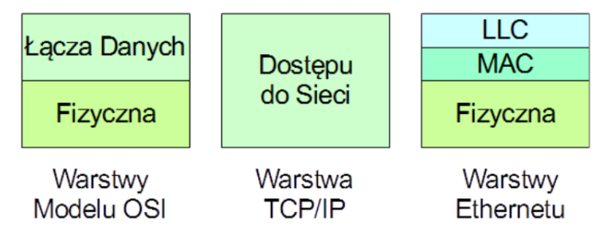

### Warstwa LLC
Jej najważniejszym zadaniem jest przekazanie informacji do docelowej maszyny odnośnie
tego jaki protokół powinien być użyty w warstwie transportowej. Umożliwia to poprawne
odczytanie przychodzącej wiadomości przez odbiorcę. Warstwa LLC dopisuje informacje o
protokole użytym w warstwie internetowej i o protokole, który powinien otrzymać
wiadomość. Pozwala to warstwie LLC na docelowym komputerze poprawnie dostarczyć
otrzymane datagramy. Zdefiniowana przez standard IEEE 802.2.
### Warstwa MAC
jest odpowiedzialna za tworzenie końcowej wiadomości ethernetowej, która będzie wysłana
przez sieć komputerową. Podobnie jak inne warstwy, warstwa MAC tworzy swój własny
nagłówek i dodaje go do wiadomości. Nagłówek zawiera adresy MAC nadawcy i odbiorcy,
czyli fizyczne adresy dwóch komunikujących się maszyn. Jeśli docelowa maszyna znajduje się
za routerem, w innej sieci, to pole adresu odbiorcy będzie miało wartość adresu
### MAC
routera. Adres MAC odbiorcy będzie zmieniony na inny przez router, kiedy będzie on
przetwarzał wiadomość.
Warstwa MAC dodaje również 4 kontrolne bajty CRC, które mogą być wykorzystane do
naprawienia uszkodzonej wiadomości.
Warstwa MAC dla sieci przewodowych jest zdefiniowana przez standard IEEE 802.3. Sieci
bezprzewodowe są zdefiniowane przez IEEE 802.11.
Warstwa Fizyczna
Warstwa fizyczna jest odpowiedzialna za przekształcanie wiadomości w (zależności od typu
sieci) impulsy elektryczne lub fale elektromagnetyczne oraz za transmitowanie ich przez sieć
fizyczna pomiędzy komunikującymi się maszynami. Jest zdefiniowana przez te same
specyfikacje co warstwa MAC, IEEE 802.3 i IEEE 802.11.

## 37. Cykle życia oprogramowania.

### Podstawowe czynności związane z tworzeniem oprogramowania:

- Określanie wymagań i specyfikacji,
- Projektowanie,
- Implementacja,
- Testowanie - walidacja(atestowanie) i weryfikacja
- Konserwacja (pielęgnacja)

### Podstawowe modele cyklu życia oprogramowania:

1. Kaskadowy (*waterfall*)


**Cechy:**
- Nie można przejśc do następnej fazy przed zakończneniem poprzedniej
- Błąd popełniony w początkowej fazie ma wpływ na całość
- model ten posiada bardzo nieelastaczny podział na kolejne fazy
- łatwy nadzór, dużo dokumentacji

2. Ewoulucyjny (np. Agile, Model Spiralny, Model Przyrostowy)

**Cechy:**
- adaptowanie systemu do zmian w wymaganiach i korygowanie popełnionych błędów
- turdne w nazdzorowaniu, wymaga dodatkowych strategii dla uporządkowania procesu wytwarzania oprogramowania

3. Model Komponentoway - Składanie systemu z gotowych komponentów.
4. Model Spiralny


**Cechy:**
- Można wykorzystac gotowe komponenty
- Faza oceny w każdym cyklu pozwala uniknąć błędów lub wczesniej je wykryć
- Cały czas istnieje możliwość rozwijania projektu

**Cykl życia oprogramowania** - Okres czasu rozpoczynający się kiedy pojawił się pomysł na oprogramowanie  


## 38. Proces testowania i jego rola w tworzeniu oprogramowania.

**Testowanie Oprogramowania** - Jest to proces związany z wytwarzaniem oprogramowania. Jest on jednym z procesów kontroli jakości oprogramowania.

### Cele testowania:
- Weryfikacja oprogramowania - testowanie zgodności systemu z wymaganiami.
- Walidacja (atestowanie) oprogramowania - ocena systemu lub komponentu podczas lub na końcu procesu jego rozwoju na zgodności z wyspecyfikowanymi wymaganiami.
- Testowanie umożliwia wykrycie błędów we wczesnych stadiach rozwoju oprogramowania co pozwala zmniejszyć koszty usuwania tego błędu.	

Podstawowym standardem dla testowania oprogramowania jest IEEE 829-1998 (829 Standard for Software Test Documentation).

Rodzaje testów:
- Testy funkcjonalne. Polegają one na tym, że wcielamy się w rolę użytkowaika, traktując oprogramowanie jak, czarną skrzynkę", która wykonuje określone zadania. Nie wnikamy w ogóle w techniczne szczegóły działania programu. Testy te często są nazywane **testami czarnej skrzynki**.
- Testy strukturalne. Tym razem tester ma dostęp do kodu źródłowego oprogramowania, może obserwować jak zachowują się różne częsci aplikacji, jakie moduły i biblioteki sa wykorzystywane w trakcje testu. Te testy czasami sa nzywane **testami białej skrzynki**
<br>

**Testy Manualne**
Testy wykonywane ręcznie przez testera, który przechodzi przez interfejs użytkownika zgodnie z określoną sekwencją kroków:
- testy integracyjne,
- testy systemowe dotyczą działania aplikacji jako całość

**Testy dopasowane do aktualnego zapotrzebowania/przeznaczenia**
- testy funkcjonalne - znane również jako testy czarnej skrzynki,
- testy regresyjne - sprawdzają wpływ nowych funkcjonalności na działanie systemu,
- testy akceptacyjne z udziałem klienta,
- testy dokumentacji, których celem jest wykrycie niespójności i niezgodności z dokumentacją,
- testy użyteczności, których celem jest weryfikacja interfejsu użytkownika

**Testy automatyczne**
Testy automatyczne skutecznie przyspieszają proces tworzenia testów systemowych, ich wykonywanie oraz analize, a tym samym pozwalają na wcześniejsze wykrycie i weliminowanie błędów w aplikacjach.

### Co podlega testowaniu?
- wydajności systemu,
- interfejsy,
- właśności operacyjne systemu,
- testy zużycia zasobów,
- zabezpieczenie systemu,
- przenaszalność oprogramowania,
- niezawodność oprogramowania,
- odtwarzalność oprogramowania,
- bezpieczeństwo oprogramowania,
- kompletność i jakość złożonych funkcji systemu

## 39. UML, jego struktura i przeznaczenie.

### Czym jest **UML**
**UML** - Unified Modeling Language jest to język modelowy używany między innymi w inżynierii
oprogramowania jako standardowy sposób wizualizacji projektu systemu.

### Historia
Do kreacji **UML** przyczyniła się potrzeba standaryzacji różnych systemów wizualizacji systemów
rozwiazywania problemów. Został zaproponowany przez Rational software w połowie lat 90-
tych.
<br>
W 1997 **UML** został zaimplementowany przez Object Management Group jako główny system
organizacji, co było punktem przełomowym w popularyzacji języka.
<br>
W 2005 **UML** zostało zaadoptowane do standardu ISO (International Operation of
Standardization) i od tamtego czasu przechodzi okresowe rewizje, w 2020 roku wprowadzono
specyfikacje wersji 2.5.1


### JAK TO DZIAŁA
**UML** to sposób wizualizacji architektury systemów za pomocą diagramu.
UML składa się ze standardowych elementów, które mają na celu przyspieszenie pracy.
Diagram posiada sposoby wizualizacji miedzy innymi:
- Wszelkich prac
- Indywidualnych komponentów i jak one wzajemnie na siebie działają
- Jak użytkownik może komunikować się z systemem
  
**UML** nie narzuca żadnego systemu pracy, ani żadnego systemu projektowania
oprogramowania. Jest jednak narzędziem, która wspomaga projektowanie tych systemów.<br>
W programowaniu, bardzo dobrze sprawdza się jako sposób wizualizacji jak ma działać
program opierający się na obiektach.


### STRUKTURA DIAGRAMU
Są różne systemy i **UML** stara się zaproponować wizualizacje każdego z nich za pomocą
różnych elementów, wyspecjalizowanych lub nie. Idea natomiast jest taka sama.<br>
Diagram składa się z zawsze z wizualizacji danego obiektu, oraz interakcji między nimi.
Z takich standardowych przykładów używania UML możemy wymienić reprezentację systemu
za pomocą bramek logicznych.
### KATEGORIE
**UML** 2 posiada wiele typów diagramów, które można podzielić na 2 typy :
1. **Strukturalne** pokazują układ obiektów, lub całych systemów i interakcje między innymi.


<br><br>

2. **Behawioralne** pokazują dynamiczne systemy, takie jak np algorytmy.

## 40. Podstawowe funkcje w zespole projektowym i ich role.

### Czym jest zespół projektowy?
Zespół projektowy jest to jednostka organizacyjna,
powołana na zasadzie specjalizacji przedmiotowej, realizująca projekt pod bezpośrednim nadzorem kierownika projektu.

### Czym jest Agile?
Grupa metod wytwarzania oprogramowania opartego na programowaniu iteracyjno-przyrostowym.
Najważniejszym założeniem metodyk zwinnych jest obserwacja, że wymagania odbiorcy
(klienta) często ewoluują
podczas trwania projektu. Pojęcie zwinnego programowania zostało zaproponowane w 2001 w
Manifeście Programowania Zwinnego.
### Manifest zwinnego programowania
„(...) Bardziej cenimy:<br>
**Ludzi** i **interakcje** od **procesów** i **narzędzi** **Działające**<br>
**oprogramowanie** od **szczegółowej**
**dokumentacji**<br>
**Współpracę z klientem** od **negocjacji** **umów** <br>
**Reagowanie na zmiany** od **realizacji założonego planu**.

Oznacza to, że elementy wypisane po prawej są wartościowe, ale większą wartość mają dla nas te, które wypisano po lewej.”

### SCRUM
Są to iteracyjne i przyrostowe ramy postępowania zgodne ze Scrum Guide.
Zgodnie z definicją ze Scrum Guide’a w obręb Scruma wchodzą: Zespoły Scrumowe oraz związane z nimi role,
wydarzenia, artefakty i reguły.
- ROLE: DEWELOPERZY + PRODUCT OWNER = ZESPÓŁ SCRUMOWY + SCRUM MASTER
- WYDARZENIA: PLANOWANIE SPRINTU + CODZIENNY SCRUM + PRZEGLĄD SPRINTU + RETROSPEKTYWA = SPRINT
- ARTEFAKTY: BACKLOG PRODUKTU + BACKLOG SPRINTU + PRZYROST
- REGUŁY: PRZEJRZYSTOŚĆ + INSPEKCJA + ADAPTACJA

### SCRUM - ROLE
ROLE: DEWELOPERZY + PRODUCT OWNER + SCRUM
MASTER = ZESPÓŁ SCRUMOWY
Deweloperzy, czyli zespół składający się z 3 9 osób z np.testera, analityka, webdewelopera, programisty
dowolnego języka. Odpowiadają za sposób wykonania zadań. W zespole wszyscy powinni być równi.
Product Owner odpowiada za wybór zadań do wykonania. Product Owner to osoba reprezentująca klienta ,
ciało jednoosobowe, jedyne, które może zlecać zadania zespołowi, dlatego bardzo ważne jest wsparcie jego roli
w organizacji.
Scrum Master czuwa nad tym, aby przebieg prac był zgodny z zasadami Scruma i ustalonymi przez zespół.
Osoba ta odpowiedzialna jest za usuwanie wszelkich przeszkód uniemożliwiających zespołowi wykonanie
zadania.

### SCRUM - WYDARZENIA
WYDARZENIA:
<br> PLANOWANIE SPRINTU
<br> CODZIENNY SCRUM + 
<br>PRZEGLĄD SPRINTU +
<br> RETROSPEKTYWA =
<br> SPRINT
<br>
- **Planowanie Sprintu** , służy ustaleniu na samym początku Sprintu, nad czym Zespół będzie pracował, w jaki sposób i dla
jakiego celu. Pieczę nad postępem pracy Zespół zapewnia sobie, organizując 
- **Codzienny Scrum** , czyli miniplanowania, które
służą codziennej weryfikacji stanu prac i ewentualnym korektom zaplanowanych zadań. 
- Na koniec Sprintu Zespół przedstawia
swoje dokonania Product Ownerowi i interesariuszom w czasie **Przeglądu Sprintu**
- Zaraz po tym weryfikuje swój sposób
pracy i wprowadza ulepszenia w czasie **Retrospektywy** .

### SCRUM - ARTEFAKTY
ARTEFAKTY: BACKLOG PRODUKTU + BACKLOG SPRINTU + PRZYROST
<br>Backlog Produktu to uporządkowana lista wszystkich rodzajów zadań potrzebnych do rozwoju, utrzymania i naprawy produktu.
Lista ta jest otwarta dla wszystkich w organizacji, natomiast Product Owner ma ostateczne słowo co do treści, wyglądu i
zawartości Backlogu. To jest jego narzędzie pracy nad produktem.
Backlog Sprintu to analogiczne narzędzie, ale dla Zespołu Deweloperskiego, który dzięki temu artefaktowi w pełni panuje nad
pracami zaplanowanymi na Sprint.
Przyrost to ukończona przez Zespół zgodnie z Definicją Ukończenia praca na koniec każdego i wszystkich razem Sprintów.

### SCRUM - REGUŁY
REGUŁY: PRZEJRZYSTOŚĆ + INSPEKCJA + ADAPTACJA
<br> Przejrzystość zapewnia Zespowi Scrumowemu i wszystkim w organizacji dostęp do całości prac i takie samo rozumienie
każdego elementu Scruma. Dzięki temu nie ma niejasności i nieporozumień.
Inspekcja pozwala na bieżące monitorowanie i weryfikowanie przedmiotu pracy i sposobu pracy Zespołu.
Adaptacja powinna być wynikiem Inspekcji i prowadzić do niezbędnych zmian naprowadzających Zespół na właściwy tor
pracy.## 41. Pojęcie Maszyny Turinga - idea pracy automatu, hipoteza Churcha-Turinga

### **Definicja**

**Maszyna Turinga** - stworzona przez *Alana Turinga* prosta maszyna logiczna (licząca) służąca do wykonywania algorytmów. Wszystkie
współczesne komputery dają się do niej sprowadzić. *Problem jest rozwiązalny na komputerze, jeśli da
się zdefiniować rozwiązującą go maszynę Turinga.*

**Maszyna Turinga zbudowana jest z trzech głównych elementów:**
<ul>
    <li>Nieskończnoej taśmy zawierającej komórki z przetwarzanymi symbolami</li>
    <li>Ruchomej głowicy odczytującej i zapisującej </li>
    <li>Bloku sterowania głowicą.</li>
</ul>

**Taśma**

*Nieskończona taśma* jest odpowiednikiem współczesnej pamięci komputera. Taśma dzieli się na komórki, w których umieszczone zostały znaki przetwarzane przez maszynę Turinga. Symbole te stanowią odpowiednik danych wejściowych. Maszyna Turinga odczytuje te dane z kolejnych komórek i przetwarza na inne symbole, czyli dane wyjściowe. Wyniki obliczeń również są zapisywane w komórkach taśmy.


Można definiować różne symbole dla maszyny Turinga. Najczęściej rozważa się jedynie symbole 0, 1 oraz tzw. *znak pusty* - czyli zawartość komórki, która nie zawiera żadnej danej do przetworzenia.  Wbrew pozorom taki prymitywny zbiór trzech symboli jest równoważny logicznie dowolnemu innemu zbiorowi

**Głowica**

Aby przetwarzać dane, maszyna Turinga musi je odczytywać i zapisywać na taśmę. Do tego celu przeznaczona jest właśnie głowica zapisująco-odczytująca, która odpowiada funkcjonalnie urządzeniom wejścia/wyjścia współczesnych komputerów lub układom odczytu i zapisu pamięci.

Głowica zawsze znajduje się nad jedną z komórek taśmy. Może ona odczytywać zawartość tej komórki oraz zapisywać do niej inny symbol - na tej zasadzie odbywa się przetwarzanie danych - z jednych symboli otrzymujemy inne. Oprócz odczytywania i zapisywania symboli w komórkach głowica wykonuje ruchy w prawo i w lewo do sąsiednich komórek na taśmie. W ten sposób może się ona przemieścić do dowolnie wybranej komórki taśmy.

Przed rozpoczęciem pracy maszyny Turinga głowica jest zawsze ustawiana nad komórką taśmy zawierającą pierwszy symbol do przetworzenia. W klatce taśmy po lewo jest zapisany specjalny znak, tzw. *lewy ogranicznik*. Jeżeli głowica znajduje się nad lewym ogranicznikiem, to nie może go zamazać ani przesunąć się na lewo od niego. Po zakończeniu danych wejściowych taśma wypełniona jest w nieskończoność specjalnymi pustymi symbolami, tzw. *blank'ami*.

**Układ Starowania**

Przetwarzaniem informacji zarządza układ sterowania głowicą. Jego współczesnym odpowiednikiem jest procesor komputera. Układ ten odczytuje za pomocą głowicy symbole z komórek taśmy oraz przesyła do głowicy symbole do zapisu w komórkach. Dodatkowo nakazuje on głowicy przemieścić się do sąsiedniej komórki w lewo lub w prawo.

Podstawą działania maszyny Turinga są *stany układu sterowania. Stan układu sterowania określa jednoznacznie jaką operację wykona, jak zareaguje maszyna Turinga, gdy odczyta z taśmy określony symbol.*

Zatem operacje wykonywane przez układ sterowania zależą od dwóch czynników:
<ul>
    <li>Symbolu odczytanego z komórki na taśmie </li>
    <li>Bieżącego stanu układu sterującego </li>
</ul>

Stany będziemy określać kolejnymi nazwami: q0, q1, q2, ... ,qn, gdzie q0 jest stanem początkowym, w którym znajduje się maszyna Turinga przed rozpoczęciem przetwarzania symboli na taśmie.

Instrukcją dla maszyny Turinga jest następująca piątka symboli:


S<sub>0</sub> i q<sub>i</sub> są tzw. **częścią identyfikacyjną instrukcji**. Maszyna Turinga wykonuje tyle różnych instrukcji, ile zdefiniujemy części identyfikacyjnych - w programie nie może być dwóch różnych instrukcji o identycznej części identyfikacyjnej.

S<sub>z</sub>, q<sub>j</sub> i L/P są tzw. **częścią operacyjną**, która określa jakie działanie podejmuje dana instrukcja. Części operacyjne różnych instrukcji mogą być takie same - oznacza to jedynie, iż instrukcje te wykonują dokładnie to samo działanie.

**Przyklad instrukcji**
$$  (A,q_{0},B,q_{0},\bf R)
$$
Jeżeli odczytanym przez głowicę symbolem z taśmy będzie symbol *A*, a układ sterowania znajduje się w stanie *q<sub>0</sub>*, to głowica zamieni ten symbol na *B*, stan wewnętrzny nie zmieni się (pozostanie dalej *q<sub>0</sub>*), a głowica przesunie się do sąsiedniej komórki po prawej stronie.

### **Hipoteza Churcha-Turinga**
**Formalna Definicja**

*Każdy problem, który może być intuicyjnie uznany za obliczalny, jest rozwiązywalny przez maszynę Turinga.*

Sformułowanie *"intuicyjnie uznany za obliczalny"* uniemożliwia przeprowadzenie matematycznego dowodu tej hipotezy.

**Bardziej praktyczna definicja**

*Każdy problem, dla którego przy
nieograniczonej pamięci oraz zasobach istnieje efektywny algorytm
jego rozwiązywania, da się rozwiązać na maszynie Turinga*

**Trzecie równoważne sformułowanie**

*Każdy nieinteraktywny program może być zredukowany do rozwiązującej go maszyny Turinga, a ta może być wyrażona w każdym <a href="https://pl.wikipedia.org/wiki/Kompletno%C5%9B%C4%87_Turinga">zupełnym w sensie Turinga </a> języku programowania.*

 Dlatego równoważne sformułowanie tej hipotezy mówi, że każdy istniejący algorytm można wyrazić w każdym zupełnym języku programowania.

### **Zapis Formalny MT**

$$ 
  {\bf MT} = <Q,{\scriptstyle\sum},Г,s,b,F,\delta>
$$

> $$Q\; - \;skończony\; zbiór\; stanów\; (q_{0} -stan\; początkowy),$$
> $$ {\scriptstyle\sum} \; - \; skończony \; zbiór \; symboli \; wejściowych $$
> $$Г \supseteq {\scriptstyle\sum}\: - skończony \; zbiór \; dopuszczalnych \; symboli, $$
>$$s\; є\; Q\; - \;stan\; początkowy$$
>$$ b \; є \; Г \; \backslash \; {\scriptstyle\sum} \; - \; symbol\; pusty$$
>$$ F \subseteq Q - zbiór\; stanów\; końcowych$$
>$$\delta: Q\timesГ\longrightarrow Q\times (Г\times \{L,R,S\}) - funkcja \; częściowa, \:zwana \\
funkcją \; przejść, gdzie\; {\boldsymbol k} \; jest \; liczbą \; taśm, {\boldsymbol L}\; to \; przesunięcie \\
w \; lewo \;, {\boldsymbol R}\; przesunięcie\; w\; prawo,\; a \;{\boldsymbol S}\; to \; brak \; przesunięcia.  

## 42. Usługa translacji adresów w sieci TCP/IP.

### **Definicja Formalna**

**Translacja Adresów Sieciowych (Network Adress Translation, NAT)** - technika przesyłania ruchu sieciowego poprzez router, która wiąże się ze zmianą źródłowych lub docelowych adresów IP, zwykle również numerów portów TCP/UDP pakietów IP podczas ich przepływu. Zmieniane są także sumy kontrolne (zarówno w pakiecie IP, jak i w segmencie TCP/UDP), aby potwierdzić wprowadzone zmiany.

**Alternatywna Definicja**

*NAT* jest procesem modyfikującym informację o adresie IP w nagłówku pakietu IP, w momencie przesyłania ruchu przez urządzenie sieciowe. W większości konfiguracji, NAT podmienia prywatne adresy wewnątrz sieci na adresy IP publiczne, udostępniane przez dostawcę usługi dostępu do internetu. Taki zabieg pozwala komputerom w sieci domowej czy firmowej współdzielić połączenie internetowe. Dodatkowo, uzyskuje się zwiększony poziom bezpieczeństwa sieci, ponieważ dostęp do sieci wewnętrznej z zewnątrz jest mocno ograniczony.

**Dwa podstawowe typy NAT:**
<ul>
<li>
<span style="font-weight:bold">SNAT</span>  (Source Network Address Translation)  to technika polegająca na zmianie adresu źródłowego pakietu IP na jakiś inny. Stosowana często w przypadku podłączenia sieci dysponującej adresami prywatnymi do sieci Internet. Wtedy router, przez który podłączono sieć, podmienia adres źródłowy prywatny na adres publiczny (najczęściej swój własny).
</li>
<li>
<span style="font-weight:bold">DNAT</span> (Destination Network Address Translation) - to technika polegająca na zmianie adresu docelowego pakietu IP na jakiś inny. Stosowana często w przypadku, gdy serwer, który ma być dostępny z Internetu ma tylko adres prywatny. W tym przypadku router dokonuje translacji adresu docelowego pakietów IP z Internetu na adres tego serwera.
</li>
</ul>


**Wyróżniamy trzy rodzaje SNAT:**
<ul>
<li>
<span style="font-weight:bold">Statyczny NAT:</span> Udostępnia odzorowanie 1-1 między adresami zewnętrznymi a adresami lokalnymi (czyli każdy komputer lokalny ma swoje IP, a serwer tylko pośredniczy w przekazywaniu pakietów).
Takie stałe mapowanie jest najbardziej odpowiednie dla hostów, które muszą być dostępne poza siecią. Jest to najbardziej odpowiednie do zapewnienia dostępu do serwerów takich jak serwery poczty elektronicznej i serwery internetowe.
</li>

<li>
<span style="font-weight:bold">Dynamiczny NAT:</span> Serwer dysponuje pulą adresów IP, które przyporządkowuje lokalnym jednostkom dynamiczne w odpowiedzi na ich żądania skierowane do sieci zewnętrznej
</li>
<li>
<span style="font-weight:bold">PAT: Port address translation -</span>  jest jednym z najczęściej używanych systemów NAT. Wiele połączeń z różnych wewnętrznych hostów jest multipleksowane w celu utworzenia jednego publicznego adresu IP, który wykorzystuje różne numery portów źródłowych. Maksymalnie 65 536 połączeń wewnętrznych można przetłumaczyć na jeden publiczny adres IP. Sprawia to, że jest on bardzo skuteczny w sytuacjach, gdy dostawca usług przydzielił tylko jeden publiczny adres IP.
</li>
</ul>
Kiedy komputer z sieci lokalnej wysyła zapytanie do sieci, urządzenie NAT zmienia adres nadawcy pakietu (i czasem numer portu) na publiczny adres IP.

W momencie, gdy wraca do nas odpowiedź na ten pakiet urządzenie NAT przypisuje pakietowi odpowiedni adres lokalnego węzła. Odwzorowania między pakietami a adresami zapamietywane są w tablicy translacji NAT.

**Przyklady działania SNAT`U**

*Wysyłanie request`u przez (Statyczny/Dynamiczny SNAT):*


*Otrzymanie odpowiedzi przy (Statycznym/Dynamicznym SNAT):*


*Otrzymanie odpowiedzi z wlączanym PAT:*

## 43. Mechanizm trasowania (ang. routing) pakietów w Internecie.

### **Ogółne pojęcie**

**Trasowanie (Routing)** - to mechanizm wyznaczania trasy i przesyłania pakietów
danych w intersieci, od stacji nadawczej do stacji odbiorczej. 

**Intersieć** - to minimum dwie
sieci fizyczne połączone ze sobą za pomocą routera. 

Trasowaniem zajmuje się urządzenie zwane routerem: może to być zwykły komputer
jak i urządzenie specjalnie dedykowane tylko do tego zadania, tzw. *router sprzętowy*.

Trasowanie umożliwia danym z jednej sieci lokalnej dotrzeć do innej sieci lokalnej,
która może znajdować się w dowolnym miejscu na świecie. Trasa może prowadzić przez
wiele sieci pośrednich, tak więc routing jest jakby *spoiwem łączącym Internet w całość*. Bez
routowania cały ruch danych byłby ograniczony do jednej fizycznej sieci.

**UWAGA**

*Trasowanie realizowane jest w **warstwie trzeciej (sieciowej)** modelu OSI*.
Wyznaczane trasy pakietów danych musza być jak **najbardziej optymalne** – czyli
możliwie najszybsze, ale umożliwiające dostarczenie wszystkich pakietów.

### **Troche bardziej szczegółowo o pakietach**
**Pakiet**  to jednostka informacji, której źródłem i przeznaczeniem jest warstwa *Sieciowa
(warstwa 3)* modelu OSI. Pakiet składa się z trzech elementów:
<ul>
<li>
   <span style="font-weight:bold">Nagłówka</span> warstwy Sieciowej, 
</li>
<li>
<span style="font-weight:bold">Danych</span> warstwy wyższej,
</li>
<li>
<span style="font-weight:bold">Końcówki</span> warstwy Sieciowej.
</li>
</ul>

Nagłówek i końcówka zawierają informację sterującą przeznaczoną dla warstwy 3 w stacji
odbiorczej. Można powiedzieć, że dane z wyższej warstwy są otoczone (kapsułkowane) przez
nagłówek i końcówkę warstwy 3.

**Datagram** jest jednostką informacji, której źródłem i przeznaczeniem jest warstwa
Sieciowa (warstwa 3) modelu OSI, używająca bezpołączeniowej obsługi sieci. Pakiet
(połączeniowa obsługa sieci) = datagram (bezpołączeniowa)

**Etapy trasowania:**
<ol>
<li> 
    Host generuje pakiety i decyduje, czy dostarczyć je bezpośrednio do adresata, czy
przesłać do routera. 
</li>
<li>
    Obowiązkiem routera przy przekazywaniu pakietu dalej do celu jest obniżenie o jeden
wartości TTL (ang. Time To Live, czas życia). Datagram IP, który trafia do routera z wartością 1 (a zostanie ona zmniejszona na tym routerze do 0) w polu TTL zostanie
utracony, a do źródła router odsyła data gram ICMP z kodem TTL Exceeded. 
</li>
<li>
Router decyduje, czy przesłać pakiety bezpośrednio do adresata, czy do routera
pośredniczącego (i ew. do którego routera, gdy jest ich kilka). 
</li>
</ol>

**Tablica Routingu**

Router przechowuje tzw. **tablicę routingu**, dzięki której wie, jak kierować ruchem.
Najważniejsze informacje zawarte w tablicy to adresy sąsiednich routerów i adresy sieci
docelowych. 
<table align="center">
    <thead>
        <tr>
            <th>Aby dotrzeć do sieci</th>
            <th>Wyślij do urządzenia o adresie</th>
        </tr>
    </thead>
    <tbody>
        <tr>
            <td>10.1.1.0</td>
            <td>10.1.2.2</td>
        </tr>
        <tr><td>10.1.2.0</td>
        <td>10.1.2.2 </td>
        </tr>
        <tr>
        <td>10.1.3.0</td>
        <td>Bezpośrednio połączony</td>
        </tr>
    </tbody>
</table>

Oprócz tego w tablicy mogą się też znaleźć informacje o **całościowym koszcie (metryce)** wysłania daną trasą pakietu (jest to pewna liczba przypisana trasie przez protokoły
routingu), **nazwy czy adresy interfejsów sieciowych**, przez które dany pakiet jest kierowany
do sieci, **flagi** opisujące właściwości danej ścieżki (H - ścieżka do konkretnego komputera, a
nie np. do kolejnego routera, U – ścieżka jest drożna i działa bez problemów), **licznik**
określający czas, jaki upłynął od ostatniego uaktualnienia informacji o trasie. 

Pakiet danych przechodzi pomiędzy kolejnymi sieciami. Takie kolejne przejście
nazywane jest **przeskokiem** lub **hop-em**. Tablica routingu zawarta w routerze lub w
komputerze sieciowym zawiera właśnie przyporządkowania adresów **dotyczące jednego
hopu!** 


### **Routing Statyczny i Dynamiczny**

*Pod względem sposobu wypełniania danymi tych tablic, dzielimy routing na statyczny
i dynamiczny.*

**Statyczny** - administrator ręcznie wpisuje wszystkie adresy to tablicy routingu.
Najprostszą formą budowania informacji o topologii sieci są ręcznie podane przez
administratora trasy definiujące routing statyczny. Przy tworzeniu takiej trasy wymagane jest
jedynie podanie adresu sieci docelowej, interfejsu, przez który pakiet ma zostać wysłany oraz
adresu IP następnego routera na trasie. 

**Zalety**
<ul>
<li>Router przesyła pakiety przez z góry ustalone interfejsy bez konieczności
każdorazowego obliczania tras, co zmniejsza zajętość cykli procesora i pamięci. 
</li>
<li>
Informacja statyczna nie jest narażona na deformację spowodowaną zanikiem
działania dynamicznego routingu na routerach sąsiednich. 
</li>
<li>
Dodatkowo zmniejsza się zajętość pasma transmisji, gdyż nie są rozsyłane pakiety
rozgłoszeniowe protokołów routingu dynamicznego
</li>
<li>
Dla małych sieci jest to doskonałe rozwiązanie, ponieważ nie musimy posiadać
zaawansowanych technologicznie i rozbudowanych sprzętowo routerów.
</li>
<li>
Routing statyczny zapewnia również konfigurację tras domyślnych, nazywanych
<i>bramkami ostatniej szansy (gateway of the last resort).</i> Jeżeli router uzna, iż żadna
pozycja w tablicy routingu nie odpowiada poszukiwanemu adresowi sieci docelowej,
korzysta ze statycznego wpisu, który spowoduje odesłanie pakietu w inne miejsce
sieci.) 
</li>
</ul>

**Wady**
<ul>
<li>
Routing statyczny wymaga jednak od administratora sporego nakładu pracy w
początkowej fazie konfiguracji sieci. 
</li>
<li>
Nie jest również w stanie reagować na awarie poszczególnych tras. 
</li>
</ul>

**Dynamiczny** - routery samodzielnie zbierają informacje i aktualizują zapisy w tablicy.

Ponieważ statyczne systemy trasowania nie mogą reagować na zmiany w sieci, to
generalnie nie są one przydatne do stosowania w sieciach dużych, gdzie zmiany następują
praktycznie ciągle. Dlatego większość obecnie stosowanych algorytmów trasowania to
algorytmy dynamiczne, dostosowujące się do zmiennych warunków występujących w sieci,
na drodze analizy aktualizujących komunikatów trasowania. W wypadku, gdy aktualizujący
komunikat trasowania wskazuje, że w sieci wystąpiły zmiany, oprogramowanie trasujące
ponownie oblicza trasy i wysyła do routerów nowe komunikaty aktualizujące. W ślad za tym
komunikaty, przenikając przez sieć, stymulują routery do uruchomienia algorytmów
trasowania i zmieniają ich tablice trasowania.  

Protokoły trasowania dynamicznego są wykorzystywane przez routery do pełnienia
trzech podstawowych funkcji: 
<ul>
<li> Wyszukiwania nowych tras</li>
<li> Przekazywania do innych routerów informacji o znalezionych trasach </li>
<li> Przesyłania pakietów za pomocą owych routerów. 
</li>
</ul>

### **Kategorie protokołów trasowania**

**Podział protokołów:**
<ul>
<li>
    Podział ze względu na charakter wymienianych informacji:
    <ul>
    <li>
    Protokoły wektora odległości (lub dystans - wektor)
    </li>
    <li>Protokoły stanu łącza </li>
    <li>Hybrydowe</li>
    </ul>
    <li>
    Podział ze względu na obszary zastosowań:
    <ul>
    <li>Protokoły wewnętrzne </li>
    <li>Protokoły zewnętrzne </li>
    </ul>
    </li>
</li>
</ul>

**Protokoły wektora odległości:**

Trasowanie może być oparte na algorytmach wektora odległości (nazywanych również
<a href="https://pl.wikipedia.org/wiki/Algorytm_Bellmana-Forda">algorytmami Bellmana-Forda</a>). Nazwa pochodzi stąd, iż poszczególne routery prezentowane
są jako wektory zawierające dwie informacje: dystans oraz wektor wyznaczający kierunek.
**Dystans** opisuje całkowity koszt/metrykę danej trasy i wyrażany jest za pomocą pewnej
liczby, natomiast **Kierunek** definiowany jest poprzez adres następnego skoku. 

*<u>Etapy działania protokołu:</u>*
<ol>
<li>
Przy starcie router tworzy tablicę routingu zawierająca informacje tylko o jego
bezpośrednich sąsiadach i kosztach/metrykach dotarcia do nich. 
</li>
<li>
Wysyła tą tablicę tylko do swoich sąsiadów, którzy uzupełniają swoje tablice
routingu o informacje, które pozyskali z tej właśnie przysłanej.
</li>
</ol>

Router nie widzi poza swojego sąsiada i informacje o innych sieciach,
nieprzyłączonych do niego bezpośrednio, uzyskuje tylko dzięki nim. Nazywa się to
**routingiem przez plotkowanie**.


### Zalety:
<ul>
<li>
Protokoły wektora odległości są łatwe w konfiguracji i bardzo dobrze nadają się do
zastosowania w małych sieciach. 
</li>
</ul>

### Wady:
<ul>
<li>
Niestety, jednym z ich podstawowych problemów jest tzw. <b>zbieżność</b>, czyli powolne
reagowanie na zmiany zachodzące w topologii sieci, na przykład wyłączenie lub
włączenie pewnych segmentów - zerwanie łącza zostaje odzwierciedlone w tabelach
routingu poszczególnych routerów dopiero po pewnym czasie. Czas, po którym
wszystkie routery mają spójne i uaktualnione tabele routingu nazywany jest <b>czasem
zbieżności</b>.
</li>
<li>
Kolejną wadą protokołów wektora odległości jest generowanie dodatkowego ruchu w
sieci poprzez cykliczne rozgłaszanie pełnych tabel routingu, nawet wówczas, gdy w
topologii sieci nie zachodzą żadne zmiany. 
</li>
<li>
Protokoły tej grupy nie są też odporne na powstawanie pętli między routerami
(zarówno między bezpośrednimi sąsiadami, jak i pętli rozległych), co skutkuje
wzajemnym odsyłaniem sobie pakietów z informacją o tej samej sieci. 
</li>
</ul>

**Przykładowe protokoły: *RIP, EBGP*.**

### **Trasowanie na podstawie stanu łącza**

Algorytmy trasowania na podstawie stanu łącza, ogólnie określane jako protokoły
"<u>najpierw najkrótsza ścieżka</u>" (ang. <a href="https://pl.wikipedia.org/wiki/Open_Shortest_Path_First">SPF shortest path first</a>), utrzymują złożoną bazę danych
opisującą topologię sieci. W odróżnieniu od protokołów wektora odległości, *protokoły stanu
łącza zbierają i przechowują pełną informację na temat routerów sieci, a także o sposobie ich
połączenia.*

W protokołach stanu łącza każdy router przechowuje kompletną bazę danych o
topologii sieci z informacjami o koszcie pojedynczych ścieżek w obrębie sieci oraz o stanie
połączeń. Informacje te kompletowane są *poprzez rozsyłanie tzw. pakietów LSA (Link-State
Advertisement) o stanie łączy*.

### *<u>Etapy działania protokołu:</u>*
<ol>
<li>
Każdy router wysyła informację o bezpośrednio do niego podłączonych
sieciach oraz o ich stanie (włączone lub wyłączone). 
</li>
<li>
Dane te są następnie rozsyłane od routera do routera, każdy router pośredni
zapisuje u siebie kopię pakietów LSA, ale nigdy ich nie zmienia. 
</li>
<li>
Po pewnym czasie (czasie zbieżności) każdy router ma identyczną bazę danych
o topologii (czyli mapę sieci) i na jej podstawie tworzy drzewo najkrótszych
ścieżek SPF (shortest path first) do poszczególnych sieci.
</li>
<li>
Router zawsze umieszcza siebie w centrum (korzeniu) tego drzewa, a ścieżka
wybierana jest na podstawie kosztu dotarcia do docelowej sieci - najkrótsza
trasa nie musi pokrywać się z trasą o najmniejszej liczbie skoków. Do
wyznaczenia drzewa najkrótszych ścieżek stosowany jest <i><a href="https://pl.wikipedia.org/wiki/Algorytm_Dijkstry"> algorytm E.W.
Dijkstry. </a></i>
</li>
</ol>

### Zalety:
<ul>
<li>Reagowanie na zmiany w topologii sieci. Po zmianie stanu łącza router generuje nowy
pakiet LSA, który rozsyłany jest od routera do routera, a każdy router otrzymujący ten
pakiet musi przeliczyć od nowa drzewo najkrótszych ścieżek i na jego podstawie
zaktualizować tabelę routingu. </li>
<li>Protokoły stanu łącza nazywane są też protokołami "cichymi", ponieważ w
przeciwieństwie do protokołów wektora odległości nie rozsyłają cyklicznych
ogłoszeń, a dodatkowy ruch generują tylko przy zmianie stanu łącza. Ze względu na
sposób działania i swoje cechy protokoły stanu łącza przeznaczone są do obsługi
znacznie większych sieci niż protokoły wektora odległości. 
 </li>
</ul>

### Wady
<ul>
<li>Do wad protokołów stanu łącza zaliczyć można zwiększone zapotrzebowanie na
pasmo transmisji w początkowej fazie ich działania (zanim "ucichną"), gdy routery
rozsyłają między sobą pakiety LSA. Wspomniane obniżenie wydajności ma charakter
przejściowy, ale jest niestety mocno odczuwalne.  </li>
<li>Dodatkowo ze względu na złożoność obliczeń drzewa SPF, protokoły stanu łącza mają
zwiększone wymagania dotyczące procesora i pamięci RAM routera (zwłaszcza przy
większych sieciach). Z tego powodu routery skonfigurowane do obsługi trasowania na
postawie stanu łącza są stosunkowo drogie. Typowym przedstawicielem tej grupy
protokołów jest *OSPF (Open Shortest Path First)* </li>
</ul>

**Przykładowe protokoły: OSPF, IS-IS, IDRP**

### **Hybrydowe Trasowanie**
Ostatnią formą trasowania dynamicznego jest praca *hybrydowa*. Choć istnieją "otwarte"
zrównoważone protokoły hybrydowe, ta forma trasowania jest niemal całkowicie związana
z zastrzeżonym produktem jednej firmy Cisco Systems, Inc. Protokół o nazwie <b>EIGRP</b> (ang.
<a href="https://pl.wikipedia.org/wiki/Enhanced_Interior_Gateway_Routing_Protocol">Enhanced Interior Gateway Routing Protocol</a>) został zaprojektowany z zamiarem połączenia
najlepszych cech protokołów opartych na wektorze odległości i stanie łącza, przy
jednoczesnym ominięciu ich ograniczeń wydajności i innych wad. 

### **Protokoły wewnetrzne i zewnętrzne**

**Potrzebna informacja:**

<b>System autonomiczny</b> – grupa sieci i routerów pod wspólną administracją
(korporacje, uczelnie). Routery wewnątrz systemu autonomicznego dowolnie zarządzają
trasami. Każdy system autonomiczny wybiera router lub routery przeznaczone do
komunikacji z innymi systemami autonomicznymi. Odpowiadają one za przekazywanie
informacji o osiągalności sieci wewnątrz „swojego” systemu do innych systemów. 

Routery odpowiedzialne za komunikację z innymi systemami autonomicznymi
nazywane są routerami zewnętrznymi albo brzegowymi (exterior gateways), routery
działające wewnątrz systemu – wewnętrznymi (interior gateways). 

**Zewnętrzne:**

*EGP(Exterior Gateway Protocol)*
<ul>
<li>Router może uzgodnić z innym routerem, że będą „sąsiadami”, tzn. będą wymieniać
informacje o trasach. </li>
<li>Router sprawdza co jakiś czas czy jego sąsiedzi działają. </li>
<li>Sąsiedzi wymieniają komunikaty pozwalające zaktualizować tablice routingu.
Komunikat taki zawiera listę znanych danemu routerowi sieci i odległości do nich</li>
</ul>

*Inny protokoł tego typu: (E) BGP (Exterior Border Gateway Protocol)*

**Wewnętrzne:**

Grupę protokołów używanych przez routery wewnątrz systemu autonomicznego
określa się nazwą *IGP (Interior Gateway Protocols)*

### Pzykładowe protokoły z tej grupy:
<ul> 
<li> 
   <b> RIP</b>
</li>
<li>HELLO</li>
<li>OSPF</li>
</ul>

### RIP - Routing Information Protocol
<ul>
<li>
Implementacja algorytmu wektor-odległość dla sieci lokalnych
</li>
<li>
 Odległość mierzona jako <i>„hop count”</i>
</li>
<li>
Liczba routerów między rozważanymi sieciami
</li>
<li>Przeznaczony dla niewielkich sieci – <i>odległość 16 traktowana jest jako
nieskończoność </i>
</li>
</ul>

### HELLO
<ul>
<li>
Protokół bazujący na algorytmie „wektor odległość”
</li>
<li>
Do oceny odległości używa <u>opóźnień</u> (tj. czasu potrzebnego na dostarczenie
komunikatu za pośrednictwem sieci), a nie liczby routerów pośredniczących 
</li>
</ul>

### **Miary trasowania**
W jaki sposób algorytmy trasowania decydują o tym, że jedna trasa jest preferowana bardziej
niż inna?
Rozróżnia się obecnie następujące miary trasowania:
<ul>
<li>długość ścieżki</li>
<li>niezawodność </li>
<li>opóźnienie </li>
<li>szerokość pasma </li>
<li>obciążenie </li>
<li>koszt komunikacji</li>
</ul>

<b>Długość ściężki</b> jest najczęściej używaną miarą trasowania. Niektóre protokoły trasowania
zezwalają administratorowi sieci na arbitralne przypisywanie kosztów każdemu łączu
sieciowemu. W takim wypadku koszt ścieżki jest sumą kosztów związanych z każdym łączem
składającym się na ścieżkę. Inne protokoły trasowania natomiast używają miary hop count,
rozumianej jako liczba przejść pakietu przez urządzenia intersieciowe - np. routery - od stacji
nadawczej do stacji odbiorczej.

<b>Niezawodność</b>, w kontekście algorytmów trasowania, odnosi się do skuteczności każdego
łącza (określanego liczbą przekłamanych bitów). Niektóre łącza mogą ulegać uszkodzeniom
częściej od innych. Po uszkodzeniu sieci niektóre łącza można naprawić szybciej i prościej
niż inne. 

<b>Opóźnienie</b> trasowania oznacza czas potrzebny do przesłania pakietu od stacji nadawczej do
stacji odbiorczej w intersieci. 

<b>Szerokość pasma</b> odnosi się do dostępnej pojemności ruchu w określonym łączu

<b>Obciążenie </b>to stopień zajętości zasobu sieciowego, np. routera. Obciążenie zależy od wielu
czynników, np. stopnia wykorzystania procesora czy liczby pakietów przetwarzanych w
czasie jednej sekundy. 

<b> Koszt komunikacji </b> jest ważną miarą trasowania, przede wszystkim dlatego, że niektóre
firmy nie dbają o wydajność. Nawet wtedy, gdy opóźnienia są duże, przesyłają pakiety przez
własne linie zamiast korzystać z sieci publicznych, za które się płaci tylko w czasie ich
używania. 


## 44. Usługi nazewnicze sieci TCP/IP.

**Ogółny Zarys**

*Usługi nazewnicze* wykorzystywane są do dystrybuowania informacji. One tłumaczą nazwy hostów na adresy IP. Internetowym standardem jest DNS, ale w pewnych sytuacjach wykorzystywane są NIS i WINS.

**DNS**(ang. Domain Name System, system nazw domenowych) to system serwerów oraz protokół komunikacyjny zapewniający zamianę adresów znanych użytkownikom Internetu na adresy zrozumiałe dla urządzeń tworzących sieć komputerową. Dzięki wykorzystaniu DNS nazwa mnemoniczna, np. pl.wikipedia.org, może zostać zamieniona na odpowiadający jej adres IP, czyli 145.97.39.135.

Adresy DNS składają się z domen internetowych rozdzielonych kropkami. Dla przykładu w adresie Wikipedii *org* oznacza domenę funkcjonalną organizacji, wikipedia domenę należącądo fundacji Wikimedia, a *pl* polską domenę w sieci tej instytucji. W ten sposób możliwe jest budowanie hierarchii nazw, które porządkują Internet. 

**Strona Techniczna**

Podstawą technicznego systemu DNS jest ogólnoświatowa sieć serwerów przechowujących informacje na temat adresów domen. Każdy wpis zawiera nazwę oraz odpowiadającą jej wartość, najczęściej adres IP. System DNS jest podstawą dla rozwiązywania nazw hostów w Internecie.

DNS to również protokół komunikacyjny opisujący sposób łączenia się klientów z serwerami DNS. Częścią specyfikacji protokołu jest również zestaw zaleceń, jak aktualizować wpisy w bazach domen internetowych. Na świecie jest wiele serwerów DNS, które odpowiadają za obsługę poszczególnych domen internetowych. Domeny mają strukturę drzewiastą, na szczycie znajduje się 13 głównych serwerów (*root servers*) obsługujących domeny najwyższego poziomu (*TLD – top level domains*).

Serwery najwyższego poziomu z reguły posiadają tylko odwołania do odpowiednich serwerów DNS odpowiedzialnych za domeny niższego rzędu, np. serwery główne (obsługujące między innymi TLD.com) wiedzą, które serwery DNS odpowiedzialne są za domenę example.com. Serwery DNS zwracają nazwę serwerów odpowiedzialnych za domeny niższego rzędu. Możliwa jest sytuacja, że serwer główny odpowiada, że dane o domenie example.com posiada serwer dns.example.com. W celu uniknięcia zapętlenia w takiej sytuacji serwer główny do odpowiedzi dołącza specjalny rekord (tak zwany **<a href="https://en.wikipedia.org/wiki/Domain_Name_System#Circular_dependencies_and_glue_records">glue record</a>**) zawierający także adres IP serwera niższego rzędu (w tym przypadku dns.example.com).


Wewnątrz każdej domeny można tworzyć tzw. subdomeny - stąd mówimy, że system domen jest 'hierarchiczny'. Przykładowo wewnątrz domeny .pl utworzono wiele domen:

<ul>
<li>
regionalnych jak 'opole.pl', 'dzierzoniow.pl' czy 'warmia.pl' 
</li>
<li>funkcjonalnych jak 'com.pl', 'gov.pl' czy 'org.pl' </li>
<li>należących do firm, organizacji lub osób prywatnych jak 'onet.pl' czy 'zus.pl' </li>
</ul>

Nazwy domen i poszczególnych komputerów składają się z pewnej liczby nazw, oddzielonych kropkami. Ostatnia z tych nazw jest domeną najwyższego poziomu. Każda z tych nazw może zawierać litery, cyfry lub znak '-'. Od niedawna w nazwach niektórych domen można używać znaków narodowych (IDN) takich jak 'ą' czy 'ż', ale większośćwspółczesnych programów nie przewiduje możliwości wykorzystania takich funkcji. *Wewnątrz każdej z poddomen można tworzyć dalsze poddomeny, np. w domenie 'wikipedia.org' można utworzyć domenępl.wikipedia.org.*

DNS, jako system organizacyjny, składa się z dwóch instytucji - IANA i ICANN. Nadzorująone ogólne zasady przyznawania nazw domen i adresów IP. Jednak te dwie instytucje nie sąw stanie zajmować się całym światem i dlatego cedują swoje uprawnienia na szereg lokalnych instytucji i firm. 

**Najważniejsze cechy DNS:**
<ul>
<li> Nie ma jednej centralnej bazy danych adresów IP i nazw. Najważniejszych jest 13 głównych serwerów (klastrów) rozmieszczonych na wielu kontynentach</li>
<li>Serwery DNS przechowują dane tylko wybranych domen. </li>
<li>Każda domena powinna mieć co najmniej 2 serwery DNS obsługujące ją, jeśli więc nawet któryś z nich będzie nieczynny, to drugi może przejąć jego zadanie. </li>
<li>Każda domena posiada jeden główny dla niej serwer DNS (tzw. <u>master</u>), na którym to wprowadza się konfigurację tej domeny, wszystkie inne serwery obsługujące tę domenę są typu <u>slave</u> i dane dotyczące tej domeny pobierają automatycznie z jej serwera głównego po każdej zmianie zawartości domeny. </li>
<li>Serwery DNS mogą przechowywać przez pewien czas odpowiedzi z innych serwerów (<i>ang. caching</i>), a więc proces zamiany nazw na adresy IP jest często krótszy niż w podanym przykładzie. </li>
<li>Na dany adres IP może wskazywać wiele różnych nazw. Na przykład na adres IP 207.142.131.245 mogą wskazywać nazwy pl.wikipedia.org oraz de.wikipedia.org </li>
<li>Czasami pod jedną nazwą może kryć się więcej niż 1 adres IP po to, aby jeśli jeden z nich zawiedzie, inny mógł spełnić jego rolę. </li>
<li>Przy zmianie adresu IP komputera pełniącego funkcję serwera WWW, nie ma konieczności zmiany adresu internetowego strony, a jedynie poprawy wpisu w serwerze DNS obsługującym domenę. </li>
<li>Protokół DNS posługuje się do komunikacji serwer-klient głównie protokołem UDP, serwer pracuje na porcie numer 53, przesyłanie domeny pomiędzy serwerami master i slave odbywa się protokołem TCP na porcie 53. </li>
</ul>

**Rodzaje zapytań DNS**
<ul>
<li><b>Rekurencyjne</b>

  Zmusza serwer do znalezienia wymaganej informacji lub zwrócenia wiadomości o błędzie. Ogólną zasadą jest, że zapytania od resolwera (program, który potrafi wysyłać zapytania do serwerów DNS) do serwera są typu rekurencyjnego, czyli resolwer oczekuje podania przez serwer adresu IP poszukiwanego hosta. Wykonywanie zapytań rekurencyjnych pozwala wszystkim uczestniczącym serwerom zapamiętać odwzorowanie (ang. <i>DNS caching</i>), co podnosi efektywność systemu.
</li>
<li> <b>Iteracyjne </b>

Wymaga od serwera jedynie podania najlepszej dostępnej mu w danej chwili odpowiedzi, przy czym nie musi on łączyć się jeszcze z innymi serwerami. Zapytania wysyłane pomiędzy serwerami są iteracyjne, przykładowo wiarygodny serwer domeny org nie musi znać adresu IP komputera www.pl.wikipedia.org, podaje więc najlepszą znaną mu w tej chwili odpowiedź, czyli adresy serwerów autorytatywnych dla domeny wikipedia.org </li>
</ul>

**Odpowiedzi na zapytania**
<ul>
<li><b> Autorytatywne </b> 

Dotyczące domeny w strefie, nad którą dany serwer ma zarząd, pochodzą one bezpośrednio z bazy danych serwera; jest to pozytywna odpowiedź zwracana do klienta, która w komunikacie DNS zawiera ustawiony bit uwierzytelniania (AA – Authoritative Answer) wskazujący, że odpowiedź została uzyskana z serwera dokonującego bezpośredniego uwierzytelnienia poszukiwanej nazwy  </li>

<li><b> Nieautorytatywne </b>

Dane które zwraca serwer pochodzą spoza zarządzanej przez niego strefy; odpowiedzi nieautorytatywne są buforowane poprzez serwer przez czas TTL wyrażony w sekundach, wyspecyfikowany w odpowiedzi, a następnie po upływie czasu są usuwane
</li>
</ul>

**Komunikaty DNS**

Zapytania i odpowiedzi DNS są najczęściej transportowane w pakietach <a href="https://pl.wikipedia.org/wiki/User_Datagram_Protocol">UDP</a>. Każdy komunikat musi się zawrzeć w jednym pakiecie UDP (standardowo 512 oktetów, ale wielkość tę można zmieniać pamiętając również o ustawieniu takiej samej wielkości w <a href="https://pl.wikipedia.org/wiki/Maximum_Transmission_Unit">MTU</a> – Maximum Transmission Unit). W innym przypadku przesyłany jest protokołem <a href="https://pl.wikipedia.org/wiki/Protok%C3%B3%C5%82_sterowania_transmisj%C4%85">TCP</a> i poprzedzony dwubajtową wartością określającą długość zapytania i długość odpowiedzi (bez wliczania tych dwóch bajtów).

### Format Komunikatu DNS:

><b>NAGLÓWEK </b> - (Header) <br> 
><b>ZAPYTANIE </b> - (Question) do serwera nazw <br>
><b>ODPOWIEDŻ</b> - (Answer) zawiera rekordy będące odpowiedzią <br>
><b>ZWIERZCHNOŚĆ</b> - (Authority) wskazuje serwery zwierzchnie dla domeny <br>
> <b>DODATKOWE</b> - (Additional) sekcja informacji dodatkowych <br>
>  

## 45. Zarządzanie konfiguracją urządzenia w sieci TCP/IP.
 
<a href="<link_to_resource_local_or_online_here>"></a><b></b>
<table align="center">
    <thead>
        <tr>
            <th>Ex. 1</th>
            <th>Ex. 2</th>
            <th>Ex. 3</th>
        </tr>
    </thead>
    <tbody>
        <tr>
            <td>Ts</td>
            <td>Ts</td>
            <td>Ts</td>
        </tr>
    </tbody>
</table>

## 46. Wirtualne sieci lokalne.

 **Wirtualna sieć lokalna, VLAN** (ang. virtual local area network) - sieć komputerowa wydzielona logicznie w ramach innej, większej sieci fizycznej. 

 *Wirtualne sieci lokalne (Virtual Local Area Networks, VLANs)* umożliwiają podział
większej fizycznej sieci komputerowej na logiczne, odizolowane segmenty.
**Kształtowanie przepływu ruchu między sieciami VLAN odbywa się w warstwie 3.
modelu OSI.**

Virtual LAN dzieli fizyczne łącza na logiczne segmenty, ale sposób
zaprojektowania wirtualnej sieci lokalnej zależy od administratora, a raczej przyjętych w
organizacji założeń w zakresie kształtowania przepływu ruchu oraz wymaganego poziomu
bezpieczeństwa. W ten sposób na jednym fizycznym przełączniku można utworzyć dwie
(lub więcej) odizolowane od siebie sieci lokalne.


Tylko urządzenia przynależące do tej samej sieci VLAN mogą komunikować się ze sobą,
każda sieć VLAN tworzy bowiem niezależną domenę rozgłoszeniową. Przełączniki
przekazują ruch transmisji pojedynczej (unicast), grupowej (multicast) i rozgłoszeniowej
(broadcast) tylko w ramach jednego segmentu sieci LAN. Poza izolacją segmentów sieci
podejście to pozwala też ograniczyć zalewanie portów przełącznika rozgłoszeniami z
protokołów ARP i DHCP, które nigdy nie przekraczają granic sieci VLAN.

Mechanizm routingu między VLAN, choć wymaga zastosowania dodatkowych urządzeń,
pozwala kształtować przepływy ruchu między poszczególnymi segmentami sieci
komputerowej. Mowa tutaj o kontroli dostępu, filtrowaniu ruchu na zaporze sieciowej czy
zapewnianiu jakości usług (QoS).

**Praktyczne zastosowanie**

Sieć VLAN może służyć do segmentacji według struktury organizacyjnej. W instytucjach
publicznych komputery pracowników działów finansowych i HR nie powinny
komunikować się ze względów bezpieczeństwa z urządzeniami pozostałego personelu
biurowego. Z kolei w firmie produkcyjnej technologia VLAN może odizolować ruch sieci
komputerowej udostępnianej pracownikom biurowym od sieci komputerowej
wykorzystywanej w wydziałach produkcyjnych na potrzeby zbierania danych i sterowania
maszynami.

Inne praktyczne zastosowanie sieci VLAN to segmentacja ruchu sieciowego ze względu na
jego typ. Podejście to sprawdzi się w każdej instytucji, nawet gdy nie ma jawnej potrzeby
izolowania ruchu według struktury organizacyjnej. Oddzielne VLAN stosuje się dla
serwerów, punktów końcowych (stacje robocze, laptopy), drukarek, urządzeń mobilnych
(strategia BYOD), telefonów VoIP, sieci Wi-Fi dla gości, sieci zarządzania (management)
czy strefy DMZ.

**Protokół IEEE 802.1Q**

*VLAN to wydzielona logicznie sieć komputerowa **warstwy 2. (łącza danych)** modelu OSI.*
Grupuje logicznie porty jednego lub wielu przełączników sieciowych niezależnie od ich
położenia. Podstawowym, powszechnie stosowanym protokołem oznaczania ramek i
trunkingu jest IEEE 802.1Q. Protokół ten, nazywany także Dot1q, stał się branżowym
standardem definiującym sposób obsługi VLAN w sieciach Ethernet.

Działanie sieci VLAN bazuje na dodawaniu 4-bajtowych znaczników (tagów) wewnątrz
nagłówka ramek Ethernet, które pozwalają urządzeniom sieciowym sterować przepływem
ruchu. Znacznik ten, o nazwie 802.1Q Header, umieszczany jest między polem adresu
źródłowego (Source MAC) a polem wskazującym na typ ramki/długość (EtherType/Size).
Pierwsze dwa bajty tego znacznika (Tag Protocol ID, TPID) mają stałą wartość 0x8100 i
umożliwiają przełącznikowi odróżnienie znakowanej ramki 802.1Q od ramki
nieznakowanej, która w tym miejscu miałaby pole EtherType/Size. Pozostałe dwa bajty (Tag Control Information, TCI) zawierają informacje służące do oznaczenia priorytetu ramki
(definiowany w standardzie 802.1p), standardu sieci LAN (Ethernet lub Token Ring) oraz
numeru wirtualnej sieci (VLAN ID), do której przynależy dana ramka. Wspomniane pole
VLAN ID, stanowiące identyfikator sieci wirtualnej, ma długość 12 bitów i pozwala
skutecznie przypisać ramkę do właściwego segmentu VLAN. W rezultacie na przełączniku
można zdefiniować maksymalnie do 4096 sieci VLAN, z czego dwie są zarezerwowane do
innych celów, a VLAN 1 pełni funkcję sieci natywnej.

W tym miejscu warto też wspomnieć o innym protokole znakowania i trunkingu. InterSwitch Link (ISL) to własnościowy protokół Cisco używany w przełącznikach tej firmy.
Oryginalna ramka Ethernet pozostaje niezmieniona, jest bowiem kapsułkowana w ramce
ISL, której nagłówek zawiera znacznik VLAN ID. Protokół ISL został *uznany za
przestarzały, nie powinien być dalej używany*. Co więcej, nie jest wspierany przez najnowsze
przełączniki Cisco.

Punkty końcowe mogą komunikować się ze sobą w ramach jednej sieci VLAN.
<u>*Przekazywanie ruchu sieciowego między sieciami VLAN wymaga zastosowania routera lub
przełącznika działającego w warstwie 3. (sieci) modelu OSI.*</u>


## 47. Technologie redundantne w sieciach komputerowych.

<a href="<link_to_resource_local_or_online_here>"></a><b></b>
<table align="center">
    <thead>
        <tr>
            <th>Ex. 1</th>
            <th>Ex. 2</th>
            <th>Ex. 3</th>
        </tr>
    </thead>
    <tbody>
        <tr>
            <td>Ts</td>
            <td>Ts</td>
            <td>Ts</td>
        </tr>
    </tbody>
</table>

## 48. Metody optymalizacji zapytań SQL.

### **Klasyfikacja metod optymalizacji**

**Są 2 rodzaje optymalizacji:**
<ul>
<li> Optymalizacja Dynamiczna </li>
<li> Optymalizacja Statyczna </li>
</ul>

### *W zależności od liczby optymalizowanych zapytań mamy następny podział:*
<ul><li> Optymalizacja pojedynczego zapytania</li>
<li> Jednoczesna optymalizacja zbioru zapytań</li>
 </ul>

Pierwsza z podanych klasyfikacji
wyróżnia *optymalizację statyczną* i *optymalizację dynamiczną*. Optymalizacja statyczna
polega na znalezieniu „najlepszego” planu wykonania zapytania, przed rozpoczęciem
wykonywania zapytania. W trakcie realizacji zapytania plan wykonania zapytania nie
ulega już zmianie – stąd nazwa optymalizacja statyczna. Optymalizacja dynamiczna
polega na znalezieniu „najlepszego” planu wykonania zapytania, przed rozpoczęciem
wykonywania zapytania, ale później, w trakcie wykonywania zapytania jego plan
wykonania może ulęgać zmianie. Aktualnie, komercyjne systemy baz danych zapewniają
jedynie optymalizację statyczna, choć efektywność takiej optymalizacji jest najczęściej
niższa aniżeli efektywność optymalizacji dynamicznej. Optymalizacja dynamiczna jest
jednak znacznie bardziej kosztowna.
Druga z podanych klasyfikacji wyróżnia optymalizację pojedynczego zapytania oraz
jednoczesną optymalizację wielu zapytań. W przypadku optymalizacji pojedynczego
zapytania, optymalizacji podlega tylko jedno zapytanie. W przypadku jednoczesnej
optymalizacji wielu zapytań, częściowe wyniki wykonania jednego zapytania mogą być
wykorzystane przez wiele innych zapytań, co prowadzi do minimalizacji czasu wykonania
zbioru zapytań. W chwili obecnej systemy komercyjnych baz danych zapewniają jedynie
optymalizację pojedynczego zapytania.

**Ogółny proces optymalizacji zapytań:**
<ul>
<li>
Transformacja zapytania SQL do postaci drzewa wyrażenia logicznego:
    <ul><li>Identyfikacja bloków zapytania (odpowiadających
zagnieżdżonym zapytaniom lub perspektywom)</li></ul>
<li>Faza przepisywania zapytania:</li>
<ul><li>Zastosowania <b>transformacji algebraicznych</b> w celu
uzyskania tańszego planu wykonania zapytania</li></ul>
</li>
<li> Optymalizacja bloku: zdefiniowania porządku
wykonywania operacji połączenia
</li>
<li>Zakończenie optymalizacji: wybór uszeregowania
</li>
</ul>

W wyniku zastowania transformacji algebraicznych uzyskujemy zbiór najlepszych planów wykonania
pojedynczych bloków zapytania. Pozostaje jeszcze problem połączenia bloków, w
szczególności, problem zdefiniowania porządku wykonywania operacji połączenia. Wybór
kolejności wykonywania operacji połączenia, tzn. wybór uszeregowania operacji
połączenia, kończy proces optymalizacji zapytania.

### **Sczególowy opis faz przetwarzania danych**

**Dekompozycja**

Pierwszą fazą przetwarzania zapytania jest <b>dekompozycja</b>
zapytania. Celem procesu
dekompozycji zapytania jest transformacja zapytania wyrażonego w języku wysokiego
poziomu na wyrażenie *algebry relacji* i weryfikacja syntaktycznej i semantycznej
poprawności zapytania. Proces dekompozycji składa się z następujących etapów:
<ul>
<li> analiza zapytania</li>
<li>normalizacja zapytania </li>
<li>analiza semantyczna zapytania </li>
<li>upraszczanie zapytania </li>
<li> restrukturyzacja zapytania </li>
</ul>

**Analiza zapytania**

Celem etapu analizy jest analiza syntaktyczna poprawności zapytania. W skład tej analizy
wchodzi *weryfikacja poprawności atrybutów i relacji* (czy w bazie danych występują
wyspecyfikowane w zapytaniu relacje i atrybuty, czy zapytanie poprawnie specyfikuje
typy danych). 

Następnie, zapytanie wyrażone w języku SQL jest transformowane do
postaci reprezentacji wewnętrznej (wyrażenia algebry relacji, które można zapisać w postaci drzewa, jak na przykładzie poniżej), bardziej adekwatnej do
procesu dalszego przetwarzania zapytania.

<br>

### Przykład zapytania i opdpowiadającego drzewa:

*Select * <br>
From Employee E, Department D <br>
Where E. deptId = D. DeptId <br>
And E.position = 'manager' and D.location = ‘London';*

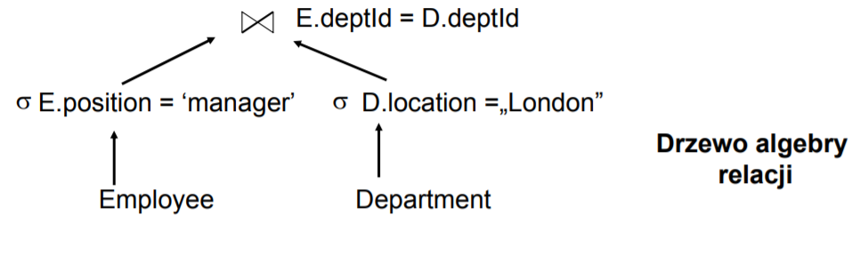

**Normalizacja**

Kolejnym etapem fazy dekompozycji jest normalizacja zapytania. *Celem etapu
normalizacji zapytania jest przekształcenie wewnętrznej reprezentacji zapytania do
znormalizowanej <u>postaci koniunkcyjnej</u> lub <u>dysjunkcyjnej</u>.* W fazie tej sekwencja
predykatów selekcji jest przekształcana do normalnej postaci koniunkcyjnej lub normalnej
postaci dysjunkcyjnej. Postać dysjunkcyjna jest, najczęściej, mniej efektywna, gdyż
wymaga niezależnego wartościowania poszczególnych składowych wyrażenia. Przykłady
postaci koniunkcyjnej i dysjunkcyjnej wyrażenia zapytania:


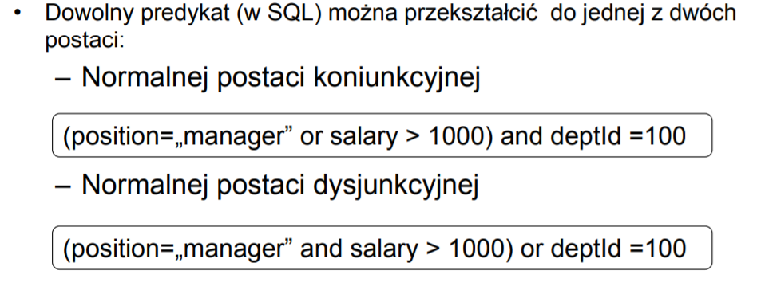

**Analiza semantyczna zapytania(1)**

Kolejnym, ważnym, etapem dekompozycji zapytania jest etap analizy semantycznej
zapytania. Celem analizy semantycznej zapytania <u>jest odrzucenie niepoprawnie</u>
sformułowanych lub sprzecznych zapytań. Zapytanie jest niepoprawnie sformułowane,
jeżeli jego elementy składowe nie prowadzą do generacji wyniku. Zapytanie jest
sprzeczne, jeżeli jego predykaty nie mogą być spełnione przez żadną krotkę w bazie
danych. Przykładem klauzuli, która jest sprzeczna jest wyrażenie: <br> 
position = ‘manager’
and position = ‘assistant’. <br>
Zakładając, że baza danych jest w <b>1NF</b>, nie istnieje w bazie danych żadna krotka, któraby
jednocześnie spełniała oba predykaty. Wartość sprzecznej klauzuli interpretujemy jako
wartość <b>FALSE</b>. W związku z tym, wyrażenie zawierające sprzeczna klauzulę można
uprościć. 

Przykładowo, wyrażenie <br>
*(position = ‘manager’ and position = ‘assistant’) or salary > 1000;* <br>
ze względu na sprzeczność klauzuli : *„position = ‘manager’ and position = ‘assistant’”*
można uprościć do postaci *„salary > 1000”*

**Analiza semantyczna zapytania(2)**

Niestety, algorytmy oceny poprawności semantycznej zapytań istnieją tylko dla pewnej
klasy zapytań, <u>nie zawierających dysjunkcji i negacji</u>. W jaki sposób rozwiązywany jest
problem zapytań niepoprawnie sformułowanych oraz zapytań sprzecznych? Rozwiązanie
problemu zapytań niepoprawnie sformułowanych opiera się na konstrukcji tak zwanego
**grafu połączenia relacji**. W grafie tym, wierzchołki odpowiadają relacjom, natomiast luki
odpowiadają operacjom połączenia wyspecyfikowanych w zapytaniu. Dodatkowo, graf
połączenia relacji zawiera wierzchołek reprezentujący wynik zapytania. *Jeżeli graf
połączenia relacji nie jest spójny, to zapytanie jest niepoprawnie sformułowane.*

Rozwiązanie problemu zapytań *niepoprawnie sformułowanych* opiera się na konstrukcji
tak zwanego **grafu połączeń atrybutów**.

<a href="https://wazniak.mimuw.edu.pl/images/c/c7/BD-2st-1.2-w12.tresc-1.1.pdf">Przykłady tworzenia tych grafów</a> (str: 10-12)


### **Upraszczanie zapytania**
Kolejnym etapem fazy dekompozycji jest *upraszczanie zapytań.* Celem tego etapu jest
<u>identyfikacja wyrażeń redundantnych, eliminacja wspólnych podwyrażeń, i transformacja
zapytania do równoważnej postaci</u>, ułatwiającej dalsze przekształcanie zapytania.
Transformacja zapytania do postaci równoważnej polega na zastosowaniu znanych reguł
algebry relacji.

### **Restruktyryzacja**

Kolejnym etapem fazy dekompozycji jest etap *restrukturyzacji, czy tez transformacji*
zapytania. Zanim jednak przejdziemy do przedstawienia podstawowych reguł
transformacji, wróćmy na chwilę do problemu konstrukcji podstawowych bloków
zapytania. Tradycyjne podejście do konstrukcji bloków zapytania opera się na
zastosowaniu transformacji algebraicznych, jednakże, zbiór stosowanych transformacji różni się zasadniczo dla
różnych systemów komercyjnych. 

Co więcej, nie wszystkie transformacje gwarantują
minimalizację czasu wykonania danego bloku. W ostatnim czasie, coraz częściej,
konstrukcja bloków opiera się na optymalizacji kosztowej, w której, dla każdego bloku,
konstruujemy możliwe plany wykonania danego bloku i szacujemy koszt i rozmiar
wykonania każdego planu. Ostatecznie wybierany jest plan wykonania o najniższym
szacowanym koszcie. Do zakończenia procesu optymalizacji pozostaje jeszcze
znalezienie najlepszego drzewa operacji połączenia, łączącego wyniki wykonania bloków
zapytania. Tradycyjne podejście do problemu znajdowania najlepszego drzewa operacji
połączenia (nazywane *często podejściem w stylu systemu R*) polega na zastosowaniu
*algorytmu programowania dynamicznego.*

### **Operacje**

Każdy plan wykonania zapytania jest *częściowo uporządkowanym zbiorem operacji*. W
skład tego zbioru operacji wchodzą: <u>operacja skanowania, selekcji, projekcji, połączenia,
produktu kartezjańskiego, operacje grupowania i agregacji</u>. Problem znalezienia
najlepszego planu wykonania zapytania obejmuje, z jednej strony, określenie kolejności
wykonania operacji wchodzących w skład zapytania, z drugiej, określenia metody
wykonania poszczególnych operacji. Przykładowo, mamy dwie metody dostępu do
relacji: *bezpośrednie skanowanie (odczyt)* relacji lub dostęp do relacji poprzez
*skanowanie indeksu założonego na relacji*. Podstawowa reguła optymalizacji mówi, że
wszystkie operacje unarne (projekcja i selekcja) należy przesunąć w dół drzewa
zapytania, tzn. *wykonywać w pierwszej kolejności*. Operacje te charakteryzują się silną
własnością redukcji (filtrowania) przetwarzanych danych. Redukując rozmiar
przetwarzanych danych, operacje unarne prowadzą do poprawy efektywności
wykonywania operacji binarnych. Dlatego, operacje binarne (połączenie, produkt
kartezjański) należy przesunąć w kierunku korzenia drzewa zapytania. Dla operacji
binarnych, np. połączenia, poza określeniem kolejności ich wykonywania, należy wybrać
również metodę ich wykonania (dla połączenia - nested loop, sort-merge, hash-join).
Najczęściej, na końcu planu wykonania zapytania znajdują się operacje grupowania i
agregacji. 

*<a href="https://wazniak.mimuw.edu.pl/images/c/c7/BD-2st-1.2-w12.tresc-1.1.pdf">Reguły transformacji oparte na algebrze relacji</a>* (Strony: 17-20)

**Ważne**

Zapytania
zawierające skorelowane podzapytania zagnieżdżone są kosztowne w realizacji, gdyż
wymagają sprawdzenia, dla każdej krotki zapytania zewnętrznego, czy spełniony jest dla
tej krotki warunek podzapytania skorelowanego. Klasyczna metoda transformacji takich
zapytań polega na przepisaniu zapytania w taki sposób, aby usunąć zagnieżdżenie (ang.
unnesting). Usunięcie zagnieżdżenia polega na **zastąpieniu zagnieżdżenia operacją
połączenia**. 

*<a href="https://wazniak.mimuw.edu.pl/images/c/c7/BD-2st-1.2-w12.tresc-1.1.pdf">Przykłady transformacji zagnieżdzionych zapytań</a>* (Strony: 21-26)

Zagadnienie optymalizacji jest zagadnieniem trudnym i istnieje
bardzo wiele, specyficznych, reguł transformacji dla różnych typów zapytań. Co więcej,
nie zawsze jest możliwe przetransformowanie zapytań w taki sposób, aby nie zawierało
podzapytań (szczególnie dla podzapytań skorelowanych). *W szczególnych przypadkach,
gdy czas realizacji zapytania jest nieakceptowalny, można zastosować technikę redukcji
rozmiarów relacji uczestniczących w zapytaniu opartą o sekwencję operacji
półpołączenia.* Technika ta jest wykorzystywana do optymalizacji zapytań rozproszonych
w systemach rozproszonych baz danych.


## 49. Modele uwierzytelniania, autoryzacji i kontroli dostępu do systemów komputerowych.

### **Uwierzytelnianie** 

Uwierzytelnianie (ang. authentication) - roces polegający na potwierdzeniu
zadeklarowanej tożsamości podmiotu biorącego udział w procesie komunikacji.
Celem uwierzytelniania jest uzyskanie określonego poziomu pewności, że dany
podmiot jest w rzeczywistości tym, za który się podaje.


W systemach informatycznych stosuje się następujące rodzaje uwierzytelniania:
<ol>
<li><i>Uwierzytelnianie jednokierunkowe</i> - polega na uwierzytelnieniu jednego podmiotu (uwierzytelnianego), np. klienta aplikacji, wobec drugiego (uwierzytelniającego) – serwera. Uwierzytelnienie następuje poprzez zweryfikowanie danych uwierzytelniających przekazanych przez podmiot uwierzytelniany. Typowymi danymi uwierzytelniającymi są np. identyfikator użytkownika i jego hasło dostępu.

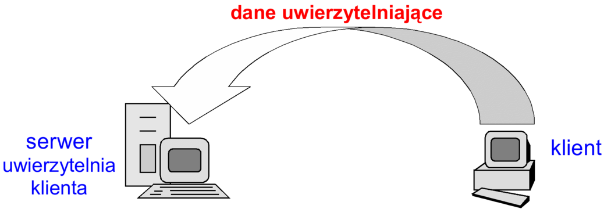
</li>
<li>
<i>Uwierzytelnianie dwukierunkowe</i> - polega na kolejnym lub jednoczesnym uwierzytelnieniu obu podmiotów (które są wzajemnie i naprzemiennie uwierzytelnianym oraz uwierzytelniającym). Jeżeli wzajemne uwierzytelnianie następuje sekwencyjnie (np. najpierw klient wobec serwera, a później serwer wobec klienta), mówimy o <u>uwierzytelnianiu dwuetapowym</u>, natomiast jednoczesne uwierzytelnienie obu stron nazywamy <u>jednoetapowym</u>.

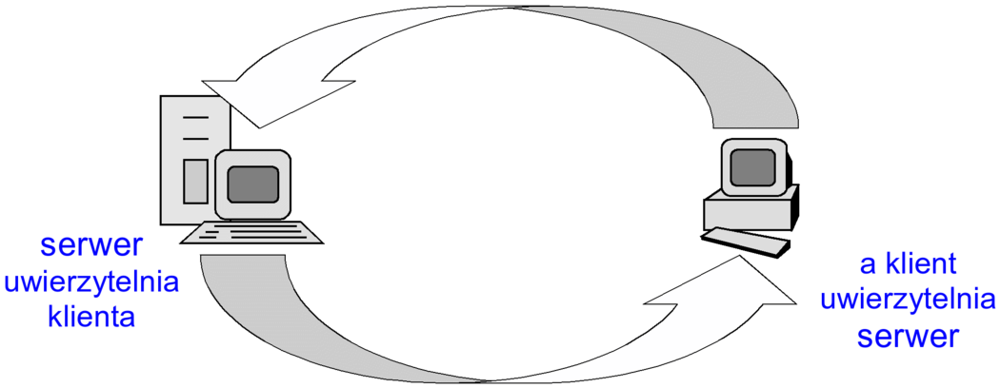
</li>

<li>
<i>Uwierzytelnianie z udziałem zaufanej trzeciej strony</i> – włącza w proces uwierzytelniania trzecią zaufaną stronę, która bierze na siebie ciężar weryfikacji danych uwierzytelniających podmiotu uwierzytelnianego. Po pomyślnej weryfikacji podmiot uwierzytelniany otrzymuje poświadczenie, które następnie przedstawia zarządcy zasobu, do którego dostępu żąda (serwerowi). Podstawową zaletą tego podejścia jest przesunięcie newralgicznej operacji uwierzytelniania do wyróżnionego stanowiska, które można poddać szczególnie podwyższonemu zabezpieczeniu. Należy też podkreślić potencjalną możliwość wielokrotnego wykorzystania wydanego poświadczenia (przy dostępie klienta do wielu zasobów, serwerów). Zaufana trzecia strona może być lokalna dla danej sieci komputerowej (korporacyjnej) lub zewnętrzna (wykorzystująca infrastrukturę uwierzytelniania dostępną w sieci rozległej np. publiczne urzędy certyfikujące).

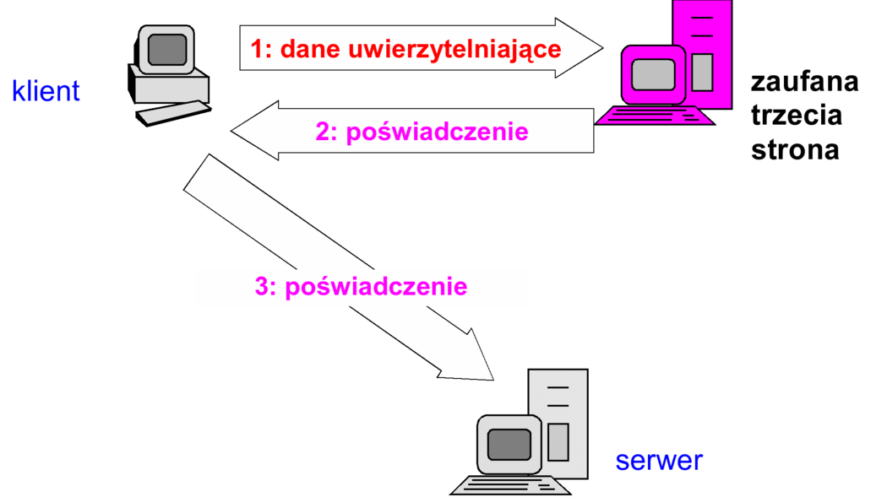
</li>
</ol>

### **Mechanizmy uwierzytelniania**

**Klasyczne uwierzytelnianie użytkownika**

W przypadku wielu współczesnych środowisk informatycznych, systemów operacyjnych lub systemów zarządzania bazami danych, funkcjonuje klasyczny mechanizm uwierzytelniania poprzez hasło. Proces uwierzytelniania rozpoczyna klient żądając zarejestrowania w systemie (login). Serwer pyta o identyfikator (nazwę) użytkownika, a następnie o hasło
i decyduje o dopuszczeniu do sieci. W większości przypadków nazwa użytkownika i hasło są przesyłane tekstem jawnym, co stanowić może kolejny problem zapewnienia poufności, jaką właśnie mamy osiągnąć stosując opisywany mechanizm. Stąd też takie klasyczne podejście nadaje się do wykorzystania jedynie w ograniczonej liczbie przypadków, kiedy np. mamy uzasadnioną skądinąd pewność wykluczenia możliwości podsłuchu danych uwierzytelniających.

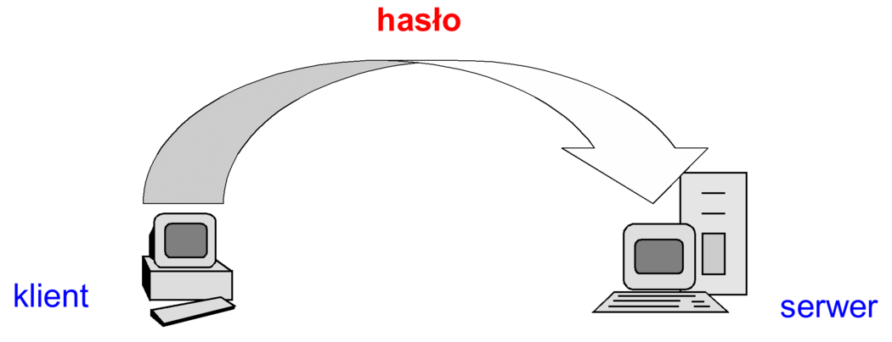
Hasła nie są najefektywniejszą, ani najbezpieczniejszą formą weryfikacji tożsamości użytkownika, z następujących powodów:
<ul>
<li>Hasło można złamać</li>
<li>Odgadnąć, np. metodą przeszukiwania wyczerpującego (brute-force attack) lub słownikową (dictionary attack) - często hasła są wystarczająco nieskomplikowane by ułatwiło to odgadnięcie ich przez atakującego </li>
<li>Podsłuchać w trakcie niezabezpieczonej transmisji </li>
<li>Hasła się starzeją - czas przez który możemy z dużą pewnością polegać na tajności naszego hasła skraca się nieustannie, przez co hasła wymagają systematycznych zmian na nowe </li>
</ul>

**Zdalne potwierdzanie tożsamości**

W środowisku sieci TCP/IP wypracowano mechanizm prostego potwierdzania tożsamości użytkownika, który żąda zdalnego uwierzytelniania. W tym celu powstał standard RFC 1413 opisujący usługę o nazwie identd. Niezależnie od jej aktualnej przydatności i powszechności warto zdawać sobie sprawę z istoty jej działania, którą łatwo opisać w następujący sposób:
<ul>
<li>
Użytkownik uruchamia klienta usługi i nawiązuje połączenie z serwerem
</li>
<li>
Serwer kontaktuje się z wydzielonym serwerem - identd, pracującym na stacji klienta (113/tcp) w celu poświadczenia nazwy (lub identyfikatora) użytkownika wykorzystującego usługę
</li>
</ul>

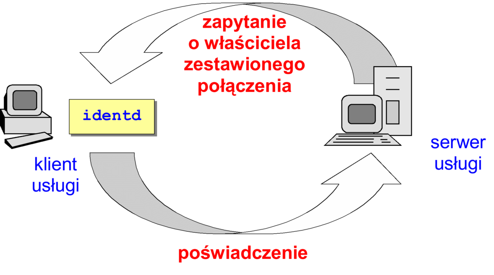

Należy też zdawać sobie sprawę z potencjalnych zagrożeń jakie niesie udostępnianie przez usługę ident informacji o przynależności procesów dokonujących komunikacji sieciowej (nie tylko klientów). W standardzie RFC 1413 oraz w praktycznych implementacjach **nie realizuje się bowiem uwierzytelniania podmiotu żądającego informacji z tej usługi**, może ona być zatem również nadużyta przez potencjalnego włamywacza.


### **Uwierzytelnianie jednokrotne (SSO – single sign-on)**

Procedury uwierzytelniania jednokrotnego są częściowym rozwiązaniem problemu ochrony danych uwierzytelniających przed złamaniem w systemie wielozasobowym, np. sieci komputerowej z wieloma serwerami.

Ideą procedury uwierzytelniania jednokrotnego jest minimalizacja ilości wystąpień danych uwierzytelniających w systemie - <u>hasło powinno być podawana jak najrzadziej</u>. Zgodnie z tą zasadą, jeśli jeden z komponentów systemu (np. system operacyjny) dokonał pomyślnie uwierzytelniania użytkownika, pozostałe komponenty (np. inne systemy lub zarządcy zasobów) ufać będą tej operacji i nie będą samodzielnie wymagać podawania ponownie danych uwierzytelniających. Przy tym jest możliwe teoretycznie, że wszystkie komponenty samodzielnie korzystają z odmiennych mechanizmów uwierzytelniana. Wówczas, dodatkowo po pierwszorazowym uwierzytelnieniu użytkownika, system może oddelegować specjalny moduł do przechowywania odrębnych danych uwierzytelniających użytkownika i poświadczania w przyszłości jego tożsamości wobec innych komponentów systemu.

chemat SSO przedstawia poniższy rysunek. W przedstawionej na rysunku sytuacji tylko jeden serwer dokonuje uwierzytelniania klienta, reszta ufa uwierzytelnianiu dokonanemu przez ten serwer.

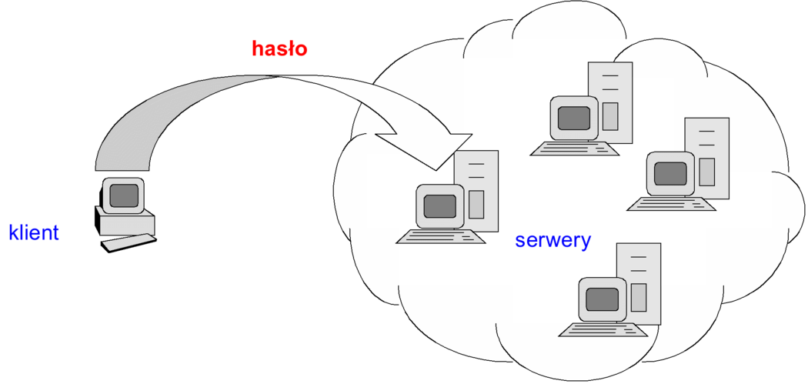

### **Hasła jednorazowe**

Istota wykorzystania haseł jednorazowych wynika zamiaru ochrony ich przed przechwyceniem i nieautoryzowanym wykorzystanie, w przyszłości. Jednak nie polega na zapewnieniu ich poufności w transmisji lecz na uczynieniu ich de facto bezwartościowymi po przechwyceniu. Opiera się na, jak sama nazwa wskazuje, tylko użyciu danej postaci hasła tylko raz. Hasła jednorazowe mają przy każdym kolejnym uwierzytelnieniu inną postać. Raz przechwycone hasło jednorazowe nie jest przydatne, bowiem przy kolejnym uwierzytelnieniu będzie obowiązywać już inne. *Komunikacja między podmiotami procesu uwierzytelniania może być zatem jawna*. Stosujące takie hasła procedury uwierzytelniania muszą jedynie oferować brak możliwości odgadnięcia na podstawie jednego z haseł, hasła następnego.


Hasła jednorazowe generowane są przy pomocy listy haseł, synchronizacji czasu lub metody zawołanie-odzew. Dostępne są najczęściej w następujących postaciach: listy papierowe, listy-zdrapki, tokeny programowe i tokeny sprzętowe.

**Lista haseł**

Listy haseł to najprostsza i najtańsza metoda identyfikacji metodą haseł jednorazowych. Użytkownik otrzymuje listę zawierająca ponumerowane hasła. Ta sama lista zostaje zapisana w bazie systemu identyfikującego. W trakcie logowania użytkownik podaje swój identyfikator, a system prosi o podanie hasła z odpowiednim numerem. Klient za każdym razem posługuje się kolejnym niewykorzystanym hasłem z listy.

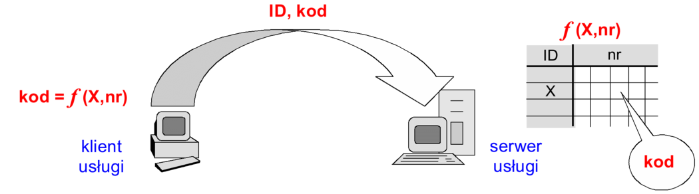

**Metoda synchronizacji czaswoej**

W metodzie z synchronizacją czasu (*time synchronization*) klient generuje unikalny kod w funkcji pewnego parametru X użytkownika (identyfikatora, kodu pin, hasła, numeru seryjnego karty identyfikacyjnej) oraz bieżącego czasu. Serwer następnie weryfikuje otrzymany od klienta kod korzystając z identycznej funkcji (z odpowiednią tolerancją czasu).

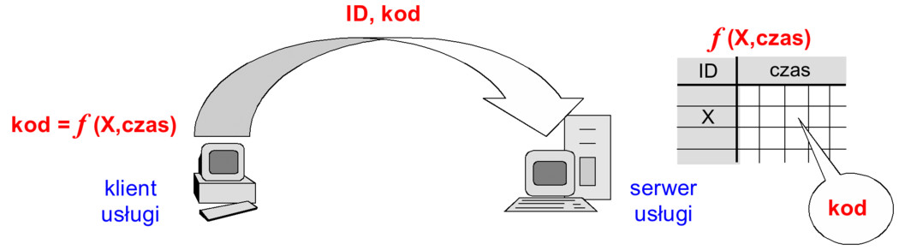

**Metoda "Zawołanie-Odzew"**

Natomiast w metodzie zawołanie-odzew (challenge-response) serwer pyta o nazwę użytkownika, a następnie przesyła unikalny ciąg („zawołanie"). Klient koduje otrzymany ciąg (np. swoim hasłem lub innym tajnym parametrem pełniącym rolę klucza) i odsyła jako „odzew". Serwer posługując się identycznym kluczem weryfikuje poprawność odzewu.

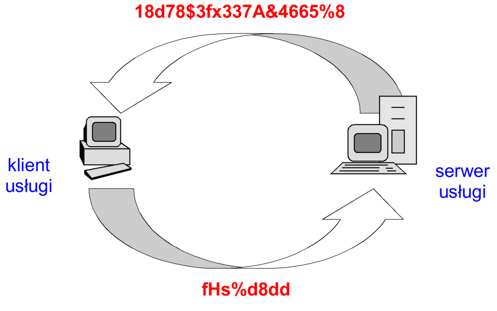

**Metoda Tokenów**

Tokeny programowe to specjalne programy generujące hasła. W zależności od implementacji program na podstawie kwantu czasu lub zawołania serwera generuje hasło jednorazowe, które weryfikuje serwer.

Token sprzętowy jest małym przenośnym urządzeniem spełniającym wszystkie funkcje tokenu programowego.

Pewną ciekawostką zyskującą na popularności jest <u>wykorzystanie telefonu komórkowego w uwierzytelnianiu za pomocą haseł jednorazowych</u>. Cały proces polega przesłaniu hasła jednorazowego z serwera na telefon w postaci wiadomości SMS. W tym przypadku rola telefonu jako swoistego tokena sprowadza się tylko do medium odbierającego i wyświetlającego dane.


**Inne mechanizmy uwierzytelniania**

Do uwierzytelniania użytkowników można wykorzystać również przedmioty, których posiadaniem musi się wykazać uwierzytelniany. Mogą to być np. karty magnetyczne, karty elektroniczne czy tokeny USB. Ponadto, w przypadku ludzi, można posłużyć się również cechami osobowymi wynikającymi z odmienności parametrów niektórych naturalnych składników organizmu (uwierzytelnianie biometryczne), takich jak m.in.:
<ul>
<li> Klucz DNA </li>
<li>Geometria twarzy </li>
<li> Termogram twarzy</li>
<li>Termogram dłoni </li>
<li>Odcisk palca (dermatoglify) </li>
<li>Tęczówka oka </li>
</ul>

### **Autoryzacja i kontrola dostępu**

Autoryzacja i kontrola dostępu zaczyna się tam, gdzie kończy się uwierzytelnianie. Kiedy podmiot zabezpieczeń SP (Security Principal) podejmuje próbę uzyskania dostępu do chronionego obiektu lub usługi, proces autoryzacji przejmuje jego tożsamość i używa jej do określenia jego uprawnień.

Zadania autoryzacji i kontroli dostępu legalnych użytkowników należą do podstawowych funkcji systemów operacyjnych czy systemów zarządzania bazą danych oraz środowisk przetwarzania rozproszonego. W większości przypadków te funkcje są realizowane podobnie.

Jeżeli SP próbuje uzyskać dostęp (np. do pliku na serwerze WWW), usługa autoryzacji kwerenduje bazę danych, aby określić, jakie uprawnienia związane z tym plikiem ma SP. System kontroli dostępu jest programem lub procesem egzekwującym uprawnienia i przywileje. Generalnie, część autoryzacyjna systemu określa, że SP może tylko czytać dany plik, a system kontroli dostępu w rzeczywistości zapewnia, że nie może tego pliku zmodyfikować.

Modele kontroli dostępu opisują ogólne metody używane w poszczególnych domenach bezpieczeństwa do kontroli dostępu na styku SP i żądanej usługi czy obiektu.

### **Trzy modele kontroli dostępu do danych:**
<ul>
<li><b>DAC (Discretionary Access Control)</b> <br>
Uznaniowa kontrola dostępu jest tradycyjną metodą kontroli: tożsamość SP ma przyznane (pośrednio lub jawnie) jedno lub więcej uprawnień do obiektu. W tym systemie uprawnienia są przechowywane z każdym obiektem. Kiedy SP zamierza uzyskać dostęp do obiektu lub usługi, mechanizm kontroli dostępu otrzymuje jego tożsamość i wtedy kwerenduje obiekt (lub tablice uprawnień) w celu sprawdzenia, jakie uprawnienia mu przydzielono.
</li>
<li><b>MAC (Mandatory Access Control) </b><br>
System obowiązkowej kontroli dostępu jest oparty na kategoryzujących etykietach bezpieczeństwa, które są przypisywane wszystkim SP i obiektom. SP z określoną etykietą bezpieczeństwa może wykonywać operacje (czytania, pisania lub usuwania) tylko na tych obiektach, które mają taką samą lub niższą w hierarchii etykietę MAC. Firma może np. etykietować całą zawartość według kategorii: "tajna", "poufna", "prywatna", "publiczna" i tylko niektórym pracownikom przyznać dostęp do wszystkich kategorii zawartości. Jedną z głównych wad MAC jest to, że większość SP musi być dodatkowo ograniczana na zasadzie niezbędności dostępu do poszczególnych zawartości z danej kategorii - użytkownik dopuszczony do informacji tajnych niekoniecznie musi mieć dostęp do wszystkich tajnych dokumentów. W praktyce MAC sprawdza się jako warstwa innego modelu kontroli dostępu.
</li>
<li><b>RBAC (Role-Based Access Control)</b><br>
W tym systemie uprawnienia określa się na podstawie pełnionej roli i zakresu działania SP. W systemie RBAC role są tworzone i przydzielane zgodnie ze sprecyzowanymi uprawnieniami i przywilejami niezbędnymi do ich pełnienia. SP są przydzielane jedna lub więcej ról i ma on możliwość wykonywania jedynie tego, co zostało przypisane do danej roli. W porównaniu z innymi modelami, RBAC precyzyjniej wyznacza najmniejszy, niezbędny zbiór uprawnień SP. </li>
</ul>

Główna różnica między modelem dostępu RBAC a DAC polega na tym, że grupy DAC mają na ogół określać ogólną przynależność (np. zespół działu kadr), podczas gdy wyznacznikiem RBAC są działania (np. wykonywane przez pracownika działu kadr, działu płac itp.).

Wiele modeli RBAC (w tym sporo zaimplementowanych jako warstwa nad systemami DAC) dopuszcza tylko szczególne uprawnienia w trakcie wykonywania przez SP koniecznych działań. I tak np. w tym modelu pracownik zajmujący się wypłatami ma dostęp do bazy danych płac tylko wtedy, gdy korzysta z aplikacji płacowej.

*W domenie bezpieczeństwa opartej na DAC pracownik działu płac będzie miał prawdopodobnie uprawnienia do zapisów oraz odczytu całej bazy danych, i te uprawnienia będą stałe oraz niezależne od aplikacji.*

*Systemy RBAC są dużo bardziej bezpieczne. Preferuje je większość ekspertów ds. bezpieczeństwa, ale również wymagają znacząco większego wysiłku po stronie administrowania, podejmowania decyzji o uprawnieniach, określania delegacji ról. W codziennym użytkowaniu RBAC wymaga większej automatyzacji i stosowania globalnych praktyk zarządzania.*

W praktyce rzadko można spotkać domenę bezpieczeństwa, gdzie zastosowano tylko jeden model kontroli dostępu. System operacyjny Windows jest zbudowany wokół DAC, ale już w systemie Vista Microsoft dodał MAC (stosując obowiązkową kontrolę integralności), a RBAC jest dostępny na poziomie sieciowym w Active Directory. Wiele domen opartych na DAC i RBAC umożliwia także klasyfikowanie (etykietowanie) danych, podobnie jak systemy oparte na MAC, co pomaga ustalić właściwe uprawnienia i inne zabezpieczenia, które mają być stosowane na kolejnym poziomie ochrony ważnych danych.

### **Krótko o systemach rozliczeniowych i audycie**

Aby zapewnić odpowiedni poziom bezpieczeństwa, niezbędne jest rejestrowanie pomyślnych lub podejmowanych prób dostępu, a także działań po uzyskaniu dostępu. Rozliczanie jest zazwyczaj uważane za bardziej ogólną metodę rejestrowania niż audyt. System rozliczeniowy może rejestrować tylko pojedyncze pomyślne logowania (na sesję), liczbę przesłanych danych lub całkowity czas aktywności sesji. Z audytem wiąże się dużo bardziej szczegółowy poziom kontroli, pozwalający śledzić każdą wykonywaną przez SP akcję (lub próbę wykonania) - przeglądane lub modyfikowane pliki i foldery - oraz rejestrować czas wydarzenia.

Audyt i system rozliczania dodatkowo komplikują systemy współdzielone, tożsamości i hasła. Silny system AAA wymaga unikatowych tożsamości, aby każda indywidualna akcja mogła zostać zarejestrowana oddzielnie. Poziom rozliczalności i audytu może być ustawiony przez administratora, aczkolwiek zależy częściowo od systemu AAA i używanych protokołów.
Dobry system rozliczania i audytu śledzi każdą akcję wykonywaną przez każdego SP - od tworzenia obiektu aż do jego usunięcia (włączając w to zdarzenia logowania i zmiany w dzienniku zdarzeń audytu).
**<a href="https://www.computerworld.pl/news/AAA-uwierzytelnianie-autoryzacja-i-kontrola-dostepu-cz-2,376006,2.html">Więcej o tym tutaj</a>** (Strony 2-5)


## 50. Teoretyczne modele komputerów: automaty skończone, automaty ze stosem, maszyny Turinga i odpowiadające im klasy języków formalnych.
<br>

### **Ważne definicje**

<u><b>Alfabet</b></u>

<b>Alfabetem</b> nazywamy dowolny niepusty zbiór skooczony. Elementy alfabetu nazywami symbolami.

<u><b>Słowa</b></u>

<b>Słowem</b> 


**I Wyrażenia regularne**

<u><b>Def</b></u> 

Niech będzie dany zbiór Π = { ∅, λ ,+,· ,* ,( ,) } oraz alfabet Σ, przy czym Σ ∩ Π = ∅. 

<b>Wyrażeniem regularnym</b> nad alfabetem Σ nazywamy każde słowo A ∊ (Σ, ∏)* spełniające jeden z poniższych
warunków:
<ol>
<b><li> A=∅ </li>
<li> A= λ</li>
<li> A=x ∊ Σ</li>
<li> A jest postaci A=(B)+(C) lub A=(B)·(C) lub A=(B)*, gdzie B, C są wyrażeniami regularnymi nad Σ</li>
</b></ol>

Rodzinę wyrażeo regularnych nad alfabetem Σ oznaczamy przez <b>WR</b>(Σ)<br> (lub <b>WR</b> jeśli nie będzie wątpliwości
dotyczących alfabetu)

**II Języki regularne**

<b><u>Def</u></b>

 Niech będzie dany alfabet Σ oraz rodzina wyrażeń regularnych **WR** zdefiniowanych nad tym alfabetem.
Każdemu wyrażeniu regularnemu **A∊WR** przyporządkowujemy język L(**A**) za pomocą definicji rekurencyjnej ze
względu na budowę wyrażenia regularnego **A**:

$$
L(A) = \begin{cases}∅ & gdy\; A= ∅ \\
    \lbrace λ \rbrace & gdy\; 𝐀 = \lambda \\
    \lbrace x \rbrace & gdy\; 𝐀 = 𝐱 ∈ ∑ \\
    L(B) + L(C) & gdy\; 𝐀 = 𝐁 + 𝐂,\; gdzie\; 𝐁, 𝐂 ∈ WR\\
    L (𝐁)\; ∙\; L (𝐂)& gdy\; 𝐀 = 𝐁\; ∙\; 𝐂, gdzie\; 𝐁, 𝐂 ∈ WR \\
    (L(B))^* & gdy\; 𝐀 = 𝐁^*,\; gdzie\; 𝐁\; ∈ WR
 \end{cases}
$$

Mówimy, że język L(**A**) jest językiem generowanym przez wyrażenie regularne A, natomiast o słowach należących do
języka L(**A**) mówimy, że są generowane przez wyrażenie regularne **A**. 


<u><b>Def</u></b>. 

**Językiem regularnym** nazywamy każdy język formalny L nad danym alfabetem, dla którego istnieje wyrażenie
regularne **A** takie, że: L=L(A) . Klasę języków regularnych oznaczamy przez <b>JR</b>.

Każdy język regularny może byd generowany przez wiele wyrażeo regularnych.
Def. Mówimy, że wyrażenia regularne **A** i **B** są równoważne, gdy generują ten sam język, tzn

$$
A \equiv B \Longleftrightarrow L(A) = L(B)
$$


<b><u>AUTOMAT SKOŃCZONY Rabina-Scotta</b></u>

<b>Automatem skończonym</b> (typu **Nas-labmda**) nazywamy uporządkowaną piątkę 

$$
    M = (Q,{\scriptstyle\sum},\delta,S_{start},F),
\;gdzie: \\
 
\textit{Q}\;\;\; jest \; skończonym\; zbiorem\; stanów, \\
{\scriptstyle\sum} \;\;\; jest\; alfabetem \; symboli\; wejściowych, \\
\delta:Q\times( {\scriptstyle\sum} \cup \lbrace \lambda \rbrace \big) \longrightarrow P(Q) \;jest \;funkcją \;przejścia\; (\delta(s,a) \;to\;stan,\\ \;do\; którego\; przechodzi \;automat  \;ze\; stanu\; \mathbf{s}\;po\; wczytaniu \; znaku\; \mathbf{a}). \\
 Funkcję \;przejść \; \delta \;można \; przedstawić \; w\; tabeli \; lub \;za\; pomocą\; grafu. \\
 s_{start} \;\in\; Q\; -\; stan \; początkowy\; automatu, \\
 F \;\subset \;Q\;\; - \;zbiór \; stanów \; końcowych \;(automat \; przechodząc\; do \; tego \; stanu\\ \; akceptuje \; dotychczas \; przeczytane \; słowo)
$$

Język L złożony ze wszystkich słów akceptowanych przez automat skooczony <b>M</b> nazywamy generowanym przez automat <b>M</b> i oznaczamy przez L(M)
$$
L(M)\;=\;\lbrace A \in\; {\scriptstyle\sum}^*: \; \hat{\delta}(s_0,A) \; \cap \; F \neq \empty \rbrace
$$
Gdzie:
$$
\hat{\delta} \; - \; rozszerzona \; funkcja \; przejść
$$
Zbiór wszystkich języków generowanych przez automaty skończone oznaczamy symbolem <b>ZJNAS-λ</b>.

Przykład automatu skończonego:

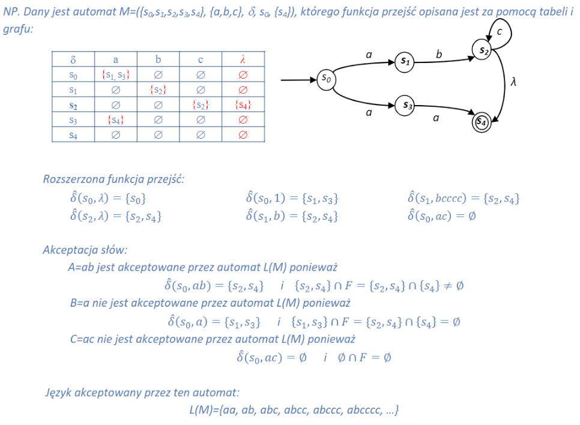

<br> <br>

### **Deterministyczny, zupełny automat skończony Rabina-Scotta**
<b>Automatem skończonym type DAS</b> nazywamy uporządkowaną piątke:
$$
 M = (Q,{\scriptstyle\sum},\delta,S_{start},F),
\;gdzie: \\
\textit{Q}\;\;\; jest \; skończonym\; zbiorem\; stanów, \\
{\scriptstyle\sum} \;\;\; jest\; alfabetem \; symboli\; wejściowych, \\
\delta:Q\times {\scriptstyle\sum} \longrightarrow Q \;jest \;funkcją \;przejścia\; (\delta(s,a) \;to\;stan,\\ \;do\; którego\; przechodzi \;automat  \;ze\; stanu\; \mathbf{s}\;po\; wczytaniu \; znaku\; \mathbf{a}). \\
 Funkcję \;przejść \; \delta \;można \; przedstawić \; w\; tabeli \; lub \;za\; pomocą\; grafu. \\
 s_{start} \;\in\; Q\; -\; stan \; początkowy\; automatu, \\
 F \;\subset \;Q\;\; - \;zbiór \; stanów \; końcowych \;(automat \; przechodząc\; do \; tego \; stanu\\ \; akceptuje \; dotychczas \; przeczytane \; słowo)
$$
Język Lzłożony ze wszystkich słów akceptowanych przez automat <b>M</b> typu *DAS* nazywamy generowanym przez automat Mi oznaczamy przez L(M) 
$$
L(M)\;=\;\lbrace A \in\; {\scriptstyle\sum}^*: \; \hat{\delta}(s_0,A) \; \in \; F   \rbrace
$$

Zbiór wszystkich języków generowanych przez automaty typu DAS oznaczamy symbolem <b>ZJDAS</b>.

**TW. 3**

Jeżeli 
$$
 M = (Q,{\scriptstyle\sum},\delta,S_{start},F)$$
 jest automatem typu **DAS**, to generuje on język L wtedy i tylko wtedy, gdy automat 
 $$
 M' = (Q,{\scriptstyle\sum},\delta,S_{start},Q\setminus F)$$
 generuje język L`.

Przykład automatu typu DAS:

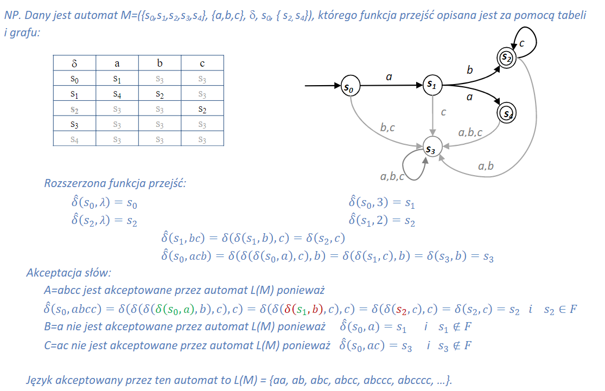

<br>

**Ważne Tw.**
Zbiory języków generowanych przez automaty typu DAS i NAS-λ są sobie równe:
  $$
  ZJDAS=ZJNAS-\lambda
  $$

<b><u>Def</u></b>
**Gramatyką bezkontekstową** nazywamy uporządkowaną czwórkę:
$$
G \; = \; (V,{\scriptstyle\sum},P,S), gdzie:\\
V \; jest \; skończonym \; zbiorem \; zmiennych \; (tzw. \; symboli \; nieterminalnych), \\
{\scriptstyle\sum} \; jest \; alfabetem\; gramatyki \; (tzw. \; zbiorem \; symboli \; nieterminalnych), \\
P \; jest \; zbiorem \; par \; slów \; postaci (\alpha ,\beta), \; gdzie {\color{red}\;\alpha \in V, \beta \in ({\scriptstyle\sum} \; \cup V)^*} , \; \\
zwanych \; produkcjami \; i \; zapisywanych \; w \; postaci \; \alpha \rightarrow \beta \; \\
S \; jest\; wyróżnioną\; zmienną \; początkową\; ze \; zbioru \;V\;\\(tzw.\; głową\;gramatyki)
$$

<b><u>Def</b></u>
Językiem generowanym przez gramatykę **G**, nazywamy zbiór 
$$
L \; = \; \lbrace A \; \in \; {\scriptstyle\sum}^*\; : \; S \; \hat{\Rrightarrow} \; A \rbrace.
$$
Słowo **A** należy do języka **L** opisanego przez daną gramatykę **G**, jeśli istnieje ciąg produkcji prowadzący od symbolu zmiennej początkowej **S** do danego słowa. Mówimy wówczas, że słowo **A** jest wyprowadzone w gramatyce **G**.

<b><u>Def</b></u>

**Językiem Bezkontekstowym** nazywamy język, dla którego istnieje gramatyka bezkontekstowa generująca ten język.Zbiór języków generowanych przez gramatyki bezkontekstowe oznaczamy przez **ZJB**.

<b><u>Def</b></u>

<b>Automatem ze Stosem</b>(**AZS**) nazywamy uporządkowaną siódemkę:
$$
M=(Q,{\scriptstyle\sum},Г,\delta,S_{start},\bot,F), \; gdzie:\\
\mathbf{Q} \;\; jest \; skończonym \; zbiorem \; stanów, \\
\mathbf{{\scriptstyle\sum}} \;\; jest \;alfabetem\;symboli\;wejściowych\;(terminalne), \\ 
\mathbf{Г} \; jest \; alfabetem \; stosu \\
\delta:Q\times({\scriptstyle\sum}\cup{\lambda})\timesГ \rightarrow P(Q\times Г)^* \; jest \; funckją \; przejść \\
S_{start} \; \in \; Q \; - stan \; początkowy \; stosu, \\
\bot \; \in \; Г \; - \; stan \; początkowy \; stosu,\\
F \subset Q \; - \; zbiór \; stanów \; końcowych \; automatu.
$$

*Opisem chwilowym automatu* **M** nazywamy każdą trójkę (S,A,B), gdzie:
$$
S \in Q \; - \; jest \; stanem, \\
A \in {\scriptstyle\sum}^* \; - \; jest \; słowem \; do\;wczytania\;pozostającym \;na\;taśmie, \\
\beta \in Г^* \; jest \; słowem\; znajdującym \;się\; na\; stosie.
$$

**Przykładowy auyomat ze Stosem:**

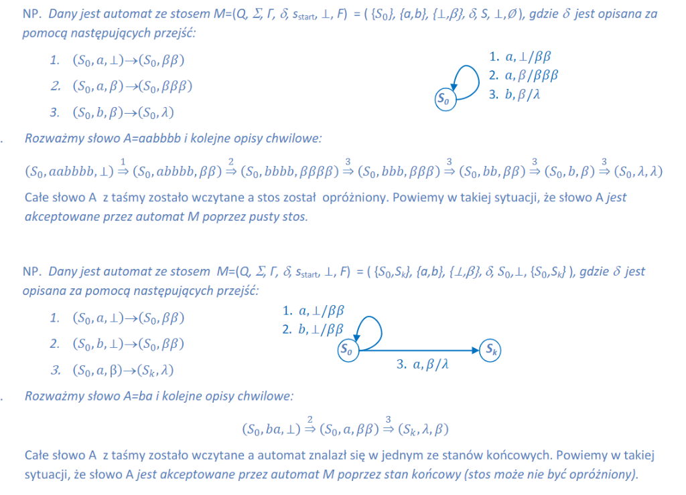

**Tw. 17**

Zbiór języków akceptowanych przez automaty ze stosem jest równy zbiorowi języków bezkontekstowych.
$$
\mathbf{ZJABS=ZJBK} 
$$


<b><u>Maszyny Turinga</b></u>

<b>Def.</b> <b>Maszyną Turinga</b> (**MT**) nazywamy uporządkowany układ:
$$
M = (Q,{\scriptstyle\sum},Г,\delta,s_{start},\square,F), \; gdzie:\\
Q \; jest \; skończonym \; zbiorem \; stanów,\\
{\scriptstyle\sum}\;jest\;alfabetem\;maszyny\\
Г\;jest \;alfabetem\;taśmy,\;przy\;czym\; Г \supset {\scriptstyle\sum}\\
\delta:D\rightarrow P(Q\times Г \times \lbrace L,R\rbrace) \; (gdzie \; D \subset Q\times Г) \; jest \; funkcją \\
przejść \;maszyny \\
S_(start) \; \in \; Q \; jest \; stanem \; startowym \; maszyny,\\
\square \; \in \; Г \; jest\; symbolem\; pustej\; komórki \;(\textrm{poza skończoną ilością komórek} \\
\textrm{wszystkie pozostałe komórki nieskończonej taśmy zawierają symbol pustej}\\
\textrm{komórki}), \\
F \subset \; Q \; \textrm{jest zbiorem stanów końcowych maszyny.}
$$

**Def**

Język **L** złożony ze wszystkich słów akceptowanych przez maszyne Turinga **M** nazywamy językiem **generowanym przez maszynę M** i oznaczamy przez L(M):
$$
L(M)=\lbrace A \in {\scriptstyle\sum}^*: \; s_{start} \; A \Rightarrow...\Rightarrow Г_1 \red{s} \; Г_2 \; \in Г * i \; stanu \; \red{s} \; \in \; F \rbrace
$$

Zbiór wszystkich języków generowanych przez maszyny Turinga oznaczamy symbolem **ZJMT** i nazywamy **rekursywnie przeliczalnymi**.

### **UWAGA**

$$ Jeżeli \; \delta:D \rightarrow Q\times Г \times\lbrace L,R \rbrace \; (gdzie \; D \subset Q\times Г) \textrm{ to Maszyna Turinga} \\ \mathbf{\textrm{jest maszyną deterministyczną.}}
$$

### **UWAGA**

Maszyne Turinga można przedstawić m in. za pomocą:
<ul>
<li>
tabeli,
</li>
<li> grafu,</li>
<li>kodu maszyny Turinga (o ile: E={0,1}, przekształcimy maszynę do postaci maszyny Turinga o jednym stanie końcowym s<sub>1</sub> i ustalimy kolejność kodowania ruchów maszyny Turinga).  </li>
</ul>


**Przykład Maszyny Turinga**

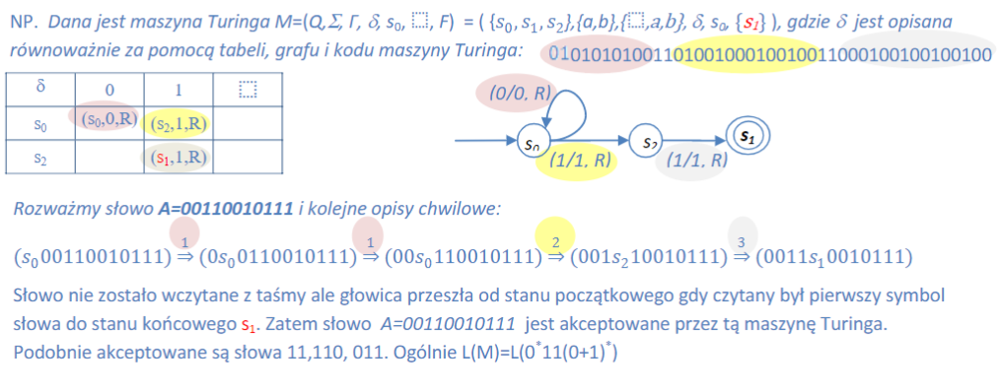

**Przykład MT akceptującej słowa i MT obliczającej:**

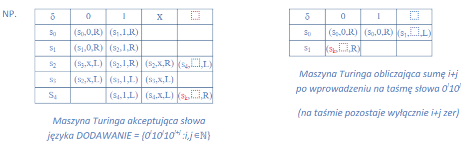

<table align="center">
    <thead>
        <tr>
            <th>MT</th>
            <th>Języki</th>
        </tr>
    </thead>
    <tbody>
        <tr align="center">
            <td>Maszyny Turinga <br>
            Niedeterministyczne maszyny Turinga<br>
            Wielotaśmowe maszyny Turinga<br>
            Uniwersalna maszyna Turinga</td>
            <td><b>ZJRP</b> <br>
            zbiór języków <br> rekursywnie przeliczalnych <br> (rekurencyjnie przeliczalnych)</td>
        </tr>
        <tr align="center">
        <td><b>Właściwe MT </b>- maszyny Turinga zatrzymująca się <br> dla każdego słowa po skończonej ilości ruchów </td>
        <td> <b>ZJRK</b> <br> Zbiór języków rekursywnych <br>(rekurencyjnych) </td>
        </tr>
        <tr align="center">
        <td>
        <b>MT (automaty) liniowo ograniczone – </b>  <br>maszyny Turinga w <br> których <,> є Γ i głowica przesuwa się <br> tylko między symbolami < i > wyznaczającymi początek i koniec słowa. 
        </td>
        <td>
        <b>ZJK</b> <br>
        Zbiór języków kontekstowych.
        </td>
        </tr>
    </tbody>
</table>

<br>

### **Tw.**
Istnieje język formalny, który nie jest rekursywnie przeliczalnym, tzn. nie jest akceptowany przez żadną MT.